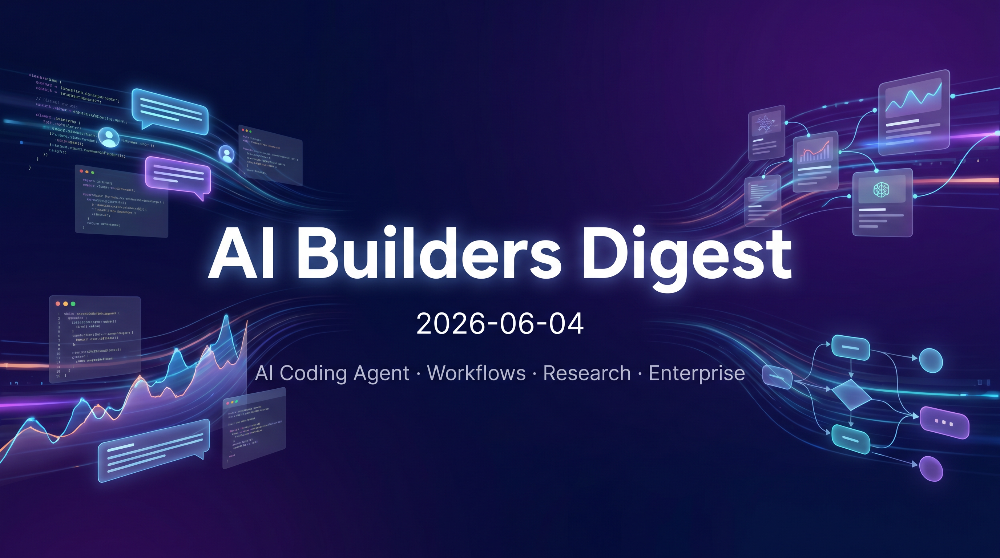
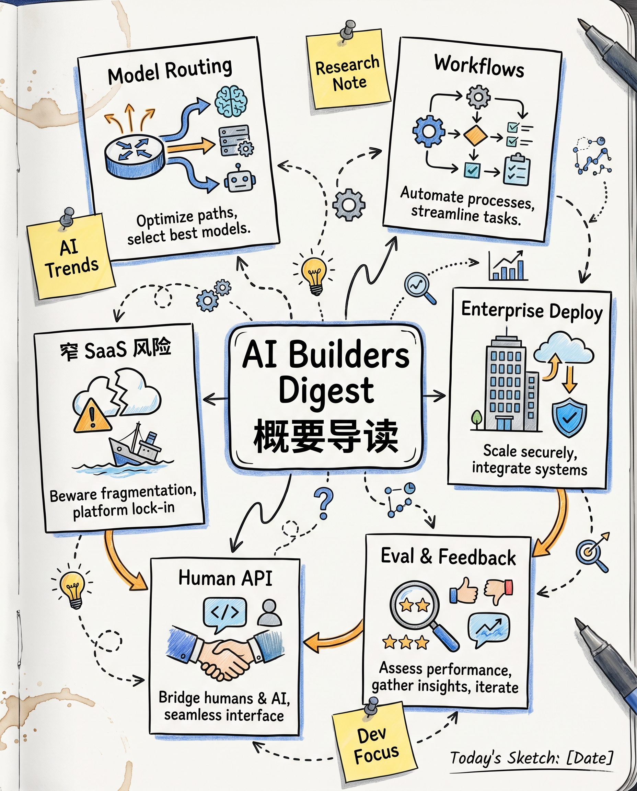
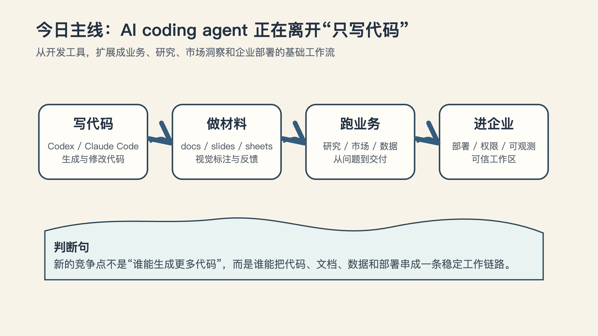
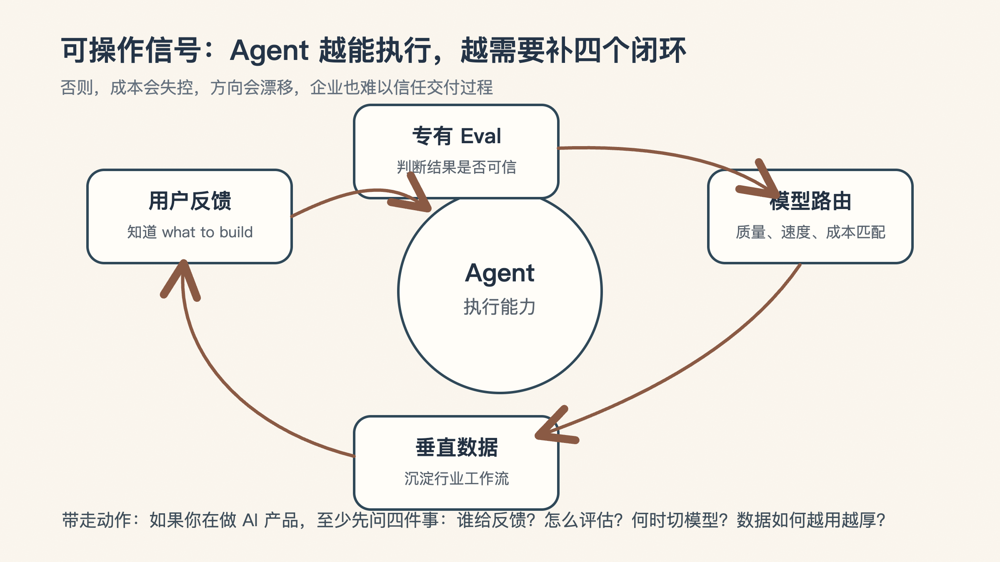

# 今天 AI Builder 圈最值得看的 4 个信号：Agent 开始接业务了

> 💡 **📌 今日速览**
>
> - 今天的主线很清楚：AI coding agent 正在从“写代码工具”扩展为业务、研究、市场洞察和企业部署的基础工作流。
> - 内容量：X / Twitter 有 15 位 builder、38 条更新；Official Blogs 暂无新内容；Podcast 有 1 期 Training Data。
> - 优先读 Aaron Levie 的 model routing 判断、Peter Yang 对窄 SaaS 的风险分析，以及 Listen Labs 对“human API”的市场研究路线。
> - 可操作信号：agent 越能执行，越要补齐 eval、用户反馈、模型路由和垂直数据闭环，否则成本和方向都会失控。

今天这期 AI Builders Digest，最值得看的不是某一条单独新闻，而是一条越来越清晰的产品主线：

**AI coding agent 正在从“帮你写代码”，变成“帮你接住一段业务流程”。**

这件事如果成立，影响就不只在开发者工具里了。它会继续外溢到研究、文档、市场洞察、企业部署、客户反馈和垂直行业工作流里。

---

## 🧵 X / Twitter

### 1. Aaron Levie，Box CEO

**关键信号：** Aaron Levie 认为，随着 token budget 逐渐成为运营成本的大头，model routing 会变成必然选择。真正的差异化不只是接入 frontier model，而是理解具体领域的工作模式，并用强 eval 判断哪些任务可以切到更低成本模型。

**为什么重要：** 这给 applied AI 产品指出了一个清晰位置：企业自己大规模做模型分层很难，能把质量、成本和任务类型自动匹配起来的平台，会聚合更多需求。

🔗 **来源：**  
[https://x.com/levie/status/2061974298760495132](https://x.com/levie/status/2061974298760495132)

### 2. Peter Yang，Roblox Product / AI 教程作者

**关键信号：** Peter Yang 提出，简单、窄场景 SaaS 的变现压力会变大，因为 AI skills、Codex / Claude Code 这类带个人上下文和记忆的 agent，能用更灵活的方式解决同类问题。他也提醒 builder 不要只沉迷“什么都能做”，上线后没有用户仍然是硬问题。

**为什么重要：** 这不是“SaaS 已死”，而是产品边界在变：单点工具需要证明自己比用户已有的 AI 订阅和个人 agent 更值得单独付费。

🔗 **来源：**  
[https://x.com/petergyang/status/2061846283263103274](https://x.com/petergyang/status/2061846283263103274)  
[https://x.com/petergyang/status/2062018242789670929](https://x.com/petergyang/status/2062018242789670929)  
[https://x.com/petergyang/status/2061936952400814392](https://x.com/petergyang/status/2061936952400814392)

### 3. Guillermo Rauch，Vercel CEO

**关键信号：** Guillermo Rauch 把“no-code”时代的前提反过来：coding agent 让 code 变得便宜、容易、充足，因此新的类别更像“yes-code”。他还认为，自然语言正在成为通向世界的 API，agent-native IDE 和 remote dev 会进入主流。

**为什么重要：** 对开发平台来说，竞争点不再是隐藏代码，而是让 agent 生成、运行、托管高质量代码，并且不要让成熟团队很快遇到平台天花板。

🔗 **来源：**  
[https://x.com/rauchg/status/2061934154732974376](https://x.com/rauchg/status/2061934154732974376)  
[https://x.com/rauchg/status/2061862134469062850](https://x.com/rauchg/status/2061862134469062850)  
[https://x.com/rauchg/status/2061809689973944724](https://x.com/rauchg/status/2061809689973944724)

### 4. Thibault Sottiaux，Codex & ChatGPT @ OpenAI

**关键信号：** Thibault Sottiaux 强调 ChatGPT 正在从 AI 代名词走向 agent 代名词，并提到 Codex 的日常工作能力更新：Business 计划可托管和分享网站，plugins / skills 有明显升级，还能在 docs、slides、sheets 等场景里通过视觉标注给 agent 反馈。

**为什么重要：** 这说明 agent 工作流正在进入非纯代码场景：网页托管、文档反馈、业务素材协作会成为知识工作者使用 Codex 的实际入口。

🔗 **来源：**  
[https://x.com/thsottiaux/status/2062057881424506950](https://x.com/thsottiaux/status/2062057881424506950)  
[https://x.com/thsottiaux/status/2061876999564791952](https://x.com/thsottiaux/status/2061876999564791952)  
[https://x.com/thsottiaux/status/2061877014999830625](https://x.com/thsottiaux/status/2061877014999830625)

### 5. Zara Zhang，Builder

**关键信号：** Zara Zhang 引用 OpenAI 最新 Codex 报告：知识工作者已经占 Codex 用户约 20%，采用速度是开发者的 3 倍以上；增长最快的任务类型包括 Data Analysis、Research 和 Knowledge Artifacts。她还提到 Frontend Slides 达到 20k GitHub stars，并新增模板、网页发布 / PDF 导出和 inline editing。

**为什么重要：** Codex 的增长信号正在从“开发者提效”外溢到更广的知识工作；而 HTML deck 这类工具也在替代传统 PPT 的部分工作流。

🔗 **来源：**  
[https://x.com/zarazhangrui/status/2061924300698091760](https://x.com/zarazhangrui/status/2061924300698091760)  
[https://x.com/zarazhangrui/status/2061889286585405790](https://x.com/zarazhangrui/status/2061889286585405790)  
[https://x.com/zarazhangrui/status/2061892917514662152](https://x.com/zarazhangrui/status/2061892917514662152)

### 6. Amjad Masad，Replit CEO

**关键信号：** Amjad Masad 展示了“把整个业务铺在 canvas 上”的方向，并宣布与 Microsoft 合作，让企业用户基于 Fabric 构建和部署安全的数据应用。他还指出，传统 SWE benchmark 不一定能衡量 app building 能力，ViBench 更贴近这一点。

**为什么重要：** Replit 的企业叙事正在从个人 coding agent 延伸到安全部署、数据应用和应用构建评测，这些都是企业采用 AI builder 工具时会关心的硬指标。

🔗 **来源：**  
[https://x.com/amasad/status/2062048812345291259](https://x.com/amasad/status/2062048812345291259)  
[https://x.com/amasad/status/2061893093696434578](https://x.com/amasad/status/2061893093696434578)  
[https://x.com/amasad/status/2061878314311266552](https://x.com/amasad/status/2061878314311266552)

### 7. Thariq，Claude Code @ Anthropic

**关键信号：** Thariq 认为 workflows 是 Claude Code 自 skills 和 subagents 以来最大的能力升级，并特别看好它打开的非技术任务场景。他还指向 Claude Blog 上的相关内容。

**为什么重要：** agent 产品开始把“单次提示”升级成可复用、可编排的 workflow，这会改变团队把 Claude Code 用在运营、研究、文档和跨职能任务上的方式。

🔗 **来源：**  
[https://x.com/trq212/status/2061907538741006796](https://x.com/trq212/status/2061907538741006796)  
[https://x.com/trq212/status/2061907897928528349](https://x.com/trq212/status/2061907897928528349)  
[https://x.com/trq212/status/2061907337154367865](https://x.com/trq212/status/2061907337154367865)

### 8. Nikunj Kothari，FPV Ventures partner

**关键信号：** Nikunj Kothari 提醒创始人，AI、timing、funding、distribution、market、product、revenue 都可能是业务必要条件，但不能把其中任何单点包装成“整个 business”。在拥挤赛道里，seed 到 A 的门槛更高，融资叙事必须解释多个维度如何组合成难以复制的优势。

**为什么重要：** 对 AI startup 来说，“用了 AI”或“时机到了”已经不足以成为投资理由；VC 需要看到更完整的捕获机制和机会成本判断。

🔗 **来源：**  
[https://x.com/nikunj/status/2062033620773306763](https://x.com/nikunj/status/2062033620773306763)  
[https://x.com/nikunj/status/2061866688866648573](https://x.com/nikunj/status/2061866688866648573)  
[https://x.com/nikunj/status/2061866440513479135](https://x.com/nikunj/status/2061866440513479135)

### 9. Josh Woodward，VP @ Google / Google Labs / Gemini App / Google AI Studio

**关键信号：** Josh Woodward 宣布 Gemini 的 Thinking Levels 已经在 Web、iOS 和 Android 上可用，这是一个被修复的产品 papercut。

**为什么重要：** 思考强度从模型参数变成跨端产品控制项，说明 consumer AI app 正在把推理成本、速度和质量交给用户显式调节。

🔗 **来源：**  
[https://x.com/joshwoodward/status/2062025667852812583](https://x.com/joshwoodward/status/2062025667852812583)

### 10. Swyx，AI Engineer / Latent Space 相关 builder

**关键信号：** Swyx 重点转发了 Codex “one-shot”能力和 reasoning efficiency 的 reward function 讨论，其中一个信号是更高效的推理评价正在成为 builder 关注点。

**为什么重要：** 当 agent 能完成更长链路任务后，评估不只看是否做对，也要看推理成本和效率；这会影响模型训练、产品定价和实际可用性。

🔗 **来源：**  
[https://x.com/swyx/status/2062062585391014245](https://x.com/swyx/status/2062062585391014245)  
[https://x.com/swyx/status/2062060142489973010](https://x.com/swyx/status/2062060142489973010)  
[https://x.com/swyx/status/2062055084138316176](https://x.com/swyx/status/2062055084138316176)

### 11. Peter Steinberger，OpenClaw / OpenAI builder

**关键信号：** Peter Steinberger 提到 OpenClaw 正在加入 observability 和 verifiable workspaces，并与 Microsoft 合作把相关能力带入企业环境。

**为什么重要：** 企业 agent 采用的关键不是“能不能生成”，而是工作区是否可验证、过程是否可观测、交付是否能被组织信任。

🔗 **来源：**  
[https://x.com/steipete/status/2061877813053907083](https://x.com/steipete/status/2061877813053907083)  
[https://x.com/steipete/status/2061874084649025728](https://x.com/steipete/status/2061874084649025728)

### 12. Dan Shipper，Every CEO

**关键信号：** Dan Shipper 在关注 Opus 4.8 的真实使用反馈：他们测试时很看好，但外部反应更温和；一个解释是模型会更主动挑战用户框架，结果可能高方差。他也强调 AI 媒体和产品团队的设计品味会持续影响生态。

**为什么重要：** 新模型评测不能只看内部基准，真实用户对“主动性”和“不同意用户”的接受度，会影响模型被选择和留存的方式。

🔗 **来源：**  
[https://x.com/danshipper/status/2061817375519809665](https://x.com/danshipper/status/2061817375519809665)  
[https://x.com/danshipper/status/2061962774918373592](https://x.com/danshipper/status/2061962774918373592)  
[https://x.com/danshipper/status/2061908190040645707](https://x.com/danshipper/status/2061908190040645707)

### 13. Sam Altman，OpenAI CEO

**关键信号：** Sam Altman 表示，美国应通过继续开发最好的模型、确保安全，并把 cyber tools 交到可信防御者手中来保持 AI 领先；他认为新的 EO 在平衡上是对的。

**为什么重要：** 这是 AI 政策和国家竞争叙事里的核心张力：既要模型领先，也要安全和防御工具落地。

🔗 **来源：**  
[https://x.com/sama/status/2061973280655904815](https://x.com/sama/status/2061973280655904815)

### 14. Claude，Anthropic AI assistant

**关键信号：** Claude 官方介绍了 The Problem Solvers 系列中的 Legora：Max Junestrand 把 Claude 用到法律解释和法律工作流里，并押注每次模型发布都会抬高这类垂直产品的能力水位。

**为什么重要：** 法律是高信任、强专业场景，Claude 的案例说明垂直 AI 公司越来越像“把模型进步转译成行业工作流”的船。

🔗 **来源：**  
[https://x.com/claudeai/status/2061829558999912680](https://x.com/claudeai/status/2061829558999912680)  
[https://x.com/claudeai/status/2061829560505655316](https://x.com/claudeai/status/2061829560505655316)

---

## 🎙 Podcasts

### 1. Training Data

**本期：** Knowing What Your Customers Want, All the Time: Listen Labs' Alfred Wahlforss

**关键信号：** Alfred Wahlforss 的核心判断是：当 AI 让“build it”越来越快，真正稀缺的是持续知道“what to build”。Listen Labs 用 AI 同时跑大量语音 / 视频访谈，再把访谈沉淀成人群画像和 simulation，目标是让产品、营销和 coding agent 都能调用一个接近“human API”的用户偏好层。

**为什么重要：** 这期最有价值的点不是“AI 做调研更便宜”，而是调研从项目制服务变成实时反馈闭环：真实访谈用于大决策，simulation 用于小决策，发现 bug 后甚至可以接到 coding agent 去修。

Alfred 也很清醒地承认人类输入不会消失，因为“even if you have a perfect rational being, like AGI, humans are still irrational”，所以 vertical AI 的护城河会来自专有 eval、访谈数据网络效应和把复杂方法论做成“stupid, simple, and it just works”的产品体验。

🔗 **来源：**  
[https://www.youtube.com/watch?v=Rumft-rsEu4](https://www.youtube.com/watch?v=Rumft-rsEu4)

---

## 最后带走 4 个动作

今天这些更新真正能带走的，不是“又多了很多 AI 新闻”，而是下面 4 个判断：

1. 如果你在做 AI 产品，model routing 很快会从优化项变成必选项。
2. 如果你在做窄 SaaS，要重新证明自己为什么值得独立付费。
3. 如果你在做企业 agent，observability、verifiable workspace 和 eval 会比演示更重要。
4. 如果你在做增长或产品，用户反馈层会重新变成 AI builder 工具链里的关键基础设施。

**一句话总结：AI agent 的竞争，正在从“能不能做”进入“能不能可信、低成本、持续做对”的阶段。**

Generated through the Follow Builders skill: [https://github.com/zarazhangrui/follow-builders](https://github.com/zarazhangrui/follow-builders)
