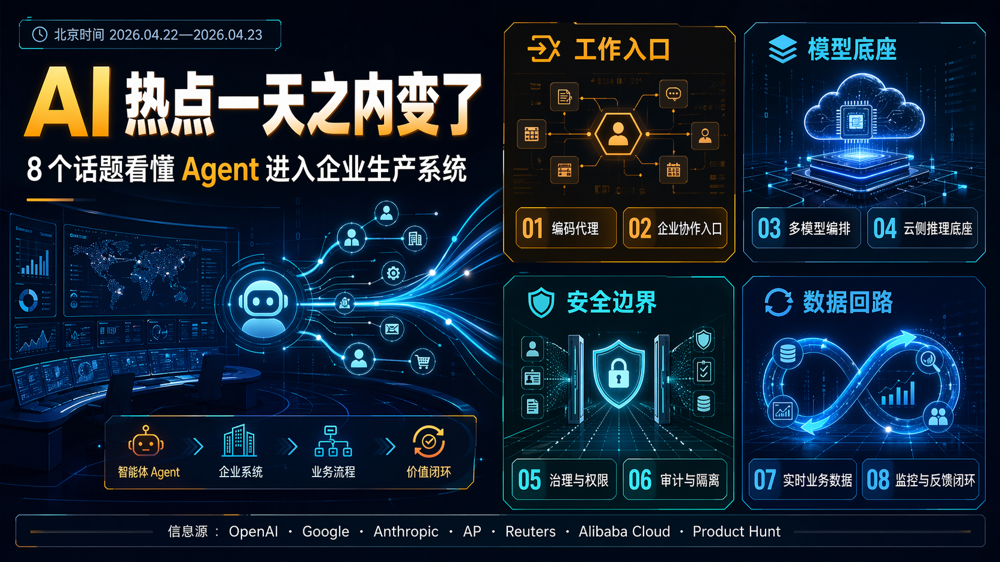

# AI 热点一天之内变了：Agent 开始接管工作流

时间范围：2026-04-22 00:00 至 2026-04-23 12:16（北京时间；包含美国 4/21 下午发布后在 4/22 持续发酵的事项）

写作定位：热点快评型

覆盖渠道：官方公告、可信科技媒体、产品榜单、开发者与社区讨论

一句话判断：过去一天 AI 圈最热的不是“谁又刷了一个榜”，而是 Agent 正在从聊天框进入企业工作流、代码生产、安全防线和真实操作数据。

## 标题候选

1. AI 热点一天之内变了：Agent 开始接管工作流
2. 8 个 AI 热点背后，真正抢的是企业工作的入口
3. OpenAI、Google、Anthropic 同时给了一个信号：AI 不只会聊天了
4. 今天 AI 圈最热的，不是模型，而是工作流
5. 从 Cursor 到 Workspace Agents，AI 正在变成公司里的“第二套员工系统”
6. Agent 进公司，第一批被改写的是代码、安全和办公
7. 这 8 个 AI 热点合在一起看，答案很清楚：下一战是工作流

主标题选择：**AI 热点一天之内变了：Agent 开始接管工作流**

## 优化摘要

过去一天的 AI 热点表面很散：OpenAI 发 Workspace Agents，Google 推 Gemini Enterprise Agent Platform，Anthropic 的 Mythos 调查牵出安全模型供应链风险，SpaceX 拿下 Cursor 600 亿美元收购选择权，Meta 被曝用员工操作轨迹训练 Agent。合在一起看，它们都指向同一件事：AI 竞争正在从模型能力，转向谁能占住工作入口、治理层和真实数据回路。

## AI 速览

- OpenAI 推出 ChatGPT Workspace Agents，重点不是“更聪明的 GPT”，而是把可共享、可审批、可接工具、可在 Slack 中运行的 Agent 放进团队流程。
- Google Cloud Next 这轮发布的主线很清楚：Gemini Enterprise Agent Platform、Workspace Intelligence、TPU 8t/8i、安全 Agent，都在服务“企业里要管理成千上万个 Agent”。
- Anthropic Mythos 的可能未授权访问，让“强能力模型如何受控开放”从理念问题变成供应链问题。
- SpaceX 与 Cursor 的 600 亿美元收购选择权说明，AI 编程工具已经不只是 IDE，而是软件生产入口、开发者分发和代码工作数据的组合资产。
- Meta 被曝记录美国员工的鼠标、点击、键盘与屏幕快照来训练 Agent，争议背后是一个现实：Agent 想学会真实工作，最缺的是高质量操作轨迹。
- ChatGPT Images 2.0 的热度不是“又能画图了”，而是图像生成开始往海报、文档、广告、信息图这些可交付场景靠近。
- Qwen3.6-Max-Preview 在产品榜单与开发者圈继续发酵，国产模型的传播点仍集中在编码、长上下文、Agent 能力和性价比。

## 开场：这一天的 AI 热点，表面很散，合起来很集中

如果只看标题，过去一天的 AI 圈像一张被打乱的拼图：OpenAI 发团队 Agent，Google 发企业 Agent 平台，Anthropic 的安全模型出访问风波，Meta 因员工操作数据训练 Agent 被骂，SpaceX 又把 Cursor 推上 600 亿美元级别的估值讨论。

但把这些热点放到一起看，结论反而很清楚：**AI 产业的竞争焦点，正在从“谁的模型更强”，转向“谁能进入真实工作流”。**

这篇文章你可以带走一个判断和一个框架。

判断是：下一阶段最值钱的 AI 资产，不只是模型本身，而是工作入口、治理系统、上下文数据和操作轨迹。

框架是：看 AI 热点别只看模型参数，要看三条线：它抢了哪个入口，它拿到了什么数据，它有没有办法被安全地管起来。

## 1. OpenAI Workspace Agents：GPT 正在从个人助手变成团队流程

发生了什么：

OpenAI 在 2026-04-22 发布 Workspace Agents in ChatGPT。它把 Agent 放到 ChatGPT 的团队工作区里，让企业用户创建共享 Agent，用来处理报告、写代码、回复消息、拉取上下文、跑长期流程。官方说这些 Agent 由 Codex 驱动，运行在云端，可以使用文件、代码、工具和记忆，也可以在 Slack 里参与协作。

为什么热：

这不是 GPTs 的小升级。GPTs 更像“个人定制助手”，Workspace Agents 更像“团队流程模板”。一个销售跟进 Agent、软件审批 Agent、周报 Agent、供应商风险 Agent，如果能在组织里被共享、审计、复用，它就不只是聊天工具，而是在替公司沉淀流程。

我怎么看：

**OpenAI 这次真正要抢的不是问答入口，而是企业里的重复工作入口。**

过去 ChatGPT 的优势是个人使用频率高。现在 Workspace Agents 要解决的是组织问题：谁能创建 Agent，能接哪些工具，什么时候要审批，出了问题谁负责，管理员怎么看运行记录。

这也是为什么它会强调权限、审批、分析、Compliance API 和管理员控制。Agent 进公司以后，模型能力只是第一层，真正难的是它能不能被管理。

来源：OpenAI 官方《Introducing workspace agents in ChatGPT》

## 2. Google Gemini Enterprise Agent Platform：企业不会只要一个 Agent，它要管一群 Agent

发生了什么：

Google Cloud Next 2026 的发布主线是“agentic enterprise”。Google 推出 Gemini Enterprise Agent Platform，定位是构建、扩展、治理和优化 Agent 的统一平台。它继承 Vertex AI 的模型选择与构建能力，同时加入 Agent Studio、Agent Runtime、Memory Bank、Agent Identity、Agent Registry、Agent Gateway、Agent Observability 等能力。

Google 同时强调 Model Garden 中有 200 多个模型，包括 Gemini 3.1 Pro、Gemini 3.1 Flash Image、Lyria 3、Gemma 4，也支持 Anthropic Claude 等第三方模型。

为什么热：

Google 的打法很典型：它不是只给企业一个好用聊天框，而是直接做 Agent 控制台。企业一旦真的部署 Agent，很快就会遇到一堆工程问题：哪个 Agent 能访问哪个系统，Agent 的身份是什么，工具怎么审批，错误怎么追踪，失败样本怎么回收，跨系统如何连接。

我怎么看：

**Google 押注的是“Agent 群管理”，不是单个 Agent 炫技。**

这对大公司很现实。一个部门做一个 Agent 很容易，但一个集团有几千个 Agent 同时跑，身份、权限、审计、成本、质量、异常检测都会变成硬问题。Google 这套产品语言说明一件事：Agent 正在从 demo 阶段进入 IT 管理阶段。

来源：Google Cloud 官方《Introducing Gemini Enterprise Agent Platform》、Google Cloud Next 2026 汇总

## 3. Anthropic Mythos 调查：最危险的不是模型太强，而是边界太脆

发生了什么：

CBS News 在 2026-04-22 报道，Anthropic 正在调查 Mythos 模型的可能未授权访问。Anthropic 对 CBS 表示，相关报告涉及一个第三方供应商环境，目前没有发现 Anthropic 核心系统被入侵。

背景是 Anthropic 本月早些时候推出 Project Glasswing，把 Claude Mythos Preview 限制开放给少数关键软件与安全组织，用于发现和修复漏洞。Anthropic 官方称 Mythos Preview 已发现大量高危漏洞，包括主要操作系统和浏览器中的漏洞，并承诺投入最高 1 亿美元使用额度和 400 万美元开源安全捐赠。

为什么热：

Anthropic 一直是最强调安全和受控发布的 AI 公司之一。正因为如此，Mythos 的访问风波才更刺眼：如果一个高度受限、以安全为核心的模型也会暴露在供应链风险里，那企业自己的 Agent 系统更应该紧张。

我怎么看：

**强模型的风险，不只来自模型会输出什么，也来自谁能访问它、凭什么访问它、供应商链条有没有漏口。**

Mythos 是一个很好的提醒：当 AI 能力进入网络安全、代码审计、漏洞挖掘这些高风险领域，访问控制就不再是后台小事，而是产品本身的一部分。

来源：CBS News、Anthropic Project Glasswing、Anthropic Red Team 技术说明

## 4. SpaceX 与 Cursor：AI 编程工具成了战略资产

发生了什么：

AP、Axios、TechCrunch 等媒体报道，SpaceX 表示已获得以后以 600 亿美元收购 AI 编程工具 Cursor 的选择权，或者支付 100 亿美元推进双方合作。Cursor 方面称，和 xAI 的合作能让它使用 Colossus 基础设施来扩大模型训练能力。需要注意的是，这不是已经完成的收购，而是选择权与合作安排。

为什么热：

600 亿美元这个数字足够吸睛，但更值得看的是它背后的逻辑。Cursor 不是普通代码编辑器，它是开发者每天写代码、理解项目、调试问题、生成变更的入口。谁拥有这个入口，谁就更接近真实软件生产数据。

我怎么看：

**AI 编程工具的价值，正在从“提高工程师效率”，变成“控制软件生产入口”。**

OpenAI 有 Codex，Anthropic 有 Claude Code，Google 有 Antigravity 和企业 Agent 平台，Cursor 则是 AI-native IDE 的代表。SpaceX/xAI 如果想补齐编码 Agent 能力，直接切入 Cursor 这样的高频入口，比从零做一个工具更快。

这件事也说明，未来的 AI 编程大战不只是模型大战，还是分发、工作流、代码上下文和训练数据大战。

来源：AP、Axios、TechCrunch

## 5. Meta MCI：员工操作轨迹成为 Agent 训练燃料

发生了什么：

Reuters 报道称，Meta 将在美国员工电脑上安装新的追踪软件，用于收集鼠标移动、点击、键盘输入和部分屏幕快照，作为训练 AI Agent 的数据。相关工具名为 Model Capability Initiative，Meta 表示这些数据用于模型训练，不用于绩效评估，并会设置敏感内容保护。

为什么热：

这个话题天然会引发反感，因为它踩中了两件事：员工隐私和“训练自己的替代者”。但如果从技术角度看，它也暴露了 Agent 自动化的一个真实瓶颈：模型要学会操作软件，光靠网页文本和代码不够，它需要看到人怎么在真实系统里完成任务。

我怎么看：

**Agent 自动化越往真实工作走，越会碰到一个尴尬问题：高质量操作数据从哪里来。**

过去训练语言模型，互联网文本是燃料。现在训练能操作电脑的 Agent，燃料变成了点击路径、快捷键、下拉框选择、跨系统复制粘贴、审批步骤和异常处理。Meta 的争议说明，企业在追求 Agent 效率时，必须提前回答员工同意、数据最小化、用途边界和审计机制。

这不是公关问题，是 Agent 时代的制度设计问题。

来源：Reuters 报道，经 Investing.com、Ars Technica、PC Gamer 等转载与跟进

## 6. ChatGPT Images 2.0：图像模型开始追求“可交付”

发生了什么：

OpenAI 在 2026-04-21 发布 ChatGPT Images 2.0，并在帮助中心说明该功能面向所有 ChatGPT 计划开放。付费计划可使用“images with thinking”，也就是让模型在生成前有更多时间规划和调整图像结果。

为什么热：

过去 AI 图片的卖点是“能生成”和“好看”。Images 2.0 的传播点则明显转向更实用的方向：文字渲染、多语言排版、海报、信息图、文档配图、品牌物料、漫画分镜、可读版式。

我怎么看：

**图像生成的竞争正在从审美炫技，走向交付能力。**

对公众号、小红书、营销团队、课程内容和产品设计来说，最重要的不是模型能不能画出一张惊艳图，而是能不能稳定产出能用的图：字能读，版式成立，风格一致，能按要求修改。

这也是为什么它和今天的 Agent 主线有关。未来的创作 Agent 不只是写文案，还要把研究、排版、制图、修改、发布串成闭环。

来源：OpenAI 官方《Introducing ChatGPT Images 2.0》、OpenAI Help Center release notes

## 7. Google Workspace Intelligence：办公套件的护城河是上下文

发生了什么：

Google 在 2026-04-23 发布 Workspace Intelligence。它把 Docs、Slides、Gmail、Chat 等内容理解成一个动态上下文系统，让 Gemini 能在 Chat 里接收目标、生成文档和幻灯片、安排会议、找文件，并连接 Asana、Jira、Salesforce 等第三方工具。

为什么热：

企业 Agent 真正要做事，最缺的不是“聪明回答”，而是上下文。谁参与了项目，哪些邮件重要，聊天里哪个决定才是最新版本，文件夹里哪个表才是真数据，这些信息平时都散在办公系统里。

我怎么看：

**办公套件公司做 Agent，最大的优势不是模型，而是上下文图谱。**

Google 的 Workspace Intelligence 和 OpenAI 的 Workspace Agents 看似撞车，本质上各有重心：OpenAI 从 ChatGPT 这个 AI 入口往工作流里钻，Google 从 Workspace 这个工作现场往 AI 里长。

谁更有优势，取决于企业愿意把“最终工作入口”交给谁。

来源：Google Workspace 官方《Introducing Workspace Intelligence》

## 8. Qwen3.6-Max-Preview：国产模型继续卷编码和 Agent

发生了什么：

Alibaba Cloud Community 在 2026-04-22 发布 Qwen3.6-Max-Preview 相关介绍；Product Hunt 2026-04-22 日榜中也出现 Qwen3.6-Max-Preview。围绕它的讨论重点仍集中在编码、推理、长上下文、Agent 场景和 API 使用。

为什么热：

过去一年，国产模型在海外开发者圈的传播路径很清楚：要么靠开源，要么靠性价比，要么靠编码和 Agent 能力切入真实工作场景。Qwen 系列正好踩在这条线上。

我怎么看：

**中国模型要持续出圈，不能只说“接近谁”，必须在开发者每天用的任务上给出更低成本或更好体验。**

这也是 Qwen、GLM、DeepSeek 等模型被反复讨论的原因。它们不一定每次都要做“全球最强”，但只要在编码、长上下文、工具调用、本地部署、API 成本上有一个清晰优势，就能进入开发者工具链。

来源：Alibaba Cloud Community、Product Hunt 2026-04-22 日榜

## 产品雷达：今天值得顺手关注的 AI 产品

| 排名 | 产品/项目 | 来源 | 一句话介绍 | 为什么值得看 |
|---:|---|---|---|---|
| 1 | ChatGPT Workspace Agents | OpenAI | 团队可共享、可接工具、可审批的云端 Agent | ChatGPT 从个人助手转向组织流程 |
| 2 | Gemini Enterprise Agent Platform | Google Cloud | 企业 Agent 的构建、治理、运行和观测平台 | 解决 Agent 成群之后的管理问题 |
| 3 | Workspace Intelligence | Google Workspace | 把邮件、文档、聊天和项目变成办公上下文图谱 | 办公套件正在变成 Agent 入口 |
| 4 | ChatGPT Images 2.0 | OpenAI | 新一代图像生成能力，强调规划、文字和版式 | AI 图片从好看转向可交付 |
| 5 | Qwen3.6-Max-Preview | Alibaba Cloud / Product Hunt | 面向编码、推理和 Agent 场景的模型预览 | 国产模型继续争夺开发者工作流 |
| 6 | Google Security Operations agents | Google Cloud | 威胁狩猎、检测工程、第三方上下文安全 Agent | 安全运营从人工研判转向 Agent 协作 |
| 7 | ChatGPT for Clinicians | OpenAI | 面向美国验证临床人员的免费 ChatGPT 工作区 | 医疗 AI 从泛问答转向专业工作区 |
| 8 | Tines Story Copilot | Product Hunt | 用对话方式构建智能工作流 | 低代码工作流也在 Agent 化 |

## 本周期趋势判断

1. **Agent 的主战场从模型窗口转向工作入口。** ChatGPT、Slack、Google Chat、Workspace、Cursor、代码仓库、CRM，谁占住入口，谁更接近真实任务。
2. **企业要买的不是单个 Agent，而是可治理的 Agent 系统。** 身份、权限、网关、审计、记忆、观测、异常检测，会成为企业 AI 产品的标配。
3. **真实操作数据会越来越贵，也越来越敏感。** Meta 的争议不是偶然，未来所有想训练电脑操作 Agent 的公司都会面对类似问题。
4. **AI 安全进入供应链阶段。** Mythos 的核心启示不是“不要发布强模型”，而是受限访问、第三方环境、凭证、命名信息、日志审计都必须当成模型安全的一部分。
5. **AI 编程工具的估值逻辑正在改变。** Cursor 的热度说明，AI IDE 不是小工具，而是软件生产的入口、上下文容器和开发者分发渠道。

## 来源与热度表

| 热点 | 优先级 | 热度 | 可信度 | 核心来源 | 备注 |
|---|---:|---:|---|---|---|
| OpenAI Workspace Agents | P0 | 5 | High | [OpenAI](https://openai.com/index/introducing-workspace-agents-in-chatgpt/) | 官方发布，企业 Agent 主线明确 |
| Google Gemini Enterprise Agent Platform | P0 | 5 | High | [Google Cloud](https://cloud.google.com/blog/products/ai-machine-learning/introducing-gemini-enterprise-agent-platform), [Google Blog](https://blog.google/innovation-and-ai/infrastructure-and-cloud/google-cloud/next-2026/) | Cloud Next 核心发布 |
| Anthropic Mythos 访问调查 | P0 | 5 | Medium-High | [CBS News](https://www.cbsnews.com/amp/news/anthropic-investigates-mythos-ai-breach/), [Anthropic](https://www.anthropic.com/glasswing), [Anthropic Red Team](https://red.anthropic.com/2026/mythos-preview/) | 调查事件来自媒体报道，背景来自官方 |
| SpaceX × Cursor 600 亿美元选择权 | P1 | 5 | High | [AP](https://apnews.com/article/582e7606e695320a299e4902dbb2704f), [Axios](https://www.axios.com/2026/04/21/spacex-ai-cursor-deal), [TechCrunch](https://techcrunch.com/2026/04/21/spacex-is-working-with-cursor-and-has-an-option-to-buy-the-startup-for-60-billion/) | 不是已完成收购，是选择权和合作 |
| Meta MCI 员工操作数据训练 Agent | P1 | 4 | Medium | [Investing.com / Reuters](https://www.investing.com/news/company-news/meta-to-track-employee-keystrokes-to-train-ai-models-reuters-reports-93CH-4627095), [Ars Technica](https://arstechnica.com/ai/2026/04/meta-will-use-employee-tracking-software-to-help-train-ai-agents-report/) | 基于 Reuters 内部备忘录报道 |
| ChatGPT Images 2.0 | P1 | 4 | High | [OpenAI](https://openai.com/index/introducing-chatgpt-images-2-0/), [OpenAI Help Center](https://help.openai.com/en/articles/6825453-chatgpt-release-notes%25252525253F.eot) | 官方发布，4/22 继续发酵 |
| Google Workspace Intelligence | P1 | 4 | High | [Google Workspace](https://workspace.google.com/blog/product-announcements/introducing-workspace-intelligence) | 官方发布，和 Agent Platform 形成组合 |
| Qwen3.6-Max-Preview | P1 | 3 | Medium-High | [Alibaba Cloud Community](https://www.alibabacloud.com/blog/qwen3-6-max-preview-smarter-sharper-still-evolving_603055), [Product Hunt](https://www.producthunt.com/leaderboard/daily/2026/4/22) | 官方社区和产品榜单信号，部分榜单说法需继续核验 |

## 可配图热点列表

1. **8 个热点雷达图：** 中心写“Agent 进入生产系统”，外圈放 OpenAI、Google、Anthropic、Cursor、Meta、Images、Workspace、Qwen 八个节点。
2. **三条主线图：** 工作入口、模型底座、安全边界，分别对应聊天、办公、代码、安全、数据。
3. **Agent 企业化流程图：** 创建 Agent、接工具、设权限、跑任务、要审批、留日志、做观测、回收失败样本。
4. **安全供应链示意图：** 模型金库、供应商侧门、凭证、审计日志、访问边界。
5. **AI 编程工具价值链：** 编辑器、代码上下文、模型调用、开发者分发、训练数据、企业采购。

## 配图提示词包

详见同目录 `image-prompts.md`。已准备 `cover_or_lead_image` 和 `long_infographic` 两组提示词，分别包含 GPT Image 2 与 Nano Banana 2 版本。

## 结尾：下一个该关注什么

如果只用一句话总结今天的 AI 热点，我会这样说：

**模型大战还在继续，但更大的战场已经变成工作流大战。**

过去我们看 AI 新闻，习惯问三个问题：模型强不强，价格低不低，能不能开源。现在还要多问三个问题：

它进入了哪个工作入口？

它拿到了什么真实上下文？

它有没有办法被企业安全地管理？

OpenAI 的 Workspace Agents、Google 的 Agent Platform、Anthropic 的 Mythos、SpaceX 对 Cursor 的兴趣、Meta 对员工操作轨迹的收集，其实都在回答这三个问题。

接下来真正值得盯的，不是哪个发布会又多了一个“最强模型”，而是哪家公司先把 Agent 变成企业每天离不开的基础设施。

对普通创作者和企业团队来说，最实际的动作也很简单：别急着追每一个模型，先盘点你自己的工作流。哪些任务高频、重复、可审计、可回滚、需要跨工具协作？这些地方，才是 Agent 最先落地的地方。

AI 不再只是帮你回答问题。它正在试图进入你做事的系统。

*AI 辅助创作，人工检索、核验与编辑。*
