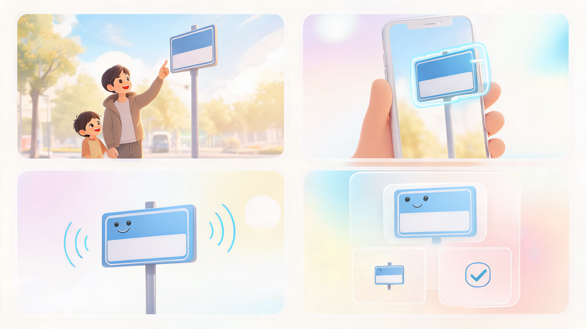
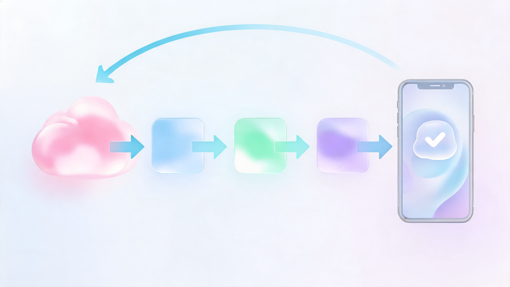
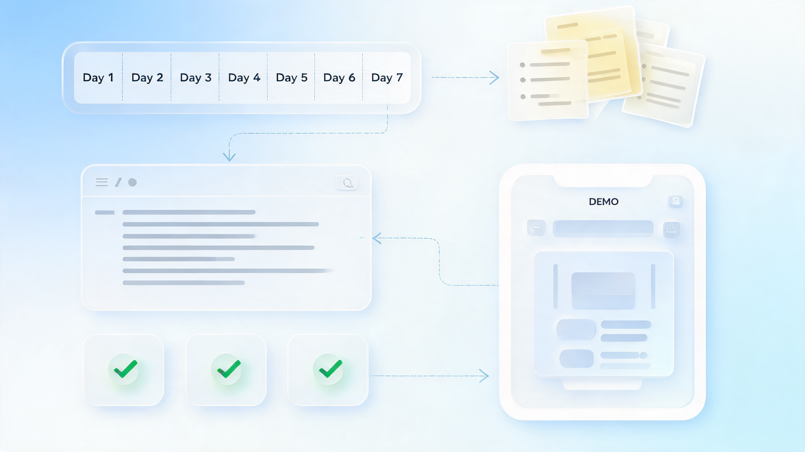

# 普通开发者的 AI 风口，不在大模型，而在身边的小需求

昨天看到 AYi 分享 CapWords 的故事，第一反应不是“又一个 AI 学英语 App 火了”，而是有点被那个起点打动。

一个爸爸接女儿放学，孩子指着路边的东西问英文怎么说。他答不上来，打开翻译 App，出来的是一个很冷的机械音。孩子只是轻轻说了一句“噢”。

我的判断是：**普通开发者要乘上 AI 风口，机会不在跟大厂抢大模型，而在把自己真正经历过的生活需求，做成一个有温度的小产品。**

这篇不想写成创业鸡血，也不想喊“人人都能做下一个爆款”。我更想借 CapWords 这件事，拆清楚普通开发者现在真正能抓住的 4 类机会，以及一套可以马上动手的判断框架。

## 1. 🌱 好 AI 产品的起点，往往不是 AI

CapWords 最有意思的地方，不是它用了 AI，而是它解决的问题很小、很真。

Apple 开发者官网介绍过这个故事：CapWords 由 Ace Lee 开发，背后的 HappyPlan Tech 来自北京，团队规模 3 人。它拿下了 2025 年 Apple 设计大奖“乐趣横生”奖项。

产品逻辑并不复杂：打开相机，对准日常物体拍一下，AI 识别物体，去掉背景，生成一个互动单词贴纸，再配上发音和复习。杯子、路牌、交通锥、点心，都可以变成孩子愿意点、愿意听、愿意收藏的学习材料。

但如果只把它理解成“拍照识词”，就把重点看小了。

真正关键的是，Ace Lee 不是先问“现在有什么模型可以包装一下”，而是先遇到了一个生活里的真实瞬间：

> **孩子不是缺一个答案，而是缺一个有参与感、有情绪反馈、有记忆钩子的学习体验。**

这就是普通开发者最容易忽略的机会。

很多人一聊 AI 产品，就下意识往“大”里想：通用助手、超级入口、行业平台、工作流系统。想法越大，离自己越远，最后反而变成另一个套壳聊天框。

但 CapWords 提醒我们，AI 时代的好机会未必从宏大命题开始，它常常从一句很轻的“不对劲”开始。

- 这个流程为什么每次都让我烦？
- 这个工具为什么给了答案，却没有解决感受？
- 这个场景为什么明明高频，却没人认真做？
- 这件事为什么我身边的人一直在手动凑合？

**普通开发者最好的护城河，不是比大厂更懂 AI，而是比大厂更懂某一个真实生活场景。**

## 2. 🔍 大厂看见市场，普通人看见缝隙

大公司做 AI，天然会追求大规模：更通用的模型，更大的入口，更完整的平台，更可复制的商业化路径。

这当然重要，但它也会带来一个问题：越追求通用，越容易离具体的人远一点。

生活里的很多需求，恰恰藏在这些“不够大”的地方。

比如孩子问一个路牌怎么说，老人看不懂复杂的就医提示，家里一堆票据和保修单没人整理，旅行前临时做攻略总是东拼西凑，做饭时看到一个短视频菜谱却很难变成采购清单。

这些场景单独看都不宏大，甚至有点琐碎。

但它们有一个共同点：**人已经在忍了，工具还没贴上去。**

过去，这些小需求很难被产品化，因为成本不划算。你要做识别、翻译、生成、分类、提醒、复习、同步，任何一个环节都可能把一个小工具拖成大工程。

现在不一样了。

多模态模型、语音、视觉识别、向量检索、Agent、AI 编程工具，把很多过去昂贵的能力变成了可调用的积木。一个普通开发者不需要从零造发动机，只需要知道车应该开进哪条小巷。

这就是 AI 风口对普通开发者最现实的意义：

> **当通用能力变便宜，场景理解就变贵了。**

你不一定比大厂模型强，但你可以比它更知道某个场景里用户真正卡在哪里。

你不一定能做出一个覆盖亿万人的超级产品，但你可以做一个让 1000 个同类用户觉得“这就是给我做的”的小产品。

很多时候，风口不是在天上吹的，而是在生活缝隙里漏出来的。

## 3. 🧩 AI 不该只是功能标签，而要完成一次转换

判断一个 AI 产品有没有机会，可以先问一个很简单的问题：

**它到底把什么，转换成了什么？**

CapWords 的答案很清楚。

它不是把“物体”转换成“单词”这么简单，而是把一次路边好奇，转换成一张可以收藏、可以点击、可以听、可以复习的互动贴纸。

这中间至少有四次转换：

1. 把现实物体转换成可识别的对象。
2. 把对象转换成多语言词汇和发音。
3. 把答案转换成可爱的贴纸和动画。
4. 把一次性提问转换成长期复习。

这就比“AI 识别一下”强很多。

普通开发者做 AI 产品，最怕的是只把 AI 当标签贴上去：AI 记账、AI 日记、AI 搜索、AI 助手。名字很新，体验还是旧的，用户用一次就走。

真正值得做的，是找到一个原本很麻烦的转换链路。

- 把一段语音，转换成能执行的待办。
- 把一堆聊天记录，转换成清晰的决策纪要。
- 把一个短视频菜谱，转换成步骤和采购清单。
- 把孩子的错题，转换成下一周的练习计划。
- 把混乱的家庭资料，转换成可搜索、可提醒、可交接的生活档案。

这里面每个例子都不只是“生成一段文字”。

它们真正解决的是：用户过去要靠脑子记、靠手工抄、靠反复查、靠临时拼的事情，现在能不能被产品顺手接住。

所以我会把普通开发者的 AI 产品机会，总结成一个公式：

> **真实场景 + 明确转换 + 低摩擦体验 + 可持续闭环 = 小团队能抓住的 AI 机会。**

只要这四项成立，哪怕题目很小，也值得做。

反过来，如果一个产品只有“AI 能聊”“AI 能生成”“AI 能总结”，但没有明确转换，也没有让用户第二天还想回来，那它大概率只是热闹。

## 4. 🧭 乘风口不是追热点，而是做出小闭环

很多普通开发者会卡在一个误区里：觉得要抓 AI 风口，就得马上做创业项目、融资、招人、做增长。

其实第一步没那么重。

更好的起点，是先做出一个小闭环。

所谓小闭环，就是用户在一个具体场景里完成一次明确动作，并且愿意再回来。

CapWords 的闭环很清楚：

拍下身边物体 → 得到一个贴纸 → 听到发音 → 收藏起来 → 以后复习。

这个闭环不大，但很完整。

普通开发者判断一个想法能不能做，也可以用 5 个问题过一遍：

1. **这个需求是不是我或身边人真的遇到过？**
2. **它是不是高频到值得打开一次工具？**
3. **AI 能不能让结果明显更快、更准或更有趣？**
4. **用户第一次用完后，有没有一个自然的下次使用理由？**
5. **这个产品有没有清楚的信任边界，知道哪些事不能乱承诺？**

最后一点尤其重要。

AI 产品不能只追求“看起来很聪明”。越贴近生活，越要知道自己的边界。教育类产品不能替代长期陪伴，健康类产品不能替代医生判断，财务类产品不能替代用户自己做决策。

**有边界，才会有信任；有信任，才可能有复用。**

这也是 CapWords 让我觉得舒服的地方。它没有试图把自己包装成“全能教育 AI”，而是把一件具体的事做得轻、准、有趣：把孩子眼前的世界，变成可以学习的贴纸。

小闭环跑通以后，才谈得上增长。

否则所谓风口，只是把一个没想清楚的想法吹得更快散架。

## 5. 🛠️ 普通开发者可以马上做的 7 天动作

如果你也想从生活需求里找 AI 机会，不用一开始就写商业计划书。

先给自己 7 天，做一个能被真人试用的小东西。

**第 1 天：写 20 个“我真希望有个工具”的瞬间。**

不要写宏大方向，只写场景。比如“每次整理发票都很烦”“每次给家人解释手机设置都要重复讲”“每次旅行前收藏一堆帖子，最后还是乱”。

**第 2 天：筛掉不够痛的，留下 3 个高频场景。**

判断标准很简单：这件事是不是最近一个月发生过？是不是已经有人在用 Excel、备忘录、截图、微信群土法解决？

**第 3 天：为每个场景写一句转换句。**

格式是：“把 A 转换成 B”。如果写不出来，说明产品还没想清楚。

**第 4 天：用 AI 编程工具做一个最小原型。**

别做登录、会员、社区、复杂设置。只做主路径。用户进来 30 秒内要看到结果。

**第 5 天：找 5 个真实用户试。**

不要问“你觉得怎么样”，问“你上次什么时候遇到这个问题”“你现在怎么解决”“如果这个工具只能保留一个功能，你要哪个”。

**第 6 天：删功能，补那个最打动人的瞬间。**

小产品的魅力往往不在功能多，而在一个瞬间很顺。CapWords 的贴纸动画和真实声音，就是这样的瞬间。

**第 7 天：公开过程。**

写一篇文章、发一条帖子、录一个短 demo。不要等完美。普通开发者的分发，很多时候就是从公开做事开始的。

这 7 天不一定能做出一个商业产品，但一定能帮你完成一件关键的事：

**从“我觉得 AI 很重要”，走到“我知道 AI 可以具体帮谁解决什么”。**

这一步，比看 100 篇行业分析更有用。

## 结尾：小需求不是小机会

CapWords 这个故事让我最有感触的地方，是它没有从“我要做一个 AI 教育平台”开始。

它从一次放学路上的停顿开始。

从一个父亲没有答上来的问题开始。

从孩子听到机械音以后，那句轻轻的“噢”开始。

很多普通开发者真正能把握住的机会，也会是这种尺度。

不是世界级发布会，不是万亿参数，不是颠覆行业的大词，而是你每天生活里那些被忍过去、凑合掉、重复消耗的小麻烦。

AI 让这些小麻烦第一次有了被认真产品化的可能。

所以，今天最值得做的不是再问“我能不能赶上 AI 风口”，而是换一个问题：

> **我身边有哪些真实需求，过去因为技术成本太高没人做，现在可以被 AI 做得更轻、更准、更有温度？**

普通开发者不一定要站在风口中心。

能把一个生活缝隙里的需求接住，就已经是在风里了。

