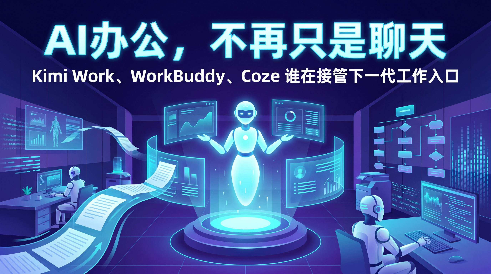
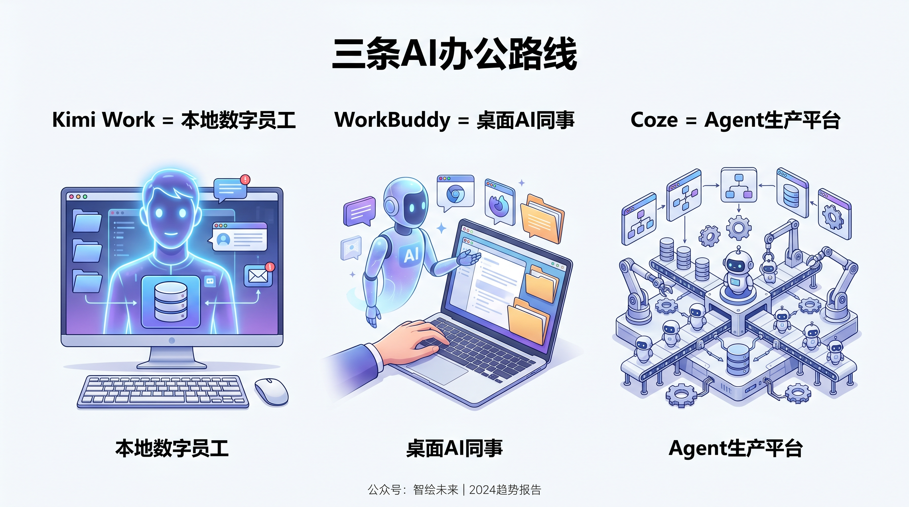
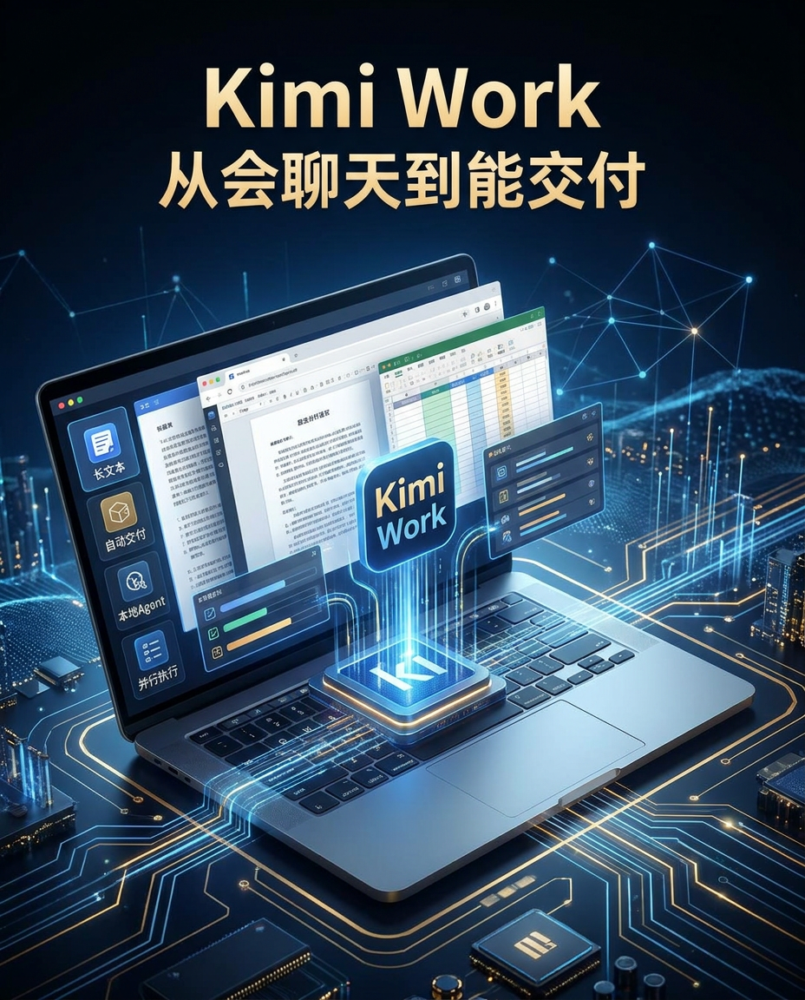
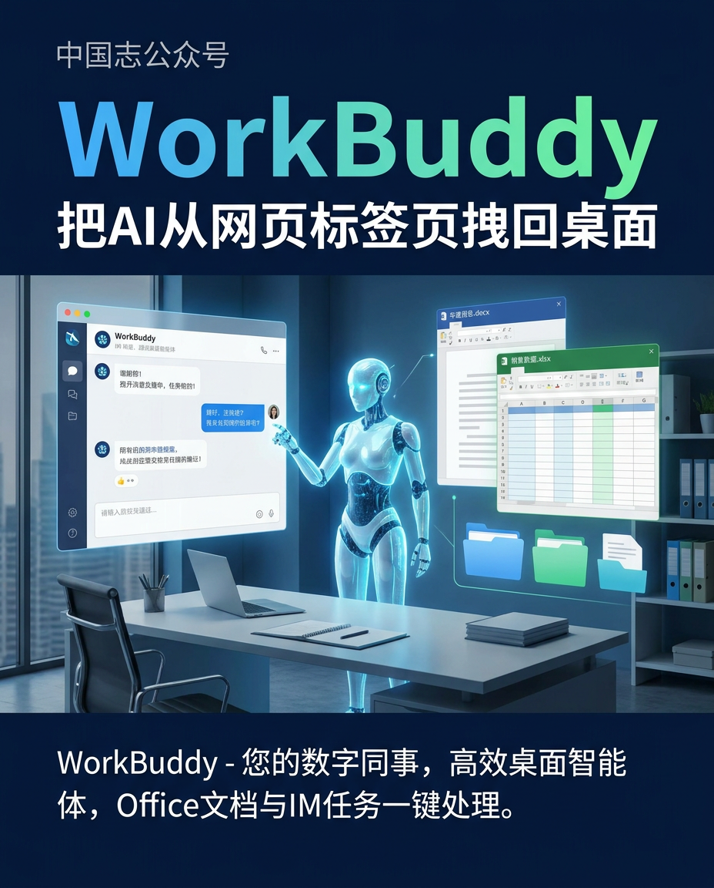
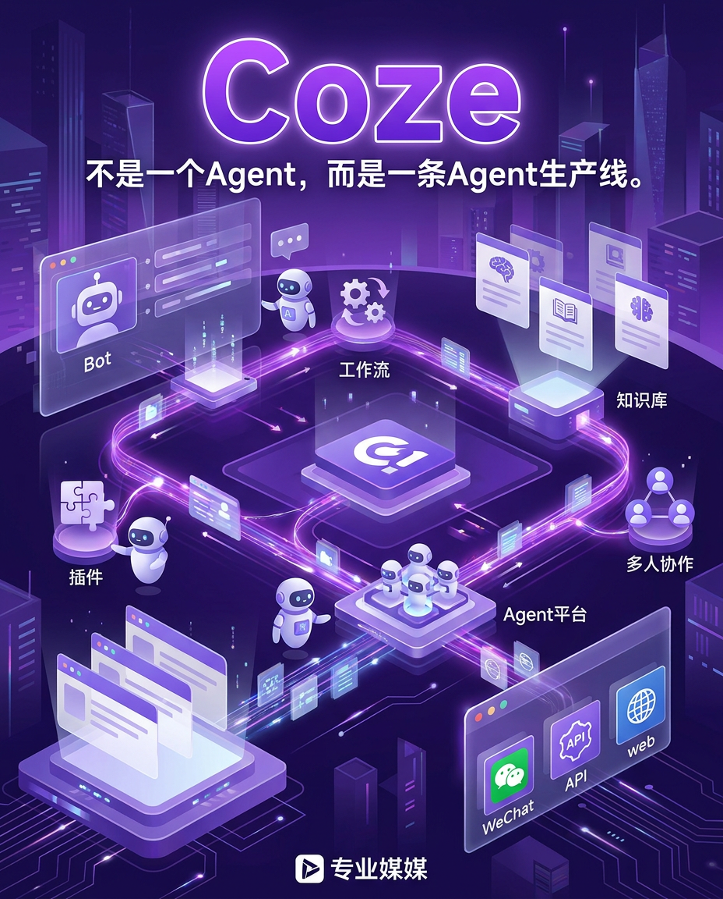

# Kimi Work、WorkBuddy、Coze，谁在定义下一代 AI 办公？

> 💡 **一句话先说结论：**Kimi Work、WorkBuddy、Coze 看起来都在做 AI 办公，但它们争的不是同一件事。Kimi Work 想做你的**本地数字员工**，WorkBuddy 想做你的**桌面 AI 同事**，Coze 想做的是**把一群 Agent 组织起来的生产平台**。真正的分水岭，不是模型谁更会聊天，而是谁先接管“找资料—处理文件—跨工具协作—交付结果”这条工作链路。[[1]](http://m.toutiao.com/group/7647161246738874915/)

> ⭐ **这篇文章最适合转发的一句话：**这一轮 AI 办公竞争，拼的已经不是“谁更会聊天”，而是“谁能把一段流程更快变成一个交付结果”。

很多人对 AI 办公的热情，已经从兴奋走向疲劳了。

原因并不复杂：会聊天的工具太多了，但真正能把活干完的工具太少了。用户不是缺一个会写漂亮废话的对话框，而是缺一个能把网页、文档、表格、知识库和协作软件真正串起来的执行者。

过去一年，行业叙事也从“谁的模型更聪明”，快速转向“谁能闭环完成任务”，Agent 成了新的中心词。[[2]](https://aiproducthub.cn/wpnote/ai-office-2026-trends-guide)

所以，如果你最近同时看到 Kimi Work、WorkBuddy、Coze 频繁冒头，不要把它们简单理解成“又来了三个 AI 产品”。

更准确地说，它们代表了中国 AI 办公正在分化出的三条主路线：**本地执行型 Agent、桌面工作台型 Agent、平台化 Agent 工厂**。这也是为什么它们都很火，但火的点并不一样。[[3]](https://blog.csdn.net/qq_44866828/article/details/160622087)

---

## 为什么这三款产品会在同一个时间窗口被反复讨论

一个直接背景是，大家已经不太满足“你问一句、AI 回一句”的产品形态了。

无论是调研、写周报、整理合同、追踪竞品，真正费时间的都不是“生成第一段文字”，而是在不同软件之间搬运信息、验证结果、补齐格式、重新交付。

用户抱怨的核心，从来不是“AI 不够会说”，而是“AI 不会替我做完”。[[4]](https://www.baogaobox.com/insights/250531000010950.html)

另一个更深的变化，是 AI 正在试图替代传统的办公入口和搜索入口。

以前你得先决定打开浏览器、文档、表格还是 IM；现在这些产品都在试图把流程改成一句话下达目标，然后让系统自己拆任务、找工具、调知识、出结果。

MCP 之类的标准化连接方式之所以被追捧，本质上也是为了让 AI 真正成为跨系统的统一接口。[[5]](https://zhuanlan.zhihu.com/p/1915771197922210124)

这就是今天讨论 Kimi Work、WorkBuddy、Coze 的真正意义：它们不是在争“下一个聊天机器人”，而是在争“下一个工作入口”。[[6]](https://cloud.tencent.com.cn/developer/article/2563583)

---

## 先把三者一句话看懂

> 💬 **先记住这张图：**Kimi Work 抢的是个人任务闭环，WorkBuddy 抢的是桌面执行闭环，Coze 抢的是 Agent 时代的平台骨架。

**Kimi Work：**更像一个装在你电脑里的**本地数字员工**。

它的卖点不是陪你聊天，而是接过任务后，自己去调用浏览器、本地文件和办公工具，最后直接把成果交给你。[[7]](http://m.toutiao.com/group/7647192855492870694/)

**WorkBuddy：**更像一个覆盖桌面和 IM 的**AI 同事工作台**。

它强调的是“你发一句话，它就能在电脑上继续干活”，包括处理本地文件、串联办公软件，甚至通过微信等入口远程控制办公任务。[[8]](https://www.aitop100.cn/tools/workbuddy)

**Coze / 扣子：**更像一个**Agent 生产平台**。

它最强的地方不是替你做一件事，而是让你把 Bot、工作流、知识库、插件和发布渠道拼起来，快速造出一整套 AI 应用。[[9]](https://www.coze.cn/open/docs/guides/welcome)

如果只看表面，这三者都在讲“AI 帮你办公”；但如果看底层路径，就能发现差异非常大：Kimi Work 抢的是个人电脑的控制权，WorkBuddy 抢的是桌面协同和企业办公入口，Coze 抢的是 Agent 时代的基础设施定义权。[[10]](http://m.toutiao.com/group/7646795288421745167/)

---

## 第一条路线：Kimi Work，想把“会聊天的 Kimi”推成“能交付的 Kimi”

> 💡 **Kimi Work 最值得看的，不是它会不会回答问题，而是它开始试图直接交付结果。**

Kimi 过去最强的用户心智是长文本。很多人认识它，是因为它能读长文档、看大段材料、做信息压缩。

但 Kimi Work 的变化在于，它不想只停留在“读完再回答你”，而是往前跨了一步：**从理解信息，走向执行任务，再走向直接交付结果**。

官方公开表述里，它被定义为面向知识工作者的通用型本地 Agent，并且目前仍处于 Beta 内测阶段。[[1]](http://m.toutiao.com/group/7647161246738874915/)

这条路线最打人的地方，在于它补上了过去大模型最尴尬的“最后一公里”。

以前你让 AI 帮你做行业研究，它往往能给你一份看起来像样的分析文字；但真正麻烦的是，你还得自己去补表格、改版式、整理引用、做成 PPT。

Kimi Work 试图把这一步也吞掉：在公开资料里，它最典型的能力就是本地自动化交付，以及在复杂任务里调度大量子 Agent 并行完成工作。[[7]](http://m.toutiao.com/group/7647192855492870694/)

这意味着 Kimi 的产品野心已经不是“最好用的中文聊天工具”，而是“把知识工作者的电脑变成一个可托管的工作环境”。

如果说传统聊天式 AI 像一个很聪明的顾问，Kimi Work 更像一个会自己开工的分析师。[[11]](https://www.kimi.com/zh-cn/help/agent/agent-overview)

不过，Kimi Work 现在最应该谨慎描述的地方也很明确。

第一，它仍在内测，不能写成全面开放；第二，它虽然强调本地 Agent，但并不等于完全离线运行，关于隐私与云端依赖的边界，不适合写得过满。

写它时最稳妥的方式，是把重点放在“本地执行能力”和“从对话走向交付”，而不是轻易下结论说它已经彻底解决了隐私与稳定性问题。[[12]](http://m.toutiao.com/group/7647158481321886258/)

---

## 第二条路线：WorkBuddy，想把 AI 从网页标签页里拽回桌面

> 💡 **WorkBuddy 的张力在于，它想把 AI 从浏览器标签页里拽出来，塞回真正的办公桌面。**

如果说 Kimi Work 更像“聪明的个人数字员工”，那 WorkBuddy 走的是另一条非常务实的路：它想成为职场人的桌面工作台。

腾讯对它的定义很直白：全场景职场 AI 智能体桌面工作台。

这个定位背后有一个很现实的判断：真正的办公流程，绝大多数并不发生在聊天框里，而是发生在本地文件夹、Office 套件、即时通讯、企业知识库和浏览器标签页之间。[[13]](https://baike.baidu.com/item/WorkBuddy/67362053)

所以 WorkBuddy 的代表性能力，不是单纯地回答问题，而是**直接接手桌面任务**。

公开资料里，它最具传播力的能力有两个：一是本地文件和办公文档的读写处理，二是把 AI 行为入口延伸到微信、企业微信、飞书等 IM 场景，让“远程给电脑派活”这件事变得更自然。

对于很多上班族来说，这种体验非常有画面感：你不是又多了一个网页工具，而是多了一个能在桌面上帮你跑腿的同事。[[14]](https://cloud.tencent.com/developer/article/2680488)

WorkBuddy 还有一个很聪明的选择：它没有把自己锁死在某一家模型上，而是公开强调支持多模型切换。

这背后的产品思路其实很重要：它更愿意把自己定义成“工作台”和“执行层”，而不是单一模型的展示窗口。

对企业用户来说，这比单纯强调模型参数更有吸引力，因为真正重要的是任务能不能稳定落地。[[15]](https://zhuanlan.zhihu.com/p/2019479042693314442)

但 WorkBuddy 的代价也同样明显。

只要一款产品开始触碰本地文件、桌面权限和跨软件操作，用户天然就会担心安全边界。哪怕产品强调授权、沙箱和控制机制，很多企业在真正大规模放开权限这件事上仍然会谨慎。

换句话说，WorkBuddy 的上限来自“控制桌面”，它的阻力也来自“控制桌面”。这正是这条路线的隐藏税。[[16]](https://news.lavx.hu/article/tencent-rolls-out-workbuddy-and-expands-its-ai-agent-lineup)

---

## 第三条路线：Coze，想做的不是一个 Agent，而是 Agent 生产线

> 💡 **Coze 真正厉害的地方，不是替你做一件事，而是让你批量造出一整套会干活的 Agent。**

Coze 的有趣之处在于，它从一开始就不是把自己做成单点办公工具。

它更接近一个低门槛的 Agent 平台：你可以在上面搭 Bot、接插件、配知识库、编工作流，再把它发布到不同渠道。

换句话说，Kimi Work 和 WorkBuddy 更像“替你干活的人”，而 Coze 更像“替你造员工和流程的工厂”。[[9]](https://www.coze.cn/open/docs/guides/welcome)

这也是为什么 Coze 在行业里经常被看作 Agent 平台的代表。

它真正的核心资产，不只是一个 Bot，而是**工作流编排能力、插件生态、知识库能力和分发能力**被打包到了一起。

对普通用户来说，这代表“我也能做一个能干活的 AI 应用”；对团队来说，这代表“我可以把重复流程封装成工具，而不是每次重新 prompt 一遍”。[[17]](https://blog.csdn.net/matlab_python22/article/details/151954450)

最近这段时间，Coze 的对外叙事也在继续升级。

公开资料显示，它已经不满足于“Bot 搭建平台”这个老标签，而是在强调项目空间、多 Agent 协作、Agent Office、Agent Coding 等能力，试图把自己从“造一个 AI 助手的地方”推进成“组织一群 AI 一起工作的地方”。

如果说前两者争的是个人或桌面的入口，Coze 更像是在争未来团队协作系统的骨架。[[18]](https://g.pconline.com.cn/x/2163/21635593.html)

当然，平台路线也不是没有代价。它最大的优势是灵活、可扩展、适合快速试错；但它最大的门槛也恰好来自灵活。

对很多普通用户来说，搭工作流、调节点、接知识库，依旧比“直接派活给一个桌面 Agent”更费脑子。

也就是说，Coze 更像一套生产工具，而不是一件即拿即用的成品。[[19]](http://m.toutiao.com/group/7615822370627928619/)

---

## 真正的分歧，不是谁更聪明，而是谁更接近“工作闭环”

如果把这三款产品放在一起看，会发现它们争夺的是三个不同层面的控制权。

- **Kimi Work** 争的是**个人任务闭环**：你给目标，它去拆解、执行、生成结果。[[1]](http://m.toutiao.com/group/7647161246738874915/)
- **WorkBuddy** 争的是**桌面执行闭环**：它要进入你的电脑环境、办公软件和 IM 体系，把分散在不同应用里的动作串起来。[[8]](https://www.aitop100.cn/tools/workbuddy)
- **Coze** 争的是**组织化生产闭环**：它不只回答一次问题，而是想把知识、插件、工作流和发布渠道变成一个可复用系统。[[17]](https://blog.csdn.net/matlab_python22/article/details/151954450)

这三者最大的共同点，是都在试图摆脱“聊天框中心主义”。

聊天框当然不会立刻消失，但它越来越像一个过渡性界面。

真正更值钱的东西，开始从“回答得像不像人”，转向“能不能把任务做成结果”。这一变化，可能才是 AI 办公从玩具走向生产力工具的真正分水岭。[[20]](https://zhuanlan.zhihu.com/p/2014672993285071304)

---

## 为什么这会成为 2026 年 AI 办公最值得看的战场

因为办公不是一个单点问题，而是一条很长的链路：搜集信息、理解上下文、调用知识、跨工具处理、多人协作、产出结果。

过去两年，大模型主要解决的是这条链路里的“理解”和“生成”；而现在，Kimi Work、WorkBuddy、Coze 试图解决的是“执行”和“协作”。

谁先把后两件事做好，谁就更可能真正吃到企业和职场人的预算。[[21]](https://blog.csdn.net/zhaoyi_he/article/details/149109440)

这也是为什么这波产品看上去都在做 AI，但市场感知完全不同。

Kimi Work 最容易打动的是那些高强度信息工作者，因为它提供了一种“把复杂任务整包外包”的想象；WorkBuddy 最容易打动的是典型职场人，因为它把办公入口直接安在桌面和 IM 上；Coze 最容易打动的则是团队负责人、运营、产品和懂一点流程的人，因为它给的是把重复劳动规模化复制的能力。[[22]](https://www.coze.cn/)

**如果你是内容/研究/咨询从业者**，更应该重点看 **Kimi Work**。它最贴近“把复杂信息工作整包外包”的想象。

**如果你是典型职场协同用户**，更应该重点看 **WorkBuddy**。它真正切进的是桌面、文件、IM 和办公软件之间的执行断点。

**如果你是团队负责人或流程设计者**，更应该重点看 **Coze**。它提供的是把重复动作沉淀成系统、再批量复用出去的能力。

从传播角度看，这三者最容易写成爆款的，不是“某某模型又升级了”，而是这句更接地气的话：**AI 办公终于不只会说了，它开始真的接活了。**

这句话之所以成立，不是因为所有问题都被解决了，而是因为产品形态已经明显往“结果交付”和“流程接管”移动。[[7]](http://m.toutiao.com/group/7647192855492870694/)

---

## 最后一句判断：下一代办公入口，可能不是一个 App，而是一群会协作的 Agent

如果你非要让我用一句话判断这场竞争的走向，我会这么说：**聊天机器人时代比的是谁更像一个聪明助手，Agent 办公时代比的是谁更像一个可靠团队。**[[23]](https://www.chinaz.com/ainews/27013.shtml)

Kimi Work 代表的是“一个强 Agent 能不能吃掉个人知识工作”；WorkBuddy 代表的是“AI 能不能真正钻进桌面环境”；Coze 代表的是“工作流和 Agent 能不能像 SaaS 一样被搭建、复用、分发”。

这三条路未必互斥，甚至未来很可能会互相借鉴，但它们已经把一个趋势说得很明白：下一代 AI 办公产品的核心价值，不再是回答问题，而是接管任务。[[24]](http://m.toutiao.com/group/7647078036173341220/)

对用户来说，真正值得观察的也许只有一个标准：它到底帮你省下了多少次切窗口、复制粘贴、来回确认和返工。

如果这件事做不到，再聪明的模型也只是一个更会聊天的输入框。[[25]](https://ad.36kr.com/p/3798890032378632)

> 🥇 **最后的判断很简单：**下一代 AI 办公产品，核心价值不再是“回答问题”，而是“接管任务、协作执行、交付结果”。谁先把这三件事做顺，谁就更接近真正的工作入口。
