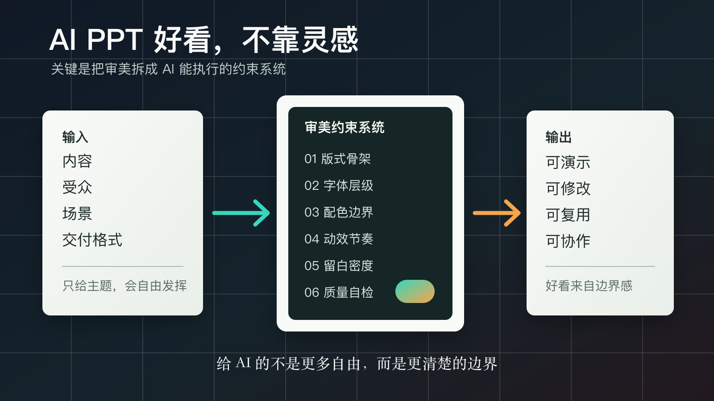
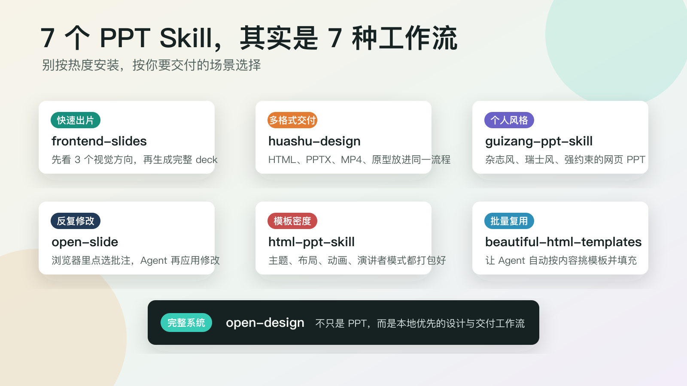
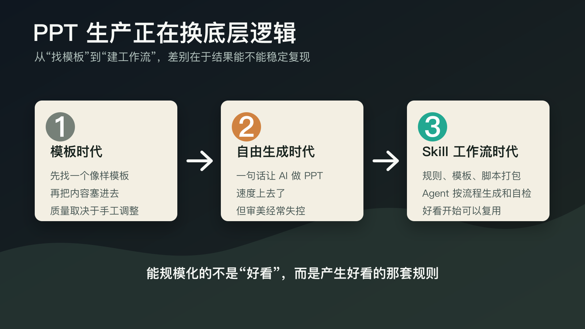

# 别再让 AI 一句话做 PPT 了，真正好看的关键是这套约束系统

这两天，X 中文圈有一条关于 PPT Skill 的长帖很值得看：作者把 `frontend-slides`、`huashu-design`、`guizang-ppt-skill`、`open-slide` 等几个开源项目集中试了一遍。如果只把它看成“7 个免费 PPT 工具推荐”，就看浅了。

我的判断更直接：**AI 做 PPT 丑，很多时候不是模型不够强，而是我们只给了它内容，没有给它审美纪律。**

这篇文章想拆清楚三件事：为什么“一句话生成 PPT”经常又快又丑，这 7 个开源 PPT Skill 到底在解决哪几类问题，以及普通创作者怎么搭一套自己的“审美约束系统”。

> 📌 **一句话判断**：AI 内容生产的下一阶段，不是让模型更自由，而是把人类的审美判断、交付标准和修改流程，打包成 AI 能执行的约束系统。

## 1. AI PPT 丑，不是因为它不会设计，而是它太自由

很多人用 AI 做 PPT 的提示词，大概长这样：

> 帮我根据这篇文章做一份高级感 PPT。

然后模型就开始努力。

它会写大纲，会分章节，会排版，会找一些“科技感”“极简风”“商业风”的视觉词，甚至能生成 HTML、CSS、动画和配图。

但最后你一打开，经常还是会觉得哪里不对。

不是完全不能看，而是有一种熟悉的 AI 味：

- 标题很大，但层级不清。
- 配色很满，但没有主次。
- 每一页都像单独做的，连起来没有节奏。
- 动效、卡片、渐变、阴影都有，但像把“好看元素”堆在一起。
- 内容明明不错，展示出来却显得廉价。

这背后不是一个单点问题。

PPT 的“好看”从来不是单纯美术问题，而是一组连续判断：

这一页该讲一个点还是三个点？  
标题是陈述事实，还是直接给结论？  
图表要精确，还是要先让观众一眼看懂趋势？  
这套演示是给投资人看，还是给社群直播看？  
最后要 PDF、PPTX、网页、视频，还是能现场演示？

你不给这些边界，模型就只能自由发挥。

自由发挥在写段子时可能有惊喜，在做 PPT 时常常是灾难。因为 PPT 不是“生成一页好看的画”，而是**在有限画布里组织观点、注意力和信任感**。

这也是最近这些 PPT Skill 火起来的核心原因。

它们真正提供的不是“又一个模板库”，而是把一部分人类设计师和内容创作者的隐性判断，写进了规则、脚本、模板、评审清单和工作流。

换句话说，它们在做一件很重要的事：

**把“什么叫好看”翻译成 AI 能执行的步骤。**

## 2. 这 7 个项目卷的不是模板，而是谁更会约束 AI

我重新核了一遍这些仓库的信息。星标数据变化很快，只能当热度参考；但它们的产品分工已经很清楚。

### 1. `frontend-slides`：先让你看图选风格

这个项目最聪明的地方，是没有逼用户用语言描述审美。

很多人说不清自己想要什么风格，只会说“高级一点”“像苹果发布会”“不要太花”。这种描述对模型其实很模糊。

`frontend-slides` 的做法是先生成多个视觉方向，让用户选。

这很像一个设计师先给你 moodboard，而不是一上来就交最终稿。用户不需要会 CSS，也不需要懂设计术语，只要能判断“我喜欢哪一个方向”。

它解决的是第一类问题：**当用户不会描述审美时，用可见样稿替代抽象提示词。**

### 2. `huashu-design`：把 PPT 放进更大的设计交付里

`huashu-design` 的野心更大。

它不是只说“我能做 PPT”，而是强调 HTML-native 设计：一句话生成产品发布动画、可点击原型、可编辑 PPT、信息图、MP4/GIF 等多种交付物。

README 里还提到 20 种设计词汇、5 维评审、设计方向顾问等机制。

这说明它关心的不只是“页面生成”，而是从模糊需求到视觉方向，再到多格式导出的整条链路。

它解决的是第二类问题：**当交付不止一份 PPT 时，需要把设计、动画、导出和评审放在同一套系统里。**

### 3. `guizang-ppt-skill`：用强风格保护结果

`guizang-ppt-skill` 很适合用来理解“约束”的价值。

它主打横向翻页的网页 PPT，强调杂志风、瑞士风、单文件 HTML、低性能静态模式、WebGL/canvas 背景等能力。

但我觉得它最重要的不是这些功能，而是它对风格边界很硬。

好看的 PPT 往往不是因为功能多，而是因为它敢限制。字体、布局、配色、背景、动画节奏，全部有边界，AI 才不容易把东西做散。

它解决的是第三类问题：**当你想要鲜明个人风格时，不要给 AI 无限自由，要给它一套非常窄的审美轨道。**

### 4. `open-slide`：把修改闭环做进浏览器

`open-slide` 的思路和前面几个不太一样。

它把每张幻灯片当成 React 组件，固定在 1920×1080 画布里，重点不是“生成得多漂亮”，而是“生成后怎么改”。

它的一个关键能力是：你可以在浏览器里点击元素留下 comment，然后让 Agent 读取这些 comment，再批量应用修改。

这件事特别重要。

因为真实工作里，PPT 很少一次生成就能用。更常见的是：

这里字太小。  
这一页太挤。  
客户 logo 换一下。  
这个数字要突出。  
这句标题再像老板会说的话一点。

如果这些修改都靠聊天描述，会很累。能在画面上直接点选批注，才更接近真实协作。

它解决的是第四类问题：**生成不是终点，可视化批注和多轮修改才是 PPT 的最后一公里。**

### 5. `html-ppt-skill`：把模板密度做到足够高

`html-ppt-skill` 走的是“军火库”路线。

README 里写得很直接：36 个主题、15 套完整 deck 模板、31 个页面布局、47 个动画，还有演讲者模式、逐字稿和计时器。

它的价值不在于重新发明设计，而在于给 Agent 足够多的可用积木。

如果你只是想快速出一版能看的技术分享、课程、汇报或小红书风格演示，这类模板密度会很有用。

它解决的是第五类问题：**当你不想从零设计时，让 Agent 有足够多的可靠模板可选。**

### 6. `beautiful-html-templates`：让 Agent 自动挑模板

这个项目更像是给 coding agent 用的 HTML slide 模板库。

它的 README 强调，Agent 要读取 `AGENTS.md` 和 `index.json`，根据用户 brief 去匹配合适模板，再克隆、替换和适配内容。

这一步很有代表性。

过去我们是人找模板，现在变成 Agent 找模板。区别不只是省时间，而是它把“模板选择”也纳入了流程。

它解决的是第六类问题：**当团队要批量产出风格一致的 deck 时，模板选择本身也应该自动化。**

### 7. `open-design`：PPT 只是更大设计工作流的一部分

`open-design` 已经不是简单 PPT 项目了。

它更像一个本地优先的 Claude Design / Figma 替代方向：支持多种 coding-agent CLI、设计系统、技能、原型、deck、图片、视频、导出和本地 daemon。

从这个项目可以看到一个更大的趋势：

PPT Skill 不会只停留在“帮我做 slides”。它会继续长成设计系统、素材系统、导出系统、评审系统和协作系统。

它解决的是第七类问题：**当你要的不只是 PPT，而是一整套可持续的设计生产线。**

所以别只问哪个项目星标最高。

更好的问题是：

> 我现在最缺的是视觉方向、交付格式、强风格、修改闭环、模板密度、批量复用，还是完整设计工作流？

答案不同，适合的工具就不同。

## 3. 真正的分水岭：从 Prompt 到 Playbook

这波 PPT Skill 的出现，其实和整个 Agent 生态的变化是一脉相承的。

Claude 官方文档对 Skills 的定义很清楚：Skill 是包含说明、脚本和资源的目录，Claude 会在需要时动态加载。OpenAI 也在帮助文档里把 Skill 解释成可复用、可分享的 workflow；在 Codex Academy 里，它甚至把 Skill 比作 Codex 可以遵循的 playbook。

这个定义很重要。

因为它说明 Skill 不是一句更长的 prompt。

Prompt 更像你临时对 AI 说：

> 这次帮我这样做。

Skill 更像你把流程写下来：

> 以后遇到这种任务，都按这套方法做。

差别非常大。

如果只靠 Prompt，AI 每次都要重新理解你的审美、格式和质量标准。你解释得清楚，它就好一点；你解释得模糊，它就乱来。

但如果做成 Skill，你可以把下面这些东西固定下来：

- 哪些布局可以用，哪些不能用。
- 标题最多几行，字号如何分层。
- 主色、辅助色、背景色怎么搭。
- 图表什么时候用柱状图，什么时候用趋势线。
- 每页信息密度不能超过多少。
- 生成后必须自检哪些问题。
- 用户批注后，Agent 应该怎么改。

这就是从“让 AI 自由发挥”到“让 AI 按流程工作”的变化。

以前 PPT 工具的核心是模板。

模板解决的是静态起点：你先有一个页面样子，然后把内容塞进去。

AI 生成 PPT 的第一阶段，核心是 Prompt。

Prompt 解决的是生成速度：你说一个主题，它很快给你一版。

但 Skill 解决的是第三件事：

**如何让好结果稳定复现。**

这才是内容生产真正需要的能力。

## 4. 为什么这波先发生在 PPT？

PPT 是一个特别适合暴露 AI 能力短板的场景。

因为它同时考 4 件事：

第一，考内容判断。

PPT 不是把文章拆成几页。它必须决定哪些观点该上屏，哪些只适合做讲稿，哪些应该删掉。

第二，考视觉组织。

同样一句话，放在标题、角标、图注、表格里，效果完全不同。PPT 的信息层级比长文更敏感。

第三，考场景意识。

对内周报、融资路演、课程分享、技术演讲、短视频切片，本来就不是一种 PPT。

第四，考交付链路。

有的人要网页演示，有的人要可编辑 PPTX，有的人要导 PDF，有的人要 MP4，有的人还想发到 Vercel。

这四件事叠在一起，就会让“通用 AI 生成 PPT”非常容易翻车。

但也正因为 PPT 难，它成了 Agent Skill 的好试验田。

因为 PPT 的每一次失败，都能反推出一个应该被写进 Skill 的约束：

- 页面太乱，就限制布局骨架。
- 字太多，就限制每页信息密度。
- 风格漂移，就固定配色和字体。
- 改稿很累，就加入浏览器批注。
- 交付不顺，就把 HTML/PDF/PPTX/MP4 导出写进流程。

最后你会发现：

**PPT Skill 的本质不是自动排版，而是把过去靠经验兜底的审美判断，变成可以复用的工程化资产。**

## 5. 普通创作者现在最该做的，不是把 7 个库全装一遍

我不建议普通创作者一上来就把所有项目 clone 下来。

那很容易从“不会做 PPT”变成“不会选 PPT 工具”。

更实用的做法，是先给自己搭一份最小审美约束清单。

你可以从 6 条开始。

### 1. 先固定场景

不要只说“做一份 PPT”。

先说清楚它是：

- 对外 pitch
- 内部汇报
- 课程讲解
- 社群分享
- 产品发布
- 读书会
- 短视频切片

场景一变，视觉密度、语气、页数和节奏都会变。

### 2. 固定画布和交付格式

先决定你最后要什么：

- 16:9 网页演示
- 可编辑 PPTX
- PDF
- MP4
- 长图切片
- 可部署 HTML

很多 AI PPT 难改，是因为一开始没想清楚交付格式。

### 3. 限定配色，而不是让 AI 自己“高级感”

给 AI 3 到 5 个颜色就够了。

主色、辅助色、背景色、强调色、警示色。

不要让它每一页都临场发挥。色彩自由度越高，风格漂移越严重。

### 4. 限定布局骨架

一套日常可用的 PPT，其实不需要几十种布局。

先准备 5 类就够：

- 封面页
- 章节页
- 单观点页
- 对照页
- 流程/框架页

其他都可以从这 5 类变体出来。

### 5. 写清楚质量禁区

比起告诉 AI “要好看”，更有效的是告诉它什么绝对不行。

比如：

- 不要一页超过 3 个重点。
- 不要用整段长文字。
- 不要每页都放大图。
- 不要同时使用 3 种以上字体。
- 不要把图标当装饰乱撒。
- 不要为了“科技感”滥用渐变和发光。

审美不是只靠正向描述，也靠禁区。

### 6. 把修改流程写进去

最容易被忽略的是改稿。

你应该提前告诉 Agent：

生成后先自检。  
自检后给出 3 个最可能被人吐槽的问题。  
用户提出修改时，先判断是内容问题、视觉问题还是交付问题。  
每次修改后只改必要部分，不要重做整套。

这条特别关键。

因为真正的 PPT 工作不是“生成一版”，而是“把一版改到能交付”。

## 6. 下一代内容工具，不是更自动，而是更有纪律

这波开源 PPT Skill 给我的最大启发，不是“以后做 PPT 更快了”。

更快当然重要，但不是最重要。

真正重要的是：内容生产正在从“结果生成”走向“过程封装”。

以前你会用一个工具做一张图、一个工具做 PPT、一个工具转 PDF、一个工具做视频。每一步都靠人把结果搬来搬去。

现在 Agent 开始能读规则、写代码、跑脚本、调模板、生成网页、导出文件、接收批注。

于是工具的形态也变了。

它不再只是一个按钮很多的软件，而是一套能被 Agent 调用、执行和迭代的工作流。

所以我觉得这句话可以作为这篇文章的结论：

**AI 内容生产的天花板，往往不在模型本身，而在你有没有把判断标准写成系统。**

PPT 只是一个开始。

接下来，文章、报告、课程、海报、短视频、品牌手册、商业计划书，都会经历同样的变化：

从模板时代，进入 Skill 时代。  
从一次性生成，进入可复用流程。  
从“让 AI 帮我做”，进入“让 AI 按我的标准做”。

如果你是创作者，现在最值得积累的，不只是工具列表，而是自己的标准库。

你喜欢什么标题节奏，怎么定义一页信息过载，什么配色看起来廉价，什么图表会误导读者，什么封面才有点击欲望。

这些判断以前只在你的经验里。

以后，它们应该被写进你的 Skill。

> 🚀 **带走这套动作**：先定场景，再定交付格式，再定配色、布局、质量禁区和修改流程。别急着让 AI 自由发挥，先给它一套可执行的审美边界。

你会发现，AI 做出来的东西突然没那么“AI”了。

因为它开始像一个被训练过的协作者，而不是一个热情但没有边界感的新手。

---

资料参考：

- X 原帖：[超级个体｜柿子关于 7 个 PPT Skill 的测试分享](https://x.com/yaohui12138/status/2055849330498736619)
- Claude Docs：[Skills overview](https://claude.com/docs/skills/overview)
- OpenAI Help Center：[Skills in ChatGPT](https://help.openai.com/en/articles/20001066)
- OpenAI Academy：[Plugins and skills](https://openai.com/academy/codex-plugins-and-skills/)
- GitHub：[zarazhangrui/frontend-slides](https://github.com/zarazhangrui/frontend-slides)
- GitHub：[alchaincyf/huashu-design](https://github.com/alchaincyf/huashu-design)
- GitHub：[op7418/guizang-ppt-skill](https://github.com/op7418/guizang-ppt-skill)
- GitHub：[1weiho/open-slide](https://github.com/1weiho/open-slide)
- GitHub：[lewislulu/html-ppt-skill](https://github.com/lewislulu/html-ppt-skill)
- GitHub：[zarazhangrui/beautiful-html-templates](https://github.com/zarazhangrui/beautiful-html-templates)
- GitHub：[nexu-io/open-design](https://github.com/nexu-io/open-design)
