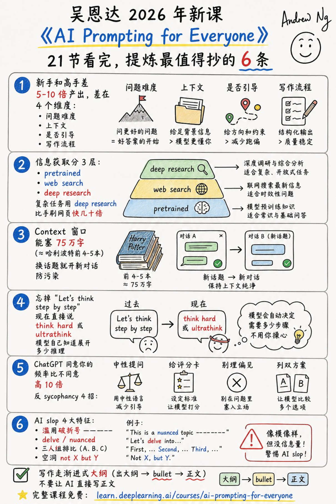

# 吴恩达新课最狠的提醒：别再抄 Prompt 模板了

今天刷到一条关于吴恩达 2026 年新课《AI Prompting for Everyone》的总结，21 节课压成 6 个要点，看完最刺眼的不是某个“神级提示词”，而是一句话：

**现在还在抄 Prompt 模板的人，已经落后一代了。**

这门课真正讲的不是怎么把一句话写得更玄，而是 AI 用法从 2022 年的“问答技巧”，升级成 2026 年的“工作流能力”。

我把它压成 4 个最值得马上换掉的习惯。

这张图可以先收藏，后面我只拆最容易马上用起来的部分。

---

## 一、别问短问题，要把问题升维

AI 新手和高手的差距，不在谁会背更多咒语，而在谁敢把更难的问题交给 AI。

新手问：“这个产品怎么样？”

高手会问：

> 请基于这 3 份资料，对比 A/B/C 三个方案，从成本、风险、长期收益三个维度打分，最后给我一个推荐。

前者是在找答案，后者是在调用一个研究助理。

吴恩达这门课里反复强调：今天的 AI 已经不只是会补全句子，它能读很多材料，能搜索，能深度研究，也能花更长时间推理。你给它的问题越像真实任务，它的价值越大。

**一句话：不要把 AI 当搜索框，要把它当一个可以临时组队的同事。**

---

## 二、别让 AI 猜，要给够上下文

很多人说 AI 写得空，不是因为模型不行，而是因为你给的信息太少。

你只说“帮我写一份自我评价”，它只能写出“积极主动、认真负责、团队协作”这种废话。

但如果你把最近做过的项目、老板反馈、关键成果、失败教训一起丢进去，它就有机会写出“像你”的内容。

这就是我觉得最值得抄的一条：**对 AI 要有共情心。**

你可以把它想成一个很聪明、但刚入职、完全不了解你背景的实习生。你不给资料，它只能猜；你给足上下文，它才可能帮你做判断。

实用做法很简单，每次提问前补三件事：

- 目标：我最终要得到什么
- 材料：你可以参考哪些信息
- 标准：什么样的答案算好

这三件事，比任何万能 Prompt 都值钱。

---

## 三、别只求赞同，要让 AI 反驳你

AI 最大的温柔，有时候也是最大的危险：它太容易顺着你说。

你问：“我这个创业想法是不是很棒？”

它大概率会先肯定你，再给几个温和建议。听起来舒服，但没什么用。

更好的问法是：

> 请你用投资人视角评估这个想法，按市场是否真实、竞争壁垒、获客成本、执行难度打分。最后列出最可能失败的 3 个原因。

想让 AI 不讨好你，可以记住 4 个动作：

- 用中性提问，不先下判断
- 给评分卡，让它按标准说话
- 不在问题里埋偏见
- 要它同时列正反两套方案

**AI 不应该只是情绪按摩器，它更应该是低成本的反方辩手。**

---

## 四、别直接让 AI 写正文，要分三步走

这条对写作者尤其重要。

很多 AI 味很重的文章，问题不是语法，而是流程错了：一上来就让 AI 写完整正文。

这样最容易得到那种漂亮但空的内容：结构整齐、词很顺、看完没记忆点。

更好的写法是渐进式：

1. 先让 AI 出大纲
2. 再把每一节拆成 bullet
3. 最后才扩成正文

每一步都要人工改一次。你改大纲，其实是在改逻辑；你改 bullet，其实是在改信息密度；你最后改正文，才是在改表达。

**AI 写作不是把手放开，而是把方向盘分阶段交出去。**

---

## 最后，给你一张 2026 版 AI 自检清单

下次打开 ChatGPT、Claude 或 Gemini，不妨先问自己 6 个问题：

- 这是常识问题，还是需要联网搜索？
- 这是简单查询，还是应该用 deep research？
- 我有没有给足背景材料？
- 我有没有说清楚评价标准？
- 我有没有让它反驳我？
- 我是不是太早让它写正文了？

如果这 6 个问题都没想过，大概率不是 AI 不够强，而是你的使用方式还停在 2022 年。

吴恩达这门课最值得带走的，不是某个 Prompt 模板，而是一个更朴素的判断：

**AI 时代的差距，不是会不会提问，而是会不会把问题组织成任务。**

今晚就可以试一个小动作：把你最近最想解决的一个问题，按“目标、材料、标准、反方意见”重新问一遍。

你会很快发现，AI 的回答突然变聪明了。

---

资料来源：

- Jason Zhu / GoSailGlobal 对《AI Prompting for Everyone》的课程总结
- DeepLearning.AI 课程页《AI Prompting for Everyone》
- Andrew Ng 在 The Batch 中对新课的介绍

*AI 辅助创作，人工审核编辑。*
