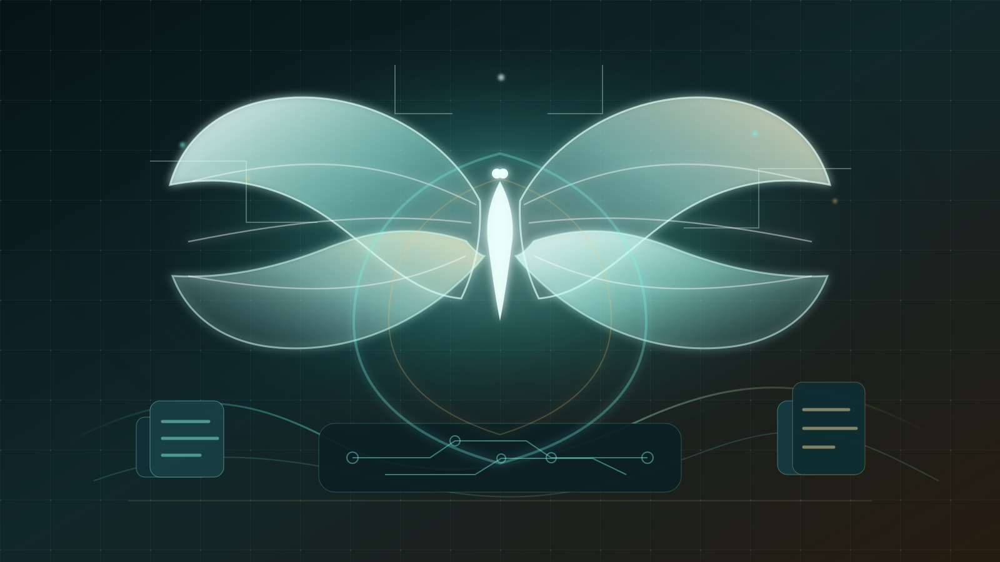
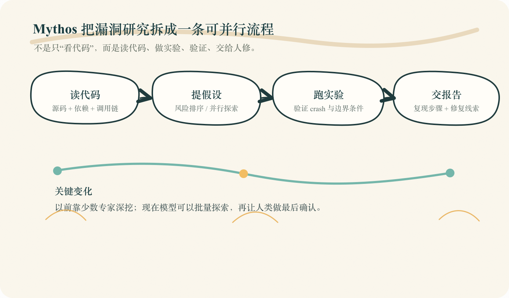
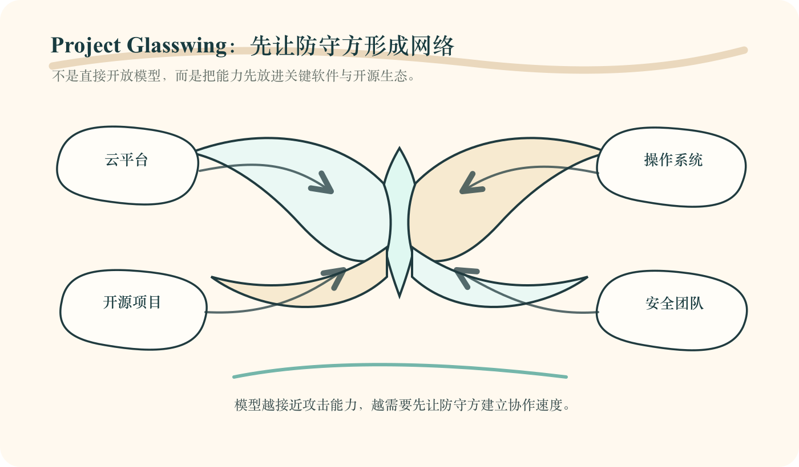
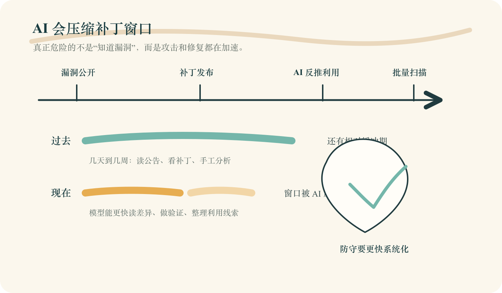

# Claude Mythos Preview 有多强？强到 Anthropic 不敢直接开放

Anthropic 最近连发了两篇文章。

一篇讲 Project Glasswing：它联合 AWS、Apple、Google、Microsoft、NVIDIA、Cisco、CrowdStrike、Linux Foundation 等公司和组织，一起加固关键软件。

另一篇讲 Claude Mythos Preview：一个还没公开开放的前沿模型，已经能在真实软件里自动发现、验证甚至构造漏洞利用证明。

先说结论：

> **这不是普通模型发布，而是网络安全进入 AI 加速时代的信号。**
>
> 以前安全行业最缺的是专家；接下来最缺的，可能是比攻击者更快修补漏洞的系统。

这篇文章可以先记住 3 句话：

- 🧠 **Mythos 强在能跑完整安全闭环**：读代码、找线索、做实验、写报告。
- 🦋 **Glasswing 不是营销项目**：它是让防守方先拿到能力的行业联盟。
- ⏱️ **真正危险的不是零日变多**：而是补丁窗口会被 AI 压得越来越短。

## 1. 🧠 Mythos 强在哪里？

过去 AI 做安全，更像“帮你看一段代码”。

你给它一个函数，它说这里可能有问题；你给它一个报错，它帮你解释；你让它写补丁，它可以给一个方向。

但 Mythos Preview 更进一步。

Anthropic Red Team 的测试方式是：把真实项目代码放进隔离环境里，让 Claude Code 调用 Mythos Preview。模型自己读代码、提出假设、运行项目、插入调试逻辑、验证猜测，最后产出漏洞报告、复现步骤和概念验证。

也就是说，它不只是“看懂问题”，而是开始接近人类安全研究员的工作流程。

文章里提到的几个案例很有冲击力：

- OpenBSD 里一个存在 27 年的问题，被 Mythos 找了出来。
- FFmpeg 里一个存在 16 年的问题，此前自动化测试跑过 500 万次都没抓到。
- Linux kernel 里多个漏洞被串联起来，可以从普通用户权限一路提升。
- 对部分 N-day 场景，它能从 CVE 和补丁 commit 反推出可工作的利用证明。

这里最该关注的，不是“AI 会不会搞安全”。

真正的拐点是：

> **模型开始把专家工作拆成可规模化流程。**

以前一个高危漏洞要靠少数专家长时间深挖。现在，模型可以并行扫不同文件、给风险排序、跑实验、筛掉错误假设，再把结果交给人类确认。

安全研究里最耗人的那部分，正在被 AI 接走一大块。

## 2. 🦋 为什么 Anthropic 不敢直接开放？

如果 Mythos Preview 这么强，为什么不直接开放给所有人？

原因很简单：它太双刃剑了。

同一种能力，放在防守方手里，可以提前发现开源库、操作系统、浏览器里的隐藏漏洞；放在攻击者手里，也可以加速漏洞挖掘和利用。

所以 Anthropic 这次没有走“发模型、开放体验、大家试用”的路线。

它先做了 Project Glasswing。

这个项目有几个关键信号：

- 🤝 联合多家关键基础设施相关公司和组织。
- 🛠️ 给 40 多个维护关键软件的组织访问 Mythos Preview。
- 💰 承诺最高 1 亿美元模型使用额度。
- 🌱 向开源安全组织捐赠 400 万美元。

这不是单纯做公益。

它更像一次防守侧集结：先让最关键的软件系统、开源项目和企业安全团队学会使用这种能力，再考虑更大范围的开放。

Anthropic 自己也说，目前不计划让 Claude Mythos Preview 普遍可用。更长期的目标，是等检测和阻断危险输出的安全机制更成熟，再让用户大规模部署 Mythos 级别的模型。

这句话翻译成人话就是：

> **模型已经强到不能像普通聊天机器人那样发布了。**

以前模型越强，大家越期待开放。  
但安全模型不一样。

当一个模型能自动找漏洞、验证漏洞、写出利用证明，它就不只是生产力，也可能成为攻击力。

## 3. ⏱️ 最危险的不是零日，而是补丁窗口被压扁

很多人看到这里，会先想到零日漏洞。

但我觉得更现实、更快发生的冲击，是 N-day。

N-day 指的是：漏洞已经公开，补丁可能也发了，但大量系统还没来得及更新。

过去，攻击者从补丁反推利用方式，需要时间。企业也因此有一个相对缓冲期。

但如果模型能从 CVE、commit、代码差异里快速推导出可用利用，这个缓冲期就会被压缩。

这对企业安全的影响非常直接。

以前补丁可以排期：这个月没空，下个维护窗口再说。

以后可能不行。

因为攻击者拿到同级 AI 能力后，也会更快完成“看公告、读补丁、写利用、批量扫描”这条链路。

所以安全团队真正要比的，不只是发现能力，而是响应吞吐：

- 能不能快速判断漏洞和自己有没有关系？
- 能不能把高危依赖升级进紧急通道？
- 能不能用自动化测试缩短验证时间？
- 能不能让模型先做报告去重、严重性判断和复现整理？
- 能不能把修复发布变成日常系统，而不是事故当天临时拉群？

一句话：

> **AI 时代的网络安全，胜负不只取决于谁先发现漏洞，而取决于谁能更快把发现、判断、修复和发布做成系统。**

## 4. 🧩 普通团队该怎么应对？

这件事听起来很前沿，但普通团队不用等 Mythos 开放。

真正该做的，是先把安全工作流改起来。

### ✅ 第一，先让模型进低风险安全环节

不要一上来就让 AI 做最终判断。

可以先让它做这些事：

- PR 安全检查
- 漏洞报告摘要
- 重复报告合并
- 依赖升级说明
- 复现步骤整理
- 补丁初稿建议

重点不是炫技，而是训练组织习惯。

**当更强模型到来时，最先受益的不是买到模型的人，而是已经知道怎么把模型放进流程的人。**

### ✅ 第二，把补丁当成生产系统

很多公司的风险，不是没人知道有漏洞，而是补丁链路太慢。

老系统没人敢动，依赖升级怕出问题，测试不够自动化，回滚策略不清楚。

这些过去叫工程债。

以后会变成安全债。

团队至少要提前回答：

- 哪些系统是关键业务？
- 哪些依赖出现 CVE 必须马上处理？
- 哪些服务可以自动更新？
- 哪些补丁能自动跑测试？
- 哪些老系统已经没人真正敢改？

这张清单，比“等一个更强模型”更重要。

### ✅ 第三，把安全响应自动化到日常

未来漏洞发现速度会上升，报告、告警、修复、验证、复盘都会变多。

如果这些环节还全靠人肉堆，安全团队会越来越累。

更合理的做法是：

> **让模型承担初筛和整理，让人类负责关键判断。**

这才是 AI 安全工具真正有价值的地方。

## 写在最后 🧭

Project Glasswing 这个名字很有意思。

Glasswing 是一种透明翅膀的蝴蝶。Anthropic 用它来隐喻那些“明明藏在眼前，却长期没人看见”的漏洞。

我觉得这个比喻很准。

AI 会让更多隐藏漏洞被看见。  
但它也会让攻击者更快看见。

所以这次 Anthropic 真正提醒我们的，不是“未来 AI 会改变网络安全”。

而是：

> **从现在开始，网络安全已经要按 AI 的速度重写一遍。**

对开发者和企业来说，最好的行动不是等 Mythos 开放，而是今天就检查自己的安全流程：

- 模型能不能参与初筛？
- 补丁能不能进入紧急通道？
- 响应能不能自动化到日常？

如果这三件事还没有开始，真正危险的不是你没用上最新模型。

而是当 AI 把攻防节奏加速之后，你的组织还停在旧速度里。

## 参考资料

1. Anthropic, Project Glasswing: Securing critical software for the AI era: https://www.anthropic.com/glasswing
2. Anthropic Frontier Red Team, Assessing Claude Mythos Preview’s cybersecurity capabilities: https://red.anthropic.com/2026/mythos-preview/
