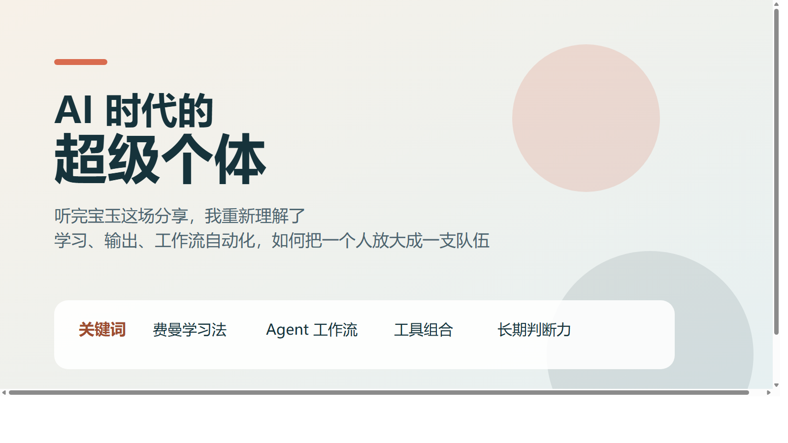
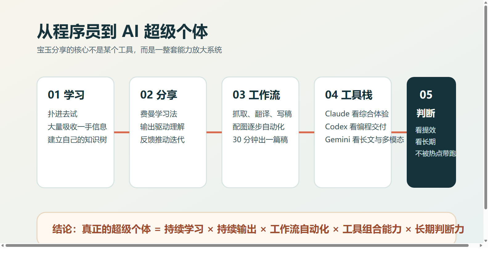
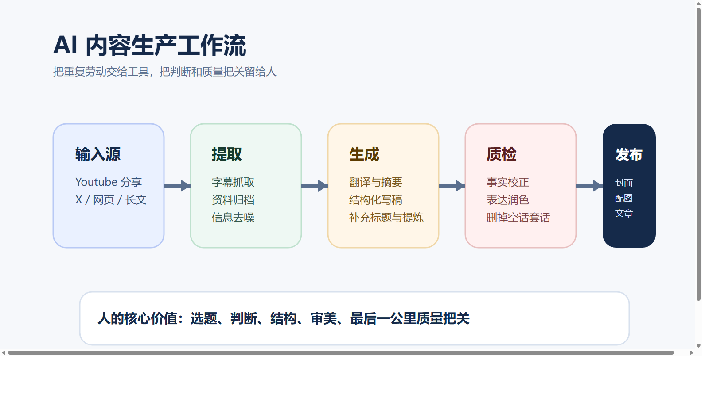
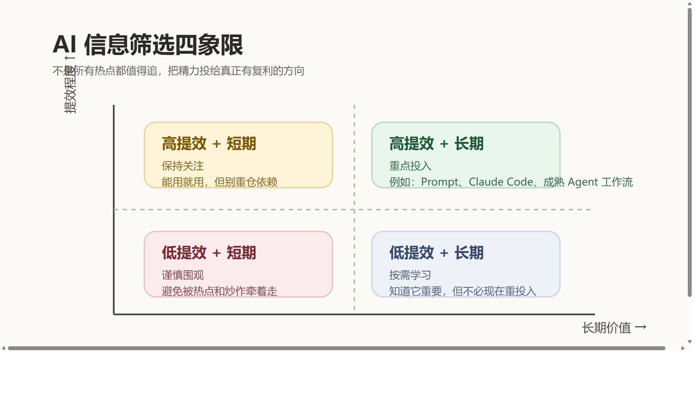

# 听完宝玉这场分享，我终于看清了 AI 时代最稀缺的能力

最近听了宝玉老师的一次内部分享。

整场下来，我脑子里一直有一句话在转：

**AI 时代真正拉开人与人差距的，不是你知不知道新模型，而是你有没有把 AI 变成自己的能力放大器。**

很多人现在对 AI 的状态很像两种极端。

一种人每天都在追热点，今天看这个模型，明天看那个 Agent，收藏夹里堆满了“未来已来”，但真正落到自己工作里的东西很少。另一种人则越来越焦虑，总觉得 AI 很强，却又不知道自己到底该从哪里开始。

宝玉这场分享最有价值的地方恰恰在于，它没有停留在“工具盘点”，而是把一个问题讲透了：

**在 AI 时代，一个人到底怎么才能变强？**

答案不是神秘的方法论，而是一整套可以落地的路径：持续学习、持续输出、搭建工作流、组合工具、建立判断框架。也就是说，未来最有竞争力的人，不一定是最懂技术的人，但一定是最会把 AI 变成自己系统一部分的人。

## 1. 宝玉的转型，最值得学的不是“结果”，而是路径

很多人看到宝玉今天在 AI 圈里的影响力，会天然觉得这是一个“抓住风口”的故事。但如果只看到结果，就很容易忽略真正值得学习的部分。

他本身是软件工程出身，写过《软件工程之美》这样的专栏。真正的变化，发生在 ChatGPT 爆火之后。别人还在围观的时候，他已经开始一头扎进去学，花大量时间去试、去看、去拆、去写。

这件事听起来普通，但决定性差异其实就在这里。

大多数人面对新技术时，默认动作是“再等等看”；真正跑出来的人，默认动作是“先用起来再说”。前者想先获得确定性，后者先用行动换确定性。

更重要的是，宝玉并没有把自己放在“我已经很懂”的位置。哪怕已经被很多人视作 AI 领域的大 V，他在分享里依然很坦诚地说，自己仍然会惶恐，因为还有很多不懂的地方。

这其实就是 AI 时代特别重要的底层心态：**变化太快，谁都没资格停止学习。**

## 2. 真正让人越学越快的，不是输入，而是“边学边输出”

分享里我最喜欢的一点，是他把“分享”放到了非常核心的位置。

很多人总觉得，等自己学明白了、研究透了、足够系统了，再开始写、开始讲、开始分享。但现实往往是，等到那个时刻，已经没有然后了。

宝玉的方式刚好相反。他是把分享当成学习过程的一部分，而不是学习完成后的展示。

这背后其实就是费曼学习法的精髓：

1. 接触新知识。
2. 尝试把它讲给别人听。
3. 在讲不清的地方发现自己其实没懂。
4. 借着反馈把认知再打磨一轮。
5. 形成更深一层的理解。

这也是为什么有些人学 AI 学了一年，还是停留在“知道很多名词”；而另一些人因为持续写笔记、做总结、发帖子、录分享，反而越学越快。

因为前者是在“囤知识”，后者是在“加工知识”。

**真正值钱的，不是你看了多少，而是你能不能把看到的东西重新组织成自己的理解。**

## 3. 为什么他能持续拿到一手信息？因为他不是在刷，而是在搭系统

宝玉提到，他会长期在 X 上花大量时间。很多人听到这里，可能第一反应是：这不就是刷信息流吗？

但仔细看他的做法，其实完全不是“随便刷刷”。

他会去关注足够多的 AI 相关博主和开发者，会对真正高质量的内容积极互动，会把值得深挖的内容先收藏起来，再利用碎片时间收集、利用整块时间整理。

表面上是在用平台，实际上是在训练平台的算法为自己服务。

这一点特别关键。AI 时代最可怕的问题不是信息不够，而是信息太多。你每天都会看到大量“重磅”“颠覆”“炸裂”的内容，如果没有一套自己的筛选机制，最后最容易发生的事情就是：看得越来越多，真正留下来的越来越少。

所以宝玉做的，本质上不是刷信息，而是在搭一个个人情报系统：

- 前端负责发现。
- 中端负责收集和归档。
- 后端负责处理和转化。

这也是普通人特别值得借鉴的一点。别再把获取信息理解成“多看一点”，真正有用的是让信息进入你的系统，而不是从你眼前飘过去。

## 4. AI 最猛的地方，不是替你写一段话，而是替你接管整条生产线

这场分享里最让我有冲击感的部分，是他讲内容生产流程怎么一步步演变。

最早的时候，他已经会自己做浏览器插件，再配合 ChatGPT 来做长文分段翻译。那个阶段已经比纯手工高效很多，但本质还是“人推着工具干活”。

而现在，随着 Claude、Gemini 和各种 Agent 工具的成熟，整个流程已经发生了质变。

不再是“我用一个工具帮我省一点力”，而是“我把整条链路串起来，让工具自己往前流”。

比如拿视频内容写文章这件事来说，现在可以是这样一条线：

1. 先拿到完整字幕稿。
2. 再做分析、提炼和结构化写作。
3. 人做最后的事实核查和表达润色。
4. 最后补封面和信息图。

过去一篇像样的内容，可能要耗掉几个小时，甚至几天。现在如果流程顺了，半小时级别就能成稿。

这意味着什么？

意味着人的价值开始从“亲手做每一步”转向“定义流程、做关键判断、控制最后质量”。

换句话说，AI 不是让创作者消失了，而是逼创作者升级了。以后真正稀缺的，不是“能不能写”，而是：

- 你能不能选出值得写的主题。
- 你能不能迅速搭好结构。
- 你能不能在 AI 给出的初稿之上做出真正有判断力的改写。

## 5. 对程序员冲击最大的，不是 AI 会写代码，而是“会做事”的定义变了

宝玉在编程问题上的判断很直接。他提到，很多复杂编程任务，AI 现在已经能做得相当不错，甚至在不少场景里，已经超过很多程序员。

这句话听起来很刺耳，但它的现实意义恰恰在于：我们必须重新定义“能力”。

过去大家默认，“自己手写出来”这件事本身就是实力证明。所以很多程序员天然会有一种心理惯性，觉得重要代码要自己敲、核心逻辑要自己写、复杂问题要自己啃。

但在 AI 时代，这个标准正在变化。

真正应该被重新评价的，不是你手写了多少行代码，而是你能不能：

- 让 AI 先给出高质量初版。
- 迅速判断方案对不对。
- 把重复步骤沉淀成脚本和模板。
- 把测试、校验、审查前置。

比如代码审查，宝玉给出的思路就很有代表性：`PR 提交 -> AI 初审 -> 人工复审 -> 合并`。

这里不是人在退出流程，而是人在把时间从机械劳动里解放出来，放到更有价值的判断上。

这个规律不只适用于编程，也适用于字幕翻译、资料整理、研究分析、文章写作。**凡是流程清晰、步骤重复、规则可总结的任务，都会优先被 AI 吞掉。**

所以真正危险的，不是“AI 太强了”，而是“你还停留在旧的工作方式里”。

## 6. 真正能帮你少走弯路的，是一个非常朴素的判断框架

面对每天冒出来的新模型、新 Agent、新概念，最容易出现的状态就是：看什么都想学，看什么都怕错过。

宝玉给的那个四象限框架，我觉得特别有用，因为它能让人快速降噪。

判断一个东西值不值得投入，只看两个问题：

- 它对生产力提升大不大？
- 它的价值是短期的还是长期的？

一旦这样看，很多事情就会变得特别清楚。

真正值得重投入的，是那些**既能立刻提高效率，又有长期复利价值**的东西。比如 Prompt Engineering、Claude Code、成熟的 Agent 工作流，这些都属于学了就能马上用，而且不会很快过期的能力。

而那些声量很大、包装很足、但实际提效有限的热点，更适合谨慎围观，而不是情绪上头式投入。

这个框架背后真正解决的，是精力分配问题。

在 AI 时代，人不是输在看得少，而是输在把太多注意力浪费在不值得的东西上。

## 7. 工具重要，但比工具更重要的是“按任务组装能力”

分享里当然也讲了很多具体产品，但我听下来最大的感受是：宝玉对工具的态度非常务实。

不是“谁是唯一最强”，而是“谁最适合哪段任务”。

大致可以这样理解：

- 通用对话和综合体验，Claude 很强。
- 编程生成和稳定性，Codex 很能打。
- 长上下文处理和部分创作场景，Gemini 很有优势。
- 图像生成、字幕处理、长文分析，各有各的最佳位置。

这背后的思路其实特别重要：**不要把 AI 当成一个聊天框，要把 AI 当成一套分工系统。**

对话归对话，搜索归搜索，写稿归写稿，编程归编程，配图归配图。谁擅长哪一段，就把哪一段交给谁。

人负责总控和裁决，工具负责分段执行。

当你开始这么看 AI，你就不再是在“用一个工具”，而是在搭自己的个人生产系统。

## 8. 未来最稀缺的能力，反而越来越“像人”

宝玉在分享里还提到一个很重要的判断：AI 会持续放大个体能力，但不会平均地替代所有事情。

越是规则明确、边界清晰、流程化程度高的工作，越容易被 AI 吃掉。反过来，越是涉及真实需求理解、复杂沟通、产品判断、审美取舍、商务推进的事，人越重要。

所以所谓“超级个体”，并不是一个人包揽一切，而是一个人能借助 AI，把原本需要一个小团队协同完成的事情快速做起来。

这个“超级”并不来自蛮力，而是来自：

- 更快地吸收信息。
- 更快地组织工作流。
- 更快地把想法变成结果。
- 同时保留人的洞察、判断、审美和沟通。

这也是为什么我听完整场分享后，最深的感受并不是“我又认识了几个新工具”，而是：

**未来真正有竞争力的人，一定是既懂得把 AI 工具化，也没有丢掉人本身核心能力的人。**

## 最后，把这场分享浓缩成 5 条最值得立刻去做的事

如果把整场分享压缩成可执行版本，我觉得最值得带走的是这 5 条：

1. 不要只看 AI 内容，尽快找一个真实工作场景上手。
2. 不要等学会了再输出，把分享本身当成学习闭环。
3. 不要迷信单一模型，开始为不同任务配置不同工具。
4. 不要被热点牵着跑，用“提效程度 + 持久价值”判断是否投入。
5. 不要只卷执行效率，持续强化产品理解、沟通协作和判断力。

如果你也是程序员、内容创作者，或者正在寻找下一阶段的个人增长方式，那我觉得宝玉这场分享真正提醒我们的只有一句话：

**AI 不是替你工作，而是逼你升级工作方式。**

当越来越多执行层的事情都能被自动化时，真正决定你上限的，就变成了你如何学习、如何判断、如何组织流程，以及如何把这些能力沉淀成自己的系统。

这可能才是 AI 时代“超级个体”真正的起点。

