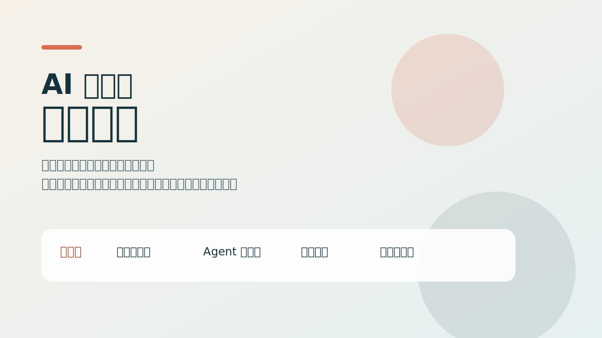
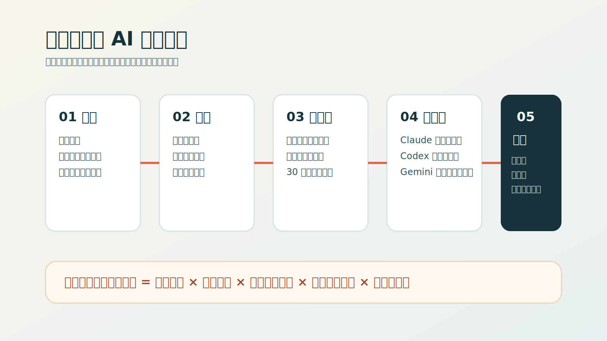
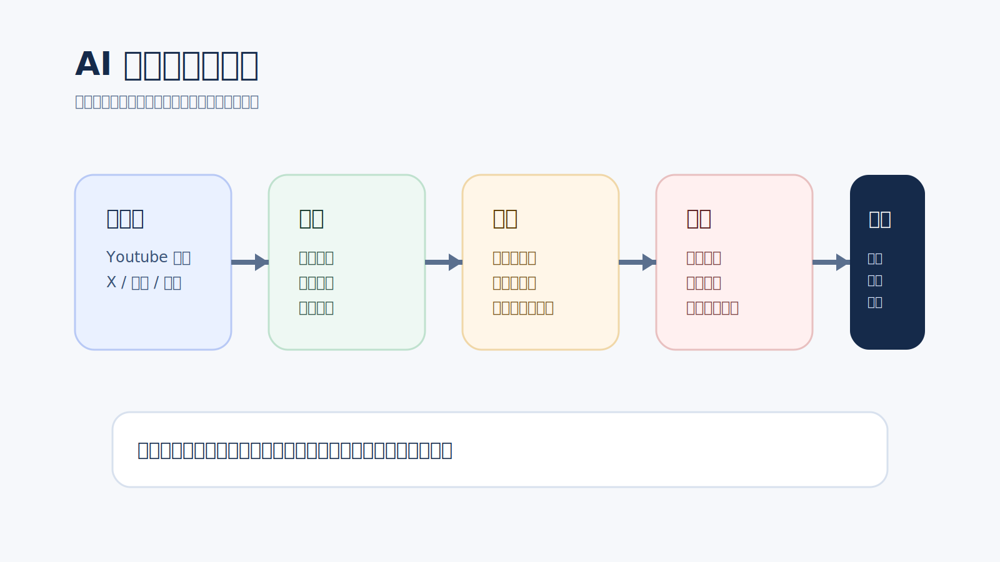
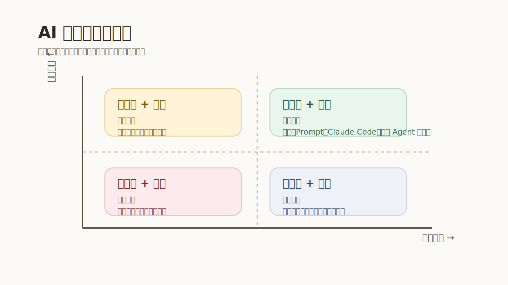

# 听完宝玉这场分享，我重新理解了 AI 时代的“超级个体”

最近听了宝玉老师的一次内部分享。原本以为会是一场“AI 工具盘点”，听完之后更强烈的感受却是：真正拉开差距的，从来不只是你用了哪个模型，而是你有没有把 AI 变成自己的能力放大器。

这场分享里，宝玉老师讲了自己的转型经历，也拆开了他获取信息、生产内容、使用工具、判断趋势的一整套方法。对我来说，最有价值的不是某个单点技巧，而是他反复强调的一件事：

**AI 时代最可怕的人，不是最会喊概念的人，而是能持续学习、持续输出、持续把工作流自动化的人。**

## 一个人为什么能在 AI 时代迅速长成“超级个体”？

宝玉老师的起点并不神秘。他是软件工程专业出身，做过内容，也写过《软件工程之美》这样的专栏。真正的转折点，发生在 ChatGPT 爆火之后。

很多人是在“围观 AI”，他选择的是“扑进去学”。为了理解这波变化到底意味着什么，他投入了大量时间去试、去看、去拆、去写。后来大家看到的是一个 AI 领域的大 V，但他在分享里说得很坦诚：即使被称作大 V，自己内心依然会惶恐，因为还有太多不懂的地方。

这句话很打动我。它提醒我们，AI 领域更新太快了，头衔没那么重要，**保持学习能力和行动速度，才是更可靠的护城河。**

更关键的是，他不是“学完了再分享”，而是把分享本身当成学习方法的一部分。这个逻辑非常像费曼学习法：

1. 先接触新知识。
2. 再试着把它讲清楚。
3. 在输出过程中暴露理解漏洞。
4. 从反馈里继续修正。
5. 形成下一轮更深的理解。

这也是为什么很多人学了很多 AI 内容，最后还是停留在“知道”；而另一些人因为持续写、持续讲、持续做 demo，反而越学越快。**分享不是学习完成后的结果，而是学习加速器。**

## 他是怎么持续获取一手 AI 信息的？

宝玉老师提到，他在 X 上花了大量时间。表面上看像“刷信息流”，但其实是在有意识地训练算法。

他的做法并不复杂：

- 关注足够多的 AI 相关博主和开发者。
- 对真正有价值的内容积极互动，给平台明确反馈。
- 把“看到好内容先收藏”变成一种习惯。
- 利用碎片时间收集，利用整块时间整理和处理。

这背后的关键，不是勤奋，而是系统化。很多人获取信息的方式是随机的，今天看公众号，明天刷短视频，后天再看几条新闻，最后得到一堆彼此断裂的碎片。宝玉老师更像是在搭一个“个人情报系统”：前端负责发现，中间负责归档，后端负责加工。

这件事对普通人同样适用。AI 时代的信息噪音非常大，你并不缺内容，缺的是**一套稳定筛选高价值信息的机制**。

## 真正厉害的，不是会写一篇文章，而是把整条生产线做成工作流

我觉得这场分享最值得反复咀嚼的部分，是他讲内容生产方式的演进。

一开始，宝玉老师是用自己做的浏览器插件配合 ChatGPT 来做长文分段翻译。那时候已经比纯手工快很多了，但本质上仍然是“人推着工具走”。后来随着 Claude、Gemini、各类 Agent 工具变强，整个流程开始变成“工具推着流程走”。

他说现在的工作流，已经可以把抓取、翻译、写稿、配图这些事情串起来。这意味着什么？意味着过去需要数小时甚至数天才能完成的内容生产，已经被压缩到了半小时量级。

以视频内容处理为例，这条链路已经非常清晰：

1. 用 Gemini 之类的工具拿到完整字幕稿。
2. 用 Claude 分析内容、提炼重点并生成文章初稿。
3. 人工做最后的事实核查和表达润色。
4. 再根据主题自动补封面和信息图。

看上去只是“效率提升”，但本质上是角色变化。以前创作者的主要精力花在机械劳动上，现在更应该花在三个地方：

- 判断哪些内容值得做。
- 定义文章的视角和结构。
- 在最后一公里做质量把关。

也就是说，AI 没有让创作变得不重要，反而把人的价值从“执行”抬升到了“判断”和“编排”。

## AI 对程序员最大的冲击，不是替代，而是重新定义“会做事”

宝玉老师在编程问题上的判断也很直接。他提到，很多复杂编程任务，AI 现在已经能完成得相当不错，甚至在不少场景里，表现超过很多程序员。

这句话听起来刺耳，但很现实。

过去我们默认“写代码”本身就是能力证明，所以总会下意识坚持“这段最好自己写”。可在 AI 时代，真正应该被重新评价的，不是你手写了多少行代码，而是你能不能借助 AI 更快、更稳、更完整地交付结果。

这种变化并不只发生在编程领域。在字幕翻译、资料整理、文章写作、研究归纳这些工作里，规律都是一样的：**凡是流程清晰、步骤重复、规则可归纳的任务，都会先被 AI 大幅吞掉。**

所以对程序员来说，最危险的心态不是“AI 还没那么强”，而是“等它再成熟一点我再学”。更务实的做法，是现在就开始把 AI 变成工作默认配置：

- 能不能让 AI 先给出初版？
- 能不能把重复步骤沉淀成模板或脚本？
- 能不能把审查、测试、校对这些环节前置？

比如在代码审查这件事上，他给出的思路就很工程化：`PR 提交 -> AI 初审 -> 人工复审 -> 合并`。这并不是让人退出流程，而是让人把注意力放在更重要的判断上。

## 比“追新”更重要的，是建立自己的判断框架

面对每天层出不穷的新模型、新 Agent、新概念，宝玉老师给了一个非常实用的四象限框架。我觉得这个框架尤其适合当下这种“看什么都像机会”的阶段。

他用两个维度来筛信息：

- 这个东西对生产力提升大不大？
- 这个东西的价值是短期的还是长期的？

有了这个框架之后，很多焦虑会立刻下降。因为你会发现，不是所有热点都值得追。

真正值得重点投入的，是那些**既能立刻提高效率，又有长期复利价值**的东西。比如 Prompt Engineering、Claude Code、成熟的 Agent 工作流，这些都更接近“长期有效的生产力工具”。

相反，那些声量很大、包装很足、但实际提升有限的热点，可能更适合保持观察，而不是立刻重投入。

这个判断框架背后，其实是在帮我们解决一个更大的问题：在 AI 时代，人的精力比信息更稀缺。你不是输在信息太少，而是输在把太多精力投给了不值得的东西。

## 关于工具，他的结论其实很务实

分享里也聊了不少具体产品，我把其中比较清晰的判断整理成一句话：

- 通用对话和综合体验，Claude 依然很强。
- 编程生成和稳定性，Codex 这类工具优势明显。
- 长上下文处理和部分创作场景，Gemini 很有存在感。
- 图像生成、字幕整理、长文分析，不同工具可以按场景拼装。

宝玉老师的思路不是“押注唯一神工具”，而是**按任务拆解，再按能力组合工具**。这一点特别重要，因为很多人用 AI 的方式仍然是“只拿一个聊天框硬扛所有工作”，最后自然会觉得 AI 不够好用。

更成熟的方式应该是：

- 对话归对话。
- 搜索归搜索。
- 写稿归写稿。
- 编程归编程。
- 配图归配图。

谁擅长哪一段，就让谁接那一段。人做的是总控和裁决，而不是把所有细节都亲自搬一遍。

## AI 时代，最稀缺的能力反而越来越像“人味儿”

宝玉老师也谈到了他对未来的判断。一个很值得记住的观点是：AI 会持续放大个体能力，但并不会平均地替代一切。

越是规则明确、边界清晰、可以流程化的任务，越容易被 AI 吃掉；越是和真实需求理解、复杂沟通、产品判断、商务推进相关的事情，人反而越重要。

所以所谓“超级个体”，并不是一个人什么都自己干，而是一个人能在 AI 的帮助下，把原本需要一支小团队协同完成的事情快速做起来。这个“超级”，不是来自蛮力，而是来自：

- 更快地吸收信息。
- 更快地组织工作流。
- 更快地把想法变成结果。
- 同时保留人的洞察、审美、判断和沟通。

这也是为什么我听完整场分享后，最大的感受并不是“又多认识了几个工具”，而是更确定了一件事：**未来真正有竞争力的人，一定是既懂得把 AI 工具化，也没有丢掉人的核心能力的人。**

## 如果把这场分享压缩成 5 条行动建议

最后，把我自己最想带走的部分，压缩成 5 条特别适合立刻执行的建议：

1. 不要只看 AI 内容，尽快选一个真实场景上手做。
2. 不要把分享当“结果”，把它当成学习闭环的一部分。
3. 不要迷信单一工具，开始为不同任务配置不同模型。
4. 不要被热点牵着走，用“提效程度 + 持久价值”判断是否投入。
5. 不要只盯着执行效率，持续强化产品理解、沟通协作和判断力。

如果你也是程序员、内容创作者，或者正在寻找下一阶段的个人增长方式，这场分享给我的提醒很简单：

**AI 不是替你工作，而是逼你升级工作方式。**

当越来越多的执行环节都能被自动化时，真正决定你上限的，就变成了你如何学习、如何判断、如何组织工作，以及如何把这些能力持续沉淀成自己的系统。

这可能才是“超级个体”真正的起点。
