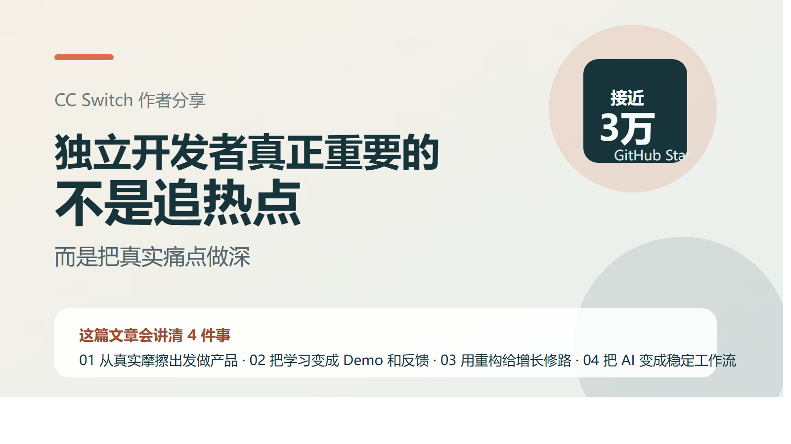
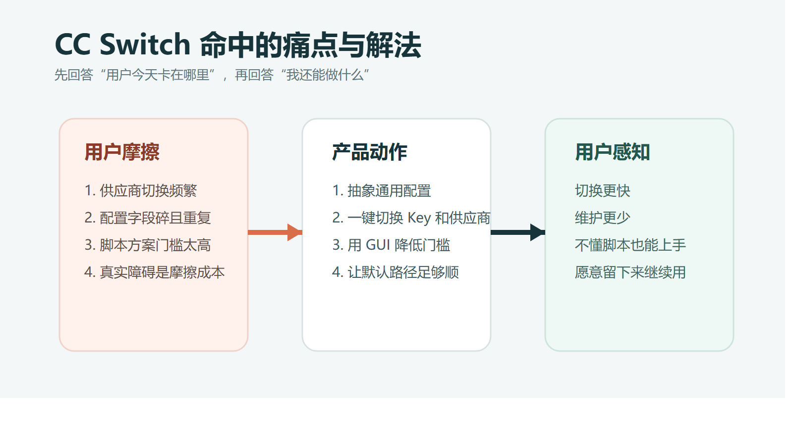
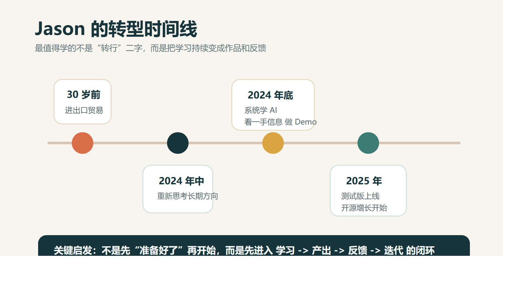
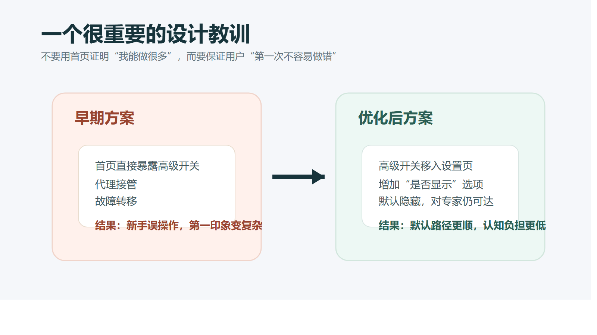
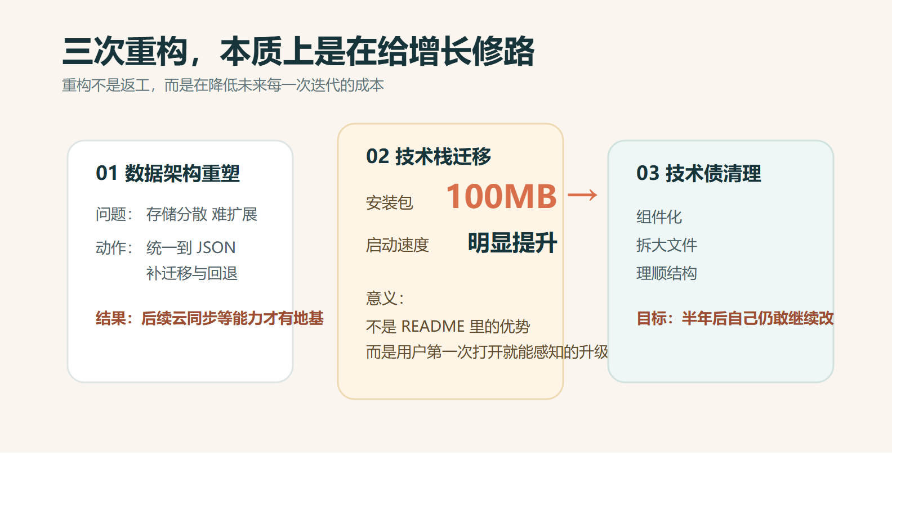
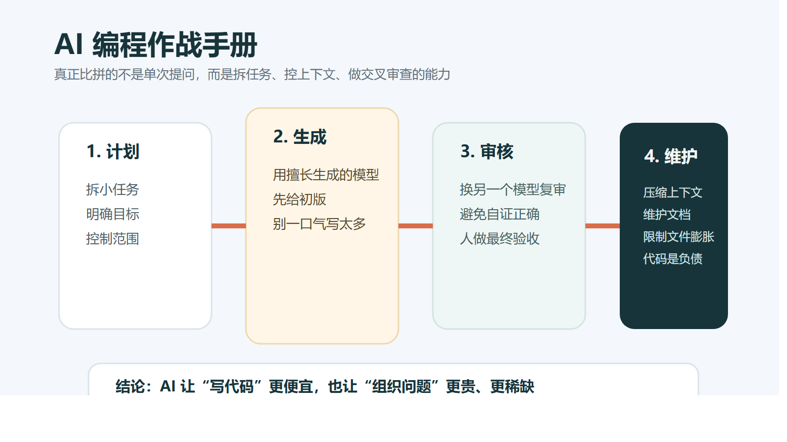
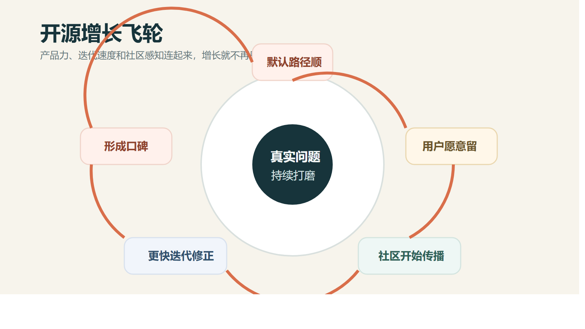
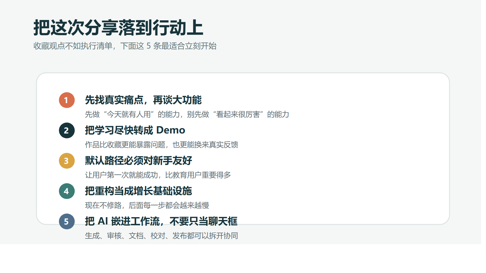

# 听完 CC Switch 作者 Jason 的分享，我更确定了：独立开发者最重要的，不是追热点，而是把真实痛点做深

最近听了 CC Switch 作者 Jason 的一次分享。原本以为会听到一堆“增长技巧”或者“AI 创业神话”，结果真正留下来的，反而是一种很朴素的确定感：

**真正能跑出来的独立开发者，往往不是最会追风口的人，而是最能把一个真实痛点持续做深的人。**

为什么是 CC Switch？

因为这个项目从 2025 年 8 月底启动，到分享时已经拿下接近 3 万 Star。对一个独立开发者来说，这不是一句“做得不错”可以概括的成绩，更像是一份非常具体的样本：一个人，怎样从真实需求出发，把产品、工程、AI 工作流和开源增长接起来。

Jason 讲了很多细节。我不想把它整理成一篇“会议纪要”，更想把它写成一篇对普通开发者也有用的文章。前半段写他和 CC Switch 是怎么做出来的，后半段写我从这次分享里带走的几条方法论。

## 1. 一个项目能跑出来，首先不是因为它“厉害”，而是因为它“真有用”

据 Jason 分享，CC Switch 一开始命中的并不是什么宏大叙事，而是非常具体的日常摩擦：

- Claude Code 等工具的供应商切换很频繁，但配置过程又碎又乱。
- 市面上很多方案是脚本形态，对普通用户并不友好。
- 大家真正卡住的，往往不是模型能力，而是切换成本和使用门槛。

CC Switch 的核心价值也因此很清楚：

- 管理不同 Coding Agent 的配置。
- 一键切换 API Key 和供应商。
- 用 GUI 把原本命令行里繁琐的事情收敛成可视操作。

这件事给我最大的提醒是，很多独立开发者项目之所以做不起来，不是因为功能不够多，而是因为一开始就错把“我想做什么”当成了“用户现在卡在哪里”。

好的起点，不是一个看上去很大的概念，而是一个用户今天就愿意打开、明天还会继续用的具体问题。

## 2. Jason 的路径最值得学的，不是转行本身，而是把学习变成产出

分享里最打动我的部分，是 Jason 自己的经历。

30 岁前，他做的是进出口贸易。到了 2024 年中，他开始重新思考自己真正想走的路；2024 年底赶上 AI 热潮，开始系统学习，去推特上看一手信息，跟着欧美主流教材和课程练，靠不断做 Demo 和玩具项目来巩固；到了 2025 年，CC Switch 测试版本做出来，后面的故事大家就都看到了。

这段经历特别有代表性。因为它证明了一件事：

**真正把人拉开差距的，不是“我有没有科班背景”，而是“我能不能把学习持续转成作品，把作品再转成反馈”。**

很多人也在学 AI，也在看帖子，也在收藏教程，但很容易停留在“知道”这一层。Jason 这条路更像是反过来的：

1. 先快速吸收。
2. 再马上动手。
3. 用 Demo 暴露理解漏洞。
4. 用反馈逼自己继续迭代。

这也是为什么有些人学得慢，不是因为不努力，而是因为始终没有进入“学习 -> 产出 -> 反馈 -> 再学习”的闭环。

## 3. CC Switch 真正的产品力，是把复杂留给自己，把简单留给用户

Jason 在分享里反复提到一个词：`Dogfooding`。说白了，就是先让自己成为那个最挑剔、最频繁、最容易不耐烦的用户。

这背后其实是一个很成熟的产品观：

**易用性，不是锦上添花，而是独立开发者和大厂竞争时最能建立壁垒的地方。**

比如他提到的“通用配置”设计，本质上做的是一件很聪明的事：

- 把不同供应商之间重复的字段抽象出来。
- 把真正需要切换的部分收敛到最少。
- 让用户维护一套更稳定、更容易理解的配置结构。

这不是“多做了一个功能”，而是在主动消灭用户的维护成本。

另一个让我印象很深的细节，是早期把代理接管、故障转移之类的开关直接放在首页，结果新手用户非常容易误操作。后来他调整成：

- 高级开关移入设置页。
- 提供“是否显示”的选项。
- 默认把复杂功能藏起来，对专家保留可达性。

很多产品做不好，不是因为功能不强，而是因为总想证明“我能做很多”，却没有优先保证“用户不容易做错”。

## 4. 三次重构说明：真正长期主义的人，不会把重构当成返工

Jason 在分享里讲了 CC Switch 的三次关键重构，我觉得这部分非常值得所有独立开发者反复看。

第一次重构，是数据架构重塑。

原来数据存储比较分散，不利于后续做云同步等能力，于是统一收敛到 JSON 文件，同时补上迁移和回退逻辑。这个动作看起来“不性感”，但它决定了后续还能不能继续长。

第二次重构，是技术栈迁移。

他提到重写之后，安装包从 100MB 级别降到 5MB 级别，启动速度也有明显提升。这个变化非常关键，因为它不是写在 README 里的优势，而是用户第一次打开就能直接感知到的体验升级。

第三次重构，是清理技术债。

- 继续组件化。
- 拆大文件。
- 整理代码结构。
- 给后面的迭代留出空间。

我非常认同这背后的判断：

**重构不是为了让代码“更漂亮”，而是为了让产品还能继续以较低成本迭代。**

独立开发者最怕的，不是今天写得快，而是半年后自己都不敢再动。

## 5. AI 编程时代，程序员最该升级的不是手速，而是组织问题的能力

Jason 在 AI 编程这部分的分享，几乎句句都很实在。

他给出的一个建议是：**生成和审核，尽量交给不同模型做交叉检查。**  
比如代码生成可以偏向一个模型，代码审核可以换另一个模型，这样能尽量减少“同一个模型为自己背书”的盲区。

但更重要的不是选哪个模型，而是他对“人”的角色判断：

- 人要负责开发计划。
- 人要负责架构设计。
- 人要负责验收把关。

这和很多人想象中的“AI 会不会替代程序员”不是一回事。真正发生的变化更像是：

**写代码这件事，越来越像执行环节；而拆任务、控上下文、管质量，越来越像核心能力。**

他还提到一个我很认同的观点：代码是负债，不是资产。

所以在 AI 编程时代，更重要的不是让模型多写，而是让系统少复杂：

- 任务不要过大。
- 上下文要定期压缩。
- 文档要持续维护。
- 文件不要无限膨胀。
- 让 AI 更容易理解，也让未来的自己更容易接手。

很多人觉得自己在学 AI 编程，实际上只是在学“怎么提问”；真正拉开差距的，是谁能把一整条工作流组织起来。

## 6. 开源增长不是玄学，而是一条“产品力 + 迭代速度 + 社区感知”的飞轮

Jason 也提到过两次“撞车”经历。

一次是自己刚做完相关能力，平台随后也支持了类似功能；另一次是格式转换这类能力，很快又被更大的平台跟进。对独立开发者来说，这种事并不少见，也确实很打击。

但他的态度特别值得记住：

**功能被覆盖不代表项目失去价值，真正关键的是你有没有继续提供更顺的体验、更快的响应和更强的场景适配。**

也就是说，独立开发者和大厂真正拼的，并不只是资源总量，而是：

- 你理解用户是不是更贴近。
- 你改得是不是更快。
- 你和社区之间是不是有真实信任。

再加上社交媒体曝光、热点窗口、持续运营，项目增长就不再只是“运气爆发”，而会慢慢形成飞轮。

这也是为什么 AI 时代的开源项目更容易被看见，也更容易走向 Sponsor、增值服务或者其他更可持续的路径。不是因为时代突然变好了，而是因为一个人的产出能力被放大后，开源项目第一次真正有机会同时兼顾产品、传播和商业闭环。

## 7. 如果把这次分享压缩成 5 条最值得立刻执行的建议

最后，把我最想带走的部分压缩成 5 条：

1. 从真实痛点开始，不要从想象中的“大功能”开始。
2. 把学习尽快变成 Demo，把 Demo 尽快变成反馈。
3. 优先打磨默认路径，让新手第一次就能成功。
4. 把重构当成增长基础设施，而不是可做可不做的返工。
5. 把 AI 当成工作流的一部分，而不是一个万能聊天框。

如果你现在也在做 AI 工具、开源项目，或者正在准备重新启动自己的技术路径，我觉得 Jason 这次分享最重要的启发，其实就一句话：

**独立开发者真正稀缺的，不是做出一个“看起来很厉害”的功能，而是长期把一个真实问题做得越来越顺。**

当你能把产品判断、工程纪律、AI 工作流和用户反馈接成一个闭环，增长往往只是结果，不再是目的。

