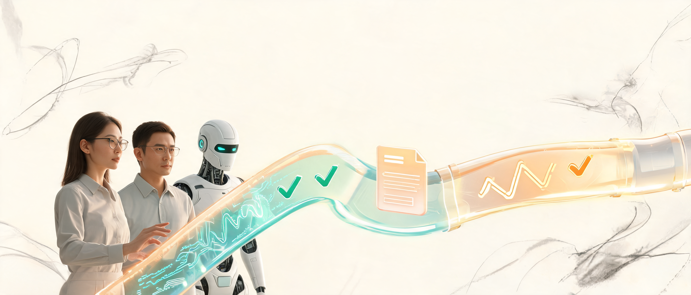
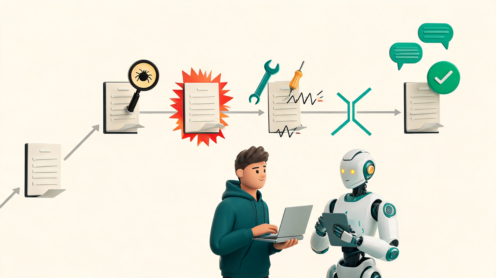
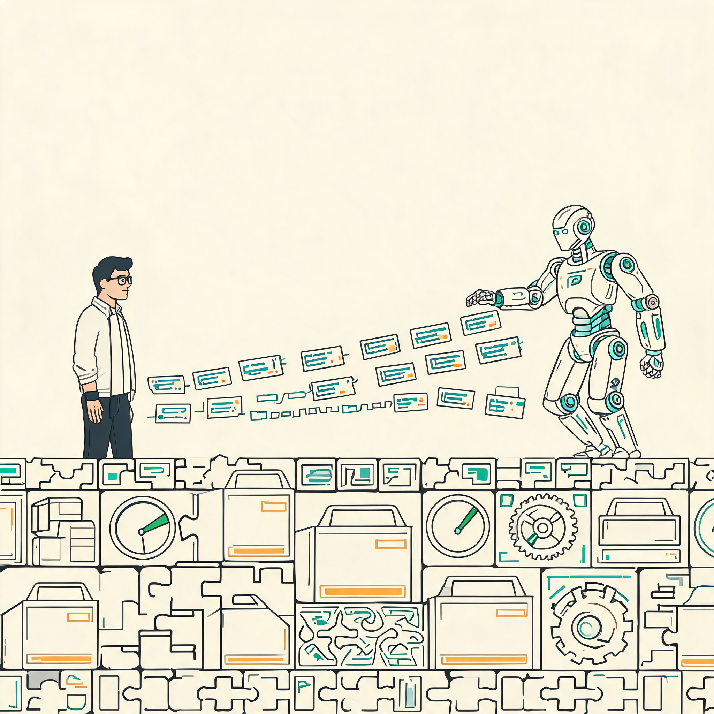
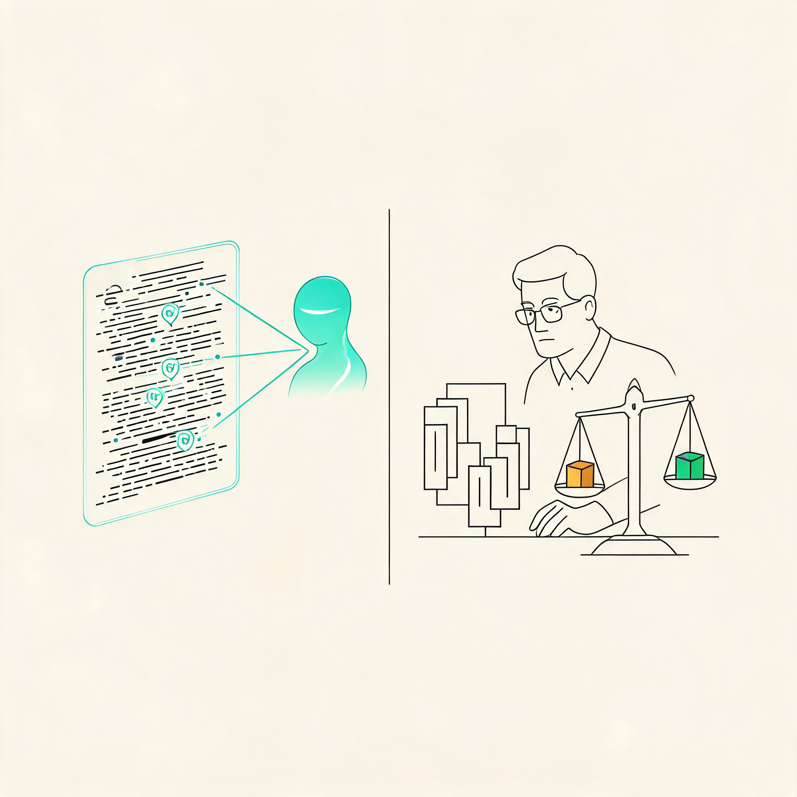
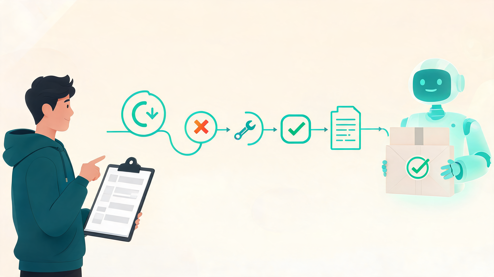

# 看完 Claude Code 和 Bun 创始人结对编程，我更确定了：程序员最值钱的能力变了

5 月 6 日，Anthropic 在 Code w/ Claude 2026 上放了一场很有意思的直播：Claude Code 负责人 Boris Cherny，和 Bun 创始人 Jarred Sumner，现场结对编程。

如果只把它看成“两个高手用 AI 写代码”，那就看浅了。

我更强烈的感受是：

> **AI 编程正在从“帮你补几段代码”，进入“替团队跑完开发流程第一遍”。**

真正被改写的不是某个函数怎么写，而是 issue 怎么被处理、测试怎么补、PR 怎么开、review 怎么回。

📌 **一句话判断**

未来程序员最值钱的能力，不是比 AI 更快地敲代码，而是把一个模糊问题变成可验证、可评审、可交付的工程闭环。

🧭 **读完这篇，你能带走两样东西**

- 一个判断：AI 编程的主战场，正在从“生成代码”转向“推进工程流程”。
- 一个动作：下次让 AI 修 bug，不要只说“帮我改一下”，而是让它先复现、再写失败测试、再修复、再开 PR、最后列风险。

这才是 AI 工程流。

---

## 1. 👀 这场直播最关键的，不是“AI 会写代码”

以前我们看 AI 编程 demo，常见剧情是这样的：

给它一个需求，它生成一段代码；再给它一个报错，它修一修；最后跑起来，大家鼓掌。

这类 demo 当然有用，但它离真实工程还差很远。

因为真实团队里的开发，不是“写一段代码”这么简单。

真实开发通常长这样：

- 🧩 issue 里只有一个不完整的现象；
- 🧱 代码库里有历史包袱；
- 🔍 bug 要先复现；
- 🧪 修复必须配测试；
- 📝 PR 要讲清楚风险；
- 👀 review 会提出新问题；
- ✅ CI 过了也不等于一定能合；
- 🚦 合进去以后，还要看线上表现。

而这次 Claude Code 和 Bun 的直播，最值得看的地方恰恰在这里。

Bun 官方博客里，Jarred Sumner 提到一件很有信号意义的事：过去几个月，Bun 仓库里合并 PR 最多的 GitHub 用户名，已经是一个 Claude Code bot。他们在内部 Discord 里让它帮忙修 bug；它会开带测试的 PR，会让旧版本 Bun 测试失败、修复后的 debug build 通过，还会回复 review comments。

这句话拆开看，其实就是一条完整工程链路：

> **发现问题 → 构造验证 → 修复代码 → 提交 PR → 回应评审。**

注意，不是“生成代码”。

是“推进一个 issue 往合并走”。

这就是分水岭。

**当 AI 能接住的不再是一段函数，而是一张 issue 卡片，软件团队的工作分工就会开始重组。**

---

## 2. 🔁 新的最小单位，不是代码，而是闭环

很多人用 AI 写代码时，最大的问题不是模型不够强，而是任务给错了。

你说：

> 帮我修这个 bug。

它就会猜。

猜 bug 在哪里，猜怎么复现，猜哪些测试要跑，猜什么算完成。猜对了你觉得它聪明，猜错了你觉得它胡来。

但工程里最怕的就是“猜”。

Claude Code 官方最佳实践里有一个非常重要的建议：给 Claude 一个验证自己工作的办法，比如测试、截图或明确的预期输出。它还建议把流程拆成 explore、plan、implement、commit，而不是一上来就直接改代码。

这背后的逻辑很硬：

> **Agent 的能力上限，取决于它能不能自己拿到反馈。**

所以一个更靠谱的 AI 工程流，不是：

> 帮我修一下。

而是：

> 先找到复现路径，说明相关文件和可能原因。  
> 再补一个当前会失败的测试。  
> 然后做最小修复。  
> 跑相关测试。  
> 最后整理 PR 描述和风险点。

这几句话看起来啰嗦，但它把任务从“写代码”改造成了“跑闭环”。

闭环里最重要的不是 AI 写了多少，而是每一步都有证据：

- ✅ 复现有证据；
- ✅ 测试失败有证据；
- ✅ 修复通过有证据；
- ✅ PR 描述有证据；
- ✅ review 回应有证据。

📌 **这里有个关键转变**

**AI 编程真正进入工程现场的标志，不是它会写更多代码，而是它开始尊重证据链。**

没有证据链，AI 只是一个很快的代码生成器。

有了证据链，AI 才像一个可以交接的工程协作者。

---

## 3. 🧱 为什么偏偏是 Bun？因为 Agent 时代会重新定价工具链

Bun 加入 Anthropic 这件事，表面看是一个 JavaScript runtime 被收购。

但如果放在 Claude Code 这场直播里看，它更像一件工程基础设施事件。

Bun 官方说得很直接：Claude Code 以 Bun executable 的形式发给大量用户；如果 Bun 出问题，Claude Code 就会出问题。换句话说，Bun 已经不是“某个开发者喜欢的更快工具”，而是 AI 编码产品运行、分发、测试的一部分底座。

Jarred 在博客里还提到一个判断：如果未来越来越多代码由 AI agent 编写、测试、部署，那么 runtime 和 tooling 的重要性会变得更高。因为代码总量会变多，迭代会更快，人类离每一行代码更远，运行环境就必须更快、更稳定、更可预测。

这句话很值得产品和技术负责人反复读。

过去我们常说工具链是“开发体验”。

到了 Agent 时代，工具链会变成“生产线”。

一个慢的测试套件，一个不稳定的包管理器，一个经常抽风的本地环境，在人类团队里也许只是烦人；但在 AI 工程流里，它会直接拖垮整个闭环。

因为 AI 的产出频率太高了。

人一天改三个 PR，工具链慢一点还能忍。

Agent 一天推进几十个小任务，工具链每慢一次，都是在给整条流水线加沙子。

📌 **所以 Anthropic 押 Bun，不只是为了让 Claude Code 启动快一点。**

更深的逻辑是：

> **谁掌握 Agent 时代的运行、安装、测试和分发底座，谁就更接近下一代软件工程的主干道。**

---

## 4. 👀 Review 也会变：人不再负责看完所有细枝末节

很多团队真正卡住的，不是开发，而是 review。

AI 写代码越快，PR 越多，review 压力就越大。最后会出现一个很讽刺的局面：

> **AI 把开发速度提上去了，但人类 review 变成了新瓶颈。**

Claude Code Review 这类能力，本质上就是在补这一环。

我不认为它会让人类 reviewer 消失。恰恰相反，它会逼人类 reviewer 升级。

未来 review 很可能分成两层：

🔎 **第一层，AI 负责扫低级风险。**

比如明显的空值问题、边界条件遗漏、测试缺口、风格不一致、可疑的复杂度、和现有模式冲突的地方。

🧠 **第二层，人负责做关键判断。**

这个改法是不是符合产品方向？抽象边界要不要接受？性能和可维护性怎么取舍？这次是不是应该先做小修，而不是顺手重构？

前者是检查，后者是判断。

AI 会把大量检查工作前移，但判断仍然要人来做。

所以程序员的价值不会消失，只是重心会变。

过去你值钱，是因为你能独立写完一个模块。

接下来你更值钱，可能是因为你能回答这几个问题：

- 这个 issue 是否值得修？
- 修复范围是否被控制住？
- 测试是否真的覆盖了风险？
- PR 里的解释是否足够让别人接手？
- 这次改动会不会把系统推向更乱的方向？

> **Agent 可以帮你写代码，但不能替你承担工程判断。**

真正稀缺的，是能让 Agent 高速工作、又不把系统带偏的人。

---

## 5. 🧪 对普通团队来说，别急着全自动，先补这五块

看完这类直播，最容易犯的错是热血上头：明天就让 AI 自动修 issue、自动开 PR、自动 review。

我建议先冷静一点。

Bun 这种项目能让 Claude Code bot 大量推进 bug 修复，不是因为他们只会写一句神奇 prompt，而是因为它有几个前提。

✅ **第一，issue 足够工程化。**  
问题能被定位、复现、缩小范围，而不是一句“感觉不好用”。

✅ **第二，测试能表达真实行为。**  
Agent 修完以后，不是靠“看起来对了”，而是有旧版本失败、新版本通过的验证。

✅ **第三，仓库有清晰约定。**  
代码风格、测试命令、PR 规范、目录边界、常见坑，不能全靠老员工脑补。

✅ **第四，review 有明确分工。**  
AI 扫第一遍，人类看关键风险。否则 PR 数量上去以后，团队只会被 review 淹没。

✅ **第五，发布和回滚要接得住。**  
如果合并之后出了问题，能不能快速发现、定位、回滚？AI 只会放大你的工程系统，不会替你凭空补齐它。

这五块不补，AI 速度越快，系统越危险。

这五块补起来，AI 才不只是“会写代码的助手”，而会变成团队里的第二条执行线。

---

## 6. 🧰 可以直接照抄的提示词模板

如果你想把这套思路马上用起来，下次别再只给 AI 一句“修一下”。

可以直接这样说：

> 你先不要急着改代码。  
>  
> 请按下面流程处理这个 issue：  
> 1. 先阅读相关代码，说明你认为问题可能在哪里。  
> 2. 找到或构造一个最小复现路径。  
> 3. 先补一个当前会失败的测试，证明问题存在。  
> 4. 再做最小范围修复，不做无关重构。  
> 5. 跑相关测试，并说明你跑了哪些命令、结果是什么。  
> 6. 最后整理一段 PR 描述：包含改了什么、为什么这样改、风险点、需要 reviewer 重点看的地方。

这个模板的重点，不是让 AI 更“听话”。

而是把它从“代码生成模式”，拉进“工程交付模式”。

📌 **你要的不是一段看起来能跑的代码。**

你要的是一个别人能 review、能验证、能接手、能放心合并的改动。

---

## 结尾：别再问 AI 会不会替代程序员了

这个问题已经有点过时。

更好的问题是：

> **当 AI 可以处理 issue、补测试、开 PR、回 review，你在团队里还负责什么？**

我的答案是：负责把工作定义清楚，负责让系统可验证，负责在关键取舍上拍板，负责守住长期质量。

这听起来没有“十倍程序员”那么刺激，但更接近现实。

AI 工程流的终点，不是把人从软件开发里完全拿掉。

它更像是在把人从“每一行代码的体力劳动”里往上推：推到问题定义、反馈设计、风险判断和系统演化。

所以，下次你再打开 Claude Code、Codex 或任何一个 AI 编程工具，不妨别再说：

> 帮我写个功能。

换成：

> 先把这个 issue 变成一个可验证的 PR。

这句话的差别，就是从 AI 写代码，走向 AI 工程流。

也是未来程序员能力迁移的方向。

---

参考资料：

- [Claude Code 官方活动页：Live coding session with Boris Cherny and Jarred Sumner](https://claude.com/code-with-claude/session/sf-live-coding-session-with-boris-cherny-and-jarred-sumner)
- [YouTube 直播回放：Claude Code 与 Bun 创始人结对编程](https://www.youtube.com/live/DlTCu_pNDHE)
- [Bun 官方博客：Bun is joining Anthropic](https://bun.com/blog/bun-joins-anthropic)
- [Claude Code Docs：Common workflows](https://code.claude.com/docs/en/common-workflows)
- [Claude Code Docs：Best practices](https://code.claude.com/docs/en/best-practices)
- [ITPro：Anthropic says code review has become a bottleneck](https://www.itpro.com/software/development/anthropic-says-code-review-has-become-a-bottleneck-this-new-claude-code-feature-aims-to-solve-that)

*AI 辅助创作，人工审核编辑。*
