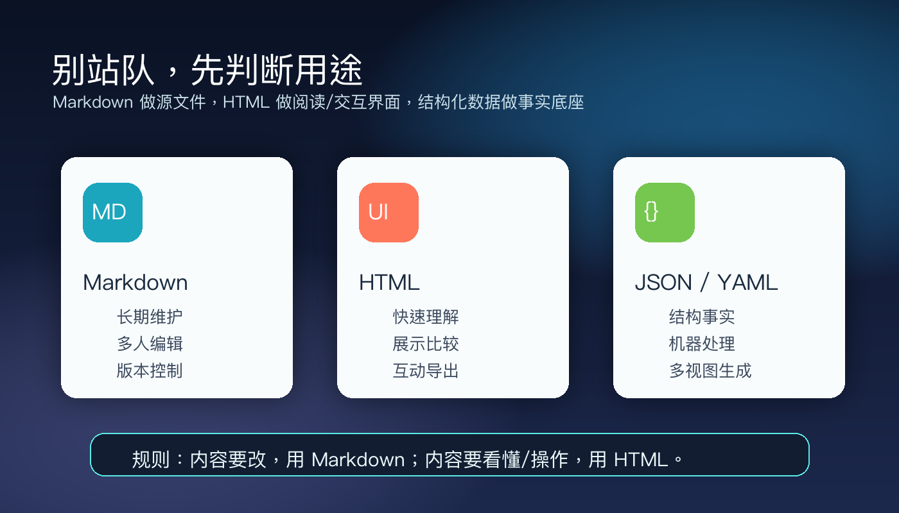

# AI 输出不该只是文档了：Claude 团队为什么开始偏爱 HTML？


这两天 AI 圈有个小话题突然热了起来：Claude Code 团队的 Thariq Shihipar 说，他现在几乎不再让 Claude 输出 Markdown，而是更常让 Claude 直接生成 HTML。

乍一看，这像是程序员又在争论“哪种格式更优雅”。

但我觉得这件事真正有意思的地方，不是 HTML 赢了 Markdown，而是 AI 产物的形态变了。

以前我们让 AI 交付一段文字。现在我们开始让 AI 交付一个界面。读完这篇，你可以带走一个判断：**未来很多 AI 输出，不会停在“文档”，而会变成一个可以阅读、点击、调参、导出的临时工作台。**

先说结论：

- 📄 **Markdown 仍然适合写和改。**
- 🧩 **HTML 更适合看懂、比较、互动。**
- 🧭 **真正的变化，是 AI 开始交付“工作流界面”。**

## 1. 🔥 这件事为什么突然火了？

先把背景讲清楚。

5 月 8 日，Thariq Shihipar 发了一篇关于 Claude Code 使用方式的文章，核心观点很直接：相比 Markdown，他越来越偏好让 Claude Code 生成 HTML 文件。

他还放了一个示例站，里面集中展示了 20 个 HTML 文件：有实施计划、代码审查、模块地图、设计系统、组件状态表、交互原型、事故复盘、提示词调优器、任务分诊看板。

这不是“把 Markdown 加点样式变好看”。

更准确地说，它是在把 AI 生成内容从线性文本变成多维信息空间：

- 🗓️ 计划可以有时间线、风险表、数据流图。
- 🔍 代码审查可以有真实 diff、严重程度标记、跳转锚点。
- 🎨 设计方案可以并排摆出来，让你直接对比而不是脑补。
- 🎛️ 复杂参数可以做成滑块和开关，调完以后再一键导出。

所以这个话题能火，不是因为大家突然怀念手写 HTML。

真正刺中人的地方是：**当 AI 产出越来越长，人的阅读能力开始成为瓶颈。**

过去一份 100 行 Markdown 计划还算清爽；现在 agent 一口气给你写出几百行方案、表格、风险、代码片段和替代路径，看起来很完整，实际很多人根本不会认真读。

这才是这场格式争论背后的真实矛盾。

不是 Markdown 太差，而是 AI 太能写了。


## 2. 🧠 HTML 赢的不是格式，是“复核率”

我觉得 Thariq 这篇文章里最值得抓住的，不是“HTML 信息密度更高”这种表层理由，而是一个更实际的问题：

AI 给你的东西，你真的会看完吗？

如果不会，再完整的计划也只是一个漂亮的心理安慰。你以为自己在审查 AI，实际只是默认接受它。

HTML 的价值就在这里。

它可以把一份需要硬读的文档，变成一个更容易扫描、理解和复核的页面。

折叠区、标签页、颜色标记、流程图、导航目录、代码高亮、交互控件，这些东西不只是“好看”，它们是在降低人重新进入上下文的成本。

比如你让 Claude 审查一个复杂 PR。

Markdown 版本可能是：

“这里改了 A，那里影响 B，建议关注 C。”

HTML 版本可以是：

左边是变更文件，右边是风险标记；严重问题用红色，高不确定性用黄色；点击一个模块，下面展开调用链；最后还有一个“需要人工确认”的清单。

这时人的角色就变了。

你不再是在一堵文字墙里找重点，而是在一个审查界面里做判断。

这也是我认为最关键的一句判断：

> **AI 输出的下一步，不是写得更长，而是让人更愿意复核。**

很多团队用 AI 最大的问题，不是模型不够聪明，而是它产出的东西太难被人认真接住。HTML 正好提供了一个很低门槛的中间层：不用开发正式产品，也能快速做出一个“专门为这次任务服务”的临时界面。

## 3. 🛠️ 真正厉害的是“用完即走”的小工具

如果只是把报告排版得更漂亮，HTML 还不算革命。

真正有想象力的，是让 Claude 临时生成一个小工具。

比如：

- 📌 你有 30 个 Linear 任务，不知道怎么排优先级。让 Claude 做一个拖拽看板，分成“现在做 / 接下来 / 以后再说 / 砍掉”，最后导出 Markdown。
- ✍️ 你在调一个系统提示词。让 Claude 做一个左右分栏编辑器，左边改模板，右边实时渲染 3 个样例，最后一键复制新 prompt。
- 🧱 你要理解一个限流模块。让 Claude 做一个带流程图、核心代码片段、FAQ 和“常见坑”的单页解释器。
- 🖼️ 你在做设计方向探索。让 Claude 生成 6 个不同风格的页面方案，放在同一张网格里对比。

这些东西如果让工程师正式开发，成本很高。

但如果它只是为一个会议、一次代码审查、一轮头脑风暴服务，它就不需要成为产品。它只需要在当天好用。

这恰恰是 AI 最适合的地方：把那些“不值得开发，但值得拥有”的界面，临时做出来。


以前我们会说，AI 是一个写作助手、代码助手、搜索助手。

现在更准确的说法可能是：

> **AI 会越来越像一个临时界面生成器。你需要什么理解方式，它就给你造一个理解界面。**

这件事对非程序员也有启发。

以后你不一定要问 AI：“帮我总结这份材料。”

你可以问：

“帮我做一个单页 HTML，我要在 5 分钟内看懂这份材料。上面放结论，中间放证据链，下面放我需要追问的 5 个问题。重要信息可以折叠，冲突信息用颜色标出来。”

这比“写一份总结”更接近真实工作。

因为真实工作不是读完一段话，而是做出判断。

## 4. ⚠️ 但别急着宣布 Markdown 死了

不过，我不建议把这件事理解成“Markdown 过时了”。

这会把一个好想法用坏。

社区里的反驳也很有价值。Hacker News 和 Reddit 上不少人都提到几个问题：

**第一，HTML 更重。** 它通常会消耗更多 token，也需要更长生成时间。Thariq 自己也承认，生成 HTML 可能比 Markdown 慢不少。

**第二，HTML 的 diff 很难看。** 一个几千行的单页 HTML 文件放进 Git 里，真正审查变更时会很痛苦。样式、结构、脚本混在一起，版本控制不像 Markdown 那样清爽。

**第三，HTML 可能削弱人的共同创作。** Markdown 最大的优点，是你可以直接打开、删两句、改一段、补一个标题。HTML 如果变成主要源文件，很多人会下意识让 AI 继续改，而不是自己动手改。

这就危险了。

因为我们本来是想用 HTML 提高复核率，结果可能变成“页面看起来很专业，所以我更少介入”。

所以我的结论不是“HTML 替代 Markdown”。

我的结论是：

> **Markdown 更适合做事实层，HTML 更适合做呈现层。**

如果一份内容需要长期维护、多人编辑、进入版本控制，Markdown 仍然非常稳。

如果一份内容需要被快速理解、展示、比较、交互、分享，HTML 就很值得用。

如果内容本身是结构化数据，甚至应该把源头放在 JSON、YAML、CSV 里，再让 AI 或脚本生成 HTML 视图。

不要把“源文件”和“阅读界面”混成一件事。

这才是更稳的用法。



## 5. 🧩 普通人怎么用？记住这三个问题

下次你让 Claude、ChatGPT、Codex 或其他 agent 输出内容时，可以先问自己三个问题。

### ✅ 第一问：这份内容主要是拿来读，还是拿来改？

如果你要自己反复改，继续用 Markdown。

比如文章草稿、技术规范、会议纪要、长期维护的项目文档，Markdown 仍然是最省心的选择。

但如果它主要是拿来读、讲解、汇报、复核，那就可以考虑 HTML。

比如研究报告、PR 解释、事故复盘、方案对比、学习笔记。

### ✅ 第二问：这份内容有没有空间结构？

纯文字观点，用 Markdown 就够了。

但只要里面出现这些东西，HTML 的优势就会明显：

- 🧭 多方案对比
- 🔁 流程图
- 🕒 时间线
- 🟢 状态分布
- 🚦 风险分级
- 🔍 代码 diff
- 📊 复杂表格
- 🔗 可点击目录
- 📂 可折叠解释

因为这些信息本来就不是线性的。

你强行把它们塞进 Markdown，它们就会变成一堵墙。

### ✅ 第三问：我是否需要和它互动？

这是最关键的分界线。

如果你只是读，HTML 是更舒服的阅读层。

如果你还需要筛选、拖拽、调参、标注、导出，那 HTML 就不只是阅读层，而是一个轻量工作台。

这时你可以直接要求 AI：

“最后加一个导出按钮，把我在页面里的选择导出为 Markdown / JSON / Prompt，方便继续交给 agent 使用。”

这个动作很重要。

它让人机协作形成闭环：AI 生成界面，人做判断，界面导出结果，再交给 AI 继续执行。

## 6. 🧪 一条我会直接照抄的提示词

如果你想试，不用搞复杂技能，先从这一条开始：

```text
请把这次分析做成一个单页 HTML 文件，而不是普通 Markdown。

要求：
1. 顶部先给 5 行以内的结论摘要。
2. 中间用卡片、表格、流程图或时间线呈现关键证据。
3. 把不确定信息单独标出来，不要和事实混在一起。
4. 如果有多种方案，请并排对比优缺点和适用场景。
5. 页面底部给一个“我下一步该做什么”的行动清单。
6. 如果我需要继续把结果交给 AI，请提供一段可复制的 Markdown 摘要。
```

你可以把它用在这些场景：

- 🧑‍💻 让 Claude 解释一个陌生代码库。
- 🔎 让 Codex 输出一次代码审查说明。
- 🗂️ 让 ChatGPT 整理一堆网页资料。
- 📈 让 AI 帮你做竞品对比。
- 📝 让 AI 把会议记录变成决策看板。

试一次你就会发现，差异不只是视觉差异。

它会逼你更具体地描述：我到底想怎样理解这件事？

## 写在最后 🧭

这场“HTML vs Markdown”的争论，表面上是格式之争，底层其实是人机协作方式在升级。

以前我们默认 AI 的交付物是一段文字。

后来我们接受它交付代码。

现在我们开始让它交付界面。

这意味着一个很实际的变化：未来会写 prompt 还不够，真正重要的是会设计“输出形态”。

同样一份研究，让 AI 写成 3000 字报告，和让 AI 做成一个带结论、证据、风险、互动控件和导出按钮的 HTML 页面，得到的不是同一种生产力。

一个是信息。

一个是工作流。

所以别急着站队 HTML 或 Markdown。更值得问的是：

**这次任务里，我需要的是一份文档，还是一个能帮我做判断的界面？**

问清楚这个问题，格式自然就会变得很简单。

## 参考资料

1. Thariq Shihipar, Using Claude Code: The Unreasonable Effectiveness of HTML: https://x.com/trq212/status/2052809885763747935
2. 宝玉的分享译文，《使用 Claude Code：HTML 难以置信的奇效》：https://baoyu.io/translations/2026-05-08/trq212-status-2052809885763747935
3. The unreasonable effectiveness of HTML examples: https://thariqs.github.io/html-effectiveness/
4. Simon Willison, Using Claude Code: The Unreasonable Effectiveness of HTML: https://simonwillison.net/2026/May/8/unreasonable-effectiveness-of-html/
5. Anthropic Help Center, What are artifacts and how do I use them?: https://support.claude.com/en/articles/9487310-what-are-artifacts-and-how-do-i-use-them
6. Hacker News discussion: https://news.ycombinator.com/item?id=48071940

*AI 辅助创作，人工审核编辑。*
