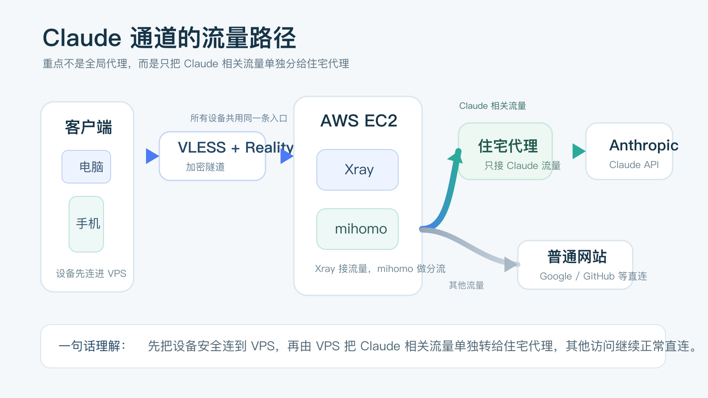
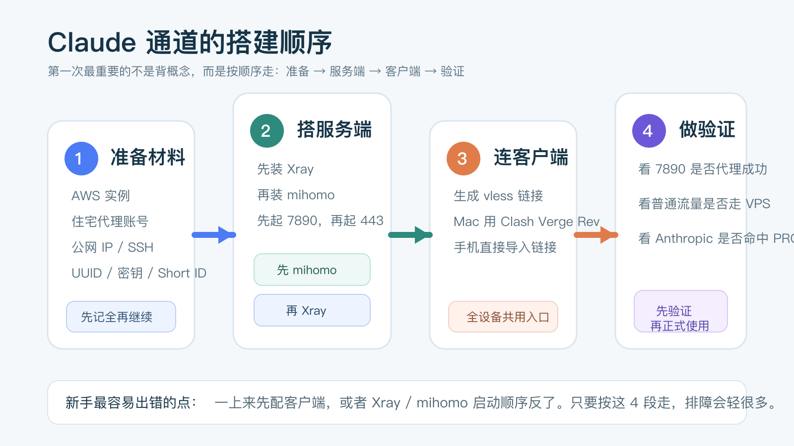

# 第一次搭 Claude 通道，最容易卡住的不是命令，而是这几步没人讲透


很多人现在折腾 Claude 通道，已经不是为了“偶尔试一下”，而是想把 Claude / Claude Code 稳定接进自己的日常工作。

但第一次动手时，真正劝退人的通常不是某一行命令，而是另一件更现实的事：你不知道该先准备什么，不知道整条链路该按什么顺序走，也不知道做到哪一步才算真的成功。

这篇我不写成纯原理文，也不把原始手写稿原样贴出来。我会按普通用户第一次搭建的视角，把这条路顺成 5 段：先看这套方案到底在做什么，再准备材料，接着搭服务端、连客户端、做验证，最后给你一份最常见问题排查表。如果你只是低频偶尔用 Claude，这套复杂度未必值得；但如果你已经开始高频依赖它，这篇会帮你把第一次搭建走顺。

## 先用一句人话讲清，这套方案到底在做什么



先别急着看配置。你只要先记住一句话：

**你的设备先安全连到一台 AWS 云服务器，再由服务器把 Claude 相关流量单独分给住宅代理，其他流量继续正常直连。**

这里面 3 个名字第一次看会有点晕，我先翻译成人话：

- `Xray`：负责接住你设备传来的加密流量，像这条通道的大门。
- `mihomo`：负责按规则分流，决定哪些流量要继续转给住宅代理。
- `住宅代理`：给 `Anthropic / Claude` 相关请求一个更稳定的出口 IP。

这套方案和“开一个全局代理就完事”最大的区别是：

**它不是把所有流量都塞进同一个黑盒，而是只给 Claude 单独开一条更可控的路。**

## 动手前，先准备这 4 样东西

第一次最容易翻车的地方，不是命令，而是材料没准备齐。

### 1. 一台 AWS EC2

建议直接用：

- 区域：`us-west-1` 或 `ap-northeast-1`
- 系统：`Ubuntu Server 24.04 LTS`
- 实例：`t3.micro`
- 磁盘：`8-20 GB`

你后面要从 AWS 记住 3 个东西：

- 实例公网 IP
- SSH 登录方式
- 安全组是否只放行了 `22` 和 `443`

### 2. 一个住宅代理账号

你至少要提前拿到下面 4 项：

- 代理地址
- 代理端口
- 用户名
- 密码

没有这组信息，你后面就算把 `Xray` 和 `mihomo` 都装好了，也没法让 Anthropic 流量真正出得去。

### 3. 一台电脑和至少一台移动设备

这篇里我默认按下面的客户端来写：

- Mac：`Clash Verge Rev`
- iPhone：`Hiddify`
- Android：`Hiddify` 或 `v2rayNG`

你不一定三端都要配，但至少准备一台电脑做服务端配置，一台自己平时真的会拿来用 Claude 的设备做验证。

### 4. 基本的 SSH 登录能力

你不用懂 Linux 运维，但至少要能完成这两件事：

- 用 SSH 登录 AWS
- 知道怎么复制、粘贴和保存配置文件

如果你连 SSH 都还没登录过，建议先把 AWS 和 SSH 这一步单独跑通，再继续往下做。

## 第一步：先把 AWS 实例和安全组准备好

建议按下面这张最小清单来：

| 配置项 | 推荐值 |
| --- | --- |
| 区域 | `us-west-1` 或 `ap-northeast-1` |
| 镜像 | `Ubuntu Server 24.04 LTS` |
| 机型 | `t3.micro` |
| 存储 | `8-20 GB gp3` |

安全组只保留两条最关键的规则：

| 类型 | 协议 | 端口 | 来源 | 用途 |
| --- | --- | --- | --- | --- |
| SSH | TCP | 22 | My IP | 远程登录 |
| Custom TCP | TCP | 443 | `0.0.0.0/0` | Xray 入站 |

这里有一个新手很容易忽略的点：

**`7890` 不需要开放到公网。**

它只给服务器本机上的 `Xray -> mihomo` 转发使用，后面我们会让它只监听本地。

实例创建好之后，再给它绑定一个弹性 IP。后面文章里的 `<你的公网IP>`，都指这个地址。

然后用 SSH 登录：

```bash
ssh -i your-key.pem ubuntu@<你的公网IP>
sudo apt update && sudo apt upgrade -y
```

如果这一步能正常进服务器，说明你后面的服务端搭建就可以开始了。

## 第二步：先装 Xray，让设备先有一条安全入口

`Xray` 的任务很简单：让你的电脑或手机，先能通过 `443` 端口安全连进这台 VPS。

### 1. 安装 Xray

```bash
bash <(curl -L https://github.com/XTLS/Xray-install/raw/main/install-release.sh)
sudo setcap cap_net_bind_service=+ep /usr/local/bin/xray
```

第二行是在给它低端口权限。没有这一步，后面 `443` 很可能起不来。

### 2. 生成这 3 组关键信息

```bash
# 生成 UUID
xray uuid

# 生成 Reality 密钥对
xray x25519

# 生成 Short ID
openssl rand -hex 8
```

把下面这些值单独记下来，后面还会反复用：

- UUID
- Private Key
- Public Key
- Short ID

### 3. 写入 Xray 配置

打开配置文件：

```bash
sudo nano /usr/local/etc/xray/config.json
```

粘贴下面这份配置，再把占位符替换成你自己的值：

```json
{
  "log": {
    "loglevel": "warning"
  },
  "dns": {
    "queryStrategy": "UseIPv4",
    "servers": ["8.8.8.8", "1.1.1.1"]
  },
  "inbounds": [
    {
      "listen": "0.0.0.0",
      "port": 443,
      "protocol": "vless",
      "settings": {
        "clients": [
          {
            "id": "<替换为你的UUID>",
            "flow": "xtls-rprx-vision"
          }
        ],
        "decryption": "none"
      },
      "streamSettings": {
        "network": "tcp",
        "security": "reality",
        "realitySettings": {
          "show": false,
          "dest": "www.apple.com:443",
          "xver": 0,
          "serverNames": ["www.apple.com", "apple.com"],
          "privateKey": "<替换为你的Private Key>",
          "shortIds": ["<替换为你的Short ID>"]
        }
      },
      "sniffing": {
        "enabled": true,
        "destOverride": ["http", "tls", "quic"]
      }
    }
  ],
  "outbounds": [
    {
      "tag": "proxy-via-mihomo",
      "protocol": "socks",
      "settings": {
        "servers": [
          {
            "address": "127.0.0.1",
            "port": 7890
          }
        ]
      }
    },
    {
      "protocol": "freedom",
      "tag": "direct",
      "settings": {
        "domainStrategy": "UseIPv4"
      }
    },
    {
      "protocol": "blackhole",
      "tag": "block"
    }
  ],
  "routing": {
    "domainStrategy": "IPIfNonMatch",
    "domainMatcher": "hybrid",
    "rules": [
      {
        "type": "field",
        "outboundTag": "proxy-via-mihomo",
        "domain": [
          "domain:anthropic.com",
          "domain:anthropic.ai",
          "domain:api.anthropic.com",
          "domain:claude.ai",
          "domain:claudecode.ai",
          "domain:ifconfig.me"
        ]
      }
    ]
  }
}
```

这份配置你只需要先看懂两件事：

- `443` 是设备连进来的入口。
- `Anthropic / Claude` 相关域名会被转给 `127.0.0.1:7890`，也就是稍后要安装的 `mihomo`。

## 第三步：再装 mihomo，让 Claude 相关流量单独走住宅代理

如果说 `Xray` 是入口，那么 `mihomo` 就是分流器。

### 1. 安装 mihomo

```bash
cd /tmp
wget -O mihomo-linux-amd64.gz https://github.com/MetaCubeX/mihomo/releases/download/v1.19.24/mihomo-linux-amd64-v1-v1.19.24.gz
gunzip -f mihomo-linux-amd64.gz
chmod +x mihomo-linux-amd64
sudo mv mihomo-linux-amd64 /usr/local/bin/mihomo

sudo mkdir -p /etc/mihomo /var/log/mihomo
sudo wget -O /etc/mihomo/Country.mmdb https://github.com/MetaCubeX/meta-rules-dat/releases/download/latest/country.mmdb

mihomo -v
```

如果最后一行能正常输出版本号，说明它已经装上了。

### 2. 写入 mihomo 配置

打开配置文件：

```bash
sudo nano /etc/mihomo/config.yaml
```

粘贴下面这份配置，再把住宅代理信息替换掉：

```yaml
mixed-port: 7890
allow-lan: false
bind-address: "127.0.0.1"
mode: rule
log-level: info

dns:
  enable: true
  listen: 127.0.0.1:1053
  enhanced-mode: fake-ip
  fake-ip-range: 198.18.0.1/16
  nameserver:
    - 8.8.8.8
    - 1.1.1.1

proxies:
  - name: "IPRoyal-住宅代理"
    type: socks5
    server: <住宅代理地址>
    port: <住宅代理端口>
    username: <代理用户名>
    password: <代理密码>

proxy-groups:
  - name: "PROXY"
    type: select
    proxies:
      - "IPRoyal-住宅代理"

rules:
  - DOMAIN-SUFFIX,anthropic.com,PROXY
  - DOMAIN-SUFFIX,anthropic.ai,PROXY
  - DOMAIN-SUFFIX,api.anthropic.com,PROXY
  - DOMAIN-SUFFIX,claude.ai,PROXY
  - DOMAIN-SUFFIX,claudecode.ai,PROXY
  - DOMAIN-SUFFIX,ifconfig.me,PROXY
  - MATCH,DIRECT
```

这里最重要的其实只有两件事：

- `7890` 只监听本地，不暴露公网。
- 只有 `Anthropic / Claude` 相关流量走 `PROXY`，其他流量走 `DIRECT`。

### 3. 给 mihomo 建 systemd 服务

```bash
sudo tee /etc/systemd/system/mihomo.service << 'EOF'
[Unit]
Description=mihomo Proxy
After=network.target

[Service]
Type=simple
ExecStart=/usr/local/bin/mihomo -d /etc/mihomo
Restart=on-failure
RestartSec=5

[Install]
WantedBy=multi-user.target
EOF

sudo systemctl daemon-reload
sudo systemctl enable mihomo
```

## 第四步：按顺序启动服务，不要反过来



这里有一个顺序千万别反：

**必须先启动 `mihomo`，再启动 `Xray`。**

因为 `Xray` 的出站流量要转给 `7890`，如果 `mihomo` 还没起来，`Xray` 就会找不到出口。

按这个顺序执行：

```bash
sudo systemctl start mihomo
sleep 2
sudo ss -tlnp | grep 7890

sudo systemctl restart xray
sudo ss -tlnp | grep 443
```

你要看到的成功信号是：

- `7890` 监听在 `127.0.0.1`
- `443` 监听在 `0.0.0.0`

如果这两个端口都起来了，服务端主链路就算搭起来了。

## 第五步：生成客户端入口，再把各端设备接上

### 1. 先拿到通用的 `vless://` 链接

如果你已经记下了 `Public Key`，直接把下面这条链接里的占位符替换掉：

```text
vless://<UUID>@<你的公网IP>:443?encryption=none&flow=xtls-rprx-vision&security=reality&sni=www.apple.com&fp=chrome&pbk=<Public Key>&sid=<Short ID>&type=tcp#AWS-Xray
```

如果你没记 `Public Key`，可以用下面的命令重新算一次：

```bash
xray x25519 -i "<你的Private Key>"
```

这条 `vless://` 链接很重要。后面手机和平板基本都可以直接导入它。

### 2. Mac：Clash Verge Rev

下载地址：

[https://github.com/clash-verge-rev/clash-verge-rev/releases](https://github.com/clash-verge-rev/clash-verge-rev/releases)

如果你想先测通，最短路径是新建一个本地 Profile，写入下面这份最小配置：

```yaml
mixed-port: 7890
allow-lan: false
mode: rule
log-level: info

proxies:
  - name: "AWS-Reality"
    type: vless
    server: <你的公网IP>
    port: 443
    uuid: <你的UUID>
    network: tcp
    udp: true
    tls: true
    flow: xtls-rprx-vision
    client-fingerprint: chrome
    reality-opts:
      public-key: <你的Public Key>
      short-id: <你的Short ID>
    servername: www.apple.com

proxy-groups:
  - name: "Proxy"
    type: select
    proxies:
      - "AWS-Reality"

rules:
  - DOMAIN-SUFFIX,anthropic.com,Proxy
  - DOMAIN-SUFFIX,anthropic.ai,Proxy
  - DOMAIN-SUFFIX,claude.ai,Proxy
  - DOMAIN-SUFFIX,claudecode.ai,Proxy
  - DOMAIN-SUFFIX,github.com,Proxy
  - MATCH,DIRECT
```

然后打开：

- `Profiles` 里选中这个配置
- `System Proxy`

如果你要让本机终端里的 Claude Code 也走这条路，再加上：

```bash
export http_proxy="http://127.0.0.1:7890"
export https_proxy="http://127.0.0.1:7890"
```

### 3. iPhone：Hiddify

最短路径就是：

1. App Store 安装 `Hiddify`
2. 点 `+`
3. 粘贴刚才那条 `vless://` 链接
4. 保存并连接

### 4. Android：Hiddify 或 v2rayNG

这两个都可以，最短路径同样是：

1. 安装客户端
2. 选择从剪贴板导入
3. 粘贴 `vless://` 链接
4. 保存并连接

## 第六步：别急着上 Claude，先做这 3 个验证

第一次搭这类链路，最容易浪费时间的事，就是“看起来差不多好了”，然后直接去用，结果一旦出问题又不知道是哪里错了。

正确做法是：先把验证跑完。

### 验证 1：确认 mihomo 本身能走住宅代理

```bash
curl -x socks5h://127.0.0.1:7890 https://ifconfig.me
```

正常结果：

- 返回的应该是住宅代理 IP
- 不是 AWS 那台 VPS 的公网 IP

如果这里就不对，先别看客户端，说明问题还在 `mihomo` 或住宅代理本身。

### 验证 2：确认设备连上 Xray 后，普通流量走 VPS

当你用电脑或手机连上这条通道后，去访问 `ip.sb` 或 `ipinfo.io`。

正常结果：

- 普通流量看到的是 VPS 公网 IP

这说明客户端 -> `Xray` 这一段已经正常了。

### 验证 3：确认 Anthropic 流量真的被分给了住宅代理

先看日志：

```bash
sudo journalctl -u mihomo -f --no-pager
```

再从客户端或本机代理环境里访问：

```bash
curl https://api.anthropic.com
```

正常结果：

- `mihomo` 日志里能看到 `anthropic.com` 命中 `PROXY`
- 返回可以是 `200`、`404`，但不要是 `403` 或 `451`

## 第七步：第一次最容易卡住的 5 个地方

把最常见的问题先收成一张表，排障会快很多。

| 问题 | 最优先检查点 | 对应动作 |
| --- | --- | --- |
| `443` 没监听 | `Xray` 没起起来，或没给低端口权限 | `sudo setcap cap_net_bind_service=+ep /usr/local/bin/xray && sudo systemctl restart xray` |
| `7890` 没监听 | `mihomo` 配置有误或服务没启动 | `sudo systemctl status mihomo` |
| Google 能开，Anthropic 不通 | 住宅代理没有生效 | 先测 `curl -x socks5h://127.0.0.1:7890 https://ifconfig.me` |
| Anthropic 返回 `403` / `451` | 出口 IP 质量不够 | 更换住宅代理 IP 或供应商 |
| 客户端导入后连不上 | 公钥、Short ID、UUID 填错 | 重新核对 `Public Key`、`Short ID`、`UUID` |

如果你需要看实时日志，优先记住这两条：

```bash
sudo journalctl -u xray -f --no-pager
sudo journalctl -u mihomo -f --no-pager
```

## 最后，把维护动作也一起记下来

真正让人省心的，不是第一次装上，而是后面你知道怎么维护。

```bash
# 启动
sudo systemctl start mihomo
sudo systemctl start xray

# 停止
sudo systemctl stop xray
sudo systemctl stop mihomo

# 重启
sudo systemctl restart mihomo
sudo systemctl restart xray

# 查看状态
sudo systemctl status mihomo
sudo systemctl status xray

# 查看端口
sudo ss -tlnp | grep -E '443|7890'
```

如果你后面更换了住宅代理，不要直接去试 Claude，先重新跑这一条：

```bash
curl -x socks5h://127.0.0.1:7890 https://ifconfig.me
```

确认出口 IP 已经切换成功，再继续往下用。

最后还是那句提醒：

**这套方案本质上是在用复杂度换稳定性。**

如果你只是偶尔问几个问题，它未必值得你折腾；但如果你已经把 Claude / Claude Code 放进了高频工作流，那把第一次搭建这件事讲顺，本身就是最有价值的一步。
