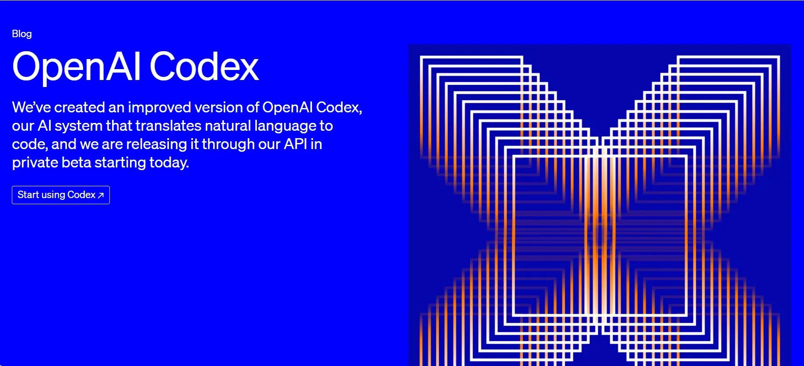

# Codex 封号风波：这次不是偶发，而是风控收紧

这两天，Codex 圈子里最让人焦虑的，不是模型变笨，也不是额度不够，而是**账号突然被踢下线、被要求验证，甚至直接显示停用**。

从 LINUX DO、V2EX 到 OpenAI Developer Community，关于“Codex 账号异常”“登录后被拦截”“莫名被封”的讨论明显增多。对很多重度用户来说，这已经不是单纯的产品波动，而是工作流突然断电[[1]](https://linux.do/t/topic/2291495)。

我的判断很直接：**这波更像是 OpenAI 正在集中收紧 Codex 的风控、验证和使用策略。** 社区反馈很密集，但截至目前，官方还没有发布一篇专门解释“本轮封号”的统一公告[[2]](https://help.openai.com/zh-hans-cn/articles/10562188-why-was-my-openai-account-deactivated)。

读完这篇，你至少能带走两件事：

1. 为什么这轮不像单点 bug，而更像连续收紧。
2. 如果你还在用 Codex，今天最应该先做哪 4 件小事。

> 💡 **一句话总结：** 对普通用户来说，最危险的不是“Codex 不能用了”，而是你已经把它接进工作流，却还没有把账号安全当成工作流的一部分。

---

## 1. 先说结论：这波不是“偶发”，而是连续收紧

从公开讨论看，这轮变化至少有三条线同时发生。

**第一，登录验证变严了。**

LINUX DO 用户反馈，使用 Codex 时会被强制退出，重新登录时需要短信验证；如果老账号没有可用手机号，恢复会变得很麻烦[[1]](https://linux.do/t/topic/2291495)。

**第二，停用提示变多了。**

V2EX 上已经出现“昨天刚开通，今天就被停用”的案例，而 OpenAI 开发者社区也有用户表示自己在正常使用中遭遇封禁[[3]](https://www.v2ex.com/t/1218100)。

**第三，配额策略也同步收紧。**

多家媒体和社区整理显示，Codex 免费与 Go 账户的额度重置周期，近期从按周恢复变成按月恢复，付费层的双倍额度促销也已结束[[4]](http://news.qq.com/rain/a/20260603A04CBJ00)。

这三个信号放在一起看，很难把它理解成单点 bug。

更像是平台在**同时做验证、限额、异常活动识别**三件事。

---

## 2. 为什么这次大家反应特别大？

因为 Codex 已经不是“一个可有可无的新玩具”了。

现在很多开发者已经把它接进了自己的日常工作流：写代码、改脚本、跑 review、做小型自动化。账号一旦异常，受影响的不只是一个聊天入口，而是整套开发节奏[[5]](http://m.toutiao.com/group/7647842182912672310/)。

更关键的是，这一波触发场景看起来并不总是“明显违规”。

社区里有人怀疑，频繁切换账号、会话复用、异常登录环境，甚至某些第三方工具链，都可能被风控系统判定为高风险[[6]](https://linux.do/t/topic/2283110)。

对普通用户来说，最难受的地方在于：

**你未必知道自己到底踩中了哪条线。**

这也是这次讨论会快速扩散的原因。

如果只是某个功能不可用，大家等修复就行。但如果是账号层面的风控，用户最怕的是不确定性：不知道原因，不知道申诉周期，也不知道以后怎么避免。

---

## 3. 官方到底说了什么？

虽然 OpenAI 目前没有专门发文解释“今天为什么一批 Codex 账号被封”，但帮助中心对账号停用的说明，已经给出了一个比较清晰的框架[[2]](https://help.openai.com/zh-hans-cn/articles/10562188-why-was-my-openai-account-deactivated)。

OpenAI 表示，账号被停用，常见原因包括：

- 违反使用政策
- 违反服务条款
- 存在安全风险或未经授权访问
- 反复违规
- 身份验证未完成[[2]](https://help.openai.com/zh-hans-cn/articles/10562188-why-was-my-openai-account-deactivated)

如果用户认为自己被误封，可以通过邮件里的申诉入口，或者官方申诉表单发起 appeal；如果没有收到邮件但已经失去访问权限，也可以通过帮助中心联系支持[[2]](https://help.openai.com/zh-hans-cn/articles/10562188-why-was-my-openai-account-deactivated)。

这段官方表述其实很重要。

它至少说明了一件事：**“被封”未必只对应内容违规，也可能与账号安全、验证失败、异常访问模式有关**[[2]](https://help.openai.com/zh-hans-cn/articles/10562188-why-was-my-openai-account-deactivated)。

另外，OpenAI 最近在介绍 Advanced Account Security 时也明确提到，这组增强账号安全措施会覆盖 Codex 使用场景[[9]](https://openai.com/index/advanced-account-security/)。

这从侧面说明，Codex 已经不只是一个模型入口，而是被放进了更严肃的账号安全体系里。

---

## 4. 这波风控，平台可能在防什么？

结合社区反馈，外界目前最常见的判断主要有三种。

### 1. 防共享与批量切号

如果一个人频繁在多个账号间来回切换，或者在不稳定环境下高频登录，系统更容易把它识别成异常行为。

LINUX DO 上已经有人总结，某些“多号轮换”的使用方式可能会显著提升风险[[6]](https://linux.do/t/topic/2283110)。

### 2. 防异常登录与验证绕过

短信验证突然普及，本身就说明平台正在把“账号归属确认”这件事做得更重。

那些没有历史手机号、或者注册链路不完整的账号，抗风险能力会明显变差[[1]](https://linux.do/t/topic/2291495)。

### 3. 防高成本滥用

额度从宽松走向收紧，往往意味着平台开始更认真地核算资源成本。

配额周期调整、双倍额度结束，再叠加更严格的登录风控，说明 Codex 正在从“抢用户阶段”切向“控成本阶段”[[7]](https://news.sina.cn/bignews/2026-06-02/detail-inhzzqcm1498509.d.html)。

这里要补一句：这些都是基于公开信息和社区反馈的外部判断，不等于官方定性。

但对用户来说，已经足够形成一个行动原则：

> **不要再把账号当成随时可替换的登录壳。Codex 越像生产力基础设施，账号就越像你的工作许可证。**

---

## 5. 普通用户现在最该做什么？

如果你还在用 Codex，今天最值得做的不是焦虑，而是先做 4 件小事。

### 1. 先确认账号资料是否完整

尤其是邮箱、手机号、年龄验证、登录方式是否一致。

这件事听起来很基础，但一旦进入风控或恢复流程，它就会直接影响你能不能快速证明账号归属。

### 2. 减少高频切号和异常环境切换

不要把多个账号在同一套工作流里反复来回倒。

如果你的使用方式看起来像共享、批量、代理或自动化滥用，即使主观上只是“省事”，也可能被系统当成异常模式。

### 3. 谨慎使用来源不明的第三方工具

近期已有安全报道提到，某些打着 Codex 名义的工具可能涉及凭证窃取风险[[8]](https://thenextweb.com/news/a-popular-openai-codex-tool-with-29000-weekly-downloads-has-been-quietly-stealing-developer-tokens-for-a-month)。

如果一个工具要求你交出登录态、cookie、token 或刷新凭证，最好先停下来多想一步。

### 4. 一旦被停用，第一时间走官方申诉渠道

不要只在社区里问“还有救吗”。

先找邮件里的申诉入口，或者通过 OpenAI 帮助中心联系支持，把 appeal 提交出去[[2]](https://help.openai.com/zh-hans-cn/articles/10562188-why-was-my-openai-account-deactivated)。

社区经验可以参考，但真正能恢复账号的，还是官方流程。

---

## 最后想说

这次 Codex 账号风波，本质上不是一句“官方开始封号了”就能概括的。

更准确的说法应该是：**OpenAI 正在明显提高 Codex 的使用门槛。**

验证更重了，额度更紧了，异常行为识别也更敏感了。

对于正规用户，这未必意味着不能继续用；但它确实意味着，过去那些“凑合能跑”的使用方式，接下来可能越来越跑不通了[[1]](https://linux.do/t/topic/2291495)。

如果你把 Codex 当成生产力工具，现在就该把账号安全、登录一致性和使用习惯，当成工作流的一部分。

因为下一次出问题，掉线的可能不是一个窗口，而是你半天的节奏。
