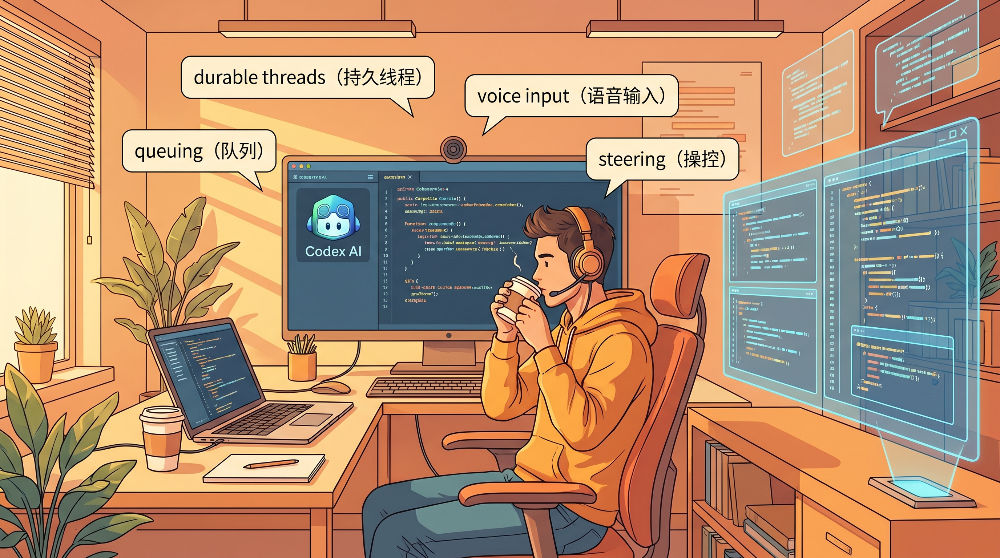
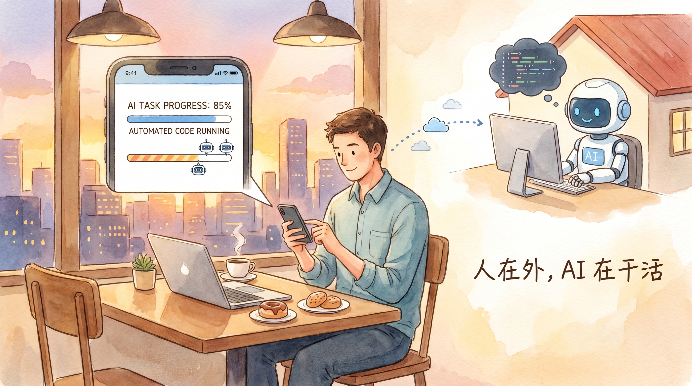
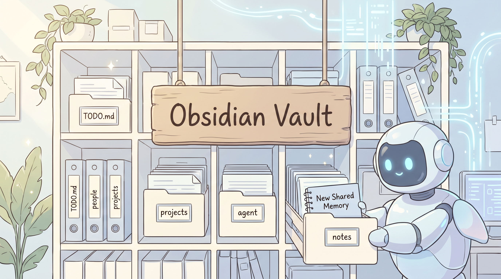

> **作者**：jason（[@jxnlco](https://x.com/jxnlco)） · OpenAI 早期产品工程师
> **原文**：[Getting the most out of Codex](https://x.com/jxnlco/status/2057153744630890620)
> **编译整理**：张泽强

<callout icon="bulb" bgc="5">  
**一句话总结：** 别再把 Codex 当成"代码补全工具"了。它现在已经是一个能帮你**收发邮件、刷网页、控电脑、跑日报、改 PPT、自动迭代到测试通过**的"超级打工人"。这篇文章手把手教你，怎么榨干它。  
</callout>

---

## 🚀 写在前面：你可能正在错过 90% 的 Codex

每次提到 AI 编程助手，大多数人脑子里浮现的画面都是这样的——

> 打开 IDE，输入需求，AI 改两行代码，跑一下测试，提个 PR。完事。

如果你对 Codex 的认知还停留在这里，那只能说：**你正在用十万块的工具，干一千块的活**。

OpenAI 工程师 jason 最近发了一篇万字长文 *Getting the most out of Codex*，11 万人围观、上千次转发。文章里他把 Codex 拆成了 **8 个能力维度**，每一个都在重新定义"AI 助手"这四个字的边界。

读完之后我只有一个感受：**这哪是编程工具？这是一个会主动学习、主动等你、主动汇报的数字员工。**

下面，是这篇神作的中文精华版。



---

## 一、💎 Durable Threads：让 AI"记住你"，而不是每次重开

普通对话 AI 是什么样？开一个新窗口，从零解释一遍背景，再从零提问。**每一次都像在跟一个失忆症患者重新认识。**

Codex 提出了一个新概念——**持久线程（Durable Threads）**。

<callout icon="star" bgc="3">  
**📌 核心定义：** 持久线程 = 一个可以跨多次会话、长期保留工作上下文的"工作空间"。它不是聊天记录，而是一个**正在持续推进的项目**。  
</callout>

jason 给出了 4 种**钉住线程（Pinned Threads）** 的高频用法：

<grid cols="2">  
<column width="50">  
**🧑‍💼 Chief of Staff 线程**  
你的 AI 参谋长，每天帮你过滤 Slack/邮件，告诉你今天最重要的 3 件事。  
  
**📦 Release 线程**  
专门盯着这次发版，记录所有决策、回归问题、上线检查项。  
</column>  
<column width="50">  
**📚 文档评审线程**  
长期跟进一份大文档的修订，每次回来都能从上次中断的地方继续。  
  
**📡 外部监控线程**  
盯一个竞争对手网站、监控一个 API、追踪某条新闻线索。  
</column>  
</grid>

更骚的操作是：用 **Command + 1 ~ 9** 直接跳转到固定线程。**就像你为常用文件设了快捷键。**

> 💡 **思维转变**：从"和 AI 聊一次"到"和 AI 一起经营一份长期工作"。

---

## 二、🎙️ 语音输入：把"想法的草稿"原汁原味喂给 AI

这一段我看完直接拍大腿。

jason 的洞见非常深刻：

<callout icon="speech_balloon" bgc="6">  
**语音真正的价值，不是输入快**——而是**捕捉那个还没有被压缩成漂亮句子的、毛刺粗糙的原始想法**。  
</callout>

举个例子，下面这种话你打字会觉得很尴尬，但说出来非常自然：

> "我记得上周好像有个叫 Ben 的人在 Slack 群里提到过这个事，但我不记得具体细节了，你能去查一下吗？"

对一个能搜索、能整理上下文、能回报结果的 Agent 来说，**这种模糊但真实的描述，反而是最好的输入**。

✨ **延伸玩法**：

- 把 2-3 分钟的"想法 dump"直接录给它，让它去拆解成任务
- 把会议录音转写丢进去，比手写摘要信息量大 10 倍
- 不确定、强调、半截话——这些在语音里被保留下来的"杂质"，恰恰是 AI 理解你真实意图的关键

> 🎯 **一句话原理**：粗糙的真话 > 精致的废话。

---

## 三、🎮 Steering & Queuing：在 AI 飞奔时给它"打方向盘"

这一节是整篇文章的核心暴击。

很多人用 AI 是这样的：发指令 → 等结果 → 不满意 → 重新发指令。**这是 1.0 时代的玩法**。

jason 介绍了两个全新的交互范式：

<table header-row="true" col-widths="120,300,300">  
    <tr>  
        <td>**操作**</td>  
        <td>**Steering（操控）**</td>  
        <td>**Queuing（排队）**</td>  
    </tr>  
    <tr>  
        <td>**何时触发**</td>  
        <td>AI 当前任务进行中</td>  
        <td>当前任务结束后</td>  
    </tr>  
    <tr>  
        <td>**作用**</td>  
        <td>**打断**它，纠正方向</td>  
        <td>**追加**下一个任务</td>  
    </tr>  
    <tr>  
        <td>**典型用法**</td>  
        <td>"这块再小一点"  
"间距感觉不对"  
"这句文案错了"</td>  
        <td>"做完之后把预览链接发给评审人 Slack"</td>  
    </tr>  
    <tr>  
        <td>**心智模型**</td>  
        <td>改变它**正在干**的事</td>  
        <td>规划它**接下来**要干的事</td>  
    </tr>  
</table>

<callout icon="thought_balloon" bgc="9">  
**为什么这件事重要？** 传统的"发指令-等结果"是**异步**的，你和 AI 是**串行**的。而 Steering + Queuing 让你和 AI 变成了**并行**——你像一个导演，AI 像演员，你可以在它表演的过程中实时给戏。  
</callout>

---

## 四、🌐 Tools & Reach：从"写代码"到"操控整个世界"

如果说前面的能力是让 AI 更聪明，**这一节是让它长出手脚**。


Codex 的"触手"由内向外可以分成三层：

<grid cols="3">  
<column width="33">  
**🪟 $browser**  
应用内置浏览器，在侧边栏里直接审查、标注网页。  
</column>  
<column width="33">  
**🌍 @chrome**  
基于你已登录的 Chrome 状态，处理需要登录态的浏览器流程。  
</column>  
<column width="33">  
**🖥️ @computer**  
直接控制桌面 GUI，搞那些只能靠点鼠标完成的事。  
</column>  
</grid>

再往外，是 **MCP Servers + Connectors** 这一整套生态：

<callout icon="bulb" bgc="4">  
**关键洞察：** 很多重要任务在变成代码之前，**首先表现为一条 Slack 消息、一封邮件、一个日程冲突**。Codex 接入 Slack / Gmail / Calendar，意味着它能在"任务还没成型"的最早期就介入。  
</callout>

最后还有一个杀器叫 **Skills**——把一个证明有用的工作流**打包成技能**，下次直接复用，不用每次重新教。

> 🔥 **本质变化**：Codex 从"代码助手"进化成了"**计算机工作的统一系统**"。

---

## 五、📱 Work From Anywhere：Mac 启动，手机续命

`Codex Mobile App` 改变的不是"功能"，而是**你必须坐在桌前的执念**。



典型的小场景：

- 你在 Mac 上启动了一个长任务（文件、权限、本地环境都在）
- 然后你出门买杯咖啡
- 在咖啡馆，手机推送：AI 跑到一半遇到了一个分支选择
- 你回一句"用方案 B"
- 任务继续跑，你继续遛弯

<callout icon="first_place_medal" bgc="11">  
**核心价值：** 本地环境留在原地不动，**人不必留在原地**。这就是"AI 接管 = 人类自由"的真正含义。  
</callout>

---

## 六、⏰ Automations：让 AI 自己醒来，自己干活

这是整篇文章最让我震撼的一节。

普通的"定时任务"大家都见过——每天 9 点跑一次脚本嘛。但 Codex 提出了一个更精妙的概念：**Thread Automations（线程自动化）**。

<callout icon="star" bgc="13">  
**🎯 区别在哪？**   
- **传统定时任务（Scheduled Automations）**：每次都从空白工作区开始，比如每天生成一份日报。  
- **线程自动化（Thread Automations）**：定时回到**同一个还活着的线程**，带着所有上下文继续推进。  
</callout>


来看 jason 给的一个真实指令——**每 30 分钟唤醒一次的 AI 参谋长**：

```
每 30 分钟，检查 Slack 和 Gmail 中需要我关注的未回复消息。
帮我按重要性排好序。
如果有人问我问题，请尽你所能深度调研，并起草一份回复，
但不要替我发送。
```

读到这段的时候我后背发凉——**当我回到办公桌前，最贵的"信息收集 + 起草"工作已经做完了，我只需要做最后的"决定"。**

更骚的玩法：

- 监听 PR 评论 → 发现新评论 → 自动改代码 → 回复评论
- 监听 Google Docs 评论 → 自动调整文档
- 监听 Slack 视频反馈 → 重新渲染动画 → 上传 → 发回原帖 @评审人

> 💎 **本质**：你不在的时候，**工作流不会停下来等你**。

---

## 七、🎯 Goals：给 AI 一条真正的"终点线"

很多人给 AI 下任务，下出来的都是**"伪目标"**：

> ❌ 弱目标："实现这份 markdown 里的计划。"

什么时候算完成？AI 自己也不知道。


jason 给出的**强目标范式**长这样：

> ✅ 强目标：把这个内部工具从 Python 迁移到 Rust。**完成的标志是：单元测试全部通过。**

差别在哪里？**有可验证的成功标准**。

一个好的 Goal = **持续执行 + 验证器**。常见的验证器有：

<grid cols="2">  
<column width="50">  
- 🧪 一套测试用例  
- 📊 一个 benchmark 跑分  
- 🐛 一个可复现的 bug  
</column>  
<column width="50">  
- ✔️ 一份验证矩阵  
- 🔄 一个端到端工作流  
</column>  
</grid>

<callout icon="speech_balloon" bgc="1">  
**金句警告：** "雄心壮志很重要，但**没有验证机制的雄心，就只是个许愿**。"  
</callout>

---

## 八、🪟 The Side Panel：让"产出"和"对话"挨在一起


Side Panel 解决的是一个非常现实的问题：

> 过去你和 AI 协作 = 切来切去窗口。AI 给你一份 PPT，你下载、打开、改、再传回来。**心流被切碎成了一地玻璃渣**。

Side Panel 让产出物**就活在对话旁边**：

1. **审查**（Inspect）：Markdown / 表格 / PDF / 网页 / 幻灯片，原地看。
2. **标注**（Annotate）：在产出物上直接圈出"这里要改"。
3. **操作**（Operate）：网页这种需要交互的对象，可以边看边点。
4. **复盘**（Review）：所有变更，原地比对。

<callout icon="bulb" bgc="12">  
**特别推荐的几种"原地艺术品"：**  
- **index.html** —— 一个文件就是一个永久可交互的产出物，不需要服务器  
- **Storybook** —— UI 组件评审  
- **Remotion Studio** —— 程序化动画  
- **浏览器幻灯片** —— 演示文稿  
- **数据应用** —— 分析工作流  
</callout>

---

## 九、🧠 Shared Memory：让 AI 真正"记住"你的世界

最后这一节，是给"长期主义者"的彩蛋。



仅靠对话历史是不够的，jason 推荐了一个非常实战的模式——**用一个 Obsidian Vault 作为 AI 的长期记忆库**：

```
vault/
├── TODO.md
├── people/
├── projects/
├── agent/
└── notes/
```

在顶层放一个 `AGENTS.md` 文件，告诉 Codex 这个工作区怎么维护。比如：

```markdown
- 把 ~/vault 当作持久工作记忆。
- 优先沉淀到规范笔记，避免笔记泛滥。
- TODO、人物、项目、日报、零散想法分别归位。
- 保留决策、阻塞项、负责人、日期、有用链接。
- 如果没有实质性变化，不要瞎折腾 vault。
```

<callout icon="thought_balloon" bgc="2">  
**Vault 装的是什么？** Repository 装的是**代码**，Vault 装的是**滚动的上下文**：参与的人、变更的历史、阻塞的事、待跟进的项、本来会在两次会话之间消失的所有信息。  
</callout>

> 🎯 **一句话**：重要的上下文不该只活在某条聊天记录里，要写进一个**下一个线程也能继承**的地方。

---

## 🌟 总结：一种新的"控制模型"

读完这篇文章，我意识到 Codex（以及它代表的那一类新一代 Agent）正在重新定义**人机协作的控制范式**：

<table header-row="true" col-widths="180,400">  
    <tr>  
        <td>**新原语**</td>  
        <td>**它做了什么**</td>  
    </tr>  
    <tr>  
        <td>🎯 Steering 操控</td>  
        <td>打断**正在进行**的工作</td>  
    </tr>  
    <tr>  
        <td>📋 Queuing 排队</td>  
        <td>规划**接下来要做**的工作</td>  
    </tr>  
    <tr>  
        <td>⏰ Thread Automations</td>  
        <td>你**离开**时让线程继续活着</td>  
    </tr>  
    <tr>  
        <td>🏁 Goals 目标</td>  
        <td>给一条 Codex **可以反复冲击**的终点线</td>  
    </tr>  
</table>

<callout icon="first_place_medal" bgc="8">  
**收尾金句：** Codex 仍然从"写代码"开始。但围绕代码的所有工作——浏览器、桌面、自动化、可审查的产出物——现在都通过同一个系统触手可及。**它能把一个工作流从指令、到执行、到产出物评审，一路接住，哪怕这份工作早就溢出了代码仓库的边界。**  
</callout>

---

## 💬 写在最后

读完这篇文章，我突然有一种久违的"激动感"。

**它不是又一个新功能列表，而是一套全新的工作哲学。**

如果你还在用"问答式"的方式使用 AI——发问题 → 等答案 → 复制粘贴——那你大概率正在用直升机的钱，享受自行车的体验。

下次打开 Codex（或者任何同级别的 Agent）的时候，问自己三个问题：

1. **我能不能把这件事做成一个"持久线程"，而不是一次性对话？**
2. **我能不能给它一个明确的"终点线"，让它自己去逼近？**
3. **我能不能让它自己定时醒来，把信息整理好等我回来？**

如果三个答案都是 **Yes**，恭喜你——你已经从"使用 AI"，升级成了"**雇佣 AI**"。

---

<callout icon="bulb" bgc="3">  
**📚 延伸阅读 / Codex 官方资源：**  
- [Codex App 功能总览](https://developers.openai.com/codex/app/features/)  
- [Codex 自动化（Automations）](https://developers.openai.com/codex/app/automations)  
- [Codex 内置浏览器](https://developers.openai.com/codex/app/browser)  
- [Codex Skills](https://developers.openai.com/codex/skills)  
- [Codex Memories](https://developers.openai.com/codex/memories)  
- [原文 Twitter 链接](https://x.com/jxnlco/status/2057153744630890620)  
</callout>

> 💌 **如果觉得有用，欢迎转发给身边那个还在用"代码补全"思路用 Codex 的朋友。**
> 🎁 **下一篇我们聊聊：怎么基于这套思路，搭一个属于自己的"AI 工作流"。**
