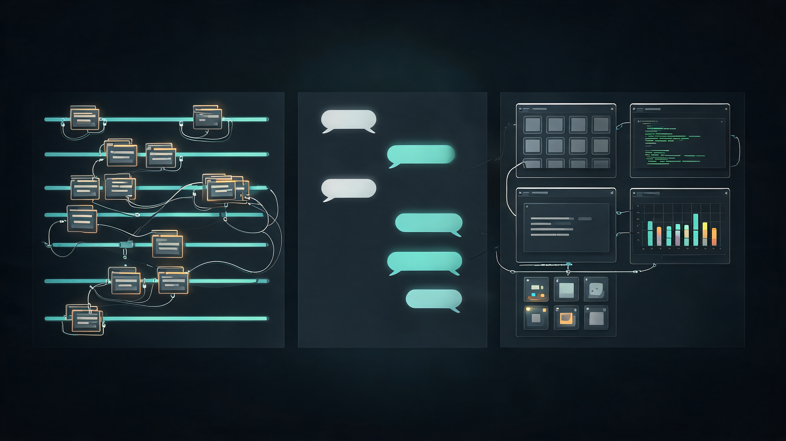
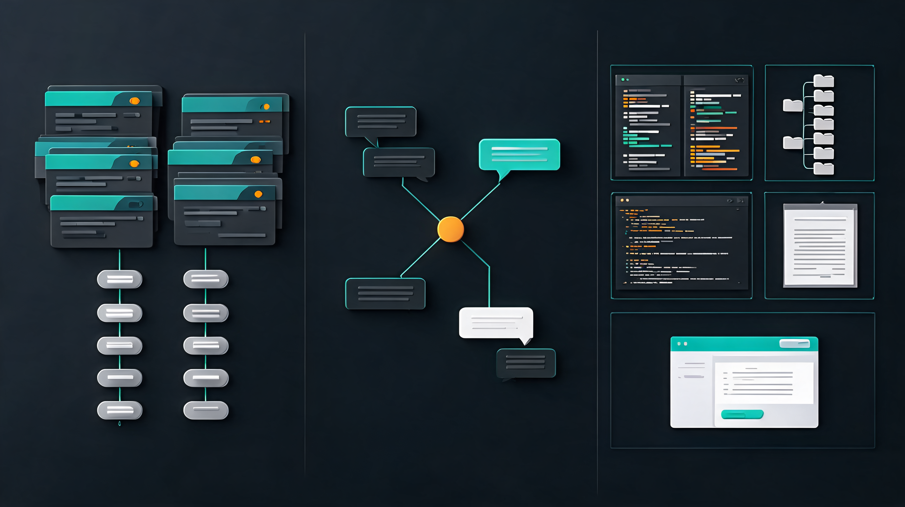

# Codex 真正想做的，不是 IDE，而是 Agent 时代的 App Store

最近这几个月，如果你同时用 Codex App、Claude Code Desktop、Cursor、TRAE SOLO，会有一个很强烈的感觉：

这些产品明明来自不同公司，底层模型不同，产品团队也不可能提前开会，但它们正在长成同一种东西。

左边是项目、任务和会话列表；中间是你和 Agent 的对话；右边是文件、终端、预览、Diff、文档、网页和各种工具面板。

这不是巧合，也不只是界面设计的趋同。

我的判断很直接：**Agent 产品正在从“聊天工具”变成“工作系统”，而右侧工作区就是这个新系统的入口。Codex 真正想做的，也不是另一个 IDE，而是 Agent 时代的 App Store。**

> 📌 **一句话判断**：模型竞争还在继续，但 Agent 产品真正的战场，已经从“谁更会回答”转向“谁能承接完整工作流”。

读完这篇，你至少能带走 3 个判断：

1. 🧩 为什么所有顶尖 Agent 都在往三栏工作台收敛。
2. 🔌 为什么 MCP 和 Skill 都很重要，但都只解决了一半问题。
3. 🧭 为什么下一波机会不在“再做一个通用 Agent”，而在给 Agent 平台补上最后一公里插件。

## 1. 🧩 三栏界面不是审美选择，而是 Agent 分工变了

传统 Chatbot 只需要两栏。

左边放历史会话，右边放聊天窗口。你问一句，它答一句。最多生成一段文案、一段代码、一个表格。任务结束以后，用户拿走结果，去别的地方继续处理。

但 Agent 不一样。

Agent 不只是回答问题，它会读文件、写代码、跑命令、调用外部工具、改 PPT、查数据、生成网页。它开始真的“动手”以后，用户就不可能只看聊天记录了。

你必须看到它改了什么、生成了什么、跑出了什么结果。

于是右侧工作区出现了。

一开始，这个区域只是验收区。看看 Diff，看看预览，确认 Agent 有没有搞错。它像一个透明窗口，让用户能盯住 Agent 的手。

但现在这个窗口正在变成另一种东西。

OpenAI 在 2026 年 4 月 16 日发布的 Codex 大版本里，把重点放在“软件开发全生命周期”的工作区能力上：GitHub review comment、多终端标签、SSH 远程 devbox、PDF / 表格 / 幻灯片 / 文档预览、Summary pane 等能力，都被放进了同一个 workspace。

Anthropic 4 月 14 日重做 Claude Code Desktop，也几乎是同一个方向：多会话侧边栏、可拖拽工作区、内置终端、文件编辑器、Diff viewer、HTML / PDF 预览。

Cursor 3.0 则把 Agent Tabs 放进编辑器，把 Agent 从“侧边栏里的助手”推到更核心的位置。

TRAE SOLO 的官方表达更直白：AI 过去是工具里的一个功能，现在工具变成了 AI 可以编排的组件。

这些更新放在一起看，信号很明显：

**Agent 产品的中心，不再是“聊天框”，而是“人如何监督、调整、验收和继续推进 Agent 的工作”。**

这也是三栏为什么会成为当前最优解。

左边解决任务切换，中间解决意图沟通，右边解决结果操作。它对应的不是 UI 分区，而是 Agent 时代新的工作分工：

1. 人提出方向。
2. Agent 执行过程。
3. 人在工作区里做判断和微调。

如果没有第三步，Agent 再强也很难进入真实工作。

*三栏不是装饰，而是 Agent 工作流开始闭环的结果。*

## 2. ✂️ 右侧工作区正在吞掉旧软件的“最后 5%”

很多人低估了最后 5%。

> ✂️ **最后 5% 的本质**：不是 AI 不够聪明，而是人必须保留最终判断权。

AI 写一篇文章，90% 可以很快；但最后那个标题能不能再狠一点，某个段落的语气要不要收一点，一个判断该不该改成更克制的表达，往往只有人自己知道。

AI 做一个 PPT，主体内容可以生成；但某页的图是不是太挤，副标题是不是挡住重点，客户名字能不能换成更稳妥的说法，最后还是要人手动调。

AI 写代码也一样。它能写完功能，能跑测试，但你临上线前想改一个命名、调一个边界、删一个不舒服的抽象，这些小动作并不总值得再发一轮 prompt。

过去的工作流是：

Agent 生成结果，你切到 VSCode、PowerPoint、Excel、Markdown 编辑器或浏览器里改。

这个流程看起来没什么，但它有一个致命问题：**它把 Agent 工作流重新切回了旧软件工作流。**

只要用户还必须频繁离开 Agent，Agent 就不是工作中心，只是一个更聪明的外包助手。

所以今天各家都在加强右侧工作区，本质不是为了让界面更丰富，而是为了把那最后 5% 留在 Agent 产品里完成。

这一步一旦跑通，Agent 的位置就变了。

它不再只是“帮你生成初稿的地方”，而会变成“你完成整件事的地方”。

**谁能把生成、预览、验收、微调、发布放在同一个工作闭环里，谁就更接近下一代工作入口。**

这也是我觉得 Codex 野心很大的地方。

“Codex for almost everything”如果只理解成广告语，会觉得夸张。但如果从工作区看，它其实是在说另一件事：

Codex 不想只做写代码的 Agent，它想成为各种专业任务的统一工作台。

代码只是第一个入口。后面会有文档、表格、幻灯片、研究报告、设计稿、数据看板、法务审阅、运营素材、知识库更新。

问题是，要吃下这些场景，Codex 不可能自己做完所有专业编辑器。

它也不应该这么做。

## 3. 🔌 MCP 解决连接，Skill 解决流程，但用户编辑还悬在半空

现在 Agent 能力拼图里，最重要的两个词是 MCP 和 Skill。

MCP 解决的是“连接”。

Anthropic 在 2024 年发布 MCP 时，核心目标就是让 AI assistant 能通过统一协议连接外部数据源和工具。你可以把它理解成 Agent 世界里的连接标准：数据库、GitHub、Slack、Google Drive、Postgres、浏览器，都可以通过 MCP 被 Agent 调用。

Skill 解决的是“怎么做”。

Anthropic 对 Agent Skills 的定义里，一个关键点是 progressive disclosure：不是把所有知识一次性塞进上下文，而是先让 Agent 看到技能的元信息，真正需要时再读取对应的 SKILL.md、脚本、参考资料和模板。

OpenAI 在 Codex 的说明里也用了一个很容易懂的比喻：Skill 像 playbook，教 Codex 按你、你的团队或公司的方式做事。

所以可以简单分一下：

- 🔌 **MCP** 让 Agent 接得上工具。
- 📚 **Skill** 让 Agent 做得像你的流程。

这两件事都很关键。

但它们仍然没有完整解决一个问题：**当结果已经生成，用户要亲自改一改时，在哪里改？怎么改？改完以后 Agent 怎么理解？**

这不是小问题。

一个数据工具通过 MCP 查出几百行数据，Agent 可以总结，但用户可能想自己筛选、排序、点击异常点。一个合同审阅工具可以标红条款，但法务可能要逐条点选“接受 / 驳回 / 需要补充”。一个选题工具可以生成 20 个标题，但创作者更想在一个可拖拽、可对比、可收藏的界面里慢慢挑。

这些交互如果都靠聊天完成，就会非常笨。你不断说“只看上周”“按转化率排序”“打开第 47 行”“这个不要，那个留下”，本质上是在用自然语言模拟鼠标。

所以 MCP Apps 的出现很关键。

2026 年 1 月，MCP 官方宣布 MCP Apps 成为第一个正式扩展。它允许工具不只是返回文本和结构化数据，还可以返回可交互 UI：仪表盘、表单、可视化、多步骤工作流、文档审阅界面。用户在界面里点击、筛选、选择，模型也能看到这些操作带来的上下文变化。

这其实补上了 Agent 工作流里最关键的一块：

**Agent 负责生成和理解，人负责直接操作和判断，UI 负责承接最后的精细动作。**

MCP Apps 不是“给聊天窗口加点漂亮组件”，而是在把 Agent 从语言交互推进到操作交互。

这一步非常大。

*MCP 解决连接，Skill 解决流程，UI 承接操作，插件市场负责分发。*

## 4. 🧱 插件生态不是功能市场，而是 Agent 的新分发层

如果把 MCP、Skill、MCP Apps 放在一起看，下一步几乎自然浮现出来：

插件。

不是过去那种简单的“装个小工具”，而是一个可以同时打包几类东西的 Agent 插件：

1. 📚 **Skill**：告诉 Agent 按什么流程做。
2. 🔌 **MCP / Connector**：让 Agent 接入哪些工具和数据。
3. 🖼️ **UI / App**：给用户一个能直接操作的界面。
4. ⚙️ **后端服务**：承载账号、权限、数据、计费和专业能力。

这才是真正的 Agent 版 App Store。

OpenAI 现在已经在 Codex 里给出了一个很初级的方向。官方 Academy 页面里，Plugins 被解释为让 Codex 连接其他工具和信息源，Skills 则是让 Codex 遵循某个团队的流程；用户可以在 Codex 左上角进入插件和技能库，也可以创建自己的插件或技能。

这还远远不是成熟市场。

但方向已经很清楚了。

以后一个写作者插件，可能不只是告诉 Agent “按我的风格写文章”，而是同时包含选题研究 Skill、公众号 / 小红书 / Notion 连接、标题对比界面、封面图审阅和发布前检查。

一个数据分析插件，也不只是“帮我查数据库”，而是把数据源、指标口径、交互图表、报告模板、权限审计和定时提醒放在一起。

一个法务插件，也不只是“总结合同风险”，而是把合同解析、条款高亮、批注界面、版本对比、审批流和内部条款库打包成一个可操作的工作面板。

到了这个阶段，插件就不是简单增强 Agent 能力，而是在 Agent 工作台里嵌入一个个专业软件的最小可用形态。

这就是为什么我说 Codex 真正想做的不是 IDE。

IDE 是软件开发者的工作空间。

Agent App Store 是所有专业任务的工作空间。

## 5. 💰 Skill 很难商业化，插件才有真正护城河

这里还有一个特别现实的问题：Skill 很难商业化。

Skill 的本质是方法、说明、模板、脚本和参考资料。它非常有用，但也非常透明。

一个好 Skill 被人看懂以后，复刻成本很低。甚至让另一个 Agent 读一遍，再写一个类似版本，也并不难。

这不是说 Skill 没价值。恰恰相反，Skill 会成为 Agent 时代最重要的知识封装方式之一。

但它天然更像开源知识、团队资产、方法沉淀，而不太像可以长期收费的软件产品。

插件不一样。

插件可以把 Skill 放进一个更完整的产品里，把价值转移到更难复制的地方：独家数据源、复杂后端服务、专业 UI、权限审计、协作流程、持续更新的行业规则库，以及账号和计费能力。

用户不是为一段 prompt 付费，而是为“这个插件让我把一件专业工作完成得更顺手”付费。

这就是 App Store 和 Chrome 插件市场已经验证过的逻辑。

免费插件可以带来生态活跃，收费插件可以让开发者持续维护，平台负责分发、审核、权限、更新和支付。

Agent 插件市场也绕不开这一套。

不过这里必须补一句冷水：插件生态真正跑起来之前，安全和信任会先成为大问题。

Skill 和 MCP 生态越开放，供应链风险就越大。最近几篇关于 Agent Skills 和 MCP 的研究已经反复提到类似问题：公开市场里的 Skill 存在冗余、系统级操作风险、恶意或误报分类问题；MCP 在生产环境里也还缺少身份传递、工具预算、结构化错误等更成熟的治理机制。

所以成熟的 Agent App Store 不能只靠“谁都能上传”。

它至少需要 5 个基础设施：🔐 权限模型、🧪 沙箱隔离、🪪 审核签名、↩️ 可撤销机制、💳 收费分成。

插件能读什么、写什么、调什么工具，要清清楚楚；用户要知道自己装的是什么、来自谁、有没有被篡改；平台也要能在出问题时下架、禁用、回滚。

没有这五件事，插件市场只会变成另一个“脚本集市”。

有了这五件事，它才可能变成真正的生态。

## 6. 🏁 谁会先跑通？我更看好“工作台 + 标准 + 分发”三件套

那最后会是哪家先跑通？

我不觉得答案只取决于模型。

模型当然重要，但 Agent 插件生态的胜负，取决于三件事：

第一，🧱 工作台够不够强。

用户愿不愿意在这里停留，能不能从任务开始一直做到验收和微调。如果工作台只能看结果，不能改结果，用户迟早还是会回到旧软件。

第二，🌐 扩展标准够不够开放。

开发者不愿意为每个平台重写一遍插件。谁能让 Skill、MCP、MCP Apps、后端服务以更稳定的方式组合起来，谁就更容易吸引开发者。

第三，🪪 分发和信任够不够成熟。

市场、审核、权限、企业管理、收费、推荐机制，这些看起来不性感，但真正决定生态能不能长期转起来。

从这个角度看，Codex 有机会。

它有 Codex App 工作台，有 OpenAI 的模型和分发，有 Skills 和 Plugins 的产品入口，也有 ChatGPT Apps SDK 和 MCP Apps 这条 UI 标准化路线的经验。

但这不是板上钉钉。

Claude 的优势是 MCP 和 Skills 这套叙事非常早，而且 Claude Code Desktop 已经把文件编辑、终端、Diff、预览这些能力直接做进工作台。

Cursor 的优势是开发者已经每天待在 IDE 里，Agent 进入工作区天然顺手。

TRAE SOLO 的优势是它更敢把“AI 工作台”讲成一个完整空间，而不是传统 IDE 的附属功能。

所以未来一段时间，竞争不会是“谁的聊天框更聪明”，而是：

**谁能让用户少切一次软件，谁就多拿走一点工作入口。**

## 7. 🧭 中小团队的机会，不是做 Agent，而是做 Agent 的最后一公里

如果你是中小团队，现在最值得看的机会不是“再做一个通用 Agent”。

这条路太挤，也太烧钱。

更现实的机会，是在 Codex、Claude、Cursor、ChatGPT 这类平台上做插件。

你不需要自己训练模型，不需要自己做 Agent 调度，不需要自己教育用户“什么是 Agent”。你只需要找到一个高频、具体、结果可验证的专业场景，把最后一公里做深。

比如自媒体的选题、改稿、封面、排版、发布前检查；咨询顾问的访谈纪要、PPT 草稿、数据图表、客户报告；法务的合同标注、条款比对、风险意见、审批流；电商运营的商品分析、竞品监控、详情页优化、投放复盘；开发团队的 PR 复核、测试补齐、发布说明、事故复盘。

*真正的机会往往藏在“AI 生成之后，人还要反复微调”的地方。*

这些场景的共同点是：

1. 🔁 用户已经在用 AI 生成初稿。
2. 🪡 但最后验收和微调很痛。
3. 💬 通用聊天框不够顺手。
4. 🧰 专业软件太重。
5. 🧩 插件刚好能补中间那块。

我会建议中小团队按这个顺序判断一个插件机会：

第一，📦 先找“高频产物”，不是找宏大需求。

别上来就说“我要做企业 AI 助手”。先问：用户每周都要生成什么？公众号文章、投研周报、销售邮件、合同批注、运营复盘、代码审查、短视频脚本，越具体越好。

第二，📝 把流程先写成 Skill。

如果一个流程连文字都写不清楚，就别急着做插件。Skill 是最便宜的原型，可以先验证这个工作流是否真的稳定、是否能被 Agent 复用。

第三，🔌 把数据和工具接成 MCP。

用户不想每次复制粘贴资料。能从真实系统里取数，插件才会从“玩具”变成“工作流”。

第四，🖱️ 把用户必须亲自判断的地方做成 UI。

凡是需要点击、筛选、拖拽、对比、勾选、批注的地方，都不应该硬塞进聊天。这里才是插件的产品价值。

第五，💳 把收费放在服务、数据、协作和结果保障上。

不要指望卖 prompt。卖 prompt 很难有护城河。真正能收费的是更稳定的结果、更少的返工、更可靠的权限、更懂行业的工作流。

这条路不会永远有红利。

平台早期缺插件，用户愿意试，开发者也容易被看见。等市场成熟以后，入口、排名、评价、品牌都会固化，后来者就只能打存量竞争。

所以我同意一个判断：窗口期不会太久。

## 8. 🌊 最后，Agent 时代的操作系统可能长得不像操作系统

很多人一听“Agent OS”，就会想到传统操作系统：桌面、文件夹、窗口、应用图标。

但下一代工作入口未必长这样。

它可能就是一个三栏 Agent 工作台：

左边管理任务，中间沟通意图，右边承载插件。

你不再主动打开 20 个软件，而是告诉 Agent 你要完成什么。Agent 调工具、调数据、调插件，把需要你判断的部分呈现在右侧。你做选择、做微调、做最终确认。

这不是软件消失了。

而是软件从“用户主动打开的应用”，变成了“Agent 按任务调用的能力模块”。

这句话也许可以作为这篇文章最重要的判断：

**AI Agent 的终局，不是替你聊天，而是替你重组软件。**

> 🚀 **带走这句话**：MCP 解决连接，Skill 解决流程，MCP Apps 解决交互，插件市场解决分发和商业化。

这四件事拼起来，才像一个真正的平台。

Codex 的野心也在这里。

它当然还没有完全做到。今天的 Codex 还不能在工作区里顺手编辑所有生成结果，插件市场也还早，安全、权限、收费、审核都还要补课。

但方向已经摆出来了。

如果 OpenAI 继续往前推，Codex 就不只是一个写代码工具，而会变成一个新型工作台。  
如果它在插件生态上犹豫，错过的可能不是一个功能，而是下一代软件入口。

未来几年，我们可能会看到一个很有意思的变化：

以前软件公司争的是“用户每天打开谁”。  
以后 Agent 平台争的是“用户完成任务时调用谁”。

这场竞争才刚开始。

你觉得第一个跑通 Agent 插件生态的会是谁？是 Codex、Claude、Cursor，还是某个现在还不起眼的新平台？

---

资料参考：

- OpenAI：《[Codex for (almost) everything](https://openai.com/index/codex-for-almost-everything/)》
- OpenAI Academy：《[Plugins and skills](https://openai.com/academy/codex-plugins-and-skills/)》
- Anthropic：《[Introducing the Model Context Protocol](https://www.anthropic.com/news/model-context-protocol)》
- Anthropic：《[Redesigning Claude Code on desktop for parallel agents](https://claude.com/blog/claude-code-desktop-redesign)》
- Claude Docs：《[Agent Skills](https://platform.claude.com/docs/en/agents-and-tools/agent-skills/overview)》
- Cursor：《[Cursor 3.0 Changelog](https://cursor.com/changelog/3-0)》
- Model Context Protocol Blog：《[MCP Apps - Bringing UI Capabilities To MCP Clients](https://blog.modelcontextprotocol.io/posts/2026-01-26-mcp-apps/)》
- OpenAI Help Center：《[Build with the Apps SDK](https://help.openai.com/en/articles/12515353-build-with-the-apps-sdk)》
- arXiv：《[Agent Skills for Large Language Models](https://arxiv.org/abs/2602.12430)》
- arXiv：《[Bridging Protocol and Production](https://arxiv.org/abs/2603.13417)》

*AI 辅助资料整理与结构起草，人工判断、改写和审核。*
