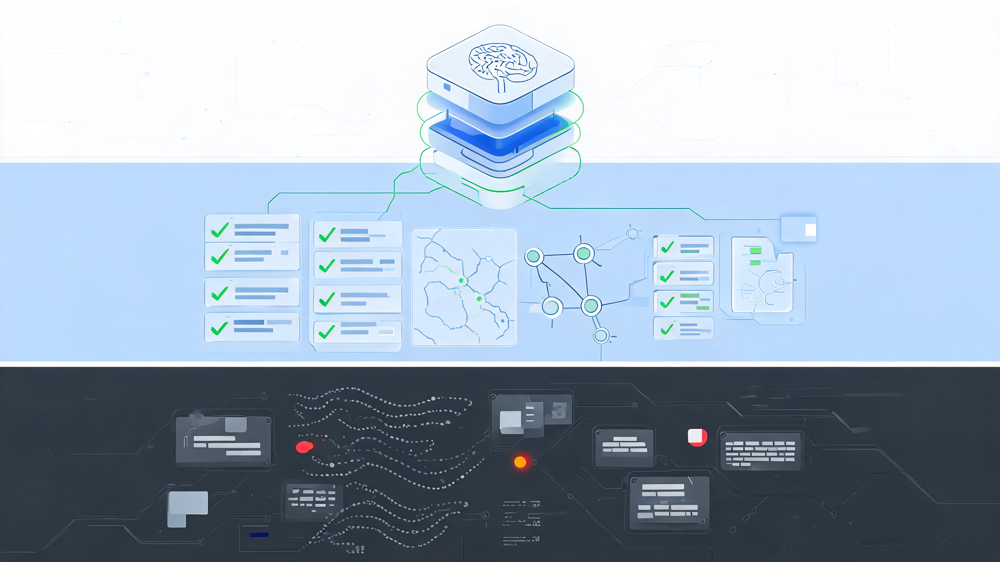
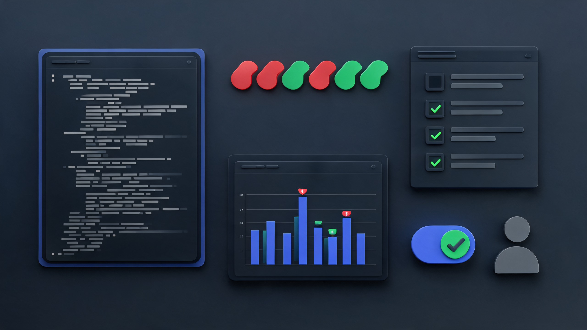

# 十年工程经验，正在被压缩成一行命令


今天凌晨刷到 AYi 的一条长帖，里面提到 Greg Brockman 转发了一个社区开发者做的 Codex Skill：`codex-complexity-optimizer`。

这个工具本身不复杂：安装以后，让 Codex 扫描代码库，找 O(n²)、O(n*m)、N+1、重复扫描、渲染重计算这类复杂度和性能热点，然后给出文件、行号、当前复杂度、优化后复杂度、风险等级和需要补的测试。

但我觉得这件事真正值得写，不是因为它又多了一个性能优化工具。

我的判断是：**AI 编程正在从“帮你写代码”，进入“帮你看见问题”的阶段。**

这两个阶段差别很大。

写代码解决的是产出速度；看见问题解决的是工程判断。前者可以靠模型能力快速拉平，后者过去长期藏在资深工程师的经验、事故记忆和肌肉反应里。

读完这篇，你至少能带走三个判断：

1. 为什么性能优化过去一直是团队里的稀缺能力。
2. 为什么 Codex Skill 这类东西，会把经验从“个人手艺”变成“团队接口”。
3. 普通开发者和团队接下来应该怎么用这类诊断型 Skill，而不是被它带着跑。

> 📌 **一句话判断**：写代码的速度被模型拉平以后，看见问题的能力，才是下一层生产力。

## 1. 这个工具很小，但信号很大

先把事实说清楚。

`codex-complexity-optimizer` 不是 OpenAI 官方产品，而是社区开发者 Kappaemme 做的一个开源 Codex Skill。

根据 npm 和 GitHub 信息，这个包在 2026 年 5 月 15 日发布 0.1.0 版本，GitHub 仓库同日创建。截至我整理资料时，它在 GitHub 上有 254 个 Star、9 个 Fork，许可证是 MIT。

安装方式也很轻：

```bash
npx --yes codex-complexity-optimizer
```

安装完成后，它会把 Skill 放到 Codex 的 skills 目录里。然后你可以在 Codex 里说：

```text
Use $complexity-optimizer to analyze this codebase and give me a report.
```

它默认做一件非常克制的事：**只报告，不改代码。**

这点很重要。

很多 AI 编程工具一上来就想帮你改，甚至想直接替你重构。但性能优化最怕的不是“改得慢”，而是“改得自信却不理解业务行为”。

一个排序规则、一个分页条件、一个权限过滤、一个缓存失效点，都可能让所谓优化变成线上事故。

所以这个 Skill 真正漂亮的地方，不是它宣称能把 O(n²) 变成 O(n)，而是它把问题拆成了工程团队真正需要的报告形态：

- 哪个文件、哪一行可能有问题。
- 当前模式为什么可能慢。
- 复杂度大概是什么。
- 推荐改法是什么。
- 改完复杂度可能降到哪里。
- 风险等级是多少。
- 上线前应该补哪些测试或基准。

这不是“AI 替你拍脑袋”，而是“AI 先把你做判断需要的材料摆好”。



## 2. 性能优化稀缺，不是因为工具少

很多团队并不缺工具。

Chrome DevTools、Node `--prof`、perf、火焰图、APM、日志、慢查询、benchmark，工具一直在那里。

问题是，工具只告诉你“哪里有烟”，不负责告诉你“火为什么烧起来”。

一个真正靠谱的性能诊断，通常需要三层能力叠在一起：

第一层是工具能力。

你得知道怎么抓 profile，怎么看火焰图，怎么区分 CPU、IO、网络和渲染瓶颈。

第二层是复杂度直觉。

你得能在一堆看似正常的业务代码里，看出这个循环里每次都全表扫描，那个组件每次渲染都重算大列表，这个接口每条记录都查一次数据库。

第三层是事故经验。

你得知道某些代码在 100 条数据时没有感觉，在 10 万条数据时会突然炸；某些优化在 demo 里很好看，上线以后会破坏排序、权限、幂等或缓存一致性。

这三层叠起来，就是为什么团队里总有少数人会被默默依赖。

他们不是比别人多会几个快捷键，而是脑子里有一张隐形地图：哪些地方最可能出事，哪些看似优雅的代码在真实流量下会变形，哪些“优化建议”其实风险更大。

过去，这种能力很难复制。

你可以写文档，可以做 Code Review，可以开分享，但最后能不能在陌生代码里闻到那个味儿，还是靠年头、项目密度和踩坑数量。

这也是这类 Skill 的信号意义所在：

**它不是把资深工程师替换掉，而是第一次把资深工程师的一部分诊断路径，封装成了可调用、可复用、可审计的工作流。**

## 3. Skill 的本质，是把经验写进流程

OpenAI 在 Codex 文档里对 Skills 的定位很清楚：它是一种可复用工作流的 authoring format。一个 Skill 通常由 `SKILL.md`、可选脚本、参考资料和模板组成。

更关键的是，它采用 progressive disclosure。

也就是说，Codex 平时只看到 Skill 的名字、描述和路径；真正判断这个任务需要用它时，才读取完整的 `SKILL.md`、脚本和参考资料。

这和我们以前写 prompt 很不一样。

以前你想让 AI 按你的方式干活，需要把一大段规则、背景、检查清单都塞进对话里。下次换一个任务，还得再塞一遍。

Skill 的变化在于：**经验不再只是一次性的提示词，而可以沉淀成工具化的流程资产。**

`complexity-optimizer` 这个例子刚好很典型。

它不只是说“帮我优化性能”，而是在 Skill 里写清楚了默认行为：

- 先建立基线，识别语言、框架、测试命令和性能敏感路径。
- 扫描常见复杂度热点，但把 scanner 输出当线索，不当结论。
- 报告优先，不默认修改文件。
- 真要修改时，先找测试，确认行为，再做局部优化。
- 优化后必须跑相关测试，必要时补 benchmark。

这就是资深工程师平时做事的顺序。

不是看到嵌套循环就开改。

而是先问：这里的数据规模够不够大？调用路径热不热？输出顺序有没有被依赖？对象引用会不会被共享？缓存有没有失效策略？数据库批量查询会不会破坏租户、权限、软删除、分页和排序？

这些问题，才是性能优化里真正昂贵的部分。



## 4. AI 编程的下一步，不是更快生成，而是更会审查

过去两年，AI 写代码的叙事太容易被“速度”绑架。

谁能一分钟生成一个页面，谁能一轮写完一个 API，谁能自动补测试、自动修 bug、自动提 PR。

这些当然有价值。

但如果你真的在真实项目里用过 AI，就会知道开发瓶颈很少只是“我不会写这一段代码”。

更常见的瓶颈是：

- 这个改法会不会影响历史行为？
- 哪个模块才是问题源头？
- 这个慢是算法问题、数据库问题、渲染问题，还是数据结构问题？
- 这个优化值不值得做？
- 改完以后应该怎么证明没有破坏业务？

这些问题，本质上是审查能力。

OpenAI 在 GPT-5.3-Codex 的发布里也强调了这个方向：Codex 不只是写代码和 Review 代码，而是进入调试、部署、监控、测试、指标等软件生命周期的更多环节。

这意味着 AI 编程工具的核心价值会继续往前挪。

一开始，它像一个更快的打字员。

后来，它像一个能完成任务的执行者。

下一步，它会越来越像一个随时待命的审计员、放大镜和工程副驾驶。

它不一定比最顶尖的人类专家更懂你的业务，但它可以把许多原本依赖个人经验的检查项，变成每个项目都能跑一遍的流程。

这就是“Skill 化”的意义。

工具本身会过时，某个 scanner 也可能不准，但把经验变成可执行流程这件事，不会过时。

## 5. 资深开发者的护城河没有消失，只是换了位置

所以，这会不会削弱资深开发者的价值？

我的看法是：会削弱一部分，但不会消灭。

被削弱的是“只有我看得出来”的信息差。

过去你能一眼看出 N+1，别人看不出来；你知道这里要先建 Map，别人还在循环里 `find`；你知道某个渲染路径不能每次重算，别人只觉得页面偶尔卡。

这些经验一旦被封装成 Skill，就会更容易被团队复用。

但真正的护城河会移动到另一个位置：

**未来更稀缺的不是看见问题，而是判断 AI 给出的解释和方案能不能在你的业务里落地。**

比如 AI 告诉你可以把数组查找改成 Map。

你还要判断：

- 这个 key 是否真的唯一？
- 数据顺序是否需要保留？
- 是否存在同名但不同含义的记录？
- 这段代码有没有依赖对象引用变化？
- 多出来的内存成本是否可接受？

AI 告诉你可以批量查询。

你还要判断：

- 权限过滤是否仍然正确？
- 分页和排序有没有被改变？
- 软删除、租户隔离、审计日志有没有被绕过？
- 失败重试会不会放大副作用？

这些判断，不会因为 Skill 出现就自动消失。

相反，AI 把更多问题暴露出来以后，人类工程师要做的判断会更集中，也更关键。

这对新人是好事。

因为新人第一次有机会在真实代码库里看到“资深工程师会盯哪些地方”。

这对资深工程师也是好事。

因为你可以把自己反复做的检查沉淀下来，让团队每次上线前都多一层自动诊断，而不是靠你一个人在 Review 里四处救火。


## 6. 真正该做的，不是马上全自动优化

如果你想试这类 Skill，我建议从三个很小的动作开始。

**第一步，只跑报告，不自动改。**

找一个你熟悉的项目，让它先扫一遍。不要急着接受所有建议，只看它能不能指出你已经知道的问题，以及能不能发现一两个你没注意到但值得检查的点。

**第二步，只挑一个低风险热点做验证。**

不要一口气改十个地方。挑一个输入输出清楚、测试容易补、业务风险低的位置，让 Codex 帮你实现优化，然后跑测试，最好补一个小 benchmark。

**第三步，把你自己的检查清单写成 Skill。**

这才是更值得做的事。

每个团队都有自己的隐性经验：

- 上线前必须检查哪些配置。
- 哪些接口最容易出权限问题。
- 哪些依赖升级最容易破坏兼容。
- 哪些组件一改就容易引发渲染抖动。
- 哪些数据口径经常被新人误用。

这些东西不要只躺在资深同事脑子里，也不要只散落在飞书文档和 Slack 旧消息里。

把它们写进 Skill。

让 AI 每次做相关任务时都能自动加载这套流程。

这才是这件事真正让我兴奋的地方。

不是因为一个社区工具突然能解决所有性能问题。

而是因为我们终于看到一种很具体的可能性：**经验可以不再只靠人传人，也可以被封装、分发、调用和持续迭代。**

未来的工程团队，可能不会只比谁模型用得更猛。

更重要的是，谁能把自己的工程经验沉淀成一套套可复用的 Skill。

写代码会越来越便宜。

但把正确的问题暴露出来，把风险讲清楚，把验证路径设计好，仍然很贵。

所以我会把这件事当成一个小但很明确的信号：

AI 编程的下一站，不是“人人都能写更多代码”。

而是“更多人可以借到一部分资深工程师的眼睛”。

这才是真正改变团队生产力的地方。

---

资料来源：AYi 对 Greg Brockman 转发内容的评论、Kappaemme 的 `codex-complexity-optimizer` 项目与 npm 包、OpenAI Codex Skills / Plugins / GPT-5.3-Codex 相关官方说明。详细链接见 `sources.md`。
