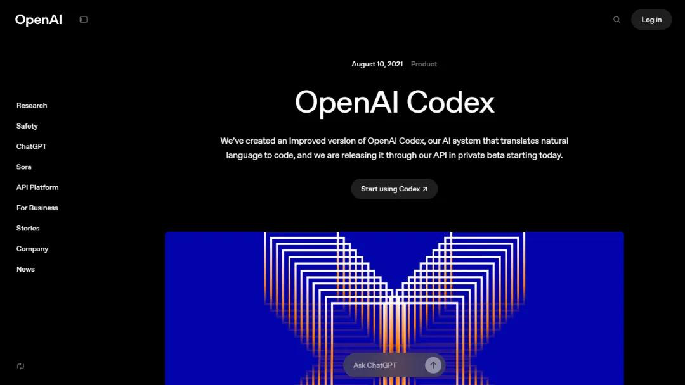
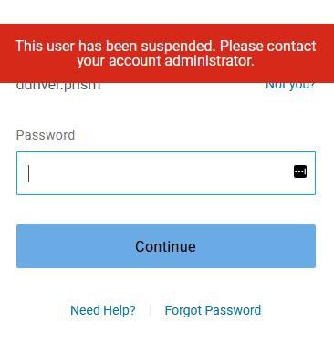
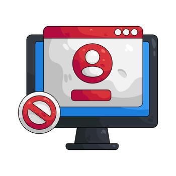
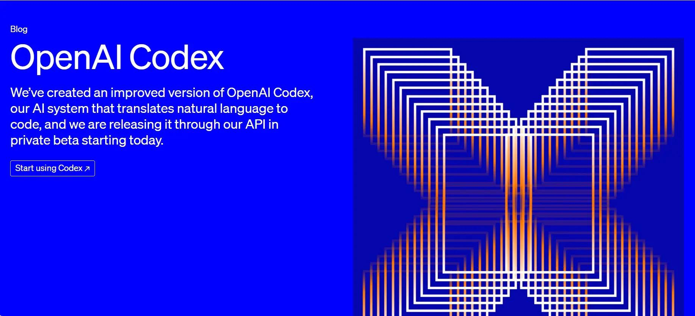

# Codex 误封反转：OpenAI 道歉后，这件事该重新定性了

## 一夜反转：昨天还在大封号，今天 OpenAI 就道歉了

昨天，很多人还在问：**Codex 是不是开始大规模封号了？**

今天，剧情直接反转。

根据公开传播的 OpenAI 官方说明，这次风波里，**确实有一部分账号不是“正常封禁”，而是被系统错误暂停了**。

官方的说法很直接：一次问题导致部分用户账号被错误停用，团队正在恢复访问权限，并处理相关订阅与 credits 问题，同时对由此带来的不便表示抱歉[[1]](https://digg.com/ai/gw50y6lj)。

这句话一出来，整件事的性质就变了。

它不再只是“Codex 风控升级”，而是变成了：**风控升级背景下，平台出现了一次大规模误伤。**

> 💡 **如果只看一句话版：** 这次不是单纯“用户违规被封”，而是 **OpenAI 亲口承认：部分账号被错封了，而且正在恢复，还公开道歉了**[[1]](https://digg.com/ai/gw50y6lj)。

---

## 为什么这件事一下子炸了？

因为在官方回应之前，所有用户看到的，几乎都是“封号现场”。

从 LINUX DO、V2EX 到 OpenAI Developer Community，反馈非常集中：

1. 用着用着突然被踢下线；
2. 重新登录时被要求短信验证；
3. 有些账号直接显示已停用；
4. 甚至有人昨天刚开通，今天就失去访问权限[[2]](https://linux.do/t/topic/2291495)。

再叠加前几天 Codex 配额收紧、重置周期变化、双倍额度权益结束这些消息，大家几乎本能地得出同一个结论：

**OpenAI 开始对 Codex 下狠手了。**[[3]](http://news.qq.com/rain/a/20260603A04CBJ00)

所以你会发现，这次舆论发酵得特别快。

因为它戳中的不是“某个产品不好用”，而是开发者最怕的那种感觉：

**我把工作流搭起来了，结果账号突然没了。**

---

## 但现在看，最初那句“开始大封号”并不完整

更准确的说法应该是：

- **平台最近确实在收紧。** 验证更严了，配额更紧了，异常行为识别也更敏感了[[2]](https://linux.do/t/topic/2291495)。
- **但这次引爆恐慌的那一波，里面确实有误伤。** OpenAI 已经承认部分账号是被 incorrectly suspended，并表示会恢复访问[[1]](https://digg.com/ai/gw50y6lj)。

这两个判断，不冲突，反而应该放在一起看。

也就是说：

**风控升级是真的。系统误封也是真的。**

这才是这次事件最接近事实的版本。

---

## OpenAI 这次道歉，真正重要的不是“态度”，而是这三件事

### 1. 它承认了：不是所有被停用的人都有问题

这点非常关键。

如果只是正常的违规封禁，平台通常不会公开说“部分账号被错误暂停”。既然官方已经这么表述，就说明这次异常里，**至少有一部分责任在平台侧**[[1]](https://digg.com/ai/gw50y6lj)。

这对用户情绪的影响很大。

因为过去最难受的地方就在于：

**你不知道自己到底是真的踩线了，还是单纯被系统误判了。**

### 2. 它不是只让你申诉，而是说“我们正在恢复”

这和普通的封号逻辑不一样。

普通情况下，平台往往只给你一个 appeal 入口，剩下全靠你自己解释。

但这次 OpenAI 的口径是：**正在恢复访问权限，并处理相关订阅与 credits 问题**[[1]](https://digg.com/ai/gw50y6lj)。

这意味着，它更像是一场平台侧批量修复，而不只是零散个案处理。

### 3. 它把问题从“违规”拉回到了“稳定性”

对普通围观者来说，大家讨论的是“有没有封号”。

但对重度开发者来说，真正可怕的问题其实是：

**如果系统会误封，那我还能不能放心把工作流押在上面？**

因为现在很多人已经把 Codex 接进了日常开发：写代码、改脚本、跑 review、做自动化。一旦账号突然掉线，断掉的不是一个网页，而是整段工作节奏[[4]](http://m.toutiao.com/group/7647842182912672310/)。

---

## 所以，这次到底该怎么定性？

我觉得最适合传播的一句话是：

> **这不是一次单纯的“Codex 大封号”，而是一次“风控升级背景下的大规模误封”。**

这个说法更稳，也更接近现在已经公开的信息。

因为 OpenAI 帮助中心本来就写得很清楚：账号被停用，不只可能因为违规内容，也可能和**安全风险、未经授权访问、反复违规、身份验证未完成**有关[[5]](https://help.openai.com/zh-hans-cn/articles/10562188-why-was-my-openai-account-deactivated)。

所以最近账号体系变严，这件事大概率仍然成立。

只是这次，平台自己也承认：**收紧的过程中，确实错杀了一批人。**[[1]](https://digg.com/ai/gw50y6lj)

---

## 对用户来说，现在最现实的建议是什么？

> ⭐ **别因为官方开始恢复了，就以为这件事已经彻底过去了。**

如果你还在高频使用 Codex，我建议立刻做 4 件事：

1. **先把账号资料补完整。** 包括邮箱、手机号、登录方式、年龄验证这些基础信息。
2. **把异常页面、额度变化、订阅状态先截图留证。** 官方既然说会处理 subscription 和 credit 问题，截图就很关键[[1]](https://digg.com/ai/gw50y6lj)。
3. **减少频繁切号和异常环境切换。** 即便这次有误伤，异常行为模式依然可能触发更高风控概率[[6]](https://linux.do/t/topic/2283110)。
4. **如果还没恢复，尽快走官方支持或申诉入口。** 这是正式渠道[[5]](https://help.openai.com/zh-hans-cn/articles/10562188-why-was-my-openai-account-deactivated)。

---

## 最后一句

这次 Codex 风波，最值得被记住的，不是“OpenAI 封没封号”，而是这句更扎心的话：

**当 AI 工具真的进入生产流程以后，一次误判，影响的已经不是情绪，而是工作。**

所以今天这件事的真正反转，不只是“官方出来道歉了”，而是它至少证明了一点：

**不是所有被封的人都有问题。**

有些人，真的只是被系统错杀了。
