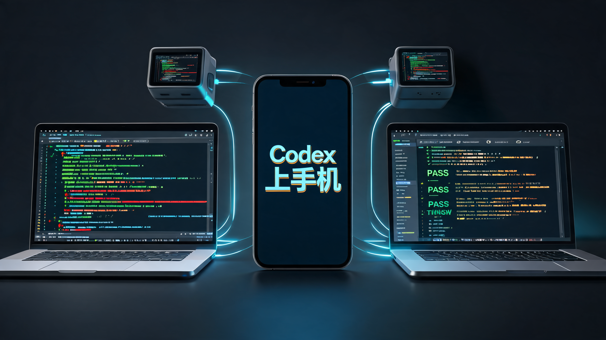
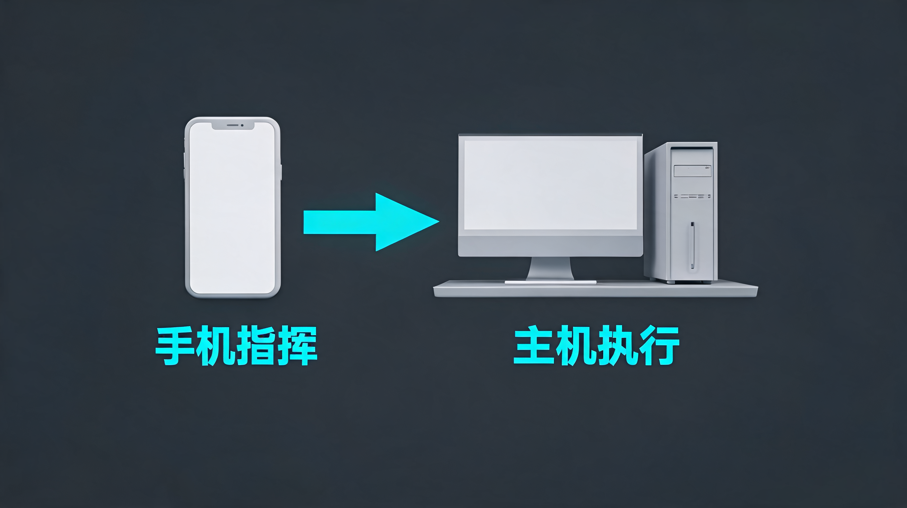
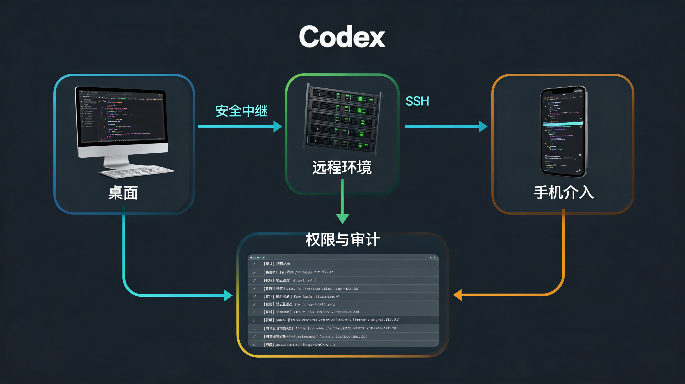
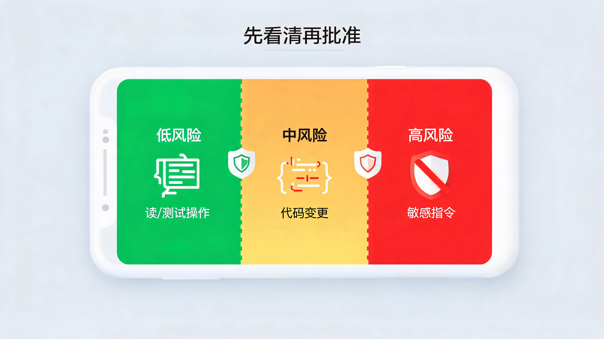

# Codex 上手机，OpenAI 抢的不是碎片时间

这两天，AI 编程圈最热的一个更新，是 OpenAI 把 Codex 放进了 ChatGPT 手机 App。

官方说法很清楚：从 2026 年 5 月 14 日开始，Codex mobile 以 preview 形式在 iOS 和 Android 的 ChatGPT App 里滚动开放。它覆盖所有 ChatGPT 计划，包括 Free 和 Go；但当前手机端连接的主机，主要还是运行 Codex App 的 macOS，Windows 端支持还在路上。

如果只把它理解成“终于可以在手机上写代码了”，我觉得反而低估了这次更新。

我的判断更直接：**Codex 上手机，真正抢的不是碎片时间，而是开发工作里那些卡住 Agent 的关键决策点。**

它不是要让你在地铁上对着小屏幕敲代码，而是让你在 Agent 跑长任务时，随时能做三件事：

1. 看它查到了什么。
2. 决定下一步往哪里走。
3. 批准或者拦下高风险动作。

> 📌 **一句话判断**：AI 编程 Agent 的战场，正在从“谁更会写代码”转向“谁能更好地承接长任务、跨设备协作和人类审批”。手机只是入口，真正变化的是工作节奏。

这篇不重复新闻通稿，我更想拆清楚 4 个问题：

- Codex mobile 到底能做什么，不能做什么。
- 为什么这个小更新会成为 OpenAI 和 Anthropic 争开发者的关键动作。
- 手机审批会带来什么新风险。
- 普通团队应该怎么用，而不是一上来就把权限放飞。

## 1. 这不是“手机写代码”，而是“手机指挥 Agent”

先把事实说清楚。

Codex mobile 并不是把整个代码仓库搬到手机里，也不是让手机变成一个完整 IDE。

它更像一个远程控制台。

OpenAI 官方文档里写得很直白：Codex 继续运行在你的 Mac、Mac mini、devbox 或远程环境里；手机端加载的是那个环境的实时状态。你可以在手机上开始或继续线程，回答 Codex 的问题，改方向，批准操作，查看输出、Diff、测试结果、终端日志和截图。

也就是说，代码、凭据、权限和本地配置仍然留在执行机器上；手机负责看见、判断和发号施令。

这个产品判断很妙。

因为移动端最不擅长的事，是长时间精细输入；但它最擅长的事，是在一个短时间窗口里给出判断。

Agent 跑到一半问你：“我发现有两种修法，你选哪一种？”  
你不需要打开电脑，也不需要重新进入完整上下文，只要看它整理好的差异和测试结果，给一个方向。

Agent 准备执行一个有风险的命令，你不需要等回到工位再处理，只要确认它是否合理。

这才是 Codex mobile 的真实价值：

**它把程序员从“必须坐在电脑前盯着 Agent”里解放出来，但没有把最终判断权从人手里拿走。**

## 2. 它为什么会热？因为 Agent 的瓶颈变了

过去我们讨论 AI 写代码，最关心的是模型能不能写对。

现在问题开始变了。

当 Codex、Claude Code、Cursor 这类工具越来越能接长任务后，新的瓶颈不是“它会不会动手”，而是“它什么时候需要人拍板”。

一个真实的 Agent 工作流通常不是这样：

> 你提需求 -> Agent 一次性写完 -> 全部正确 -> 结束。

更常见的是这样：

> 你提需求 -> Agent 看代码 -> 发现不确定点 -> 问你 -> 继续跑 -> 要权限 -> 跑测试 -> 发现新问题 -> 再让你选方案。

这个流程里，真正拖慢进度的，往往不是 Agent 执行，而是人不在场。

你去开会了，它卡在一个审批点。  
你在通勤，它卡在一个实现路线选择。  
你去吃饭，它跑完测试等你看 Diff。  

所以 Codex mobile 的意义，不是“让程序员更卷”，而是让这些短促的判断点不再把整个长任务停住。

OpenAI 在发布里提到，Codex 每周已经有超过 400 万人使用。规模到这个程度后，哪怕每个任务只因为等待用户多卡 10 分钟，乘起来都是巨大的时间浪费。

这也是为什么我觉得这个功能会热：

**Agent 越能干长活，人越需要一个低摩擦的“介入入口”。**

手机就是这个入口。

## 3. 真正的野心，是把 Codex 做成跨设备工作系统

如果只看手机端，Codex mobile 像一个小功能。

但如果把最近几个月的 Codex 更新连起来看，它更像一块拼图。

2 月，OpenAI 发布 Codex App，把 Codex 从命令行和网页里拉出来，做成一个可以管理多线程、多工作区、多 Agent 的桌面工作台。

4 月，Codex 又加强了长任务能力：浏览器、Computer Use、Chrome extension、远程环境、工作流、Skills、Hooks，都在往“更完整的软件开发生命周期”靠。

5 月这次更新，把手机接进来，同时把 Remote SSH 推到 generally available，让 Codex 可以连接企业已有的远程开发环境；Hooks 也进入 GA，可以做提示词密钥扫描、验证器、日志记录、记忆和项目级定制；Business 和 Enterprise 还可以用 programmatic access tokens 做自动化。

这条线很清楚：

**OpenAI 想做的不是一个更聪明的代码补全工具，而是一个能跨设备、跨环境、跨审批链路工作的 Agent 操作系统。**

桌面负责深度工作。

远程主机负责稳定执行。

手机负责随时介入。

企业配置负责权限、安全和审计。

这才是 OpenAI 在开发者市场上真正想抢的位置。

它抢的不是 IDE 里的一个侧边栏，而是软件工作流里的指挥权。

## 4. 但手机审批也会放大风险

这里必须泼一盆冷水。

手机能随时审批，确实方便；但也更容易让人低质量审批。

Axios 在报道里提到一个很现实的担忧：用户一边多任务处理，一边在小屏幕上批准 Agent 动作，可能会增加错误风险。

这个判断我很认同。

在电脑前看 Diff，你可能会多扫几眼。  
在手机上收到通知，你可能只是想把红点清掉。  

这两个动作看起来都是“approve”，质量完全不一样。

社区反馈里也能看到一些早期摩擦点：有人觉得 mobile 是很好的开始，但还比较有限；有人吐槽当前对 macOS 依赖太重，Windows / Linux 用户还得等；也有人担心从手机端让 Codex 控制本机应用、浏览器或密码管理器时，边界要更清楚。

这些都不是小问题。

因为 Codex mobile 连接的不是一个玩具环境，而是你的真实开发机器。它能看到项目上下文、终端输出、测试结果、Diff，必要时还会接触浏览器和本地工具。

所以这件事的正确打开方式，不是“太方便了，以后所有操作都手机批准”，而是先给权限分层：

1. ✅ 低风险：查看日志、读文件、跑测试、生成总结，可以更大胆地远程处理。
2. ⚠️ 中风险：改代码、安装依赖、调用外部服务，需要看清 Diff 和命令。
3. 🛑 高风险：删除文件、动生产环境、访问敏感凭据、操作密码管理器，最好不要在碎片场景里随手放行。

> **一个简单原则**：手机适合让任务继续走，不适合替你降低判断标准。

## 5. 普通团队该怎么用？先拿来解决“卡点”，别急着远程放飞

如果你是个人开发者、小团队，或者正在把 Codex 放进日常研发流程，我建议先别把它当成“手机远程开发神器”。

更稳的用法，是把它当成长任务的卡点处理器。

可以从这 4 类任务开始：

**第一类：调查型任务。**

比如“帮我定位这个测试为什么失败”“看看这个接口最近为什么报错”“梳理这个模块的调用链”。这类任务主要是读、查、总结，手机端很适合中途补充上下文。

**第二类：低风险修复。**

比如改文案、补小测试、修 lint、调整配置说明。它们需要人验收，但不应该一直占住你的电脑时间。

**第三类：方案分叉。**

Agent 经常会跑到一个分岔口：继续小修，还是顺手重构？临时 patch，还是补一层抽象？手机端可以让你及时选方向。

**第四类：结果验收。**

看它跑了哪些测试、改了哪些文件、有没有生成截图、有没有残留失败项。很多验收动作本来就不是写代码，而是判断工作有没有收口。

真正要避免的是两种用法。

一种是把手机当成“随手批准一切”的按钮。

另一种是把还没拆清楚的大需求直接丢给 Agent，然后人离开现场，希望它自己一路跑通。

这两种都会让 Codex mobile 从效率工具变成风险放大器。

更健康的工作流应该是：

1. 在电脑上把任务拆清楚。
2. 让 Codex 开始调查或实现。
3. 人离开工位后，用手机处理它卡住的判断点。
4. 回到电脑后，做最终 Diff 审查和合并。

这样它就不是替代你的主工作台，而是在主工作台之外，补上那些原本会浪费掉的等待时间。

## 6. 这次更新真正说明了什么

Codex 上手机，表面是一个移动端功能。

但我更愿意把它看成一个信号：

**AI Agent 的产品设计，正在从“对话界面”进入“工作调度界面”。**

以前我们打开 AI，是为了问一句、拿一个答案。

现在我们打开 AI，是为了启动一个任务、监督一个过程、在关键节点做判断、最后验收一个结果。

这时候，谁能让人更自然地介入 Agent 工作，谁就更接近下一代工作入口。

手机不会让你在碎片时间里变成超人。

它真正改变的是另一件事：

当 Agent 正在替你跑长任务时，你不必因为离开电脑，就让整件事停下来。

这可能就是 AI 编程工具接下来最重要的方向。

不是让模型更像一个随叫随到的聊天助手，而是让它变成一个可以持续推进、随时汇报、等待你拍板的工作伙伴。

最后给团队一个很实用的检查清单：

1. 你的 Agent 任务有没有明确的低风险、中风险、高风险边界？
2. 哪些审批可以手机处理，哪些必须回到电脑前看完整上下文？
3. 你的测试、日志、截图和 Diff 能不能支撑一个人远程做判断？
4. 如果 Codex 跑在远程主机上，凭据、权限、网络访问和审计有没有配置清楚？

如果这些问题还答不上来，先别急着追“手机遥控 Agent”的酷感。

先把工作流的地基补上。

因为真正能让 Agent 跑起来的，不是手机屏幕上的一个按钮，而是按钮背后那套清楚的权限、验证和验收机制。

---

参考来源：

- OpenAI：《Work with Codex from anywhere》，2026-05-14。
- OpenAI：《Codex for (almost) everything》，2026-04-16。
- OpenAI Help Center：ChatGPT Release Notes，2026-05-14。
- OpenAI Developers：Remote connections - Codex。
- OpenAI：《Running Codex safely at OpenAI》，2026-05-08。
- TechCrunch、Axios、MacRumors、TestingCatalog 对 Codex mobile 的报道。
- Reddit r/codex、r/OpenAI 中关于 Codex mobile 的早期使用反馈。
