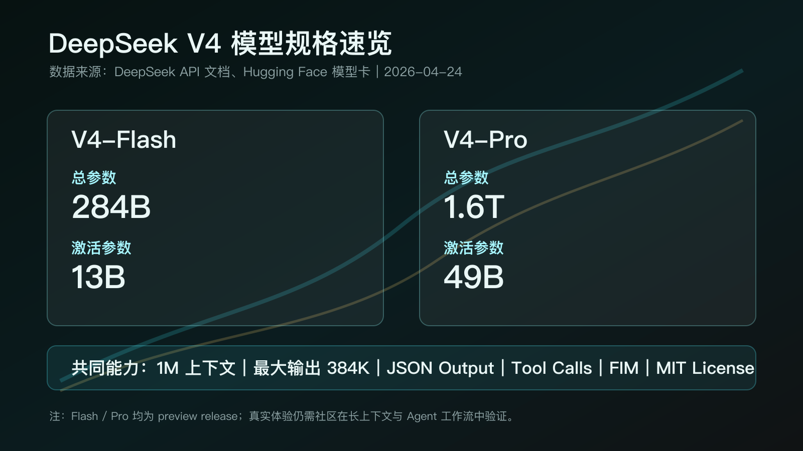
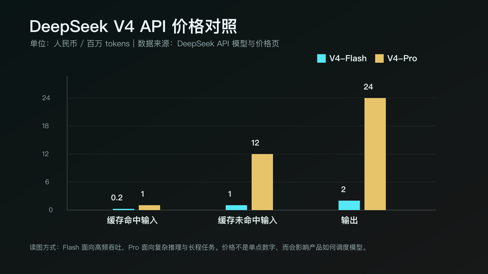
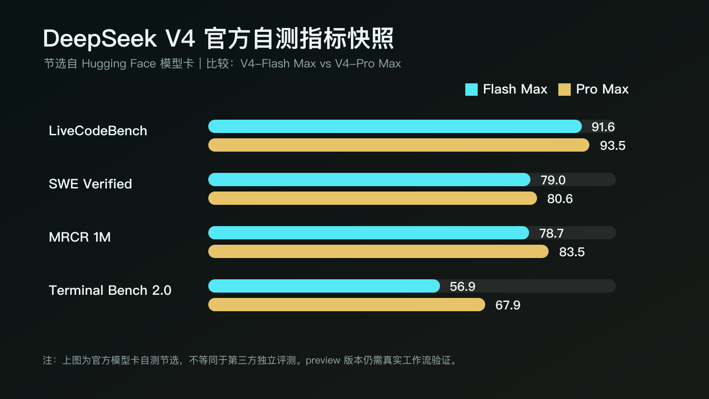

# DeepSeek V4 发布：这次真正可怕的，不是 1.6T 参数

今天 DeepSeek V4 终于来了。

如果只看参数，它当然很猛：V4-Pro 是 1.6T 总参数、49B 激活参数；V4-Flash 是 284B 总参数、13B 激活参数；两条线都支持 1M 上下文。

但我的判断是：**这次真正可怕的，不是 1.6T 参数，而是 DeepSeek 把“低价 API、开源权重、长上下文、Agent 工作流”一起打出来了。**

这意味着一件事：开源模型不再只是在榜单上证明自己，它开始争夺开发者和产品团队的主工作流。

## 1. 先说结论：V4 已经不是传闻

这两周，DeepSeek V4 被各种预测、偷跑页和社区截图刷过一轮。今天最需要先做的，不是兴奋，而是把事实钉住。

截至 2026 年 4 月 24 日，已经确认的信息是：

- DeepSeek API 文档列出 `deepseek-v4-flash` 和 `deepseek-v4-pro`。
- `deepseek-chat` 和 `deepseek-reasoner` 将在 2026 年 7 月 24 日弃用。
- V4-Flash 和 V4-Pro 都支持 1M 上下文，最大输出 384K。
- 两个模型都支持 JSON Output、Tool Calls、前缀续写和 FIM 补全。
- Hugging Face 已上线 Flash、Flash-Base、Pro、Pro-Base 四个权重，许可为 MIT License。

所以更准确的说法是：**DeepSeek V4 preview 已经进入 API 和开源权重阶段，接下来要看真实工作流验证。**

这个表述很重要。它既不扫兴，也不把 preview 写成最终结论。

## 2. 这次的关键词不是“大”，是“1M 上下文变成基础能力”

过去模型发布，大家很容易被“大参数”吸走注意力。

但 V4 更值得看的，是 DeepSeek 把 1M 上下文放进了两条产品线，而不是只塞给最贵的旗舰模型。

这件事对工作流影响很直接。

以前我们用模型，经常在做“人肉切片”：长文档要拆开，代码仓库要截几段，需求要先压缩，背景要反复解释。模型强不强是一回事，用户累不累是另一回事。

1M 上下文普及之后，真正的问题变成：

**当模型可以直接看更完整的项目、资料和对话历史，你的产品还凭什么让用户反复整理材料？**

这才是 V4 对 AI 工具的压力。

它不只是把窗口变大，而是在逼所有工具重新设计交互：少让用户搬运，多让模型接住完整上下文。

## 3. Flash 和 Pro 的分工，说明模型开始像“算力套餐”

这次 DeepSeek 没有只发一个旗舰，而是直接给出 Flash 和 Pro。

Flash 负责便宜、高频、日常调用。  
Pro 负责复杂推理、长程编码、深度研究和重 Agent 场景。

这不是简单的大小杯，而是一个信号：大模型正在从“一个万能入口”，变成“按任务调度的算力套餐”。

未来成熟的 AI 产品，可能不会再把选择题丢给用户：

- 普通问答，用 Flash。
- 长文档归纳，开长上下文。
- 多文件代码修复，切 Pro。
- 批量任务，优先跑便宜模型。
- 高风险决策，再打开更强推理预算。

所以以后评价一个 AI 应用，不只看它接了哪家模型，还要看它会不会调度模型。

**真正贵的不是 token，而是把不该用 Pro 的任务全丢给 Pro，把该用 Pro 的任务又省成 Flash。**

## 4. 开源加低价，打的不是情怀，是议价权

DeepSeek 最狠的地方，一直不是“我开源”，而是它能把开源和价格压力绑在一起。

V4 还是这个打法。

一边，权重放到 Hugging Face 和 ModelScope，许可是 MIT。  
另一边，API 给出低价入口，Flash 的价格尤其有攻击性。

这会直接改变三类人的处境。

对闭源模型厂商来说，问题会变成：如果开源模型已经能覆盖大量编码、研究和 Agent 任务，闭源模型的溢价到底来自哪里？

对 AI 应用公司来说，问题会变成：如果底层能力越来越便宜，用户为什么还要为一个只包了一层壳的产品付高价？

对创业团队来说，这反而是机会。过去算不过账的 Agent 产品，现在可能值得重新测算。

V4 的行业杀伤力就在这里：

**它不一定在每个榜单都赢，但它会不断把问题推回商业层面：当用户用更低成本拿到足够强的能力，你还剩下什么不可替代？**

## 5. 但别急着封神，preview 最需要被真实场景拷打

模型卡里的自测数据确实漂亮。

比如官方给出的 V4-Pro Max：LiveCodeBench 93.5，Codeforces 3206，SWE Verified 80.6，MRCR 1M 83.5。Flash Max 在不少推理和编码任务上也很接近 Pro。

但今天真正该问的，不是“它是不是已经天下第一”，而是更具体的 5 个问题：

1. 1M 上下文放进真实项目后，是否还能抓住主线？
2. Flash 是否足够稳，能不能成为高频默认模型？
3. Pro 的速度、排队和稳定性，是否配得上复杂任务？
4. Tool Calls 和 Coding Agents 接入后，边界情况多不多？
5. 开源权重能不能被社区真的跑起来、跑得起、跑得稳？

这不是泼冷水。恰恰相反，能被开发者认真挑刺，说明它已经不是一个只适合围观的发布会模型。

## 6. 普通人接下来怎么用这次发布？

如果你是开发者、创作者、产品经理，或者正在做 AI 应用，不要只收藏参数表。

更有用的是这张判断清单：

- 看上下文是否真的改变工作流，而不是只写在参数页。
- 看价格是否能支撑高频使用，而不是只适合偶尔炫技。
- 看强模型和便宜模型有没有清晰分工。
- 看它是否进入 API、开源、Coding Agents、工具调用这些生态接口。
- 看社区是否愿意把它放进真实任务里骂。

最后这一点尤其重要。

一个模型只有进入主工作流，才会被认真挑刺。没人真的用，才会只剩夸。

## 结尾：开源模型的下一场战争，是证明自己能被托付

DeepSeek V4 发布后，最热闹的讨论一定会围绕参数、跑分、价格和“有没有超过谁”。

但更深一层看，它其实在给整个行业做压力测试。

它测试闭源模型的溢价能不能站住。  
测试开源模型能不能进入长程 Agent 工作流。  
测试 AI 应用公司有没有真正的产品能力。  
也测试开发者会不会为了更便宜、更开放、更长上下文的模型迁移自己的工作方式。

所以今天最值得转述的一句话是：

**开源模型的下一场战争，不是证明自己能聊天，而是证明自己能被托付。**

接下来几周，社区真实使用里的评价，会比发布当天的热搜更重要。

## 资料来源

- DeepSeek API 文档：首次调用 API、模型与价格页
- DeepSeek Hugging Face：DeepSeek-V4 Collection、DeepSeek-V4-Pro / Flash 模型卡
- Reuters / Investing.com：DeepSeek releases new flagship open source AI model V4
- Bloomberg / The Straits Times：China's DeepSeek unveils new flagship AI model
- OpenRouter：DeepSeek V4 Pro 模型页与价格信息
