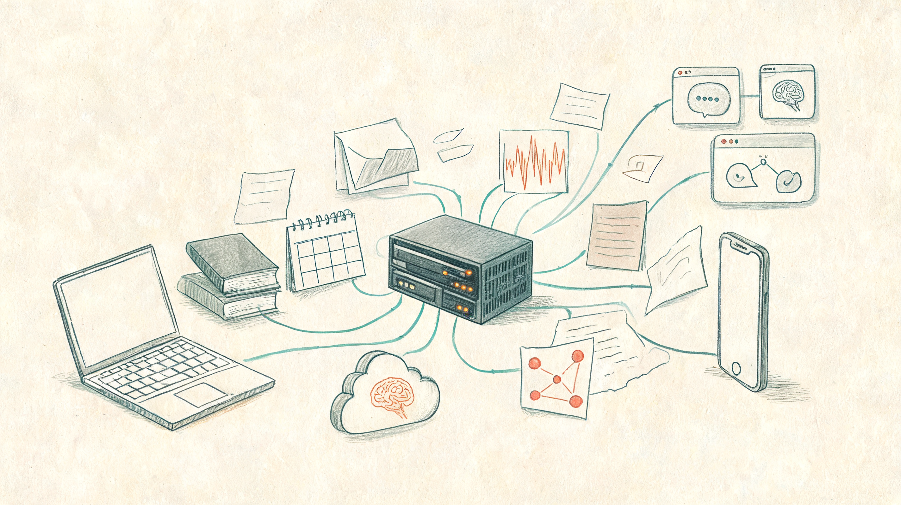
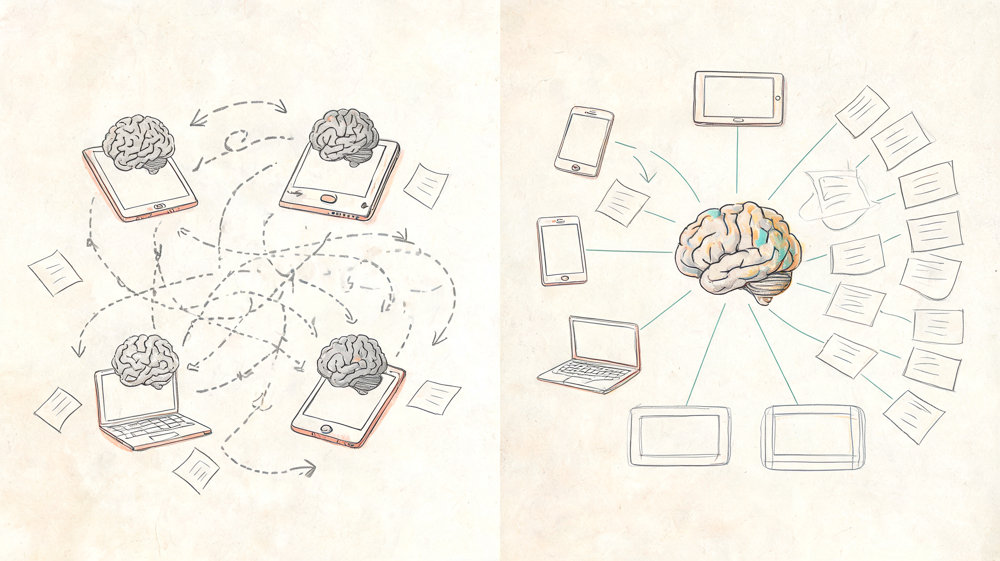
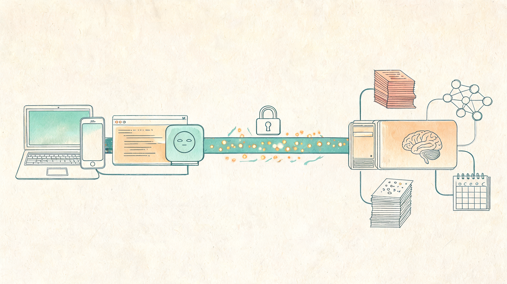
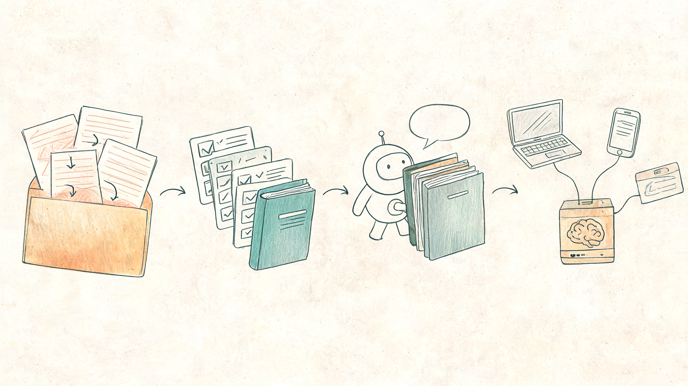

# 以后最懂你的 AI，可能不是云端模型，而是你家里的那台服务器

如果你还把 AI 记忆理解成“聊天记录同步”，那 GBrain 这次被热议的更新，可能会把这个想法直接推翻。

5 月 17 日，阿绎在 X 上转述 Garry Tan 关于 GBrain v0.31.1 的更新：它开始支持真正的 MCP thin client。简单说，就是你可以在家里跑一台“GBrain 服务器”，其他电脑、手机和 Agent 都通过 MCP 远程连接它，体验尽量接近本地运行。

这听起来像一个开发者工具的小版本更新。

但我的判断很直接：**它真正重要的地方，不是“GBrain 又修好了一个功能”，而是个人 AI 第一次开始像企业软件一样，走向客户端-服务器架构。**

> 📌 **一句话判断**：个人 AI 的下一站，不是再换一个更聪明的聊天框，而是拥有一套只属于你的、可多端调用、长期积累的私人智能基础设施。

读完这篇，你至少能带走 3 个判断：

1. 为什么“一个大脑，养所有设备和 Agent”比普通知识库更重要。
2. 为什么 MCP 在这里不只是协议，而是个人 AI 的连接层。
3. 普通人现在该怎么从“堆资料”升级到“养自己的 AI 基础设施”。

## 1. 这次修的不是 bug，而是个人 AI 的架构病

过去我们用 AI，有一个很隐蔽的问题：

每个入口都像一个新认识你的人。

你在电脑上让 Claude Code 读过一篇论文，手机上的助手不知道。你让一个 Agent 做过资料整理，另一个 Agent 还会重新问你背景。你在本地跑了一个知识库，换一台设备又要重新同步、重新索引、重新解释。

表面看，这是“同步问题”。

本质上，这是**个人 AI 没有统一大脑**。

所以阿绎那条推文里最值得看的，不是“GBrain 支持 thin client”这几个技术词，而是那个非常朴素的画面：

**以前是每台设备自己养一个脑，现在是一台家用服务器养一个大脑，所有设备和 Agent 都来调用它。**

这一步很关键。

因为一旦大脑变成中心，电脑、手机、Claude Code、OpenClaw、Hermes、Neuromancer 这些入口就不再是彼此割裂的小助手，而是同一个长期记忆系统的不同窗口。

你在一个地方留下的阅读、项目、会议、想法和判断，可以被另一个地方继续使用。

这才是“个人 Jarvis”从玩具变成基础设施的开始。

*真正的升级不是多记一点，而是让所有入口共享同一套记忆。*

## 2. 为什么 MCP 在这里像 AI 时代的 HTTP

这两年很多人都在说 MCP。

有的人把它说成 AI 时代的 USB-C，有的人把它说成 Agent 连接工具的标准接口。这个比喻没错，但如果只停在“接工具”，还是低估了它。

在 GBrain 这件事里，MCP 解决的是另一个更底层的问题：

**你的 AI 入口很多，但它们能不能共同访问同一个你？**

GBrain 官方架构文档里，thin client 的意思很明确：客户端机器不再维护本地引擎，查询、搜索、索引、embedding 等都发生在远端 host 上。客户端只保留远程 MCP 配置，通过 OAuth 和 MCP 地址连接过去。

这句话翻译成人话就是：

你的电脑不用再偷偷开一个空数据库，也不用假装自己有完整记忆。它该问谁，就老老实实去问那台真正有大脑的机器。

这就是客户端-服务器架构的意义。

互联网早期也是这样走过来的。最开始软件都装在单机上，数据散在每台电脑里。后来 Web 起来，浏览器变成入口，真正的数据和服务跑在服务器上。

现在个人 AI 也在经历类似变化：

- 聊天框是浏览器。
- Agent 是客户端。
- MCP 是连接协议。
- 私人知识库和记忆系统，是你的服务器。

当这几件事拼起来，AI 才不只是“会回答的模型”，而开始像一个能长期工作的个人系统。

*MCP 的价值不是多接一个工具，而是让多个 Agent 能接入同一个长期上下文。*

## 3. GBrain 真正卖的不是检索，而是“会复利的个人上下文”

如果只把 GBrain 看成 RAG 或知识库，就会看得太浅。

Garry Tan 在 README 里对 GBrain 的描述非常有意思：它不是一个空泛 Demo，而是他自己用来跑 OpenClaw 和 Hermes 的生产级大脑。官方写到，他的生产 brain 已经有一万多页、几千个人物档案、数百家公司记录，还有一批自动运行的 cron jobs。

这组数字重要吗？

重要，但不是因为它看起来很大。

真正重要的是，它说明了一件事：**AI 的长期价值，正在从“模型一次性生成答案”，转向“系统持续积累你的上下文”。**

一次对话当然有用，但它很快会消失。

一个 prompt 当然有用，但它只能解决当下任务。

真正值钱的是这些东西能不能沉淀下来：

- 你反复使用的判断标准。
- 你长期追踪的人、公司、项目和概念。
- 你每次读书、开会、写作、研究留下的痕迹。
- 你做事的方法，而不只是某次对话的结果。

GBrain 的路线，恰恰是在把这些东西变成一个能被 Agent 持续调用、持续修正、持续富化的系统。

这也是为什么它不该只被理解成“更好用的搜索”。

搜索解决的是：我现在能不能找到一段资料。

个人大脑解决的是：**我过去所有认真想过的东西，能不能在未来继续帮我思考。**

差别很大。

## 4. 下一波机会，不一定在云端大模型，而在你自己的电脑里

这句话要说得克制一点。

云端大模型当然还重要，而且会继续变强。但对普通人和小团队来说，真正能抓住的机会，不一定是去和大厂拼下一个万亿参数模型。

更现实的机会是：

把模型接到你自己的长期上下文里。

很多人今天用 AI，最大的问题不是模型不够聪明，而是它离你的真实工作太远。

它不知道你过去写过什么，不知道你踩过什么坑，不知道你和哪些人聊过，不知道你为什么讨厌某种表达，不知道你最近关注的判断正在怎么变化。

于是每次使用 AI，都像重新入职一个新人。

你先花 10 分钟解释背景，再花 10 分钟纠正方向，最后还要担心它下次全部忘掉。

这就是个人 AI 的根本浪费。

而一旦你有了一个长期可用的私人 brain，模型的位置就变了。

模型不再是孤零零的万能回答器，而是接入你个人上下文后的推理引擎。它每次回答，都能站在你已经积累过的资料、偏好、项目、关系和方法上继续往前走。

这才是个人生产力的复利。

> 🌱 **带走这句话**：未来最懂你的 AI，不一定来自最强模型公司，而可能来自你最认真喂养的那套私人上下文。

## 5. 普通人现在该做的，不是立刻装 GBrain，而是重建自己的“记忆策略”

说到这里，很容易让人冲动：

“那我是不是今天就该装 GBrain？”

不一定。

GBrain 现在仍然是一个偏技术用户的开源项目，版本更新很快，自托管、认证、数据结构、索引成本、安全边界都需要你真的愿意折腾。对很多普通用户来说，直接上完整系统，可能会先被安装和维护劝退。

但它给我们的启发，今天就能用。

我更建议先做 4 件小事：

### 1. 先把输入源收拢起来

不要到处散落。

读书笔记、项目复盘、会议纪要、灵感记录、文章草稿、客户反馈、研究材料，先放到一个稳定目录或知识库里。

不用一开始就完美分类，先保证它们能被持续找到。

### 2. 把重复任务写成 playbook

不要每次都重新教 AI。

比如你写公众号的选题判断、标题标准、开头结构、配图偏好、发布前检查，这些都应该沉淀成固定流程。

对个人来说，playbook 比 prompt 更重要。

prompt 是一次性指令，playbook 是可复用的能力。

### 3. 让 AI 每次先查你的上下文

以后别只问：

“帮我写一篇文章。”

改成：

“先查我过去关于 Agent、MCP、个人知识管理的文章和笔记，再基于这次资料写一篇新稿。”

这一步看起来只是多一句话，本质上是在训练 AI 从“即时创作”变成“延续你的思考”。

### 4. 再考虑多端和远程访问

等你真的积累到一定规模，再去考虑 GBrain 这种中心化 brain，或者其他类似的本地记忆系统。

顺序千万别反。

先有值得积累的内容，再有值得共享的大脑。

否则你搭出来的不是 Jarvis，只是一个很精致的空仓库。

*先收拢资料，再沉淀流程，最后才轮到多端架构。*

## 6. 别神化 GBrain，但一定要看懂这个方向

我不想把这篇写成“立刻去装”的种草文。

GBrain 有很强的启发性，也有很现实的门槛。它适合愿意自托管、愿意维护 Markdown-first 知识库、愿意把 Agent 真正放进工作流的人。它不一定适合只想要一个开箱即用聊天助手的人。

但方向已经很清楚了。

个人 AI 会从三个阶段往前走：

第一阶段，聊天框。

你问，它答。

第二阶段，工作流。

你给任务，它调用工具、生成结果、帮你完成一件事。

第三阶段，私人基础设施。

它不只是完成任务，而是长期保存你的上下文、方法、偏好和关系，并且被所有入口反复调用。

GBrain v0.31.1 被讨论的意义，就在第三阶段露出了一个很清晰的形状：

**一个大脑，多个入口。一个记忆，服务所有 Agent。**

这件事一旦跑通，个人 AI 的竞争就会换维度。

以后我们不会只问“你用哪个模型”，还会问：

- 你的 AI 记忆放在哪里？
- 它能不能跨设备调用？
- 它有没有自己的权限边界？
- 它能不能持续吸收你的工作流？
- 它是不是越用越像你？

这些问题，才是个人 AI 真正进入日常生活以后，必须回答的问题。

## 最后

Garry Tan 作为 YC 的 CEO，花大量时间打磨一个开源个人记忆系统，本身就是一个信号。

最懂创业机会的人之一，没有只盯着下一个模型参数榜，而是在亲自搭一套能让 Agent 长期记住、长期工作、长期自我修正的基础设施。

这件事值得普通人警醒。

未来的 AI 红利，可能不只属于最会追新工具的人，而属于最早开始积累自己上下文的人。

因为模型会越来越便宜，工具会越来越多，入口会越来越碎。

但真正属于你的东西，只有你的资料、判断、经验、方法和关系。

把这些东西变成一套可调用、可复用、可增长的私人 brain，才是个人 AI 时代最值得下注的长期动作。

> 🚀 **最终判断**：下一代个人 AI，不是一个 App，而是一台由你控制、不断长大的私人知识基础设施。

你现在更缺的是一个更强的模型，还是一个真正能长期记住你的“个人大脑”？

---

参考资料：

- Garry Tan 关于 GBrain v0.31.1 MCP thin client 的 X 动态
- AYi 对 GBrain v0.31.1 的中文解读推文
- GBrain GitHub README 与官方架构文档
- GBrain CHANGELOG，截至 2026-05-17 查询，官方仓库最新记录为 `0.35.1.1`（2026-05-16）

*AI 辅助资料整理与结构起草，人工判断、改写和审核。*
