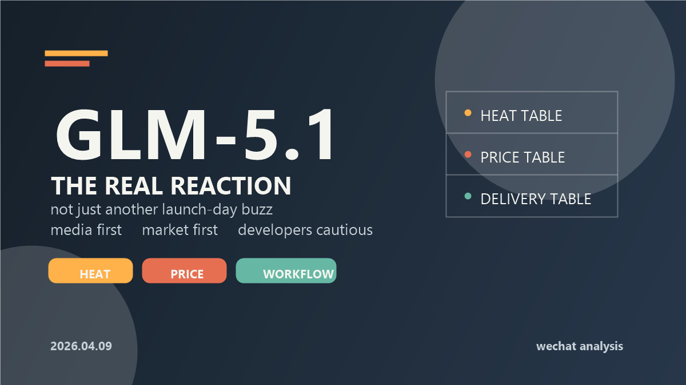
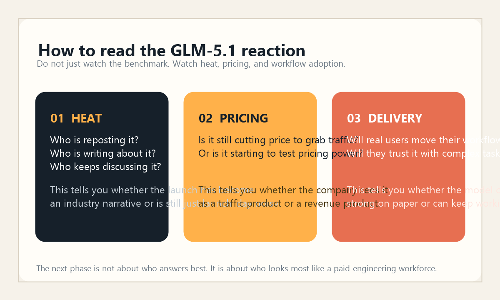

# GLM-5.1 一出，智谱把开源模型的天花板又抬高了

这两天如果你只看 AI 圈的热搜，会觉得 GLM-5.1 这次发布并没有“炸穿全网”。同一天附近，Meta 的 Muse Spark、Anthropic 的新动作、Google 的 Gemma 4，都在分走注意力。  
但如果你往媒体、资本市场和开发者社区里再多看一层，就会发现 GLM-5.1 这次真正引发的反响，并不小，而且很不一样。

我的判断很直接：**GLM-5.1 最值得看的，不只是它把代码 benchmark 又往前推了一截，也不只是它喊出了“8 小时持续工作”，而是它把“模型能力、长程交付、商业化提价”三件事第一次绑得这么紧。**  
这说明国产大模型竞争，正在从“谁更像演示视频里的天才”，走向“谁更像企业愿意持续付费的工程劳动力”。

如果你是开发者、做 AI 产品的人，或者单纯关心国产模型接下来怎么卷，这篇文章你可以带走三个东西：  
第一，为什么媒体和市场先兴奋；第二，为什么真正在用的人还没有一边倒叫好；第三，以后看一个模型发布，别只看分数表，要看热度表、定价表和交付表。

## 1. 先纠正一个时间点：GLM-5.1 不是今天才首发，今天看到的是反响发酵

先把时间说清楚，不然很容易写偏。

从智谱开放文档和开发者生态的时间线看，GLM-5.1 的公开上线节点是 **2026 年 4 月 7 日**。  
4 月 7 日，Vercel 的 AI Gateway 已经同步接入 GLM-5.1；4 月 8 日，科技日报和国内财经媒体开始集中放大这次发布；到了 **2026 年 4 月 9 日**，大家看到的更多已经不是“模型刚发布”，而是发布后的二次传播、价格讨论和社区口碑分化。

这个时间差很重要。  
因为它说明 GLM-5.1 的扩散方式，不是典型的“先靠情绪把全网点着”，而是更像一场先打到开发者和资本市场，再慢慢向外扩的发布。

换句话说，这次不是纯流量型发布，更像是结果型发布。

## 2. 为什么媒体和市场先兴奋：因为它终于把“会写代码”讲成了“能连续干活”

智谱这次对外讲述 GLM-5.1，核心不是“更聪明一点”，而是“更能持续地把事做完”。

官方文档里最刺眼的几个关键词是：

- `SWE-Bench Pro 58.4`
- `对齐 Claude Opus 4.6`
- `单次任务可持续、自主工作长达 8 小时`
- `从规划、执行、测试到修复和交付形成闭环`

这套话术为什么能打中市场？  
因为它把大模型的卖点，从“回答像不像高手”，改成了“能不能像一个工程同事一样，接票、跑实验、反复优化、最后交付结果”。

这不是文字游戏，而是商业叙事的重心变了。

过去很多模型发布，大家爱看的还是：

1. 跑分涨了多少。
2. 中文更强还是英文更强。
3. 长上下文扩到多少 K。

但这次 GLM-5.1 试图回答的，是另一个更贵的问题：  
**如果我上午把一个复杂任务交给你，下午你能不能自己持续推进，而不是 20 分钟后就开始漂。**

这也是为什么媒体很容易被这个点带动。  
它比“更强一点的聊天机器人”更有故事性，也更贴近今天所有人对 Agent 的想象。

而资本市场比媒体还敏感。  
4 月 8 日，多家财经媒体都把焦点放在两件事上：一是 GLM-5.1 在编码基准上的提升，二是智谱又提价了。港股层面，智谱盘中一度涨超 18%；A 股 AI 相关 ETF 和成分股也被带着走强。

市场为什么会因为一个模型发布而兴奋？  
因为市场真正在乎的从来不是“你会不会讲故事”，而是：**你的模型能力，能不能变成更高的 Token 消耗、更稳定的付费场景，以及更强的定价权。**

而 GLM-5.1 这次，恰好把这条线讲通了。

## 3. 但开发者社区为什么没有一边倒叫好：因为大家真正盯的是速度、稳定性和长程真实性

真正有意思的地方，也在这里。

如果只看官方叙事，GLM-5.1 几乎像是在说：“我们已经把国产 Agentic Coding 带进了 8 小时时代。”  
但社区的反应明显更复杂。

一部分开发者的态度是兴奋的。  
在海外开发者生态里，Vercel 很快接入 GLM-5.1，InfoWorld、Computerworld 等媒体也把它放进“长程 autonomous coding agent”这条线里去讨论。对很多真正需要低成本、高可控开源模型的人来说，这当然是加分项。

但另一部分开发者的反应，并不是“太强了”，而是“先别急，让我用两天再说”。

原因很简单：

1. benchmark 强，不等于长程真实场景就稳。
2. 会跑几百轮，不等于每一轮都没有策略漂移。
3. 模型强，不等于服务容量、速度、套餐体验就跟得上。

这也是为什么在社区讨论里，你会同时看到两种声音：

- 一种声音在说，5.1 相比上一代是“很实质的提升”。
- 另一种声音在说，别只 benchmark-maxxed，真正的问题是实际使用里速度够不够、上下文长了会不会乱、普通查询是不是反而一般。

国内社媒侧的情绪也不是“全民狂欢”。  
我用 Sensight 拉了 4 月 9 日的 AI 圈情绪摘要，能看到一个很典型的信号：过去 24 小时行业讨论主线其实是“卷能力”和“控成本/涨价”同时发生，而 GLM-5.1 被提到时，最受关注的并不只是性能提升，也包括“提价 10%”这件事本身。

这说明什么？

说明今天大家已经不太会被一句“全球第一”轻易说服了。  
真正会让开发者持续讨论的，反而是这些更现实的问题：

- 长程任务到底是真的稳定，还是 demo 级稳定？
- 套餐价格抬上去以后，还值不值？
- 服务容量能不能撑住更多真实使用，而不是只撑住发布当天的情绪？

这不是对 GLM-5.1 的否定。  
恰恰相反，这说明国产模型已经被放进更高的评价框架里了。大家不是在问“你是不是能用”，而是在问“你能不能进入我的主工作流”。

## 4. 这次最值得盯住的，不是 8 小时，而是“敢提价”

如果只能从这次发布里挑一个最重要的信号，我会选提价。

因为“8 小时持续工作”是能力叙事，  
而“再提价 10%”是商业叙事。

前者可以靠测试、案例和故事建立认知；  
后者则意味着公司判断：**用户已经不是把它当试玩产品，而是开始把它当生产工具。**

这一步很关键。

过去两年，国产大模型的一个默认姿势，是先用低价甚至免费把市场卷起来。  
谁更便宜，谁更快，谁更愿意送额度，往往谁就更容易拿到讨论度。

但 GLM-5.1 这次传出来的信号是：  
智谱不只想证明“我能做出一个强模型”，还想证明“我有资格把强模型卖得更贵”。

这个变化背后，其实是三个判断：

1. 模型价值的计量方式，正在从“回答质量”转向“任务吞吐和交付结果”。
2. 企业客户更愿意为真实工作流收益付费，而不是为炫技能力付费。
3. 当行业开始拼 Agent，真正稀缺的不是一次性生成，而是持续执行时的稳定产出。

所以这次发布最值得警惕的一点，不是“智谱又发新模型了”，而是：  
**国产大模型已经开始有人不想再卷到白菜价，而是想抢“提价权”。**

而一旦行业竞争进入“谁更能提价、谁更能撑住提价后的调用量”这个阶段，比赛就变了。

## 5. GLM-5.1 今天的反响，真正说明了什么？

我觉得至少说明了三件事。

### 第一，国产模型竞争已经从“参数战”走到“交付战”

以前大家比的是谁上下文更长、谁榜单更高、谁多模态更全。  
现在开始比的是：谁能把一个长任务跑得更久、更稳、更像一个真正能托付的 agent。

这会让整个行业的讨论重心改变。  
以后好模型不只是“答得对”，还要“干得完”。

### 第二，市场开始用 SaaS 逻辑而不是开源逻辑看模型公司

股价会涨，不只是因为模型更强，  
而是因为更强的模型如果能对应更高价格、更高调用密度和更深的企业渗透，那它就更像一个能放大收入的产品，而不只是一个更好看的技术 demo。

很多人以为大模型公司的核心问题还是“谁先追上谁”。  
但从今天的反响看，另一个更现实的问题已经冒出来了：  
**谁能先把模型能力变成可持续收费能力。**

### 第三，开发者已经不再只信发布会，他们开始信工作流迁移成本

这也是我最看重的一点。  
社区今天对 GLM-5.1 的犹豫、挑刺和现实比较，并不是坏事。

因为一旦一个模型真的开始被拿来和 Claude Code、OpenClaw、Vercel AI Gateway、真实套餐体验一起比较，它就说明已经不再停留在“围观对象”，而是在争“主力工具位”。

这时候，大家讨论的就不是“这模型厉不厉害”，而是：

- 我愿不愿意把主工作流迁过去？
- 我愿不愿意为它多付钱？
- 我愿不愿意把一个下午的任务真交给它？

能进入这个问题区间，本身就是地位变化。

## 6. 以后怎么看一场模型发布？别只看分数表，看这三张表

如果你最近也在追大模型发布，我建议你以后别只看 benchmark 了，直接看三张表：

### 第一张，热度表

看谁在转，谁在写，谁在讨论。  
这张表告诉你，它有没有形成行业叙事。

### 第二张，定价表

看它是降价抢量，还是提价试探。  
这张表告诉你，公司自己到底把它当流量产品还是收入产品。

### 第三张，交付表

看真实用户是否愿意迁移工作流，是否愿意把复杂任务持续交给它。  
这张表告诉你，这个模型到底是“看起来很强”，还是“真的能干活”。

GLM-5.1 这次最值得记住的，不是某一个分数，不是某一条海报，也不是一句“8 小时”。

而是它把这三张表同时推到了台面上。

**一句可被转述的判断是：大模型下一阶段比的，不是谁更会回答，而是谁更像一个能被持续付费的工程劳动力。**

**一个可带走的动作是：以后每看一场模型发布，先问自己三遍: 有没有形成行业热度？敢不敢提价？有人愿不愿意把真实工作流迁过去？**

这三问，比盯着一张榜单更有用。

---

参考资料：

1. 智谱开放文档《GLM-5.1》：https://docs.bigmodel.cn/cn/guide/models/text/glm-5.1  
2. Vercel Changelog《GLM 5.1 on AI Gateway》（2026-04-07）：https://vercel.com/changelog/glm-5.1-on-ai-gateway  
3. 科技日报《智谱GLM-5.1“Day0”上线华为云 可通过多款产品体验》（2026-04-08）：https://www.stdaily.com/web/gdxw/2026-04/08/content_499236.html  
4. 新浪财经 / 界面新闻《智谱开源模型GLM-5.1提振，科创创业人工智能ETF鹏华大涨6.14%》（2026-04-08）：https://finance.sina.com.cn/jjxw/2026-04-08/doc-inhtucsc9647824.shtml  
5. Constellation Research《Z.ai ups ante in open-source LLMs with GLM-5.1》（2026-04-08）：https://www.constellationr.com/insights/news/zai-ups-ante-open-source-llms-glm-51  
6. InfoWorld《Z.ai unveils GLM-5.1, enabling AI coding agents to run autonomously for hours》（2026-04-08）：https://www.infoworld.com/article/4155622/z-ai-unveils-glm-5-1-enabling-ai-coding-agents-to-run-autonomously-for-hours-2.html  
7. Sensight 2026-04-09 行业情绪摘要与社媒脉冲检索结果（本地检索整理）
