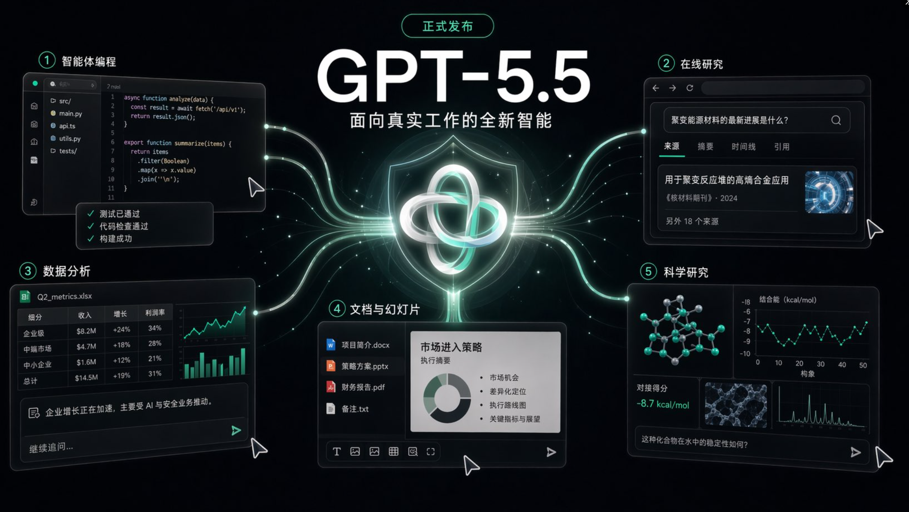

# GPT-5.5 刚发布，AI 大模型真正卷到“干活”了

过去一年看模型发布，很多人习惯先问一句：跑分涨了多少？是不是又秒杀了？

但 GPT-5.5 和 Opus 4.7 放在一起看，真正值得关注的不是“谁又赢了一张榜”，而是一个更大的变化：**模型厂商终于把主战场从聊天框，挪到了真实工作台。** 🧑‍💻

写代码、查资料、分析数据、改文档、做表格、操作软件、调用工具、跑完验证，这些才是下一代 AI 的核心战场。

你读完这篇，带走一个判断就够了：**未来最贵的模型，不是最会回答的模型，而是最能把复杂任务推进到结束的模型。** 🚀

## 1. GPT-5.5 到底是什么？🧠

OpenAI 官方把 GPT-5.5 定位为“面向真实工作的智能”。这句话听起来很大，但翻译成人话就是：

**它不是只负责给你一个答案，而是更擅长自己规划、用工具、查资料、写代码、检查结果，然后继续往前走。**

这几个点最关键：

- 🧩 **更强的 Agentic Coding**：OpenAI 称 GPT-5.5 是目前最强的 agentic coding 模型，在 Terminal-Bench 2.0 上达到 82.7%，SWE-Bench Pro 为 58.6%。
- 🖥️ **更强的电脑使用能力**：OSWorld-Verified 上 GPT-5.5 为 78.7%，和 Opus 4.7 的 78.0% 非常接近。
- 🔎 **更强的工具与浏览能力**：BrowseComp 上 GPT-5.5 为 84.4%，GPT-5.5 Pro 为 90.1%。
- 💰 **API 还没完全放开**：ChatGPT 和 Codex 已开始推送；API 官方说“very soon”，价格将是 gpt-5.5 输入 5 美元/百万 token、输出 30 美元/百万 token，gpt-5.5-pro 则贵很多。

所以，GPT-5.5 的关键词不是“聊天更自然”，而是：**跨工具执行、少返工、能收尾。** ✅

## 2. Opus 4.7 强在哪里？🟠

Anthropic 的 Claude Opus 4.7 早一周发布，关键词也很明确：编码、Agent、长任务、专业文档。

它最值得注意的不是某个单点跑分，而是 Anthropic 一直在强化的那种“稳”：

- 🧱 **1M 上下文窗口**：适合大代码库、长文档、多天项目。
- 🧑‍🔧 **长时间工程任务**：官方强调它能更稳定地处理复杂、多步骤任务，会在汇报前验证自己的输出。
- 🎨 **更好的视觉与专业交付**：Anthropic 提到它能看更高分辨率图片，在界面、幻灯片、文档上更有审美。
- 💵 **价格保持 Opus 4.6 水平**：输入 5 美元/百万 token，输出 25 美元/百万 token。

但这里也要补一句冷水：Anthropic 文档提示，Opus 4.7 使用新 tokenizer，同样文本最多可能多出 35% token。也就是说，**标价没涨，不代表真实账单一定不变。** 🧾

## 3. GPT-5.5 vs Opus 4.7，怎么理解？⚔️

我的判断很简单：

**GPT-5.5 更像“跨工具总控台”，Opus 4.7 更像“高级工程搭档”。**

如果你看 OpenAI 自己公布的横向表，GPT-5.5 在 Terminal-Bench、BrowseComp、FrontierMath、CyberGym 等项目上都压过 Opus 4.7；但在 SWE-Bench Pro 这种真实 GitHub issue 修复任务上，Opus 4.7 的 64.3% 高于 GPT-5.5 的 58.6%。

这说明什么？

不是一句“谁吊打谁”能概括。

更像是两种路线：

**OpenAI 在押“工作流入口”。** ChatGPT + Codex + 工具调用 + 即将到来的 API，想让 GPT-5.5 变成你做复杂任务时的总控台。你不一定只让它写代码，还会让它查资料、跑命令、改表格、整理结果。

**Anthropic 在押“长程可靠性”。** Opus 4.7 的叙事一直围绕复杂代码库、长上下文、严格指令、少犯低级错。它不一定在每个综合榜单上最亮眼，但很适合丢给它一块难啃的工程任务。

## 4. 普通用户怎么选？📌

如果你只是日常问答、写文案、做总结，先别焦虑。GPT-5.5 和 Opus 4.7 都是重型模型，不一定每个小任务都值得上。

如果你是开发者，我会这样选：

- 👨‍💻 **复杂代码库改造、长时间 debug、代码审查**：优先试 Opus 4.7，也值得同时用 GPT-5.5 对照。
- 🧭 **需要查资料、调工具、跨文件推进、最后交付结果**：优先试 GPT-5.5。
- 🏢 **企业工作流、文档、表格、研究、软件操作混在一起**：GPT-5.5 的想象空间更大。
- 🧾 **大上下文、长文档、稳定执行**：Opus 4.7 仍然非常有竞争力。

一句话：**不要按品牌选模型，要按任务形态选模型。**

## 结尾：大模型战争进入“交付时代”了

这轮发布最重要的信号，不是 GPT-5.5 又强了，也不是 Opus 4.7 又稳了。

真正的信号是：**AI 公司开始集体承认，光会回答已经不够了。**

下一阶段的模型，要能接住混乱需求，拆成步骤，使用工具，检查结果，处理失败，最后把东西交出来。

所以我更愿意把 GPT-5.5 和 Opus 4.7 看成同一个趋势的两面：

**一个在抢工作入口，一个在抢高难任务。一个像总控台，一个像老练搭档。**

接下来真正值得看的，不是谁发布会更会讲，而是谁能在你的真实项目里少返工、多收尾、少让你擦屁股。🔥

---

参考来源：OpenAI GPT-5.5 发布页、GPT-5.5 System Card、Anthropic Claude Opus 4.7 发布页、Claude Opus 产品页、Anthropic pricing docs。

*AI 辅助创作，人工核验与编辑。*
