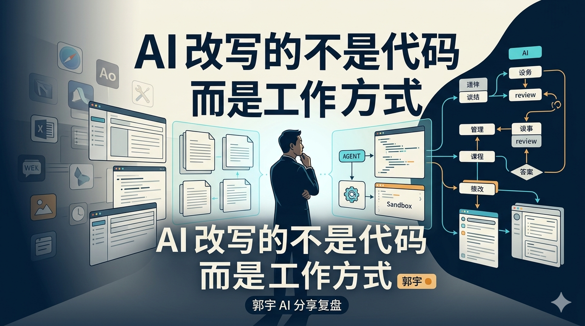

# 看完郭宇这场 AI 分享，我更确定了：最先被改写的不是代码，而是工作方式

最近看完郭宇这场字节内部 AI 分享会的智能纪要。

原本以为会是一场偏技术向的 Web Coding 分享，结果读完以后，真正留下来的不是某个工具名字，而是一种更强烈的判断：

**AI 正在吞掉的不是某一类软件，而是我们过去理解“软件、组织和工作”的方式。**

这场分享从 AI 编程讲到一人公司，从 Agent 基础设施讲到人生选择。信息量很大，但如果只把它当成一份会议纪要，反而会错过最重要的部分。

我更想把它整理成一篇普通人也能带走的文章：不追每一个新模型，不复述每一个产品名，而是拆清楚这场分享背后最值得记住的 5 个判断。

## 1. 🚀 这不是“AI 写代码更快”，而是软件开发关系被重新排列

郭宇在分享里提到，今年可能是 AI 非常关键的一年，软件开发范式正在发生巨大变化。

以前的软件开发是什么样？

产品经理把需求讲清楚，设计师画出流程和界面，工程师把需求拆成模块，再一行一行写成代码。哪怕后来有了 Copilot，本质上也只是把 Stack Overflow、代码补全、局部修改这类能力嵌进开发流程里。

但现在变化不一样了。

AI 不再只是“帮你写一段代码”的工具，而是在变成能理解项目、读取文档、拆分任务、调用环境、修改多文件、甚至接管一部分电脑操作的 Agent。

这背后的真正变化是：

> **软件不再只是一个被提前设计好的交付物，而越来越像一次“意图被执行后的临时结果”。**

过去我们问的是：“这个功能怎么开发？”

以后更重要的问题可能变成：“我能不能把目标、约束、上下文和验收标准讲清楚，让 AI 自己把中间过程跑出来？”

这就是为什么这场分享里反复出现“文档”“沙箱”“Agent”“Matrix”“渲染 API”这些词。它们听起来很技术，但共同指向同一件事：

**软件正在从固定应用，变成按需生成的工作流。**

## 2. 🧑‍🚀 “一人公司”不再只是鸡血，而是组织成本真的在下降

这场分享里有一个特别值得放大的判断：AI 让一人公司第一次变得非常具体。

以前工程师出身的创始人最难的是什么？

不是不会写代码，而是一个公司不能只有代码。你需要产品、设计、前端、后端、测试、运维、客服、市场、销售、财务，任何一个环节缺了，项目都很容易卡住。

所以很多人不是没有想法，而是被组织成本拦住了。

但郭宇这次分享里的实践很有冲击感：根据纪要，他从 2025 年 11 月开始 Web Coding，到分享时已经写了 23 个产品，上线 12 个，代码量约 130 万行。前期主要和 Claude Code 合作，后面开始使用 Agent Matrix 里的 one man take over 能力，让 Agent 克隆仓库、推演产品方向、排查 bug、筛选分支并做 review。

这当然不是说每个人明天都能一个人开公司。

真正重要的是，**一个人能调动的“虚拟组织能力”正在变大。**

以前一家公司最小也要几个人才能转起来。现在，一个人如果能把需求写清楚，把任务拆好，把反馈闭环跑起来，就可能拥有一支临时的 AI 小队。

这对大公司也是压力。

因为大公司过去的优势来自人才密度、流程、资金和组织机器。但当一部分执行能力被 AI 商品化后，小团队的速度会突然变得很可怕。不是因为小团队资源更多，而是因为它们更容易换工作方式。

这也是我读完这场分享后最想记住的一句话：

> **AI 时代的创业门槛，不是简单降低了，而是从“我有没有团队”，变成了“我会不会组织一群 Agent 做事”。**

## 3. 🤝 把模型当同事，不是玄学，而是一种新的工作方法

郭宇在分享里提到一个很有意思的认知转变：不要只把语言模型当工具，而要把它当成同事、当成一个独立个体来对待。

这句话乍一听有点抽象，但放到工作里非常实际。

如果你把 AI 当工具，你就会下意识这样用它：

- 扔一个问题过去。
- 等一个答案回来。
- 不满意就重问。
- 好像它只是一个更聪明的搜索框。

但如果你把 AI 当同事，动作就完全不同了：

- 你会给它背景，而不是只给一句命令。
- 你会告诉它目标和边界，而不是只让它“帮我写一下”。
- 你会给验收标准，而不是只看它第一版写得顺不顺。
- 你会复盘它哪里做得好、哪里跑偏，让下一轮更准。

这其实非常像管理一个新人，只不过这个新人记忆力强、速度快、能同时处理很多细节。

纪要里还提到，郭宇会和 Claude Code 进行很长时间的交流，其中 60% 到 70% 的时间都在互相理解。他从这种长程对话里获得灵感，解决了现实里很难找到人进行深度、长期、低摩擦讨论的问题。

这件事对普通人的启发非常直接：

**AI 用得好不好，不只取决于模型能力，也取决于你有没有把协作方式升级。**

一个只会提问的人，得到的是答案。

一个会定义任务、补充上下文、设置验收、持续反馈的人，得到的才是工作流。

## 4. 🧱 下一波机会，不只在应用层，而在 AI 原生基础设施

很多人聊 AI 创业，第一反应还是做一个应用：AI 写作、AI 搜索、AI 图片、AI 视频、AI 助理。

但郭宇这场分享里更让我注意的，是他对基础设施的关注。

纪要里提到，他介绍了 Web lab、Resso、morphic 等产品，也提到了针对 Agent 的基础设施，比如基于 Micro VM 的云服务、代理密钥和本地命令行工具的实验性产品，以及围绕 Agent Matrix 的大量探索。

这些名词不需要每个都记住。真正值得记住的是它们背后的方向：

**当 AI 真的要替人完成事务，它就不能只停留在聊天框里。它需要环境、权限、沙箱、记忆、工具、审查和交付系统。**

换句话说，未来的关键问题不是“我能不能让模型说出答案”，而是：

1. 它能不能安全地执行？
2. 它能不能在隔离环境里试错？
3. 它能不能调用真实工具？
4. 它能不能留下可审查的过程？
5. 它能不能和其他 Agent 协同？

这就是为什么“推理 + 沙箱 + Agent 工作流”会越来越重要。

在应用层，大家很容易做出相似的壳；但在基础设施层，真正难的是把执行链路跑稳。谁能让 Agent 安全、低成本、可控地完成真实任务，谁就更接近下一代软件的入口。

这一点对普通开发者也很重要。

不要只盯着“我还能做一个什么 AI App”。更值得问的是：

**如果未来 Agent 会替人工作，它在工作时最缺的那块基础设施是什么？**

## 5. 🌊 对普通人来说，最该改变的不是职业身份，而是默认动作

这场分享后半段还有很多关于财富、投资、人生选择的问答。

这些内容很容易被整理成“郭宇的人生建议”，但我觉得更值得提炼的是一种做事方式。

有人问，如果财富清零、30 岁重新开始，会做什么？

纪要里郭宇的回答很有意思：他强调享受做事过程，同时做事和宣传要同步进行，让更多人知道你在做什么，扩大“幸运面积”。

这句话很实在。

很多人把人生选择想得太像一次押注：我要不要创业？要不要离开大厂？要不要去硅谷？要不要 All in AI？

但真正能让概率变好的，往往不是一次壮烈选择，而是一套持续动作：

- 你有没有尽早进入真实场景？
- 你有没有把学习变成作品？
- 你有没有让作品被更多人看见？
- 你有没有把反馈变成下一轮迭代？
- 你有没有靠近技术变化最密集的地方？

创业当然是机会，但不是每个人都适合立刻裸辞。

在大厂工作也不是坏事，前提是你真的在学习一个组织如何运转，而不是只被流程消耗。真正危险的不是你今天在哪里，而是你还在用昨天那套方法理解工作。

如果把郭宇这场分享压缩成普通人能马上执行的版本，我会写成 5 个动作：

1. **这周就上手一次 Web Coding。** 不要围观，拿一个真实小任务试。
2. **把需求写成文档。** 训练自己用目标、上下文、约束和验收标准表达任务。
3. **把 AI 当协作者。** 不要只要答案，要让它参与拆解、执行、检查和复盘。
4. **公开自己的过程。** 写笔记、发总结、做 demo，扩大幸运面积。
5. **盯住基础设施。** 少做同质化壳，多观察 Agent 真正执行任务时缺什么。

## 结尾：AI 不是替你工作，而是逼你重做工作系统

读完这场分享，我最大的感受不是“又有一批新工具要学”，而是更确定了一件事：

**未来真正拉开差距的，不是会不会用某个模型，而是能不能把想法变成文档，把文档变成任务，把任务交给 Agent，把 Agent 的结果变成可交付的作品。**

这条链路一旦跑通，一个人的生产力就不再是一个人的生产力。

所以，AI 时代最危险的状态，可能不是失业，也不是错过某个风口，而是你已经看见了变化，却还在用旧的软件观、旧的协作方式、旧的职业惯性继续工作。

郭宇这场分享真正提醒我的，是一句很简单的话：

> **不要只学习 AI 工具，要重做自己的工作系统。**

当软件开始按意图生成，当 Agent 开始接管执行，当一人公司从想象变成实践，真正值得准备的不是下一次热点，而是你能不能成为那个会组织 AI 做事的人。
