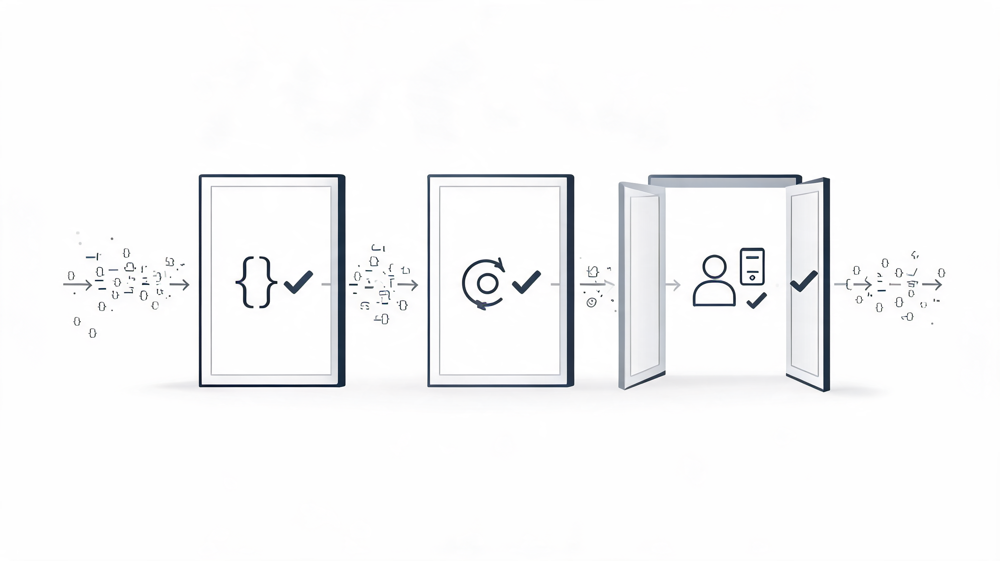
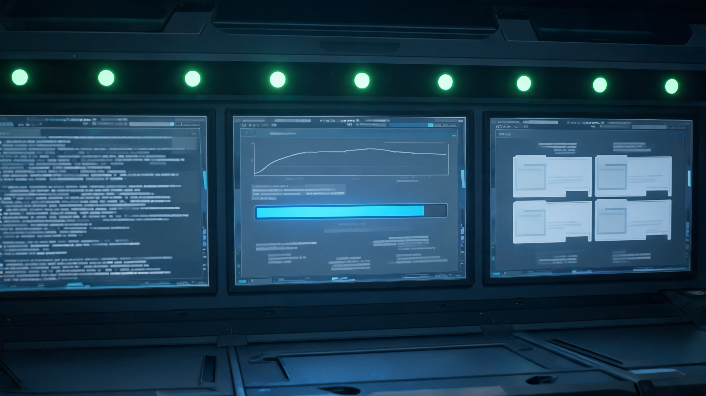

# 从 Prompt 到 Harness：Claude官方学习资料

最近我把 Learn Harness Engineering 这套课系统读了一遍，越读越觉得它戳中了很多人用 AI 写代码时最尴尬的那一幕。

你让 Agent 改一个真实项目，它确实动得很快：一会儿加接口，一会儿改前端，一会儿补测试。二十分钟后它自信地告诉你“完成了”。你打开一看，测试没跑通，边界条件没处理，甚至还顺手改了几个不该改的文件。

这时候很多人的第一反应是：模型不行，换更强的。

但这套课给出的判断更刺耳：**很多 AI 编码翻车，不是模型能力不够，而是你的仓库没有给它一套能可靠工作的系统。**

换句话说，今天真正拉开差距的，已经不只是 Prompt Engineering，也不只是 Context Engineering，而是 Harness Engineering：给 Agent 配一副能跑长途的马鞍。

这篇不打算把课程逐讲复述一遍。我更想把它压缩成一套普通团队今天就能用的自检框架：你的 AI Agent 到底是“裸跑”，还是已经被一套工程系统接住了。

## 一、模型很强，不等于执行可靠

现在很多人对 AI 编程的误解是：只要模型足够强，它就应该自己把事情做好。

这个期待听起来合理，但在真实工程里很危险。

OpenAI 在 2026 年的 Harness Engineering 文章里讲过一个很激进的实验：他们从一个空的 git 仓库开始，让 Codex 参与构建一个真实内部产品。五个月后，这个仓库长到了约百万行代码，约 1500 个 PR 被打开并合并，驱动它的起初只是一个很小的工程师团队。

这组数字容易让人兴奋，但真正值得看的不是“AI 写了多少代码”，而是后半句：工程师的主要工作不再是亲手写代码，而是设计环境、表达意图、构建反馈循环。

这就是关键差别。

**AI 写代码快，只是速度问题；AI 写出来能不能被验证、被接手、被修正，才是工程问题。**

很多团队卡住，不是因为没有最贵的模型，而是因为 Agent 进仓库之后像一个新员工被蒙着眼睛上岗：

- 不知道项目怎么启动。
- 不知道测试该怎么跑。
- 不知道哪些架构边界不能碰。
- 不知道上一次做到哪。
- 不知道“完成”到底要用什么证据证明。

你让它“加个搜索功能”，它会开始猜：搜什么，怎么分页，要不要高亮，接口格式是什么，哪里写测试。猜对了叫智能，猜错了叫返工。

所以这套课最重要的第一句话，其实可以改写成这样：

**别急着骂模型，先检查你的仓库有没有给 Agent 一张地图。**

## 二、Harness 不是一个提示词文件，而是一套工作系统

很多人听到 Harness，第一反应是：是不是写一个更长的 `AGENTS.md` 或 `CLAUDE.md`？

不是。

一个巨大的提示词文件，最多算“说明书”。而真正的 Harness，更像一间能出菜的厨房。

课程里把它拆成五个子系统，我觉得非常好用：

**指令子系统**：告诉 Agent 这个项目是什么、技术栈是什么、哪些规则不能违反。

**工具子系统**：让 Agent 能读文件、跑命令、看日志、打开浏览器，而不是只靠脑补。

**环境子系统**：让依赖、运行时、启动方式都可复现。不要让 Agent 把上下文浪费在“为什么 npm 装不上”这种地板问题上。

**状态子系统**：让长任务有进度记录、决策记录、功能状态，而不是每次新会话都从失忆开始。

**反馈子系统**：让测试、lint、构建、端到端验证能告诉 Agent 它到底做对没有。

这五个里面，最容易被低估的是反馈。

很多 Agent 失败，不是因为它不会写，而是因为它没有“批改作业”的系统。它写完之后只能看一眼代码，觉得“差不多”，然后宣布完成。

这就像学生自己给自己判卷。不是一定不行，但你最好别把生产系统押在他的自信上。

## 三、仓库要成为唯一事实来源

Learn Harness Engineering 里反复强调一个原则：仓库是唯一事实来源。

这句话听起来像老派工程管理，但在 Agent 时代突然变得非常现实。

因为对 Agent 来说，**它看不到的东西，就等于不存在。**

你的架构约定在 Slack 里，不存在。

你的上线禁忌在某个老员工脑子里，不存在。

你的错误处理模式在三个月前的会议纪要里，不存在。

你的“我们项目一直不用这个库啊”如果没写进仓库，也不存在。

所以一个对 Agent 友好的仓库，不是文档越多越好，而是信息放得对：

- 根目录有短小的入口文件，像地图目录，而不是百科全书。
- 重要约束靠近代码，谁负责谁附近就有说明。
- 架构决策、验证命令、启动流程、交接记录，都放在可版本化的文件里。
- 过时文档要被清掉，不然它比没有文档更危险。

OpenAI 的经验也很直接：短 `AGENTS.md` 做目录，详细知识放进结构化 `docs/`，再用自动检查保证这些文档没有腐烂。

这背后的判断很硬：

**Agent 不是缺少更多指令，而是缺少可发现、可验证、可维护的事实来源。**

把所有东西塞进一个 600 行的超级指令文件，反而会出问题。上下文被占满，关键约束埋在中间，优先级混在一起，旧规则没人删，最后变成一座规则垃圾场。

好的入口文件应该像机场指示牌：告诉你去哪，不要把整座城市的历史都刻在上面。

## 四、长任务最怕的不是慢，是失忆

短任务里，Agent 可以靠一次上下文硬冲。

长任务不行。

Anthropic 在 long-running agents 的研究里讲得很形象：复杂项目会跨越多个上下文窗口，而每个新会话天生没有上一班工程师的记忆。如果没有交接机制，新会话就得先花大量时间猜上次发生了什么。

更糟的是，Agent 还容易出现两种相反但经常同时发生的问题：

一种叫过度延伸：它一次开太多坑。

另一种叫不足完成：坑很多，但真正跑通的很少。

这就是很多人用 AI 写项目的真实体验：代码量涨得很快，完成度涨得很慢。

课程给出的解法非常朴素：WIP=1。

一次只做一个功能。做完、验证、记录，再做下一个。

听起来不像 AI 时代的高速方法论，但恰恰是最适合 Agent 的默认安全设置。因为 Agent 最大的问题不是不勤奋，而是太勤奋地把事情做散。

这里最值得抄的工具是功能清单。

每个功能至少有三个字段：

- 行为描述：用户能做什么。
- 验证命令：怎么证明它真的能做。
- 当前状态：未开始、进行中、阻塞、已通过。

注意，状态不能靠 Agent 自己随手改。只有验证命令跑过，才能从“进行中”变成“已通过”。

这件事的意义很大。

它把“完成”从一句主观声明，变成了一个状态机。

## 五、Agent 最危险的一句话是“我完成了”

如果你经常用 Agent 写代码，一定见过这句话：

“我已经完成了实现，并且所有功能都正常工作。”

这句话不能说没价值，但不能当证据。

课程里把这个问题叫“过早宣告胜利”。我觉得这是 AI 编码里最常见、也最容易被忽略的失败模式。

因为 Agent 的自信，常常来自局部代码判断：文件改了，类型看起来对，单元测试也许过了，于是它觉得任务结束。

但真实系统的正确性，往往藏在边界上。

前端传的是相对路径，预加载脚本要绝对路径；单元测试都 mock 了，所以都过了，端到端一跑才炸。

数据库迁移改了表结构，缓存层还拿着旧结构；服务层测试过了，真实流程一跑状态不一致。

邮件发送、支付回调、文件导出、权限校验，这些东西单独看都能“像是对的”，合起来才知道有没有跑通。

所以 Harness 里必须有三层终止检查：

第一层，静态检查：语法、类型、lint。

第二层，运行时验证：服务能不能启动，关键路径能不能执行。

第三层，系统级确认：像真实用户一样走一遍端到端流程。

这一层不是锦上添花。它会反过来改变 Agent 写代码的行为。

当 Agent 知道最后一定要被端到端验证，它就会更早考虑组件之间怎么接、错误路径怎么处理、架构边界怎么守。

**验证不是收尾动作，验证会塑造实现方式。**

这也是为什么很多团队加了 E2E 之后，不只是 bug 变少了，Agent 写出来的代码也更像“完整功能”，而不是一堆看起来合理的片段。

## 六、可观测性和清洁状态，是长跑的护栏

如果说测试回答的是“结果对不对”，可观测性回答的是“为什么不对”。

没有日志、追踪、健康检查、运行截图，Agent 失败以后只能盲修。它会在错误方向上来回试，修了不相关的路径，浪费 token，也浪费你的耐心。

课程里还有一个我很喜欢的说法：可观测性分两层。

一层是运行时可观测性：系统启动了吗，接口返回了吗，关键路径有没有走完，日志里报了什么。

另一层是过程可观测性：这次任务的范围是什么，验收标准是什么，排除项是什么，评分标准是什么。

前者像仪表盘，后者像施工合同。

只有仪表盘没有合同，Agent 可能知道车坏了，但不知道今天到底要开到哪。

只有合同没有仪表盘，它知道目标，但不知道车现在是不是冒烟。

最后还有一个很朴素但很重要的要求：每次会话结束前，都要留下清洁状态。

清洁状态不是“我大概做完了”，而是五件事：

- 构建通过。
- 测试通过。
- 进度更新。
- 临时垃圾清掉。
- 下一个会话能直接启动。

这件事听起来像家务活，但对 Agent 项目非常关键。因为 AI 的吞吐量越高，熵增越快。你今天留下一个半成品，明天下一个 Agent 会在它上面继续叠，最后整个仓库变成谁也不敢动的迷宫。

**AI 不是在替你逃离软件工程，它是在放大你的软件工程。**

工程底子好，放大的是速度。

工程底子差，放大的是混乱。

## 最后，别先换模型，先做这 5 个动作

如果你已经在用 Codex、Claude Code、Cursor 或其他 coding agent，我建议别从“大改工作流”开始。

先花 30 分钟做一个最小 Harness。

第一，写一个短 `AGENTS.md`。只放项目是什么、怎么启动、怎么测试、哪些硬约束不能碰、更多文档去哪看。

第二，把验证命令写清楚。不要只说“跑测试”，写成具体命令：`npm test`、`npm run lint`、`npm run build`、`pytest`，哪个是快速验证，哪个是完整验证。

第三，建一个 `feature_list.json`。每个功能都写行为描述、验证方式、状态。让 Agent 一次只推进一个。

第四，建一个进度文件。每次会话结束写清楚：完成了什么、验证结果、阻塞项、下一步。

第五，给“完成”设闸门。没有验证证据，不允许说完成。

这五件事不酷，也不玄学。

但它们会决定你的 Agent 是一个到处乱撞的实习生，还是一个能被系统接住、能持续交付的工程同事。

所以，下次 AI 写代码翻车时，先别急着问“是不是该换模型”。

更好的问题是：

**我有没有给它马鞍、地图、验收口和交接本？**

没有的话，先补这个。

因为在 Agent 时代，真正值钱的可能不是“谁更会提示 AI”，而是“谁更会设计让 AI 可靠工作的环境”。

---

本文基于 Learn Harness Engineering 中文课程、OpenAI Harness Engineering 文章，以及 Anthropic 关于 long-running agents 和 harness design 的工程文章整理写作。AI 辅助创作，人工审核编辑。
