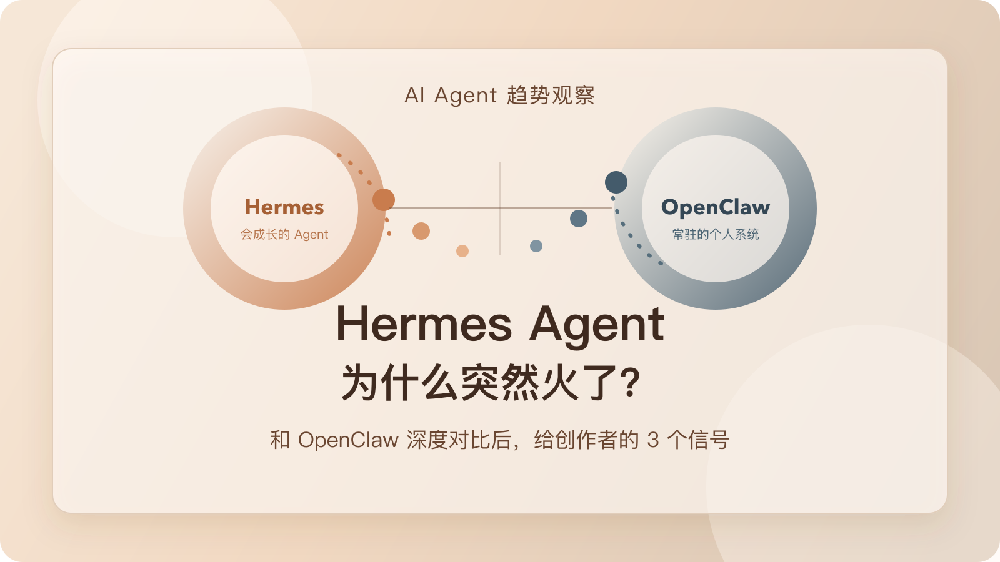

# Hermes Agent 为什么突然火了？和 OpenClaw 深度对比后，我更想提醒创作者这 3 个信号

这两天如果你在刷 AI Agent 相关内容，应该已经很难绕开 Hermes Agent 了。

一边是它的官方 release、解读文章、体验帖在密集出现；另一边，是越来越多原本在用 OpenClaw 的人开始讨论“要不要迁过去”“能不能两边一起跑”“它到底强在哪”。到了 2026 年 4 月 13 日，这已经不是一个小圈子里的工具更新，而是一波足够明显的产品热度。

我的判断很直接：**Hermes Agent 这次火起来，真正重要的不是它已经在体量上压过 OpenClaw，而是它把 Agent 的卖点，从“功能很多”改写成了“会自己长大”。**

如果你是普通内容创作者，这件事特别值得注意。因为它意味着 AI Agent 的竞争，开始从“极客能不能把它装起来”，转向“普通人愿不愿意把它放进自己的日常工作流”。这篇文章我想拆清 3 件事：

1. Hermes Agent 为什么突然火。
2. 它和 OpenClaw 的深层差异到底在哪。
3. 这波热度对普通创作者意味着什么。

## 1. 这波 Hermes Agent 热起来，火的其实不是体量，而是叙事

先说一个很容易被忽略的事实：如果只看 GitHub 体量，截至 2026 年 4 月 13 日，OpenClaw 仍然明显更大。

- OpenClaw GitHub 仓库显示约 `356k` Star，最新稳定版发布时间是 2026 年 4 月 11 日，4 月 12 日还有新的 beta 预发布。
- Hermes Agent GitHub 仓库显示约 `73.2k` Star，最新 `v0.8.0` 发布时间是 2026 年 4 月 8 日。

所以如果你只按“谁更大”来理解这波热度，很容易看偏。

Hermes Agent 真正接住这波讨论的，不是“它比 OpenClaw 更庞大”，而是**它更容易被一句话讲清楚**。

你看 OpenClaw 的官方自我定义，更接近“你自己的个人 AI 助手”，强调的是：

- 任何系统、任何平台都能接。
- 可以跑在 WhatsApp、Telegram、Slack、Discord、WeChat 等一堆渠道里。
- Gateway 是控制平面，外面还有 Canvas、节点、插件、记忆、路由这些完整系统。

这套东西很强，但它天然像一整个平台。你要理解它，脑子里得先建立一套“系统图”。

而 Hermes Agent 的传播点就简单得多。它主打的是：

- Skills 可以按需加载。
- 技能本身可以被 Agent 修改。
- 内置记忆一直在线，还能接更多外部记忆提供方。
- API Server、Open WebUI、CLI、消息入口都能共用一套 Agent 能力。

也就是说，**Hermes Agent 给人的第一感受不是“功能很多”，而是“它会越用越像你”。**

这句话对普通创作者的杀伤力，比“支持多少渠道、多少插件、多少节点”大得多。因为后者像系统能力，前者像个人收益。

## 2. Hermes Agent 为什么会突然被密集转述

我把最近几篇官方资料、中文解读和社区对比看下来，Hermes Agent 这波热度至少踩中了 4 个点。

### 1. 它把 Agent 说成了“可积累的个体”，而不是“可部署的系统”

Hermes Agent 官方仓库直接写的是：`The agent that grows with you`。

这句话特别狠。因为它不是在卖工具，而是在卖一种复利关系。

对普通人来说，“会成长”比“可配置”更容易理解；对创作者来说，“会越来越像我”比“能接更多接口”更容易产生代入感。

这也是为什么最近很多讨论不是在问“它支持不支持某个配置”，而是在问：

- 它能不能把我的工作方式沉淀下来？
- 我是不是能用久了以后少重复解释？
- 它是不是比以前那种一次性工作流更像长期搭档？

一旦讨论从“怎么装”转到“能不能越用越值钱”，热度就不再只是极客圈内部的热度了。

### 2. 它把“成长”这件事落在了技能和记忆上，而不是只停留在口号

Hermes Agent 文档里有两个设计特别关键。

第一个是 `Skills System`。官方文档明确写到，skills 是按需加载的知识文档，Agent 甚至可以修改或删除技能本身。

第二个是记忆系统。官方文档提到，Hermes 自带内置记忆，而且这层记忆始终开启；如果你需要，还可以继续接外部记忆提供方。

这两个设计合在一起，传达的不是“我支持很多功能”，而是：

**我不仅能帮你做事，还能把做事的方法继续留下来。**

这就是为什么 Hermes Agent 更容易被写成“自进化 Agent”，而不是普通的本地 Agent。

### 3. 它的入口叙事更轻

Hermes Agent 一边有 CLI，一边可以通过 API Server 接 Open WebUI 这类熟悉前端，而且官方文档明确说明：前端接过来之后，用的仍然是同一套 tools、memory 和 skills。

这件事很重要。因为它降低了很多人的心理门槛。

很多工具的问题不是功能不够，而是用户第一眼就觉得“这玩意像运维系统，不像我的工作台”。Hermes Agent 在入口层做的事情，就是尽量别让第一次接触的人先被系统结构吓跑。

### 4. 它最近的版本节奏也确实在给热度加柴

2026 年 4 月 8 日发布的 `v0.8.0` 里，官方列出的重点更新包括：

- 后台任务完成后自动通知。
- 会话中途切换模型。
- 对 GPT / Codex 工具调用做了专项优化。
- 原生接入 Google AI Studio。
- MCP OAuth 2.1 和安全加固。

这几件事拼在一起，会让人感觉这个项目不是“概念很新”，而是“最近确实在变得更能用”。

一个项目能不能持续热，不只看愿景，也看更新是不是不断把愿景落回真实体验。Hermes Agent 这次刚好两样都接住了。

## 3. 和 OpenClaw 深度对比后，我反而更确定：它们不是同一类产品

现在很多文章喜欢写成“谁替代谁”，但我越看越觉得，这样写太浅了。

我的判断是：**Hermes Agent 和 OpenClaw 不是同一阶段的产品，也不在卖同一种安心感。**

### 1. Hermes Agent 卖的是“成长感”

Hermes Agent 最有传播力的地方，是它让用户觉得：

- 我不是在装一个功能盒子。
- 我是在培养一个会越来越懂我的 Agent。

技能、记忆、任务、前端入口，最后都在为这个感受服务。

它更像一个会积累经验的工作伙伴。

### 2. OpenClaw 卖的是“在场感”

OpenClaw 的官方定位一直更像个人 AI 助手基础设施。

它强的地方不是一句“会成长”，而是：

- 可以常驻在很多消息渠道里。
- 有 Gateway 这一层控制平面。
- 有 Canvas / A2UI、节点能力、插件系统、频道路由。
- 记忆不只是一个缓存，而是能继续长出 wiki、搜索和更复杂的持久层。

OpenClaw 最近的 release 也能看出这个方向。4 月 11 日稳定版、4 月 12 日 beta 里，很多更新都在修插件加载边界、强化 memory recall、完善 dreaming 和 auth、修 keepalive 与 gateway 行为。

这说明它在做的事，不只是“让 Agent 更聪明”，而是**让一个长期在线、跨渠道、可治理的个人助手系统更稳。**

换句话说，OpenClaw 更像一座基础设施，Hermes Agent 更像一个会成长的个体。

### 3. 一个更像“个人工作流”，一个更像“个人系统”

这是我觉得两者最值得普通创作者看懂的地方。

如果你今天最想解决的是：

- 写作、研究、选题、资料整理这些高频任务；
- 想让一个 Agent 逐步学会你的方法；
- 希望入口轻一点，先把一两个工作流跑顺；

那 Hermes Agent 的叙事和方向会更有吸引力。

但如果你想要的是：

- 一个长期在线、能在多个渠道里接住你的助手；
- 更强的控制面、路由、插件、可观察性；
- 不只是“帮我做一次”，而是“全天候作为我的数字分身存在”；

那 OpenClaw 仍然很有自己的位置。

所以这不是“旧王被新王替代”，而更像是：

**Agent 产品开始分叉了。有人往“会长大的个体”走，有人往“常驻的个人系统”走。**

## 4. 对普通内容创作者来说，这波热度最该看懂的 3 个信号

如果你不是开发者，而是写内容、做播客、做选题、做课程、做研究整理的人，我觉得最该带走的是下面 3 个信号。

### 信号一：以后真正值钱的，不是 Agent 会多少功能，而是它能不能持续积累你的方法

过去大家比的是：

- 能不能调用终端。
- 能不能接 MCP。
- 能不能自动执行。

以后更值钱的问题会变成：

- 它有没有办法沉淀我的判断标准？
- 它能不能少让我重复解释？
- 我用得越久，它是不是真的更像我，而不是只是保留聊天记录？

这也是为什么 Hermes Agent 这波热度，不该只被看成“又一个替代 OpenClaw 的项目”，而该被看成“市场开始奖励复利型 Agent 叙事”。

### 信号二：入口会越来越重要，尤其是对非技术用户

工具能力继续增强是确定的，但真正分胜负的，往往不是能力多一点，而是第一天能不能进去，第七天还会不会继续用。

Hermes Agent 最近容易被转述，一个很大的原因就是它在入口层看起来更轻；OpenClaw 则更像一套完整系统，理解成本高，但长期能力也更完整。

对创作者来说，这个判断很现实：

**你不需要一上来就追“最全”的系统，你更需要先找到那个最容易进入你日常节奏的入口。**

### 信号三：未来不会只剩一个赢家，而是会出现更细的分工

很多人一看到新项目火，就会下意识问“是不是该全面迁移”。

但最近社区里最有意思的一类讨论，恰恰不是“二选一”，而是“两边一起跑，各自承担不同任务”。

这件事其实很正常。因为当 Agent 从玩具变成系统之后，你本来就不太可能再用“一把锤子打所有钉子”的方式处理全部任务。

以后更可能出现的是：

- 一个偏创作与研究的主 Agent。
- 一个偏消息接入与常驻协作的系统 Agent。
- 甚至一个偏审核、一个偏执行、一个偏整理。

所以别急着站队。Agent 赛道会先分工，再分胜负。

## 5. 如果你是普通创作者，现在最值得做的不是迁移，而是先跑这张判断清单

如果你现在也在犹豫要不要跟 Hermes Agent，这里有一张我觉得更实用的判断清单。

### 更适合先看 Hermes Agent 的情况

1. 你想先围绕写作、研究、选题、整理，跑通 1 到 2 个核心工作流。
2. 你更在意“越用越懂我”，而不是“一上来就接入所有渠道”。
3. 你希望入口轻一点，先获得使用信心，再逐步加深配置。

### 更适合继续留在 OpenClaw 的情况

1. 你已经在多个消息渠道里稳定使用助手。
2. 你需要更强的 Gateway、路由、插件和可治理能力。
3. 你要的不是一个“会成长的工具”，而是一套“长期在线的个人系统”。

### 两边都不用急着重投的情况

1. 你现在连一个固定的高频工作流都还没有。
2. 你只是被热度带着走，还没想清楚到底要让 Agent 帮你解决什么。
3. 你目前最缺的不是工具，而是任务结构和使用习惯。

这张清单背后，其实就一句判断：

**真正重要的，不是哪一个更像“最强 Agent”，而是哪一个更快进入你的日常工作，并开始替你积累上下文。**

## 6. 最后，把这波 Hermes Agent 热度压缩成一句判断和 3 个动作

如果只能带走一句话，我会带走这句：

**Hermes Agent 这次火起来，说明 Agent 赛道开始从“谁功能更全”转向“谁更容易成为你的长期搭档”。**

如果把它落成今天就能做的 3 个动作，我会建议你：

1. 不要只看谁更火，先写下你希望 Agent 接管的 1 个高频任务。
2. 不要只比功能表，连续试 7 天，观察它有没有减少你重复解释的次数。
3. 不要急着迁移全部，把“创作工作流”和“消息渠道助手”分开判断。

很多热点最后都会过去，但每一轮热点都会提前泄露一点未来的方向。

Hermes Agent 这次给出的信号，我觉得已经足够清楚了：

真正开始改变市场的，不是又多了一个 Agent，而是越来越多工具都在试图回答同一个问题：

**它能不能不只是替你做事，而是慢慢学会你做事的方式。**

而这，恰恰是普通内容创作者接下来最该认真看的地方。

---

资料参考：

- Hermes Agent GitHub：<https://github.com/NousResearch/hermes-agent>
- Hermes Agent Releases：<https://github.com/NousResearch/hermes-agent/releases>
- Hermes Agent 文档：<https://hermes-agent.nousresearch.com/docs/user-guide/features/skills/>
- OpenClaw GitHub：<https://github.com/openclaw/openclaw>
- OpenClaw Releases：<https://github.com/openclaw/openclaw/releases>
- OpenClaw 文档：<https://docs.openclaw.ai/plugins/memory-wiki>
- 最近社区讨论汇总见：`sources.md`
