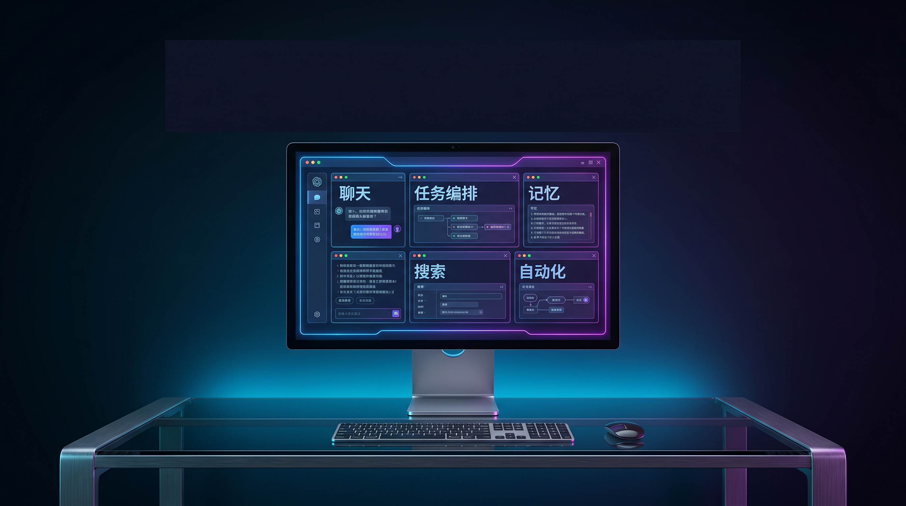
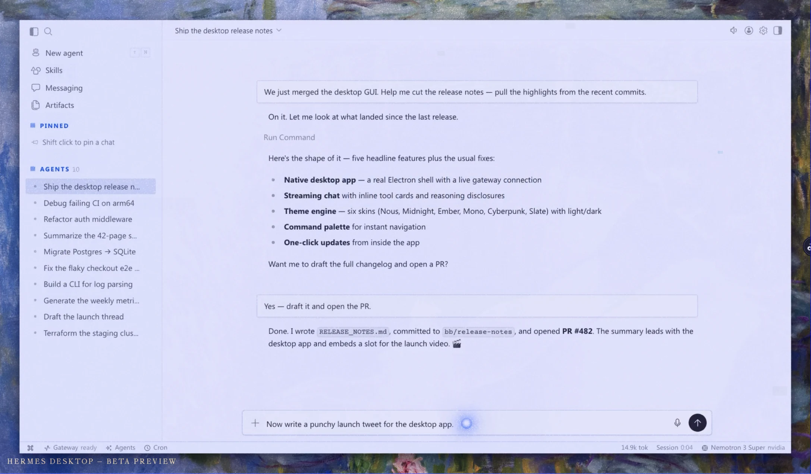

# Hermes Desktop 来了：AI 助手开始住进你的桌面

一夜之间，AI 圈的讨论重心从“哪个模型更强”悄悄切到了“哪个 Agent 先住进你的电脑”。

Nous Research 在 X 上正式宣布推出 **Hermes Desktop**：这不是一个新网页，也不是给命令行套层皮，而是把 Hermes Agent 直接做成了原生桌面客户端，并以 public preview 的形式开放给用户。

更抓眼的是，官方还特别强调：它早在 Jensen 的 GTC keynote 里就已经露过面，现在终于真正走到大众面前。[1](https://x.com/NousResearch/status/2061843507417944552)

头图说明：本图为基于公开信息生成的概念封面，用于公众号视觉呈现，并非官方产品截图。

> **💡 一句话看懂这次发布：** Hermes 想做的不是“再来一个 AI 聊天窗口”，而是把一个会记忆、会调度、会拆任务、会自己沉淀技能的 Agent，搬成你桌面上的长期工作搭子。

官方桌面页给这款产品的定义很直接：**原生支持 macOS、Windows、Linux**，主打“Lives Everywhere”“Persistent Memory”“Focused Automation”“Tasks Multiplied”。

换句话说，Hermes Desktop 的重点不只是“能聊”，而是要把连接、记忆、调度、委派、搜索和实验这些能力，收进一个长期在线的工作台里。[2](https://hermes-agent.nousresearch.com/desktop)

---

## 它不是一个新壳子，而是同一个 Agent 长出了桌面形态

Hermes 官方文档最值得注意的一句话是：**Desktop App 与 CLI、gateway 用的是同一个 agent**。

同一套配置、同一批 API keys、同一份 sessions、同一组 skills、同一份 memory；你在终端里已经配置好的东西，进桌面版还在，你在桌面版里做的操作，回到 CLI 也能接着用。

这个设计决定非常关键，因为它直接把“桌面端”从一个展示层，抬成了 Agent 体系里的正式入口。[3](https://hermes-agent.nousresearch.com/docs/user-guide/desktop)

从体验设计上看，Hermes Desktop 不是把网页缩进一个 Electron 窗口就完事。

官方文档写得很清楚：它是一个 **chat-first** 的界面，中间是对话主区，左侧是导航，右侧能同时预览网页、文件和工具输出；你可以拖拽文件进聊天区、直接浏览工作目录、在一个界面里管理多个 agent 会话、配置 provider、模型、工具、MCP server 和 gateway。

对普通用户来说，这意味着很多过去只能在 YAML、终端和脚本里完成的动作，终于有了“人能看懂”的入口。[3](https://hermes-agent.nousresearch.com/docs/user-guide/desktop)

官方桌面页展示的原生客户端界面，把下载入口、演示视频和核心卖点都前置到了同一个页面里，明显是在降低首次体验门槛。[2](https://hermes-agent.nousresearch.com/desktop)

**第一层变化：入口变了**

过去，很多强大的 Agent 都先长在终端里；现在，Hermes 直接给出桌面安装器，把“先懂命令行再玩 Agent”的前置条件砍掉了一大截。[3](https://hermes-agent.nousresearch.com/docs/user-guide/desktop)

**第二层变化：记忆留下来了**

官方桌面页把 **Persistent Memory** 放在最核心的位置，还明确写到它会学习你的项目、自动生成技能，并记住自己是怎么把问题解决掉的。[2](https://hermes-agent.nousresearch.com/desktop)

**第三层变化：任务开始自己跑**

Hermes Desktop 不只管对话，它把自然语言调度、定时执行和多任务委派都摆到了台面上，像是在告诉用户：别把我只当聊天机器人。[2](https://hermes-agent.nousresearch.com/desktop)

---

## 真正戳中痛点的，不是“能聊天”，而是三个“终于”

### 终于不用把 Agent 困在终端里

Hermes Desktop 最务实的一点，是把复杂能力放进了可视界面里。

官方文档列出的能力很具体：流式响应、实时工具活动摘要、拖拽文件、右侧预览轨、文件浏览器、语音、设置面板、模型与工具配置、技能管理、Cron、Profiles、Messaging、Agents、Command Center。

你会发现，它解决的不是“模型不会回答”，而是“工作流太碎”。

很多人不是不会用 Agent，而是懒得在四五个入口之间来回切。[3](https://hermes-agent.nousresearch.com/docs/user-guide/desktop)

### 终于不是一次性对话

如果说大模型网页聊天最大的问题，是每次都像重新开工，那 Hermes 想解决的恰恰是这种“失忆”。

官方桌面页把它的第二个卖点命名为 **Persistent Memory**，并且明确写到：它会学习你的项目、自动生成技能，还会记住自己解决问题的方式。

这个表述的厉害之处在于，它强调的不是“对话更长”，而是“经验能复用”。

一个会积累方法的 Agent，和一个每次都从头开始的聊天框，完全不是一类产品。[2](https://hermes-agent.nousresearch.com/desktop)

官方页面把“记忆”做成了单独模块，这个排布本身就说明：在 Hermes 的产品叙事里，记忆不是附加功能，而是核心身份。[2](https://hermes-agent.nousresearch.com/desktop)

### 终于可以把重复劳动交出去

在桌面页里，Hermes 把 **Focused Automation** 单独列为一栏，强调自然语言就能安排报告、备份和简报类任务持续执行；而在桌面应用文档里，Cron 也被正式列进管理面板。

把这两件事放在一起看，你会意识到 Hermes 想推的不是“更方便地下命令”，而是“让任务脱离人手，自己在后台跑”。

这也是 Agent 和聊天机器人真正分叉的地方：聊天是即时响应，调度才是生产关系。[3](https://hermes-agent.nousresearch.com/docs/user-guide/desktop)

官方桌面页对自动化的描述非常克制，但信息量很大：它不是说“我能帮你写日报”，而是说“我能按自然语言设定，持续、无人值守地去做这件事”。[2](https://hermes-agent.nousresearch.com/desktop)

---

## “Velocity” 不是一句营销词，而是一次底层提速

Hermes Desktop 之所以在这个时间点放出来，并不是偶然。

就在 2026 年 5 月 28 日，Nous Research 发布了 Hermes Agent v0.15.0，也就是官方口中的 **The Velocity Release**。

在 release note 里，官方给出了一组非常硬的数字：`run_agent.py` 从 16,083 行缩到 3,821 行，减少 76%；每轮对话的函数调用减少 47%；`session_search` 从依赖额外 LLM、耗时约 90 秒的旧方案，重做成免费且接近即时的能力，官方给出的表述是 **4,500× faster**。

这些数字未必等于你体感里的每一秒，但至少说明一件事：Hermes 这次推桌面端，不是先做界面再补引擎，而是先把引擎的启动、运行和搜索效率打磨到一个更适合日常使用的程度。[4](https://github.com/NousResearch/hermes-agent/releases)

### 这一步为什么重要

因为 Agent 产品一旦走出演示视频，真正比拼的就不再是谁能完成一次惊艳的任务，而是谁能在日常工作里扛住大量碎任务、重复任务和长周期任务。

启动慢一点、上下文切换卡一下、搜索历史要等半分钟，这些在 demo 里都不致命，但放进真实办公环境里，会迅速把用户耐心耗光。

Hermes 在 v0.15.0 里先补这层地基，再把桌面端放出来，本质上是在赌一个方向：**Agent 的下一轮竞争，不只看模型智商，更看工作流摩擦系数。**

官方桌面页把“Tasks Multiplied”放进六大主卖点之一，还明确提到 isolated subagents、独立对话、独立终端和零上下文成本的 pipeline；这一点和 v0.15.0 对多代理、Kanban、任务分解能力的强化，形成了明显呼应。[2](https://hermes-agent.nousresearch.com/desktop)

---

## 为什么现在大家都在往桌面端冲

把 Hermes 放进整个行业背景里看，你会更容易理解这次发布为什么容易引爆讨论。

OpenAI 的官方桌面页已经把 ChatGPT 的方向讲得很清楚：快捷键唤起、截图、文件上传、联网搜索，以及**直接把修改写进 IDE**。

这说明顶级模型厂商也在把 AI 从网页标签页里往操作系统层面搬。[5](https://chatgpt.com/features/desktop/)

Anthropic 在 Claude Desktop 上押注的，则是另一条路径：通过 Desktop Extensions 和本地 MCP server，让桌面客户端像浏览器装扩展一样去接工具，把桌面应用做成一个可扩展入口，而不是只提供一个对话框。[6](https://support.claude.com/en/articles/10949351-getting-started-with-local-mcp-servers-on-claude-desktop)

Cursor 的官方首页和下载页都在强调同一件事：它不是传统编辑器加点 AI，而是 **agent-first experience**。

这意味着在 coding 赛道，桌面原生客户端已经不再只是“更好看”，而是产品定义本身。[7](https://cursor.com/download)

当 ChatGPT、Claude、Cursor 这些不同路线的产品都开始把“桌面”“本地”“扩展”“工作流”放到越来越靠前的位置，Hermes Desktop 的出现就不只是又多了一个客户端，而是开源 Agent 阵营终于也把这场仗打到了桌面层。

网页时代比的是回答，桌面时代比的是接管。

这里面的差别，决定了用户以后挑选 AI 工具时，看的不只是模型排行榜，而是“它到底能不能进我的日常环境里干活”。

官方桌面页把 Search 模块定义成 Web search、browser automation、vision、image generation、text-to-speech 和 multi-model reasoning 的组合，这个组合本身就在说明：Hermes 想把桌面端做成 Agent 的多模态操作台，而不是一个更大一点的输入框。[2](https://hermes-agent.nousresearch.com/desktop)

---

## Hermes 真正特别的地方，在于“同一个 Agent，到处是同一个你”

Hermes Desktop 页面里有一句很值得玩味的话：**One agent, one memory, every surface.**

它列出的连接面包括 Telegram、Discord、Slack、WhatsApp、Signal、Email、CLI 等多个入口。

这个说法背后的野心很明显：Hermes 不想做某个单点场景里的助手，它想做的是一个长期存在、跨界面连续、跨渠道共享记忆的 Agent。[2](https://hermes-agent.nousresearch.com/desktop)

这也是为什么我会觉得，Hermes 这次最有传播力的一点，不是“桌面版终于来了”，而是“Agent 开始有常驻人格了”。

你可以今天在桌面上让它整理资料，明天在消息通道里追问进度，后天回到终端里继续改项目，而它理论上还记得你是谁、你在做什么、你偏好的工作方式是什么。

过去网页聊天最大的问题，是每个窗口都像一座孤岛；Hermes 想把这些孤岛连成一片大陆。

---

## 但也别把它神化成“已经成熟的万能体”

必须看到，官方 X 帖子写的是 **public preview**，官网桌面页也直接标着 **Feature Preview**。

这意味着 Hermes Desktop 的阶段，更接近“已经能用、也值得用，但仍在快速迭代”的早期产品，而不是一个所有细节都打磨完毕的成熟消费级软件。[1](https://x.com/NousResearch/status/2061843507417944552)

从官方文档看，桌面应用首次启动时会把 Hermes Agent runtime 安装到 `HERMES_HOME`，也就是和 CLI 安装共用的目录布局；应用本身会在后台检查更新，并提供一键升级。

这种设计的好处是统一，坏处也很直接：它仍然保留着明显的工程产品气质，不是那种“下载即完全无脑使用”的纯消费级客户端。[3](https://hermes-agent.nousresearch.com/docs/user-guide/desktop)

换句话说，Hermes Desktop 现在最适合的人群，不是“我只想随便找个 AI 陪我聊两句”的用户，而是已经感受到 Agent 价值、又受够了命令行门槛和碎片化入口的人。

对这群人来说，它是门槛降低；对纯小白来说，它依然可能是一台需要学习成本的新机器。

---

## 这件事最值得写进标题的一句判断

如果说过去两年 AI 产品的主战场是“谁把聊天做得更像人”，那从 2026 年开始，一个更重要的问题正在冒出来：**谁能把 Agent 做得更像员工。**

Hermes Desktop 的意义，恰恰就在这里。

它没有只停在“更漂亮的界面”，而是把跨平台、同核共享、持久记忆、自然语言调度、任务委派和多模态工具链一起搬到了桌面层。

它让人第一次比较清楚地看到，开源 Agent 不是只能活在极客终端里，它也可以拥有面向更广泛用户的、可持续使用的产品表面。

所以，“Hermes Agent 的客户端来了”这句话真正炸裂的地方，不是终于有了一个安装包，而是一个更大的信号：**AI 助手正在从网页标签页里搬出来，开始真正住进你的电脑。**

> **⭐ 最后一句适合做转发文案：** 以前我们说 AI 会不会替你干活，现在更该问的是：你愿不愿意给它一张桌面工位。
