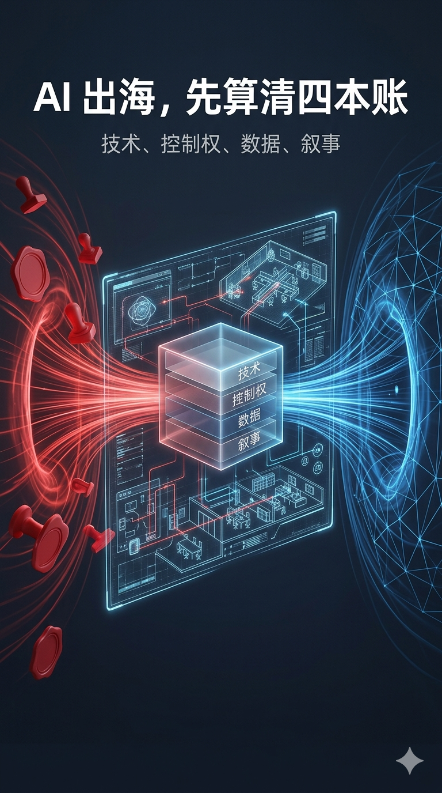
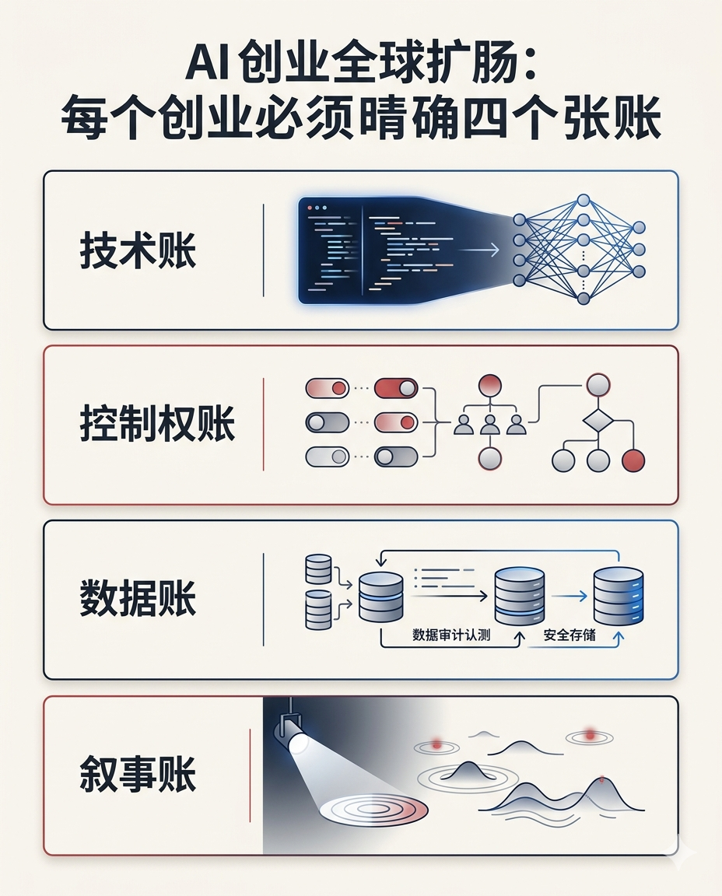
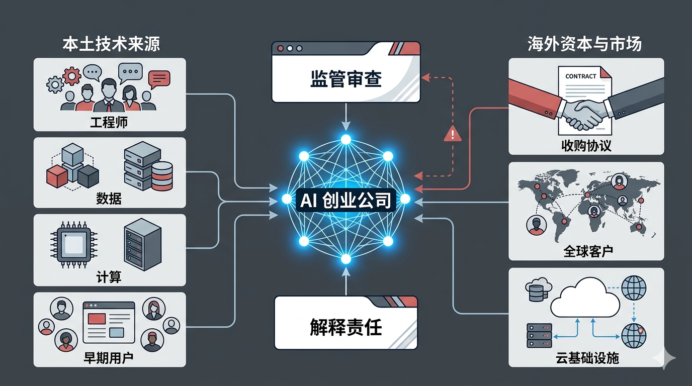
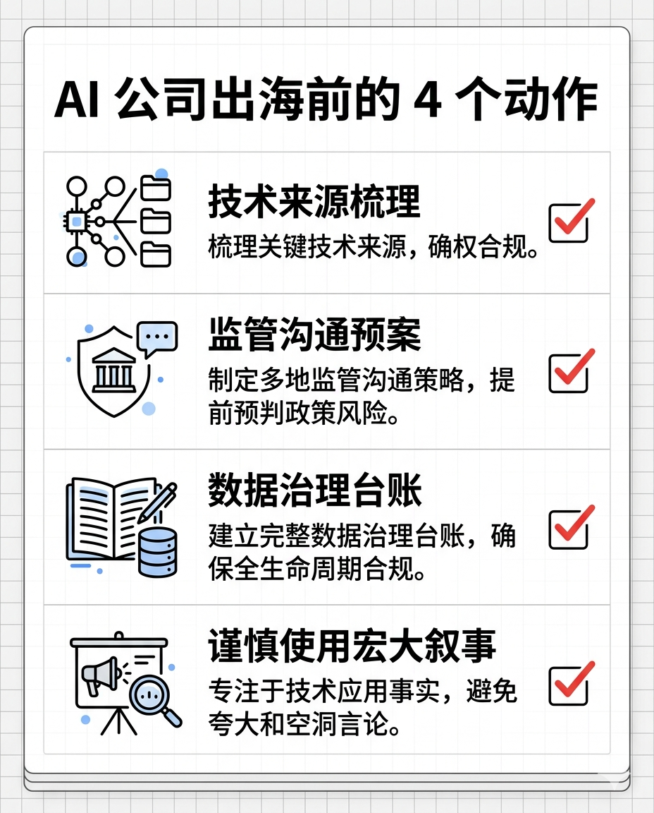
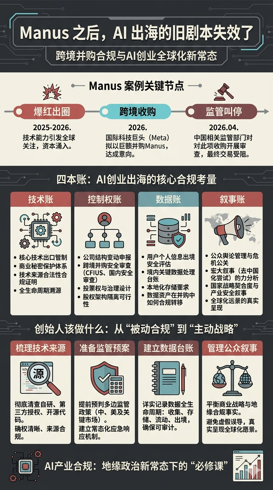

# Manus 被叫停后，AI 创业者该醒醒了

摘要：发改委叫停外资收购 Manus 项目后，最值得讨论的不是交易还能不能撤，而是 AI 公司出海的旧剧本失效了。注册地、股权架构和团队迁移都不是万能答案。真正要提前说清楚的，是技术从哪里来、数据在哪里形成、控制权在哪里落地，以及企业在关键时刻对谁负责。

2026 年 4 月 27 日，国家发改委外商投资安全审查工作机制办公室正式叫停外资收购 Manus 项目，并要求当事方撤销交易。

这件事一出来，很多讨论立刻跑向两个方向：一边问交易已经完成了，还能不能撤；另一边问 Manus 的技术到底有没有重要到值得监管部门出手。

但我觉得，这两个问题都不是最关键的。

真正值得所有 AI 创业者、投资人、产品团队认真看的，是 Manus 在过去一年走过的那条路：先被包装成“AI Agent 的高光样本”，再因为美国投资和收购进入监管视野，随后试图通过迁移主体和团队来降低风险，最后在中美监管、舆论和资本之间同时承压。

我的判断是：**Manus 事件的核心不是一家 AI 公司卖给谁，而是一家 AI 公司到底属于谁、依靠谁、又在关键时刻对谁负责。**

这篇不打算复述所有法律条文。我更想把它拆成一套 AI 公司都能带走的判断框架：以后看一家 AI 公司出海，不要只看它注册在哪里，而要看四本账。

技术账、控制权账、数据账、叙事账。

## 1. 技术账：别以为“产品在海外”，技术就天然不归本土监管管

很多人看 AI 公司出海，第一反应是看公司主体。

注册在新加坡，是不是就算新加坡公司？用户在海外，是不是就算海外产品？团队搬出去，是不是就和中国监管没关系了？

这套想法在传统互联网时代已经不稳，在 AI 时代更不够用。

因为 AI 公司的核心资产，不只是一个网页、一个 App、一个商标，甚至也不只是几个创始人的股权。它的核心资产往往是更难切分的东西：模型能力、训练方法、工程经验、数据清洗流程、提示词系统、评测体系、自动化工作流，以及一批在同一种工程文化里训练出来的人。

这些东西如果长期在中国境内形成，依靠中国工程师、中国供应链、中国算力、中国用户反馈和中文舆论带来的早期扩散，那么它就很难因为公司注册地变化，突然变成一件完全“无来源”的海外资产。

这也是 Manus 事件给 AI 行业上的第一课：**技术不是从股权架构图里长出来的，技术是从人、数据、算力、场景和组织经验里长出来的。**

所以，真正严肃的出海合规，不是找一个法域把公司装进去，而是提前把技术形成过程讲清楚。

谁开发的？

在哪里开发的？

用了哪些数据？

关键能力是在什么阶段形成的？

哪些资产可以交易，哪些资产必须被隔离，哪些资产需要审批、备案或额外解释？

如果这些问题到交易被质疑时才开始补答案，通常已经晚了。

## 2. 控制权账：AI 公司最敏感的资产，是“谁能让它往哪走”

Manus 事件里，一个反复出现的词是“控制”。

美国关心控制，中国也关心控制。投资人关心控制，监管部门更关心控制。

原因很简单：AI Agent 公司和普通 SaaS 公司不一样。普通软件更多是工具，AI Agent 则可能变成工作入口、决策入口、代码入口、企业流程入口，甚至变成某些行业的自动化执行层。

一家公司如果只是卖一个漂亮界面，监管敏感度不会那么高。但如果它代表的是未来一类自动化能力，那问题就变成：谁能决定它接入哪些系统、服务哪些客户、使用哪些数据、响应哪些政策、被谁审计、在冲突时服从哪一套规则。

这不是抽象政治问题，是产品问题，也是治理问题。

很多创业者容易低估这一点。他们以为控制权就是董事会席位、投票权、VIE 协议、持股比例。可在 AI 公司身上，控制权还包括更细的东西：

- 关键模型和代码仓库在哪里；
- 训练和推理基础设施由谁掌握；
- 核心研发人员的劳动关系和实际工作地点在哪里；
- 付费客户、合同主体和收入确认在哪里；
- 发生监管冲突时，谁有能力按下暂停键。

这些问题没有被设计清楚，所谓“我已经搬走了”就很容易变成一句很薄的话。

**AI 公司真正的控制权，不在 PPT 的组织架构里，而在谁能持续影响它的技术、人员、数据和现金流。**

## 3. 数据账：AI 出海最怕的不是没有数据，而是说不清数据

Manus 的参考文章里反复提到一个问题：数据出境和数据剥离。

这也是所有 AI 公司都绕不开的现实。

AI 公司经常会说，我们没有拿敏感数据，我们服务海外用户，我们已经把中国业务关掉了。但监管部门真正会问的，可能不是一句“有没有”，而是一组更具体的问题：

过去训练时用过什么数据？

用户反馈、任务日志、操作轨迹、评测样本有没有来自中国？

这些数据是否已经删除、脱敏、隔离？

如果团队换了主体，原来的数据资产有没有被新主体继续使用？

如果收购方拿到的是一个“已经训练好、已经验证过、已经商业化”的系统，那么早期数据贡献是否也构成交易价值的一部分？

这就是 AI 公司比普通软件公司更难切的地方。

普通软件可以交割代码、域名、合同、客户清单。AI 系统却往往把过去的数据、反馈和工程经验压缩进模型能力和产品细节里。你可以删除数据库里的某些字段，但很难把历史数据对产品能力的贡献从公司价值里完全剥离。

所以，AI 公司出海越早，越应该把数据治理做在前面，而不是等到交易尽调时再补材料。

一个很实用的动作是：从第一天开始，给数据做“来源标签”和“用途标签”。

哪些数据只用于产品运营，哪些用于模型训练，哪些用于安全评测，哪些只用于日志排查，哪些涉及中国用户，哪些涉及企业客户，哪些可以迁移，哪些永远不能出境。

这听起来很麻烦，但以后会越来越值钱。

因为 AI 公司未来做融资、收购、出海、上市时，投资人和监管部门看的不会只是收入曲线，还会看一句话：**你的能力到底是怎么长出来的。**

## 4. 叙事账：把自己捧成“国家级样本”，就别再假装自己只是商业公司

Manus 事件最有意思的地方，是它的法律风险和舆论风险几乎是互相点燃的。

一开始，大量正面报道把 Manus 推到了“AI Agent 代表作”的位置。这个叙事对增长很有帮助，也会带来用户、资本、人才和声量。

但所有叙事都是有价格的。

当一家中国背景的 AI 公司被反复讲成“新的技术突破”“中国 AI 的代表”“下一个现象级产品”，它就不再只是一个普通创业项目。它会被更多人看见，也会被更多制度看见。

美国会问：这么重要的中国 AI 公司，为什么能被美国资本投资或收购？

中国会问：刚刚还被当成本土创新样本，为什么一遇到美国审查就快速切割、迁移和出售？

公众会问：你到底是中国公司、全球公司，还是只在需要流量时选择一种身份？

这才是很多创业公司最容易忽视的“叙事账”。

创业者当然可以做公关，可以讲故事，可以把产品推到聚光灯下。但一旦你接受了某种宏大叙事，就要准备承担这种叙事带来的后果。

**流量会放大增长，也会放大监管理由。**

这句话放在 AI 公司身上尤其成立。

因为 AI 不是普通消费品。它天然带着技术竞争、数据安全、人才流动、算力供应、国家能力这些关键词。你越把自己讲成关键样本，别人越会按关键样本来审视你。

## 5. 最糟糕的出海策略，是同时让两边都不放心

AI 公司出海，最怕的不是选择中国市场，也不是选择美国市场。

最怕的是用一套含糊不清的身份管理，把两边都搞得不放心。

对美国来说，你可能仍然是一个有中国背景、可能受中国影响、技术来源和数据来源说不清的公司。

对中国来说，你又可能是一个享受过本土人才、技术、舆论和资源红利，却在关键节点迅速把控制权交给美国大厂的公司。

这就会形成一种很危险的局面：你以为自己通过灵活结构获得了更多空间，实际是同时增加了两边监管出手的理由。

这也是为什么“搬到新加坡”不是万能解法。

新加坡可以是商业运营地，可以是融资平台，可以是全球化团队的中转站，但它不能自动解决所有关于技术来源、实际控制、数据流动和国家安全的疑问。

如果底层问题没有解决，迁移主体只是在形式上换了一个容器。

容器很重要，但容器不是答案。

## 6. 给 AI 创业者的四个动作

如果 Manus 事件最后只让大家得出一句“以后 Day 0 就注册海外公司”，那这个教训就白学了。

真正应该带走的，不是一条投机路线，而是四个动作。

第一，出海前先做技术来源梳理。

不要只整理代码仓库和股权结构，要整理关键能力形成过程。哪些能力来自中国团队，哪些依赖中国数据，哪些用过国内供应链，哪些可能落入技术出口、数据出境或投资安全审查的讨论范围。

第二，交易前先做监管沟通预案。

不要等到美国问询、中国调查、媒体追问同时发生，才开始找律师补说法。真正高风险的跨境 AI 交易，需要在签约前就准备好最坏情形：如果被要求申报怎么办，如果被要求补充材料怎么办，如果被要求暂停交割怎么办，如果被要求撤销交易怎么办。

第三，把数据治理变成公司资产。

AI 公司以后最值钱的不只是模型效果，还有可解释、可审计、可隔离的数据治理能力。能说清数据从哪里来、怎么用、谁能访问、能不能迁移，本身就是商业信用。

第四，不要乱接宏大叙事。

如果你只是商业公司，就少把自己包装成国家科技样本。如果你享受了国家科技样本的流量，就要准备承担国家科技样本的审视。

这不是让创业者低调到不做增长，而是提醒大家：公关不是写稿，公关是风险管理。

## 结尾：AI 公司出海，进入了“解释责任”时代

Manus 事件之后，AI 公司出海的旧剧本基本失效了。

过去很多人相信，只要主体设在海外、团队迁到海外、用户面向海外、投资人来自海外，就能把自己定义成一家纯粹的全球公司。

现在看，这个定义权没有那么便宜。

AI 公司要面对的，已经不是“我说我是谁”，而是“我能不能解释清楚我为什么是这个身份”。

技术从哪里来。

数据在哪里形成。

团队受谁影响。

控制权在哪里落地。

交易失败时谁承担后果。

监管冲突时谁有最终决定权。

这些问题答不清楚，架构再漂亮也不稳。

所以 Manus 留下的最大提醒，不是“不要卖给美国公司”，也不是“不要做中国背景的 AI 公司”。

真正的提醒是：**AI 创业进入了一个必须提前解释自己的时代。你不解释清楚，市场会替你解释，媒体会替你解释，监管会替你解释。**

而通常，别人替你解释的时候，就已经不是你最想要的版本了。

---

参考资料：

- AP News：[China blocks Meta from acquiring startup Manus as global AI rivalry deepens](https://apnews.com/article/5f8012791f86f719a24a3ebac06d9b0a)，2026-04-27
- Axios：[China blocks Meta's acquisition of Manus AI](https://www.axios.com/2026/04/27/china-blocks-metas-acquisition-of-manus-ai)，2026-04-27
- 国家发改委：[外商投资安全审查办法](https://zfxxgk.ndrc.gov.cn/web/iteminfo.jsp?id=18525)
- 微信公众号“敏大是一只柯基”系列文章：[AI企业如何避免“中美混合双打”](https://mp.weixin.qq.com/s/GYULuklnEoc2OxTTwf2ofA)、[Manus最需要关心的法律问题，还不是技术出口管制](https://mp.weixin.qq.com/s/rVXMflSvesUv8hkNGKX88w)、[Manus：这事儿没完](https://mp.weixin.qq.com/s/CHHJabOtE9hdIy3KUrjLkg)、[Manus绝对不是下一个滴滴](https://mp.weixin.qq.com/s/ypHGeQGqSE3_Jo7FsB9gnA)、[Manus告诉我们，不要试图钻法律的空子](https://mp.weixin.qq.com/s/GafEAIUxgoC4t2GgRTK6CA)、[Manus交易当然有办法撤销](https://mp.weixin.qq.com/s/YqvobewbuCJFXfHYG7o_Ow)

AI 辅助创作，人工检索、核验与编辑。
