# 别再反复重装 OpenClaw 了，第一次最容易卡住的根本不是安装命令


第一次装这类 AI 编码工具，很多人不是卡在“不会执行命令”，而是卡在“这一步到底该怎么选、跳过会不会有问题、装完后下一步又是什么”。

OpenClaw 也是一样。真正让新手劝退的，往往不是安装脚本本身，而是后面的初始化引导和模型接入。

我的判断是：**如果你想把 OpenClaw 一次装好，最省时间的方式不是自己来回试，而是按一条完整路径走完安装、初始化、接入模型和重启验证。**

这篇文章我按 Windows 新手视角，把整个流程顺一遍。你能直接拿走 3 样东西：

1. 安装命令。
2. 初始化时每一步怎么选。
3. 接入大模型后，怎么确认 OpenClaw 已经真的跑起来。

如果你用的是 macOS，也不用慌，安装命令我会一并放上；只是下面的截图和操作路径，主要按 Windows 来写。

## 先说结论：OpenClaw 真正要走完的是 3 步

很多教程只告诉你“执行这一行命令”，但对第一次上手的人来说，那其实只完成了三分之一。

你真正需要走完的是这 3 步：

1. 先把 OpenClaw 安装到本地。
2. 按初始化引导把基础选项走完。
3. 接上可用的大模型，再重启网关确认生效。

只要这 3 步完整走完，后面你再打开 Web UI、进入本地地址开始用，基本就顺了。

## 第一步：先把 OpenClaw 装上

Windows 下，先用管理员身份打开 PowerShell。

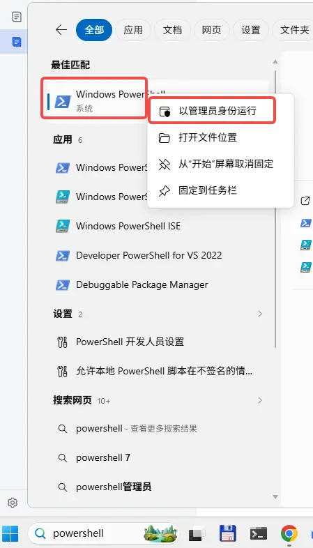

然后执行安装命令：

```powershell
iwr -useb https://openclaw.ai/install.ps1 | iex
```

如果你用的是 macOS，对应命令是：

```bash
curl -fsSL https://openclaw.ai/install.sh | bash
```

这一步本身并不复杂，真正容易让人犹豫的是后面初始化时那些选项。别急，下面我直接按一条更稳的路径带你走。

## 第二步：初始化时别乱点，按这条路径走更稳

如果安装完成后已经进入引导，就接着往下走；如果你中途跳过了，或者想重新配置，可以手动执行：

```powershell
openclaw onboard --install-daemon
```

### 1. 先确认开始引导

进入引导后，先选 `Yes`，然后选 `QuickStart`。

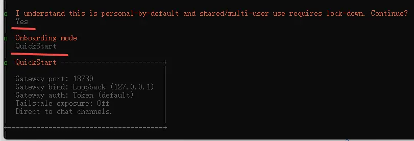

### 2. 提供商这一步，先按默认思路走

接下来建议按下面的顺序选：

- `Skip for now`
- `All providers`
- `Keep current`

这条路径的好处是，先把环境跑起来，不在一开始就把自己卡死在太细的配置里。

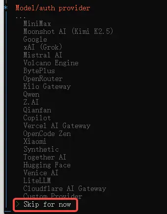

### 3. 本地工具和附加项，先别展开

接下来两步都可以先选 `Skip for now`。

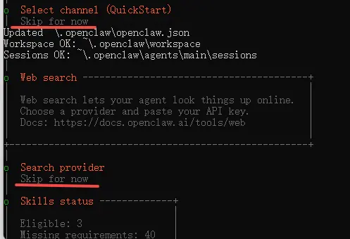

### 4. 安装 daemon 时确认即可

这里直接选 `Yes`。

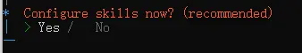

### 5. 遇到多选项时，先把“跳过”走通

当界面出现多选时，先用空格选中 `Skip for now`，然后回车确认。

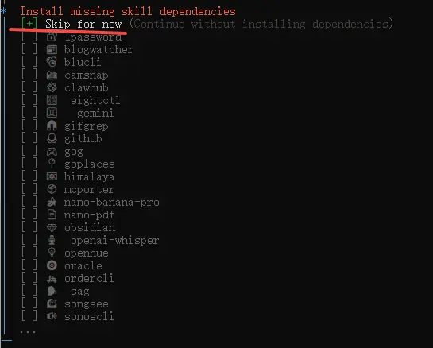

### 6. API 相关选项，先全走默认的 No

如果你现在的目标只是先把 OpenClaw 跑起来，这一段不需要一上来就展开，保持默认的 `No` 更省心。

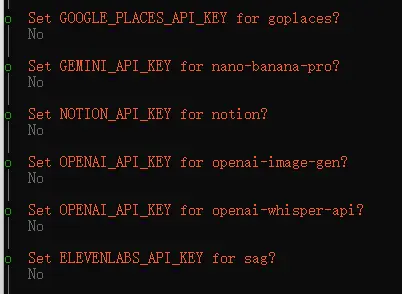

### 7. hooks 相关的地方，除了跳过项外其余都选上

这里的经验做法是：除了 `Skip for now` 之外，其他项都用空格选中，再回车确认。


### 8. 让它打开 Web UI

接下来选 `Open the Web UI`。

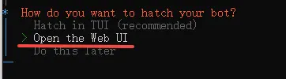

正常情况下，你会进入本地地址：

`http://127.0.0.1:18789/chat?session=main`

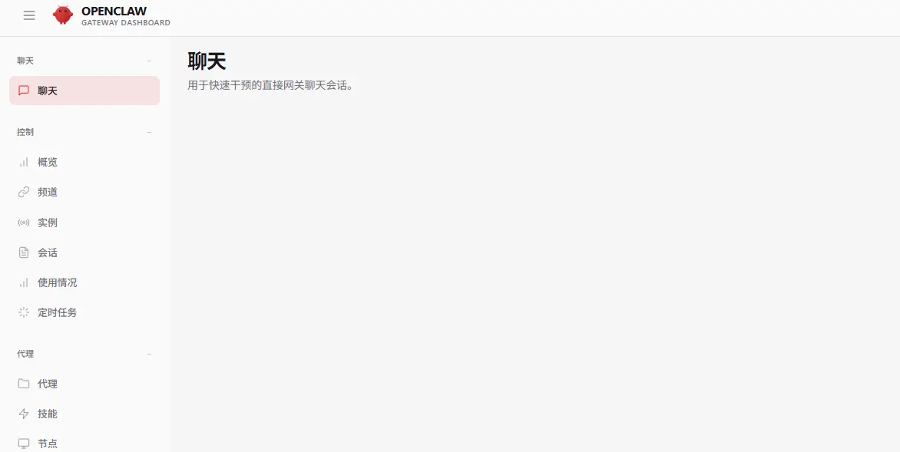

同时要注意一件事：后台会有一个 `gateway` 进程在运行，这个不要随手关掉。

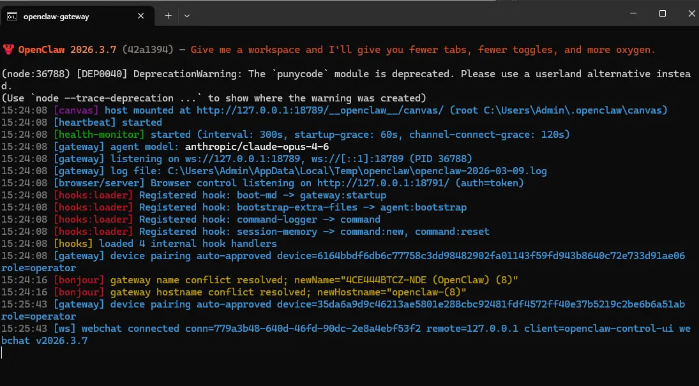

走到这里，其实你已经把 OpenClaw 的壳子装好了。但如果还没接上模型，它能打开，不代表它已经好用。

## 第三步：把大模型接上，不然能打开也不算真正装好

下面这部分，我用原稿里的火山引擎方案举例。你也可以换成自己手头能用的模型提供商，逻辑是一样的：先准备 API Key，再在 OpenClaw 里把模型供应商和默认模型配好。

先准备好 API Key，然后在 PowerShell 里执行：

```powershell
openclaw config
```

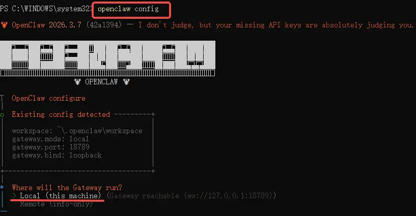

### 1. 配置入口这样走

在菜单里依次选择：

- `Local`
- `Model`


### 2. 选择模型提供商

这里按原流程选择 `Volcano Engine`。

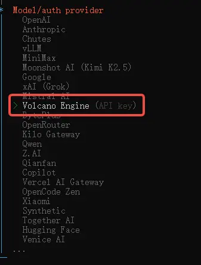

### 3. 准备粘贴 API Key

当界面提示时，选择 `Paste API key now`。

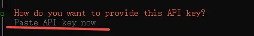

然后把你提前准备好的 API Key 粘贴进去。


确认无误后继续。

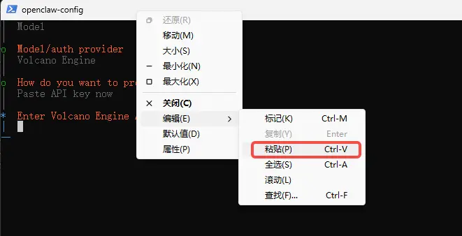

### 4. 模型名保持默认即可

如果你也是按这个方案来配，模型名保持默认的 `volcengine-plan/ark-code-latest` 就可以。

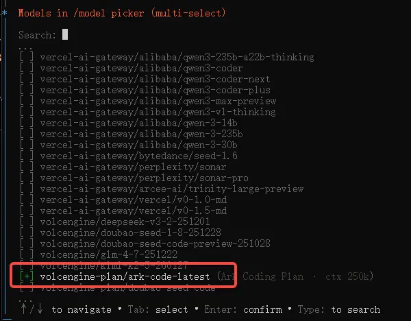

接着选 `Continue` 完成配置。

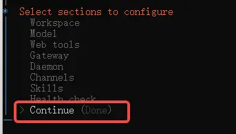

### 5. 最后重启一次网关

为了让配置生效，回到 PowerShell 执行：

```powershell
openclaw gateway restart
```


到这里，OpenClaw 才算真正完成了从“装上”到“可用”的闭环。

## 装完之后，先用这 3 个动作确认自己没有白忙

如果你不想装完以后心里还打鼓，可以立刻做这 3 件事：

1. 执行 `openclaw dashboard`，确认主界面能正常打开。
2. 访问 `http://127.0.0.1:18789/chat?session=main`，确认本地 Web UI 正常。
3. 如果界面异常，先别急着重装，优先执行 `openclaw gateway restart` 再看一次。

顺手把两个常用命令记下来，后面会经常用到：

- 重启网关：`openclaw gateway restart`
- 打开主界面：`openclaw dashboard`

## 最后，把这篇教程压缩成一句话和一个动作清单

如果你想把这篇文章转给朋友，我觉得最值得被转述的一句判断是：

**第一次装 OpenClaw，真正劝退人的往往不是安装命令，而是初始化和模型配置；把这两段走顺，OpenClaw 就不难。**

如果你只想带走一个最短动作清单，那就是这 4 步：

1. 管理员 PowerShell 执行安装命令。
2. 用 `openclaw onboard --install-daemon` 走完初始化。
3. 用 `openclaw config` 接上模型和 API Key。
4. 最后执行 `openclaw gateway restart` 做一次生效验证。

很多工具看起来门槛高，不是因为它真的复杂，而是因为第一次没人把“该怎么选”讲清楚。

OpenClaw 这类工具尤其如此。只看命令，你会觉得很简单；真正自己装时，最需要的是一条有人走通过的路径。

如果你正准备第一次上手，希望这篇能帮你少走一点弯路，直接把 OpenClaw 跑起来。
