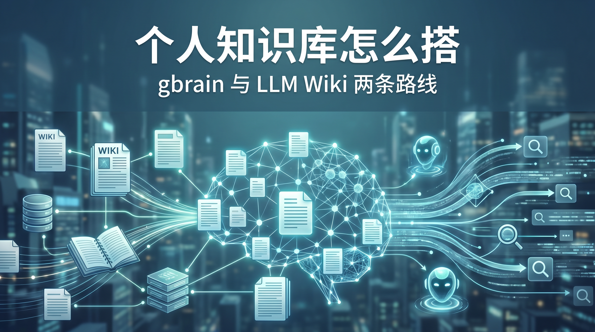
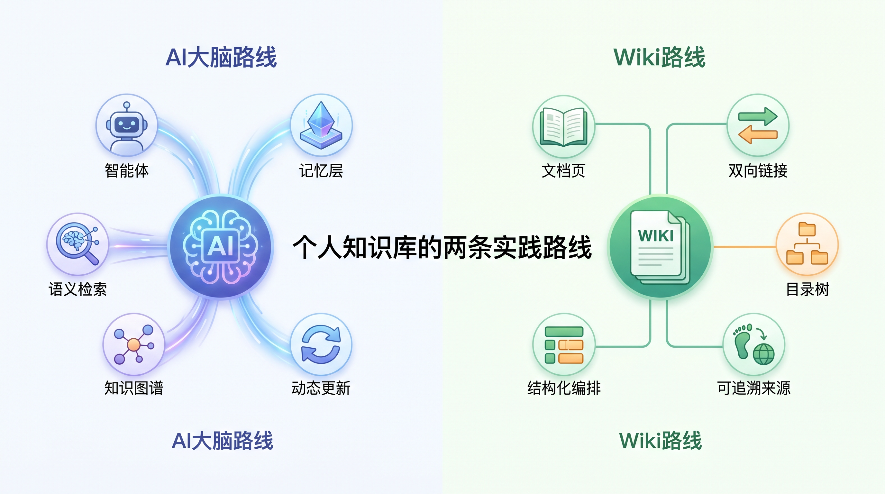
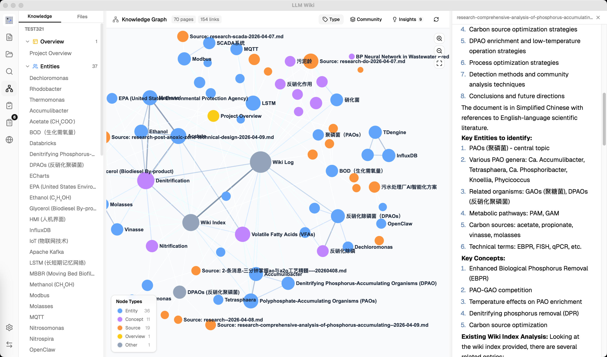
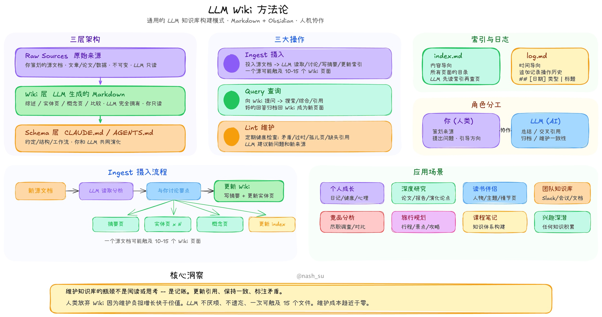

# 个人知识库怎么搭？gbrain 和 LLM Wiki 给了两条完全不同的路

> 💡 **先说结论：**
>
> 如果你想做的是“让 AI 真能记住你”，看 **gbrain**。  
> 如果你想做的是“让散落文档自动长成一个 wiki”，看 **LLM Wiki**。  
>
> 两者都不是传统意义上的笔记软件，它们解决的是同一个老问题：笔记很多，真正能在需要时被调出来的太少。

很多人以为个人知识库的核心是“收集”，其实这一轮变化的关键已经不是你存了多少，而是 **知识能不能被 AI 调用、复用、更新**。

Karpathy 提出的 LLM Wiki 模式把这个转折说得很清楚：知识不该每次提问都从零检索，而应该被“编译一次、持续维护”[[1]](https://gist.github.com/karpathy/442a6bf555914893e9891c11519de94f)。

你可以粗暴地把它理解为：左边是“会回答的记忆层”，右边是“会长大的 wiki”。

前者优先解决 AI 的失忆问题，后者优先解决资料长期失序的问题。

---

## 第一条路：把知识库做成 AI Agent 的长期记忆层

GBrain 的出发点非常激进：它不是在给人做“更好的搜索”，而是在给 AI Agent 做一个 **会综合、会回忆、会补缺口** 的长期记忆层。

官方 README 里最核心的设计，就是把 `search` 和 `think` 明确分开，并在底层放进混合检索、知识图谱、MCP 接入和夜间 dream cycle 维护机制[[2]](https://github.com/garrytan/gbrain)。

这意味着 GBrain 的实践方式更像在搭一套“个人脑后台”。

你把会议、邮件、笔记、想法不断 capture 进去，系统一边把 Markdown 当作系统记录，一边用图谱和检索把分散信息重新组织起来。

当你问“明天和某人开会前我该知道什么”，它追求的不是给你一堆 chunk，而是直接给你一段带上下文的准备稿[[2]](https://github.com/garrytan/gbrain)。

它的强项也因此非常鲜明：**更适合高频使用 AI Agent 的人**。

如果你本来就在用 Claude Code、Codex、Cursor，或者你想让 Agent 不再“每次开口都像失忆”，GBrain 的味道会很对。

它支持本地 `PGLite` 快速起步，也支持 Postgres + `pgvector` 往更大规模走，本质上是在把个人知识库从“资料柜”推向“记忆基础设施”[[2]](https://github.com/garrytan/gbrain)。

但 GBrain 的隐藏税也不低。

它对使用者默认有更强的工程心态：要接受 schema、接受 Agent-first 的工作方式、接受持续运行和维护；越想把它用成“全天在线的第二大脑”，越接近一套系统工程，而不是一个装上就完事的桌面工具。

截至 2026-06-05，官方 Releases 页面显示 gbrain 约 19k Star，默认 schema 已经迭代到 `v0.41.22` 对应的 `gbrain-base-v2`，更新速度很快，说明它不是概念 Demo，而是在快速打磨中的生产型项目[[3]](https://github.com/garrytan/gbrain/releases)。

---

## 第二条路：先把文档“编译”成 Wiki，再让 AI 去用

LLM Wiki 的思路更容易被多数知识工作者接受：你不必先成为 Agent 工程师，而是先把 PDF、DOCX、Markdown、网页剪藏这些原始材料喂进去，让系统自动长出一个 **可浏览、可互链、可追溯来源** 的持久 Wiki。

官方把它定义为“不是传统 RAG，而是让 LLM 增量构建并维护一个 persistent wiki”[[4]](https://github.com/nashsu/llm_wiki)。

LLM Wiki 把“知识树 + 聊天 + 预览 + 图谱”合在一个桌面工作台里，降低了非工程用户的进入门槛，也让“资料如何长成体系”这件事第一次有了比较完整的产品形态[[4]](https://github.com/nashsu/llm_wiki)。

它的实践路径也更“产品化”。

项目把 Karpathy 的方法论真正落成了桌面应用：底层用了两步 ingest，把“先分析再生成”拆开处理，再把知识图谱、社区发现、深度研究、审阅队列、Chrome Web Clipper 一起做进来。

你看到的不是一个聊天壳，而是一整套围绕“文档如何变知识”的工作台[[4]](https://github.com/nashsu/llm_wiki)。

这条路线特别适合两类人：一类是已经堆了很多资料，但迟迟没空整理的人；另一类是喜欢“看页面、看目录、看链接关系”多过“全程对话”的人。

因为它保留了 wiki 的结构感，又把维护工作尽量交给 LLM，所以它对研究、写作、专题沉淀都很友好。

当然，它也有自己的代价。

LLM Wiki 的核心收益来自“先编译知识”，因此首次 ingest 的 token 成本、时间成本、错误传播风险都会比普通 RAG 高；如果你的资料库巨大而且很杂，仍然需要定期 review，避免错误链接和错误总结被长期沉淀。

从产品成熟度看，LLM Wiki 已经不是一句方法论口号：官方仓库说明里，它是一款基于 Tauri v2、React 19、Rust 与 LanceDB 的跨平台桌面应用，支持主流模型接口与 Ollama，本地安装门槛比 Agent 系统更友好[[4]](https://github.com/nashsu/llm_wiki)。

公开分发页面已更新到 `0.4.7` 版本[[5]](https://winpkg.com/apps/nashsu.LLMWiki)。

---

## 真正该比较的，不是谁更先进，而是谁更像你的工作方式

| 维度 | GBrain | LLM Wiki | 我会怎么理解 |
|-|-|-|-|
| 第一性目标 | 给 AI Agent 一套长期记忆层，让它会检索、会综合、会发现知识缺口[[2]](https://github.com/garrytan/gbrain) | 把原始资料持续编译成结构化 Wiki，让知识先成形再被查询[[4]](https://github.com/nashsu/llm_wiki) | 一个偏“脑”，一个偏“书”。 |
| 知识的最小单元 | Markdown 页面 + 类型化实体 + 图谱边 + 可被 MCP 调用的操作[[2]](https://github.com/garrytan/gbrain) | Raw Sources / Wiki / Schema 三层结构，围绕页面、目录、索引和日志展开[[4]](https://github.com/nashsu/llm_wiki) | 前者更偏系统对象，后者更偏文档对象。 |
| AI 的角色 | 更像“长期记忆管理员”和回答合成器[[2]](https://github.com/garrytan/gbrain) | 更像“Wiki 编辑、整理员和研究助手”[[4]](https://github.com/nashsu/llm_wiki) | 前者在回答时更强，后者在整理时更顺。 |
| 上手方式 | 适合从 CLI、MCP、Agent 平台切入，工程味更重[[2]](https://github.com/garrytan/gbrain) | 适合直接装桌面应用，导入文件后开始跑 ingest[[5]](https://winpkg.com/apps/nashsu.LLMWiki) | 一个更像搭基础设施，一个更像装工作台。 |
| 最适合的人 | 重度 Agent 用户、开发者、需要“跨会话记忆”的高信息工作者 | 研究者、内容创作者、知识整理者、想把资料长期沉淀成可浏览结构的人 | 你越依赖 Agent，越偏向 gbrain；你越依赖文档视图，越偏向 LLM Wiki。 |
| 隐藏成本 | 工程配置、schema 心智、持续维护与运行成本更高 | 首次编译成本更高，仍需人工复审，超大资料库需要治理 | 两者都不是“零维护”，只是维护税长在不同位置。 |

> ⭐ **一句掏心窝建议：**
>
> 如果你现在的痛点是“AI 老忘事”，先看 **gbrain**。  
> 如果你现在的痛点是“资料太散，根本长不成体系”，先看 **LLM Wiki**。  
>
> 真正糟糕的不是选错工具，而是拿“文档型方案”去解决“Agent 记忆问题”，或者反过来。

**谁适合直接上 GBrain：**

- 已经在高频使用 Claude Code、Codex、Cursor
- 你希望知识库优先服务 **AI 调用**
- 你能接受本地数据库、MCP、Schema、定时任务
- 你更看重“下一次提问能不能直接给答案”

**谁更适合先上 LLM Wiki：**

- 你的资料主体是 PDF、文章、文档、研究材料
- 你希望先看见 **页面、目录、互链和图谱**
- 你更希望“导入就能用”，而不是先搭 Agent 平台
- 你更重视“资料怎样长成体系”

---

## 如果让我给大多数人一条最稳的起步路径

第一步，不要一上来就想“全量迁移”。

先挑一个主题库试点，比如工作复盘、行业研究、论文阅读或客户会议纪要，让系统先在一个小范围里跑出手感。

第二步，按你的工作方式选路线：**对话驱动**的人先上 gbrain，**浏览驱动**的人先上 LLM Wiki。

这里最怕的不是技术门槛，而是心智错配：明明喜欢页面导航，却强迫自己把一切都做成 Agent；明明想让 AI 帮你长期记忆，却还在文件夹和标签里死磕。

第三步，把“是否节省认知切换”当作唯一 KPI。

一个好的个人知识库，不该只是让你多存点东西，而应该在你写方案、开会、做研究、回忆上下文时，少切几个窗口，少问几遍同样的问题。

最后给一句不那么讨好、但更实用的结论：

**个人知识库的尽头不是收藏夹，也不是第二个 Notion，而是让你的知识资产真正进入工作流。**

从这个角度看，gbrain 和 LLM Wiki 都值得试，但它们代表的是两种完全不同的未来：一个把知识库做成 AI 的脑后皮层，一个把知识库做成持续生长的数字百科。
