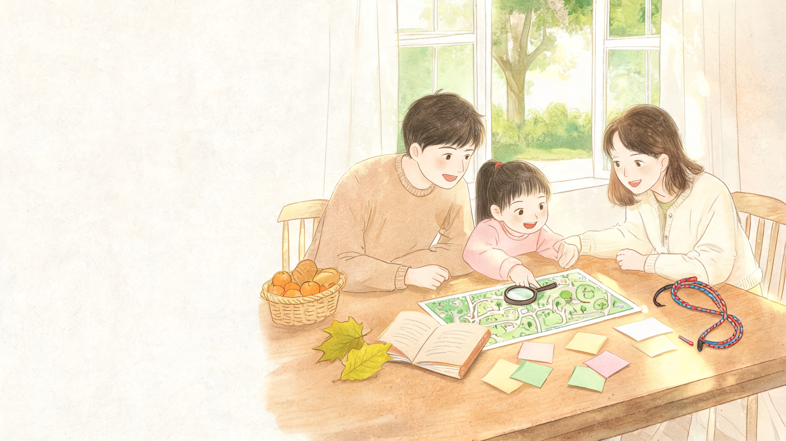
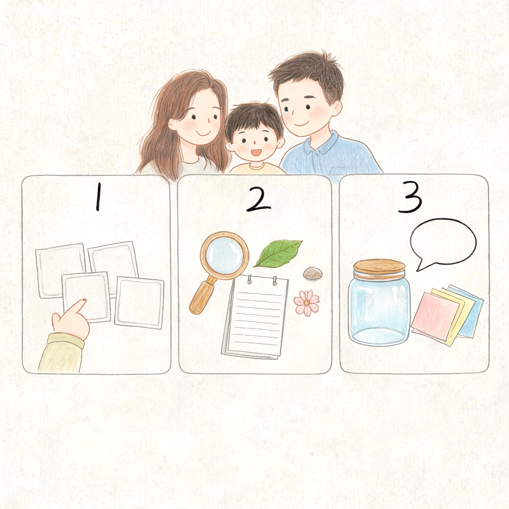
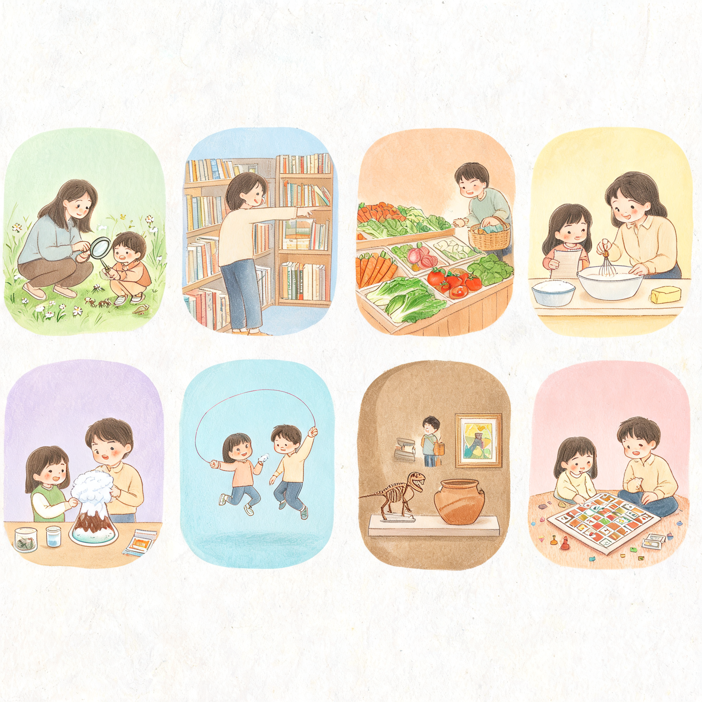
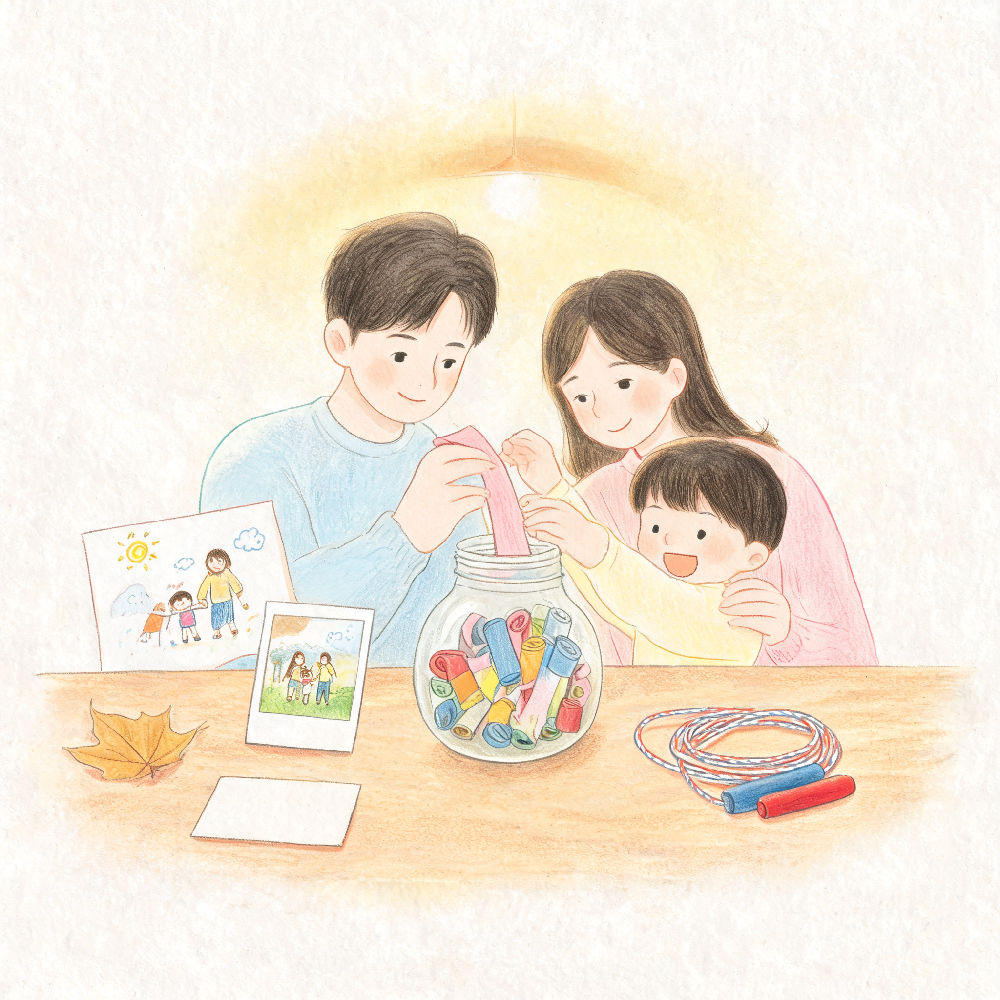

# 周末别只问去哪玩：12 个让小学生真正参与的亲子互动

每到周五晚上，很多家长都会被同一个问题卡住：

周末到底带孩子去哪儿？

去远一点，怕路上折腾。  
在家待着，又怕孩子一直看屏幕。  
报个活动，好像省心，但一个周末很快又被排成了“赶场日”。

其实对小学生来说，周末最重要的不是去了多厉害的地方，而是有没有一段时间，他能和父母一起做成一件小事。

**好的亲子活动，不是把孩子塞进行程表，而是让孩子在真实生活里多一点选择、多一点动手、多一点表达。**

所以这篇不写“周末遛娃 100 个目的地”。

我更想给家庭一份轻一点、可执行一点的清单：12 个适合小学生的周末互动，家里、小区、公园、图书馆、菜市场都能做。每个活动都不追求宏大，只追求一件事：

让孩子不是被安排，而是真的参与进来。

## 先记住一个小原则：少安排，多共创

很多周末之所以过得累，不是因为活动太少，而是因为家长把每一步都安排好了。

几点出门。  
去哪吃饭。  
看哪个展。  
拍哪张照片。  
最后孩子只剩下一件事：跟着走。

但小学生已经很需要“我能决定一点什么”的感觉了。

所以周末亲子活动，可以先套一个很简单的三步：

1. **给选择**：从 2-3 个选项里让孩子自己定一个。
2. **给任务**：不是“随便玩”，而是给一个小挑战。
3. **给复盘**：结束后聊 5 分钟，问他发现了什么、下次想怎么改。

这三步一加，普通活动就会变成亲子互动。

下面这 12 个活动，可以按天气、体力和孩子兴趣来选。

---

## 1. 公园自然侦探：把散步变成一次小调查

适合：1-6 年级，尤其是坐不住、喜欢到处看的孩子。

玩法很简单：带孩子去公园或小区绿地，不是“走一圈”，而是给他一张任务卡。

可以让孩子完成 4 个小任务：

- 找到 3 种不一样的叶子。
- 听到 3 种不同的声音。
- 拍一张“今天最像春天/夏天/秋天/冬天”的照片。
- 用一句话给这次散步起名字。

家长不要急着讲知识，可以多问：“你为什么觉得这片叶子特别？”“这个声音从哪里来的？”

**这个活动练到的不是自然知识，而是观察力。**

很多孩子不是不爱自然，是平时没有机会慢下来，把眼睛真的打开。

## 2. 城市小导航：让孩子当一次路线设计师

适合：3-6 年级，适合周末去图书馆、商场、公园前做。

出门前，把目的地告诉孩子，让他参与路线设计。

他可以查地图，也可以看公交站牌；如果距离不远，还可以让他规划一条“最少过马路路线”或“最有趣路线”。

家长只需要把安全边界讲清楚：

- 必须走人行道。
- 过马路前要停下确认。
- 不确定时先问大人。

到了目的地以后，让孩子说一说：“我这条路线哪里选对了？哪里下次可以改？”

**一次小小的带路，会让孩子从乘客变成参与者。**

这比单纯带他出去玩，更能建立方向感、规则感和责任感。

## 3. 图书馆寻宝：不要求读完，只要求找到

适合：1-6 年级，尤其适合周末想安静一点的家庭。

带孩子去图书馆，不要一上来就说“今天必须读一本书”。

可以玩“找书任务”：

- 找一本封面最吸引你的书。
- 找一本你完全不了解的书。
- 找一本你觉得爸爸妈妈会喜欢的书。
- 找一本你愿意读 10 分钟的书。

最后每个人选一本，互相介绍 1 分钟。

注意，不必逼孩子立刻读完。对小学生来说，先愿意走近书架、翻开一本书，就是很重要的开始。

**阅读兴趣不是被要求出来的，而是在一次次轻松接触里慢慢长出来的。**

## 4. 菜市场预算挑战：把数学带进真实生活

适合：2-6 年级，尤其适合对数字、买东西感兴趣的孩子。

给孩子一个小预算，比如 20 元或 30 元，让他参与买一顿饭里的部分食材。

任务可以这样设：

- 预算内买 2 种蔬菜。
- 比较两个摊位的价格。
- 估算总价，再看实际差多少。
- 回家后把小票贴在纸上，算一算每样东西多少钱。

这件事看起来很生活，但对孩子很有价值。

他会发现，数学不是只在练习册里，而是在每一次选择里：要比较、要取舍、要估算、要承担结果。

**最好的生活教育，往往不需要额外开课，只需要让孩子参与真实决策。**

## 5. 亲子厨房项目：一起做一道“孩子负责的菜”

适合：1-6 年级，难度按年龄调整。

不要把孩子叫进厨房只做“递东西”的角色。

可以让他负责一道很小的菜或点心：

- 低年级：洗菜、剥鸡蛋、摆盘、搅拌。
- 中年级：切软食材、称重量、看时间。
- 高年级：读菜谱、安排步骤、负责一道简单菜。

开始前先约定安全规则：刀具、火、电器必须由大人确认。

做完以后，不要急着评价好不好吃。可以问：

“你觉得哪一步最难？”  
“如果下次再做，你想改哪里？”  
“你最满意的是哪一部分？”

**亲子厨房真正练到的，是计划、协作和对劳动的理解。**

孩子吃到自己参与做的饭，那种成就感，比家长讲十句“要珍惜粮食”都更有用。

## 6. 家庭小实验：把“为什么”留到最后

适合：1-5 年级，尤其适合喜欢问问题的孩子。

周末可以选一个安全、低成本的小实验，比如：

- 纸桥承重：几张纸怎么折，能放更多硬币？
- 气球小车：气球喷气能不能推动车？
- 彩虹牛奶：牛奶、色素和洗洁精会发生什么？
- 种子观察：豆子几天能发芽？

关键不是家长提前讲一堆原理，而是让孩子先猜。

“你觉得会发生什么？”  
“为什么你这么猜？”  
“结果和你想的一样吗？”

**科学启蒙的第一步，不是背答案，而是允许孩子先猜错。**

猜、试、看、改，这个过程本身就很珍贵。

## 7. 运动小挑战：别只比输赢，要一起定规则

适合：1-6 年级，室内外都可以。

跳绳、羽毛球、骑车、拍球、爬楼梯，都可以变成亲子运动挑战。

但规则最好让孩子参与制定。

比如：

- 今天不比谁厉害，只比谁能坚持 5 分钟。
- 每个人有 3 次重来机会。
- 大人要加一个难度，比如单脚站、左手拍球。
- 孩子可以当裁判，记录分数。

这样孩子就不会只感受到“我又输了”，而是会看到规则是可以被讨论和调整的。

**运动不只是消耗体力，也是在练习公平、坚持和情绪管理。**

## 8. 博物馆三件展品法：少看一点，记得更久

适合：3-6 年级，适合去博物馆、科技馆、美术馆时使用。

很多家庭逛展最容易犯的错，是想一次看完。

结果大人累，孩子烦，最后只剩下“来过了”。

对小学生来说，更适合用“三件展品法”：

1. 进门前告诉孩子：今天只选 3 件最想记住的东西。
2. 每选一件，让他拍照或画下来。
3. 回家后让孩子讲给家里另一个人听。

这样逛展会轻很多。

**孩子真正带走的，不是展馆里所有知识，而是他能讲出来的那一点。**

## 9. 家庭采访：把长辈的故事变成周末素材

适合：3-6 年级，也很适合三代同堂家庭。

让孩子准备 5 个问题，采访爷爷奶奶、外公外婆，或者爸爸妈妈小时候的故事。

问题可以很具体：

- 你小时候周末最喜欢做什么？
- 你小时候有没有被老师批评过？
- 你第一次自己出门是什么时候？
- 你小时候最舍不得的一样东西是什么？
- 你觉得现在的小孩和以前哪里不一样？

孩子可以录音，也可以手写记录。

采访结束后，让他整理出一句“我最意外的发现”。

**家庭教育不只发生在说教里，也发生在孩子第一次认真听大人讲过去的时候。**

这类活动会让孩子知道，家人不是只负责照顾他的人，每个人也都有自己的童年和故事。

## 10. 桌游改规则：从玩一局到设计一局

适合：1-6 年级，适合天气不好、不想出门的周末。

飞行棋、UNO、拼图、成语接龙、五子棋，都可以玩。

但更有互动感的做法，是让孩子改一个小规则。

比如：

- 输的人可以获得一次“复活卡”。
- 每走到某一格，要讲一个小故事。
- 轮到大人时必须先回答孩子一个问题。
- 最后不比谁赢，而比谁发明的规则更有趣。

改规则这件事很适合小学生。

因为他会发现，规则不是凭空存在的，规则背后有公平、节奏、难度和乐趣。

**会玩规则的孩子，往往也更容易理解规则。**

## 11. 小小整理项目：让家务变成一次作品改造

适合：1-6 年级，尤其适合周末在家半天完成。

不要一上来就说“快去收拾房间”。

可以把它改成一个项目：

“我们今天只改造书桌左上角。”  
“我们只整理一个抽屉。”  
“我们做一个你的周末阅读角。”  
“我们给玩具分 3 类：常玩、偶尔玩、可以送人。”

完成前拍一张照片，完成后再拍一张。

最后让孩子给这个角落起一个名字。

**家务对孩子有意义的部分，不是被命令，而是他能看到自己把一个空间变好了。**

这会慢慢长出秩序感，也会让孩子对自己的东西更有责任。

## 12. 周末记忆罐：给普通一天留一个结尾

适合：所有年级，特别适合作为周日晚上的固定小仪式。

找一个罐子或盒子，准备一些小纸条。

每个周末结束前，全家各写一张：

- 本周末最开心的一件事。
- 我今天学到的一件事。
- 我想感谢家人的一件事。
- 下周末我想试的一件事。

不想写的孩子，也可以画。

这个活动不花钱，也不费时间，但很能留下记忆。

**很多亲子关系不是靠一次大旅行变好的，而是靠这些小小的、重复出现的确认。**

## 最后，周末不用过得很满

如果你问我，这 12 个活动里最推荐先做哪一个，我会建议从最小的开始。

不是立刻安排一整天。  
不是把清单全部打卡。  
也不是拍很多照片证明“我们很会陪孩子”。

就选一个。

比如这周六下午，去公园做 30 分钟自然侦探。  
或者周日上午，让孩子用 20 元预算买一道菜的食材。  
或者周日晚上，全家一起写一张记忆纸条。

对小学生来说，一个真正好的周末，不一定很贵，也不一定很远。

它可能只是：

父母把手机放下一会儿。  
孩子被认真交给一个小任务。  
一家人一起把一件小事做完。

然后在回家的路上，孩子突然说：

“下次我们还可以这样玩吗？”

这句话，就是周末亲子活动最好的答案。

