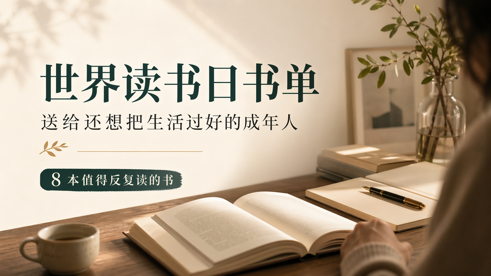
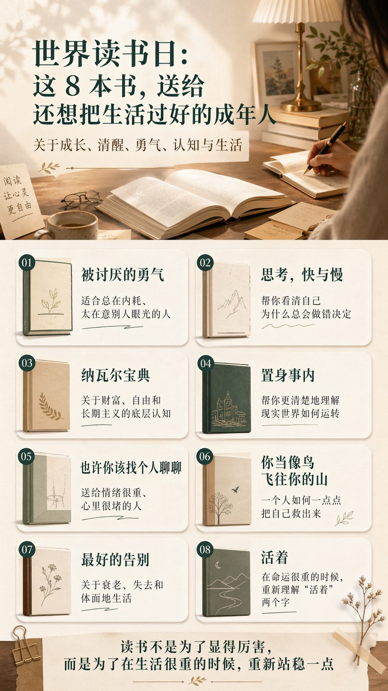

# 世界读书日：这 8 本书，送给还想把生活过好的成年人

今天是 4 月 23 日，世界读书日。

每年到这一天，都会有人说一句：“该多读点书了。”可对大多数成年人来说，真正难的，从来不是不知道读书重要，而是下班以后太累，周末太忙，心里太乱，最后连翻开一本到书的力气都没有。

**成年以后，读书真正稀缺的，不是时间，而是那一点愿意把自己重新拉回来的心力。**

所以这次，我不想给你一份“看起来很厉害、但大概率读不完”的书单。我更想给你一份实际一点的推荐：只有 8 本，但每一本都对应一种成年人常见的困境。你可以按自己当下最需要解决的问题，先挑一本到位地读完。

## 1. 如果你总在过“别人期待的生活”，先读《被讨厌的勇气》

很多成年人真正的疲惫，不只是忙，而是长期活在评价里。

怕别人失望，怕自己不够好，怕选错路，怕自己的人生看起来“不体面”。表面上是在努力，实际上是在不断拿别人的眼光审判自己。

《被讨厌的勇气》最重要的提醒是：**你不必活成所有人都满意的样子。**

当你开始把别人的课题还给别人，把自己的注意力收回来，很多焦虑会慢慢变轻。这本书很适合那些表面稳定、内心却一直在拉扯自己的人。

## 2. 如果你总觉得“我不是不努力，我只是总做错决定”，读《思考，快与慢》

这本书的价值，不在于给你灌鸡汤，而在于它会让你看见：人脑是怎么一遍遍把自己带偏的。

为什么我们会被第一印象影响？为什么会冲动判断？为什么明明知道不该，还是会反复做出差不多的错误选择？

《思考，快与慢》会帮你建立一个更清醒的判断习惯。**很多后悔，不只是运气问题，更是思维习惯的问题。**

你读完以后，不会立刻变成一个永远理性的人，但你会更早发现：自己什么时候正在被情绪推着走，什么时候应该停一下，再做决定。

## 3. 如果你想把日子过明白，也想把钱赚明白，读《纳瓦尔宝典》

这几年，很多人都在谈“搞钱”。但真正稀缺的，从来不是一招两式，而是底层认知。

什么是真正的财富？什么叫自由？什么样的能力值得长期积累？什么事情有复利，什么事情只是短期热闹？

《纳瓦尔宝典》的好，不在于它教你一夜暴富，而在于它会反复提醒你：**一个人最重要的，不是短期赚了多少，而是有没有把自己变成一个长期有复利的人。**

如果你想升级认知，又不想被空话忽悠，这本书值得反复读。

## 4. 如果你总觉得很多现实问题看不懂，读《置身事内》

成年人有一种常见的无力感，叫“我每天都在现实里生活，但我并不真的理解现实是怎么运转的”。

为什么有些城市发展得快？为什么土地、财政、投资、产业会彼此影响？为什么宏观变化，最后总会落到普通人的收入、房子和工作上？

《置身事内》最大的价值，是把那些原本看起来很大的问题，讲得足够清楚。**看懂结构，很多情绪就不会再轻易冒充真相。**

它不会让你一夜之间变成专家，但会让你更能分辨：什么是情绪，什么是结构，什么才是真正值得关注的变化。

## 5. 如果你最近情绪很重、心里很堵，读《也许你该找个人聊聊》

成年人最常见的一种状态是：表面看起来没事，实际上已经很久没有认真整理过自己的情绪。

我们习惯扛着，习惯说“算了”，习惯把委屈解释成成熟。可很多情绪不会因为你忍住了就消失，它只会换一种方式长出来。

这本书通过咨询师和来访者的故事告诉你：**脆弱、混乱、崩溃，不是失败，而是人正常的一部分。**

它不会居高临下地教你“要积极”，而是会给你一种更难得的东西：被理解的感觉。

## 6. 如果你想重新相信“人是可以一点点把自己救出来的”，读《你当像鸟飞往你的山》

这不是一本简单的逆袭故事。

它真正打动人的地方，是一个人如何在非常受限的环境里，慢慢争取教育、争取认知、争取成为自己。你会看到，改变从来不是一句口号，而是一连串很疼、很慢、很难的选择。

《你当像鸟飞往你的山》最有力量的一点是：**改变并不是突然发生的，而是你一次次不愿再回到原地。**

如果你正在经历自我怀疑、环境束缚，或者正准备从旧生活里挣出来，这本书会给你很强的支撑。

## 7. 如果你开始认真思考衰老、疾病、父母和失去，读《最好的告别》

我们这一代人，往往很擅长规划工作、收入和未来，却很少认真面对“告别”这件事。

但迟早有一天，我们要面对父母老去，也要面对自己对脆弱和失去的无能为力。

《最好的告别》并不煽情，反而很克制。它真正想讨论的是：**人在不可避免的衰老与疾病面前，如何尽可能保留尊严、选择和体面。**

这本书越早读，越能让人对生命建立一种更成熟的理解。不是为了提前难过，而是为了到那一天时，不至于只剩下慌乱。

## 8. 如果你最近被生活压得喘不过气，读《活着》

《活着》被推荐过很多次，但它仍然值得反复被提起。

因为它真正厉害的地方，是把人生的苦、命运的重、普通人的韧性，写得非常朴素，也非常深。你会难过，会沉默，也会突然明白：很多时候，人不是因为轻松才继续往前，而是因为再难也得把日子过下去。

《活着》给人的力量，不是激昂的，而是沉静的。**所谓坚强，并不是无坚不摧，而是经历了那么多以后，仍然愿意把日子继续过下去。**

人在低谷的时候，最需要的往往不是大道理，而是真相。《活着》给你的，就是一种很朴素、但很有重量的真相。

## 最后想说

如果你问我，世界读书日最值得做的一件事是什么？

不是拍一张书页照片发朋友圈，也不是给自己立一个“今年读 50 本书”的宏大目标。

真正有用的，只有一件事：**认真读完一本到真正会改变你的书。**

如果你最近很焦虑，就先读《被讨厌的勇气》。

如果你想升级认知，就从《思考，快与慢》和《纳瓦尔宝典》开始。

如果你想更理解现实，就读《置身事内》。

如果你正在被情绪和生活反复拉扯，就去读《也许你该找个人聊聊》《你当像鸟飞往你的山》和《活着》。

如果你不知道今晚该怎么开始，我给你一个最简单的动作：

**不要再囤书单，只选一本；不要想着读完 50 本，只先读 20 页；不要急着变得更好，只先把自己找回来一点。**

读书从来不是为了让别人觉得你厉害。

读书真正的意义，是在你快被生活推着走的时候，帮你把自己重新找回来一点。

愿你在这个世界读书日，重新找回一种久违的感觉：

不是“我必须变得更好”，

而是“我还愿意慢慢成长”。
