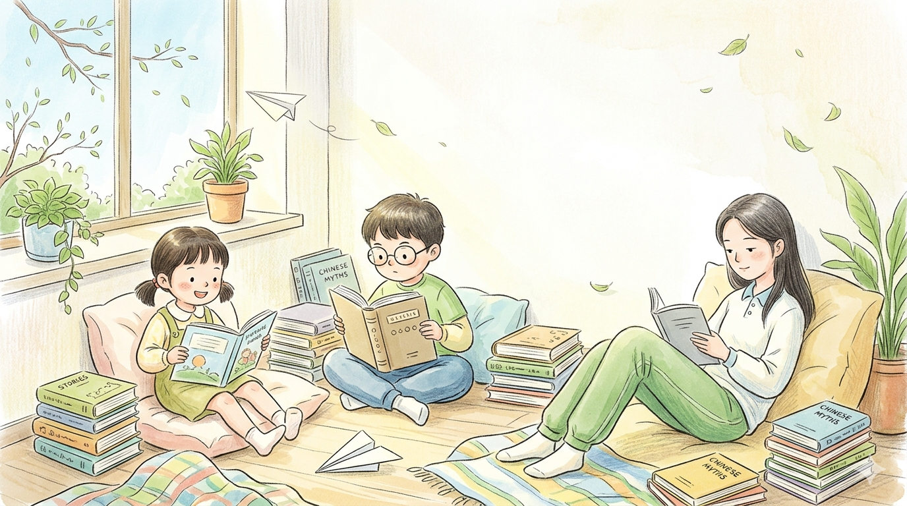
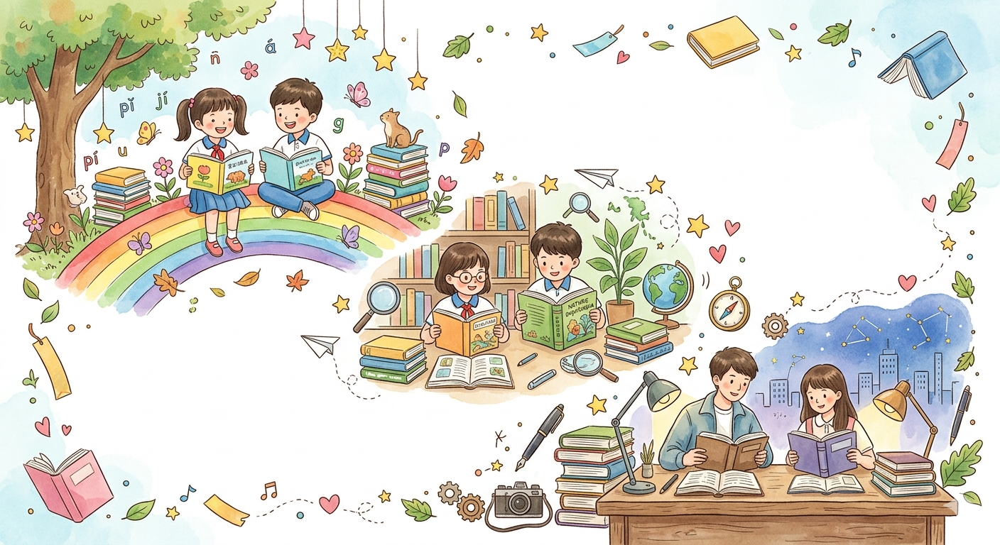
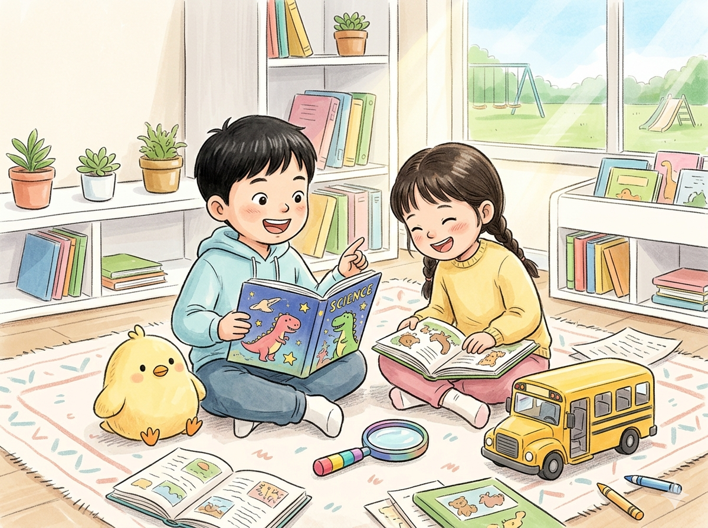
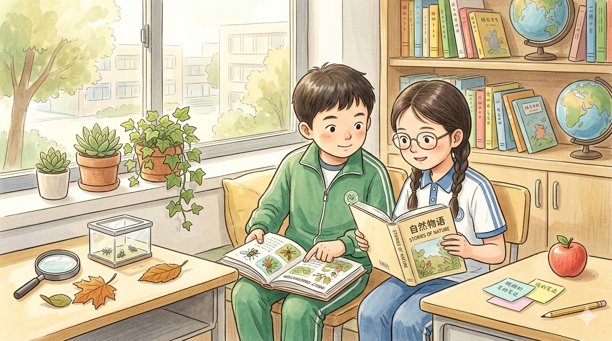
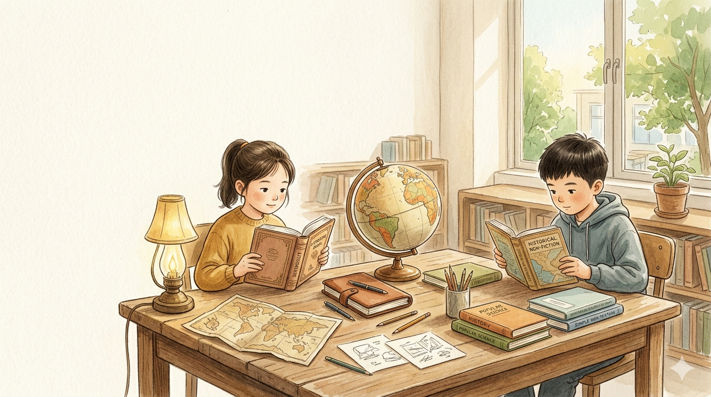

# 世界读书日：别再乱买了，这 9 本书更适合小学生

今天是 4 月 23 日，世界读书日。

如果你家也有这个画面，你一定不陌生：

书买了不少。  
书架也挺满。  
孩子真正愿意自己翻完的，却没几本。

很多时候，不是孩子不爱读。

而是第一本书太难。  
太厚。  
太像“任务”。

所以这份书单，我不求全。

只做一件事：

按 1-6 年级，给家长挑 9 本更容易读进去的书。  
文学有，科普也有。  
重点不是“很厉害”，而是“更适合起步”。

## 先说一个小原则

给小学生选书，先别急着上“大部头”。

低年级，先养出“我愿意翻开书”。  
中年级，开始养“我能读完一本书”。  
高年级，再慢慢养“我能读懂、会思考、会表达”。

顺着这个节奏买，孩子反而更容易爱上阅读。

---

## 1-2 年级：先把阅读变成一件好玩的事

### 1. 《不一样的卡梅拉》

适合：刚开始自主阅读，喜欢图多、故事快、脑洞大的孩子。

为什么推荐：这套书有点调皮，也很会逗孩子笑。字量不吓人，情节又总有点小冒险，小朋友很容易一口气读下去。

家长可以这样带：先别问“你懂了什么”，先问“你最喜欢哪只小鸡，为什么”。

### 2. 《神奇校车·图画书版》

适合：对身体、动物、天气、宇宙总爱追问“为什么”的孩子。

为什么推荐：它把科普讲得像出去玩一样，知识点不少，但不硬，特别适合低年级打开科学兴趣。

家长可以这样带：读完一册，只做一件小事，比如一起观察树叶、月亮、影子，孩子会更有参与感。

### 3. 《一年级大个子二年级小个子》

适合：刚上小学，胆子有点小、情绪有点敏感、需要一点学校生活共鸣的孩子。

为什么推荐：这本书很温柔，也很贴近低年级孩子的日常。它不会说大道理，但能让孩子觉得：原来紧张、害怕、慢一点，都很正常。

家长可以这样带：如果孩子刚入学，这本很适合睡前共读。

---

## 3-4 年级：开始把“好看”慢慢变成“会想读”

### 4. 《长袜子皮皮》

适合：脑洞大、主意多、喜欢哈哈笑，也总想按自己办法做事的孩子。

为什么推荐：皮皮这个角色太有生命力了。孩子读的时候会觉得过瘾，家长读的时候又会发现，它不只是热闹，还在悄悄保护孩子的想象力和独立劲儿。

家长可以这样带：读完可以聊一聊，“如果你是皮皮，你最想改学校里的哪条规则？”

### 5. 《夏洛的网》

适合：已经能读稍长故事，开始对友情、失去、承诺这些情感有感觉的孩子。

为什么推荐：这是一本很暖，也很有力量的书。它能帮孩子慢慢学会共情，学会珍惜，学会理解“真正的朋友是什么”。

家长可以这样带：这本不必赶进度，让孩子读慢一点，感受会更深。

### 6. 《法布尔昆虫记》（少儿版）

适合：喜欢虫子、小动物、自然观察，或者天生就有点“研究员气质”的孩子。

为什么推荐：它不是只告诉孩子“昆虫叫什么”，而是让孩子看到观察这件事本身有多有趣。对中年级来说，这是很好的科学启蒙入口。

家长可以这样带：看到书里讲到的昆虫时，带孩子去小区花坛或公园找一找，阅读会一下子活起来。

---

## 5-6 年级：可以开始读更有厚度的书了

### 7. 《草房子》

适合：已经不满足于“故事好玩”，开始愿意读人物、读成长、读心情的孩子。

为什么推荐：这本书有画面，也有情绪。它能帮助高年级孩子把阅读从“看热闹”，慢慢带到“看见别人，也看见自己”。

家长可以这样带：如果孩子最近写人、写校园、写成长类作文，这本书会给他很多细腻的表达素材。

### 8. 《林汉达中国历史故事集》

适合：对历史有点兴趣，但一看到大部头就想跑的孩子。

为什么推荐：这套书最大的好处，是把历史讲得有人、有事、有起伏，不干巴。很适合高年级先把历史兴趣养起来，再往更系统的书走。

家长可以这样带：不用按顺序读，先挑孩子最感兴趣的人物或朝代开始。

### 9. 《万物简史（少儿版）》

适合：已经能稳定自主阅读，也开始对“世界到底怎么运转”这类问题感兴趣的孩子。

为什么推荐：这本书能把地球、宇宙、生命这些大问题讲得既开阔又不那么难。它很适合给高年级孩子打开更大的视野。

家长可以这样带：这本可以分段读，不必一口气读完。每次读完聊一个问题，效果反而更好。

---

## 最后，真的不用一次买很多

如果你今天只想做一件对孩子阅读最有帮助的小事，

不是立一个“今年读 100 本”的目标。  
也不是一下子下单十几套书。

而是：

先挑 1 本。  
让孩子自己翻一翻。  
今天先读进去一点点。

如果他读完以后愿意跟你说一句：

“这本还挺好看。”

那这本书就已经选对了。

世界读书日，送给孩子最好的礼物，不一定是最贵的书。

而是那本  
他真的愿意打开，  
并且想读下去的书。
