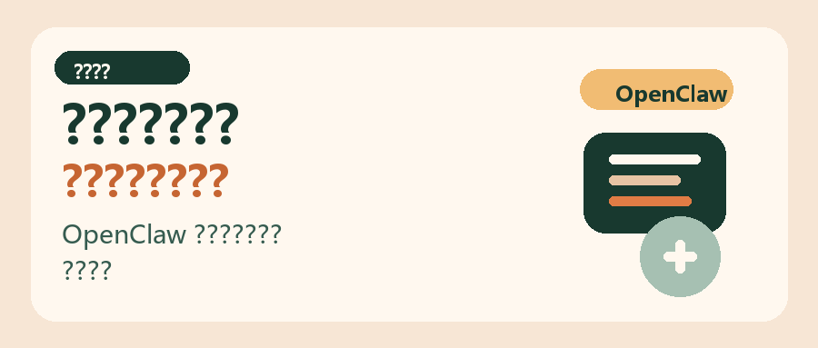

# 小红书卡片分镜

## P1 封面

配图：

标题：
OpenClaw 安装教程

第二行：
别再反复重装了

副标题：
从安装命令到模型配置
一次讲清

角标：
新手照着做就行

---

## P2 先给结论

配图：

标题：
真正难的
不是安装命令

正文：
很多人卡住
不是因为不会复制命令

而是：
onboard 不知道怎么选
模型配置不知道怎么接

结论：
把 4 个动作走完
OpenClaw 才算真正装好

底部：
安装 -> 初始化 -> 配模型 -> 重启验证

---

## P3 第 1 步

配图：

标题：
第 1 步
管理员 PowerShell

正文：
Windows 先用管理员身份
打开 PowerShell

执行安装命令：
`iwr -useb https://openclaw.ai/install.ps1 | iex`

补充：
macOS 用
`curl -fsSL https://openclaw.ai/install.sh | bash`

---

## P4 第 2 步

配图：

标题：
第 2 步
重跑初始化引导

正文：
如果你刚才跳过过
或者没走完引导

直接输入：
`openclaw onboard --install-daemon`

然后依次选：
`Yes`
`QuickStart`

---

## P5 第 3 步

配图：

标题：
第 3 步
提供商先别乱改

正文：
按这条路线走最稳：

`Skip for now`
`All providers`
`Keep current`

如果后面出现本地工具或附加项
先继续 `Skip for now`

强调：
先跑通
再细调

---

## P6 第 4 步

配图：

标题：
第 4 步
daemon / API / hooks

正文：
这里最容易点乱
直接照着做：

1. daemon 选 `Yes`
2. API 相关先全部默认 `No`
3. hooks 里除了 `Skip for now`
其余都选上

提示：
多选框记得用空格勾选

---

## P7 第 5 步

配图：

标题：
第 5 步
打开 Web UI

正文：
选择：
`Open the Web UI`

正常会进入：
`http://127.0.0.1:18789/chat?session=main`

提醒：
后台的 `gateway`
不要关

---

## P8 第 6 步

配图：

标题：
第 6 步
开始接模型

正文：
回到 PowerShell 输入：
`openclaw config`

菜单这样走：
`Local`
`Model`

这一步之后
才会进入模型供应商配置

---

## P9 第 7 步

配图：

标题：
第 7 步
填 API Key

正文：
供应商选择：
`Volcano Engine`

然后选：
`Paste API key now`

粘贴你准备好的 API Key
模型名保持默认：
`volcengine-plan/ark-code-latest`

最后点 `Continue`

---

## P10 第 8 步

配图：

标题：
第 8 步
重启并验证

正文：
最后执行：
`openclaw gateway restart`

然后检查 3 件事：

1. Web UI 能打开
2. `openclaw dashboard` 正常
3. 出问题先重启 gateway

结尾：
这 8 步走完
OpenClaw 才算真正装好

互动：
你更想看 macOS 版
还是报错排查版？
