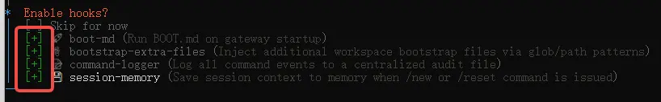
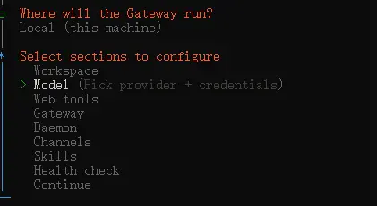
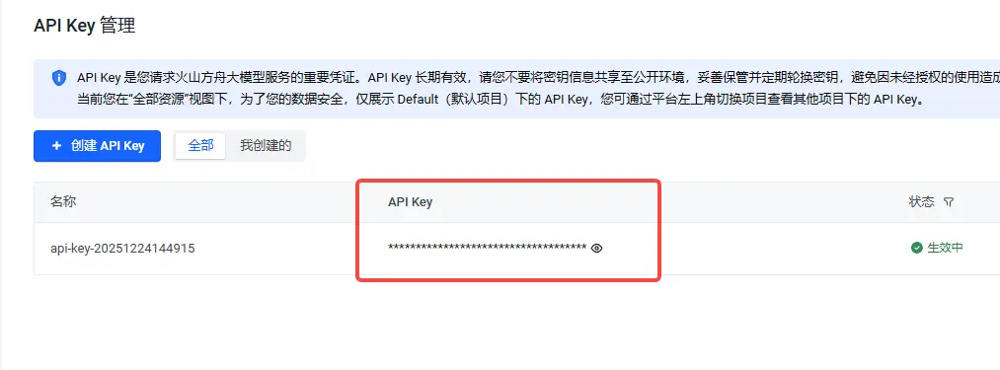
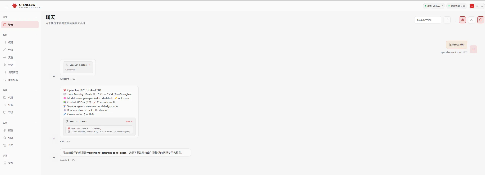

# OpenClaw 安装教程｜照着做，第一次也能跑通

如果你第一次装 OpenClaw，最容易卡住的通常不是安装命令本身，而是后面的初始化选项和模型配置。

我这次按 Windows 路线把整个流程重新走了一遍，整理成一版适合直接照做的小红书教程。你不用自己猜每一步该怎么选，跟着这篇走，基本就能把 OpenClaw 从“装上”推进到“能用”。

先说你最终要完成的不是 1 步，而是 4 步：

1. 安装 OpenClaw
2. 跑完初始化引导
3. 接入大模型 API Key
4. 重启 gateway 验证生效

这篇默认按 Windows 写，macOS 的安装命令我也一起放上。

## 标题候选

1. OpenClaw 安装别乱试了，这篇保姆级教程直接带你跑通
2. 第一次装 OpenClaw，真正卡人的不是命令，是后面这几步
3. OpenClaw 安装教程｜从命令到模型配置一次讲清
4. OpenClaw 新手避坑：照着这 8 步做，基本不会反复重装
5. 想把 OpenClaw 一次装好，直接照这篇教程操作

## 主标题

OpenClaw 安装教程｜从命令到模型配置一次讲清

## 这篇适合谁

- 第一次安装 OpenClaw
- 已经执行过安装命令，但后面不知道怎么选
- Web UI 能打开，但模型还没接好
- 想要一篇能直接照着点的教程

## 步骤 1：管理员身份打开 PowerShell

先不要直接双击终端。  
Windows 下建议用管理员身份打开 PowerShell，再执行安装命令。

配图：

安装命令：

```powershell
iwr -useb https://openclaw.ai/install.ps1 | iex
```

如果你是 macOS：

```bash
curl -fsSL https://openclaw.ai/install.sh | bash
```

## 步骤 2：如果跳过过引导，就手动重跑 onboard

如果你安装后没有完整走完初始化，或者中途跳过了，直接执行：

```powershell
openclaw onboard --install-daemon
```

然后按下面这个顺序选：

- `Yes`
- `QuickStart`

配图：

## 步骤 3：提供商和前置项，先按最稳的路径走

接下来这几步，建议先别自己乱展开，按这条路线走：

- `Skip for now`
- `All providers`
- `Keep current`

如果出现本地工具或附加项，先继续 `Skip for now`。

配图：

## 步骤 4：daemon、API、hooks 这几步这样选

到了安装 daemon 的地方，直接选：

- `Yes`

如果出现多选框：

- `Skip for now` 这类跳过项，需要用空格选中后再回车

API 相关选项：

- 这一轮先全部保持默认 `No`

hooks 相关选项：

- 除了 `Skip for now` 之外，其余项都选上

配图：

## 步骤 5：打开 Web UI，确认本地地址正常

后面会看到一个选项：

- `Open the Web UI`

正常会打开这个本地地址：

`http://127.0.0.1:18789/chat?session=main`

配图：

这一步有个很容易忽略的点：

- 后台会有一个 `gateway` 进程在运行
- 不要顺手把它关掉

## 步骤 6：开始接模型，先进入 config

安装完壳子不等于能正常用。  
想让 OpenClaw 真正可用，还要把模型接上。

先在 PowerShell 输入：

```powershell
openclaw config
```

菜单路径这样走：

- `Local`
- `Model`

配图：

## 步骤 7：选择模型提供商，粘贴 API Key

这里按原教程的路线，选择：

- `Volcano Engine`

然后选：

- `Paste API key now`

把你提前准备好的 API Key 粘贴进去。

配图：

模型名如果没有特殊需求，保持默认就行：

`volcengine-plan/ark-code-latest`

然后点 `Continue` 完成配置。

## 步骤 8：最后重启 gateway，让配置生效

回到 PowerShell，执行：

```powershell
openclaw gateway restart
```

配图：

做到这里，才算完整跑通。

## 装完后，立刻做这 3 个检查

1. 打开 `http://127.0.0.1:18789/chat?session=main`，确认页面能访问
2. 执行 `openclaw dashboard`，确认主界面正常
3. 如果界面异常，先执行一次 `openclaw gateway restart` 再看

## 我建议你直接收藏的极简版清单

如果你不想每次翻全文，可以只记这 4 个动作：

1. 管理员 PowerShell 执行安装命令
2. 用 `openclaw onboard --install-daemon` 走完初始化
3. 用 `openclaw config` 接入模型和 API Key
4. 用 `openclaw gateway restart` 让配置生效

## 最后一句判断

第一次装 OpenClaw，真正劝退人的通常不是安装命令，而是没人把“后面到底怎么选”讲清楚。

这也是我为什么把它拆成一步一步的原因。你照着走，成功率会比自己试高很多。
